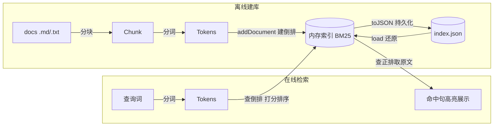

# BM25 检索 Demo

基于 **Node.js + TypeScript + pnpm** 的 BM25 **稀疏检索**示例，与同仓库 `demo/rag`（稠密向量检索）形成对照。

## 特性

- 纯本地计算，**无任何外部 API / 密钥依赖**
- 中文分词：**bigram 兜底 + `@node-rs/jieba` 可选增强**（自动探测、失败回退）
- 索引以 **JSON 持久化**（`data/index.json`），检索时免重建
- 检索结果**展示命中句子**：在相关分块内按句切分，列出含查询词的句子并高亮命中词（终端绿色）
- 代码风格与 `demo/rag` 对齐：`type: module` + `tsc` 编译后用 `node` 运行 + `tsc --noEmit` 类型检查 + ESM `.js` 后缀导入
- 不依赖 `tsx`/`esbuild`，因此 `pnpm install` 没有需要被拦截的构建脚本，受供应链接策略管控的环境也能直接 `pnpm run`

## 目录结构

```
demo/BM25/
├── .npmrc          # pnpm 镜像（registry.npmmirror.com）
├── package.json    # pnpm 管理；jieba 放入 devDependencies
├── tsconfig.json
├── README.md
├── data/
│   ├── docs/       # 原始文档（.md / .txt）
│   └── index.json  # 构建后生成的索引（git 可忽略）
└── src/
    ├── config.ts   # 目录 / 索引文件 / k1 / b 等集中配置
    ├── tokenizer.ts# 分词器（jieba 优先，bigram 兜底）
    ├── bm25.ts     # BM25 核心（纯计算 + JSON 序列化，无 I/O）
    ├── index.ts    # 建库：读 docs -> 分块 -> 分词 -> 倒排 -> 存 JSON
    ├── search.ts   # 检索：命令行单次 + 交互模式
    └── demo.ts     # 一键演示
```

## 快速开始

```bash
cd demo/BM25
pnpm install        # 装 devDependencies（typescript / @types/node / @node-rs/jieba）

pnpm index          # 自动 tsc 编译后构建索引（读取 data/docs，写入 data/index.json）
pnpm query "中文分词如何影响检索"   # 单次查询
pnpm query          # 进入交互模式，逐条输入查询词，Ctrl+C 退出
pnpm demo           # 一键：索引缺失则先建库，再跑内置示例查询
pnpm typecheck      # 仅做 tsc --noEmit 类型检查
pnpm build          # 仅编译到 dist/（pnpm index/query/demo 会自动先 build）
```

> 注：检索脚本名为 `query` 而非 `search`，因为 `search` 是 pnpm 内置命令（搜包），直接 `pnpm search` 会被 pnpm 拦截。`index` / `query` / `demo` 通过 `pre*` 钩子自动先执行 `pnpm build`（`tsc` 编译到 `dist/`），再用 `node dist/*.js` 运行。也可 `pnpm build` 后直接 `node dist/search.js "查询词"`。

## 运行环境注意（为何不用 tsx）

本机部分环境带供应链接策略：执行 `pnpm <script>` 前会强制重跑 `pnpm install`，并把被忽略的
构建脚本（如 `esbuild`，`tsx` 的底层）视为错误，直接用 `tsx` 会被打断。

本项目因此改为 **`tsc` 编译 + `node` 运行** 的纯 ESM 方案，依赖中没有任何需执行构建脚本的包，
`pnpm install` 干净通过，受管控环境也能直接 `pnpm run`。若你所在环境无此限制、更偏好 `tsx`，
可把 `devDependencies` 换回 `tsx` 并将脚本改回 `tsx src/<file>.ts`。

## 中文分词

分词由 `src/tokenizer.ts` 统一抽象：运行时优先探测 `@node-rs/jieba`，加载失败则静默回退 bigram。两种方案的词项质量直接决定 BM25 的召回与精度，对比见下。

### bigram 分词（零依赖兜底）

纯 JS 实现的**二元（2-gram）滑动窗口**分词，无任何第三方依赖，保证 demo 开箱即跑。实现逻辑（`bigramTokenizer`）：

1. 去除所有空白并转小写；
2. 以步长 1 滑窗，取相邻 2 个字符作为词项。

示例：`中文分词` → `中文` `文分` `分词`。

- **优点**：零依赖、对未登录词（新词 / 专有名词）天然友好、无需词典。
- **缺点**：会产生大量**交叉碎片**（如 `文分` 这种无意义组合），词表膨胀（本 demo 语料上约 650 个词项）、精度一般；同一语义被切碎后，单字重合带来的匹配噪声较高。

### @node-rs/jieba（可选增强）

基于 Rust 预编译的 [jieba 分词](https://github.com/messense/jieba-rs) Node 绑定，词典 + 统计切词，词项更贴近真实语义。本库使用其 v1.10.x 的**扁平 API**：直接调用导出的 `cut`（或经 `default.cut`）函数，结果统一 `trim` 后过滤空串。

启用方式（开发依赖，自动探测）：

```bash
pnpm add -D @node-rs/jieba
```

启用后运行会打印 `✓ 使用 @node-rs/jieba 中文分词`，词项质量显著优于 bigram——在本 demo 的三篇语料上，词表从约 650 降到约 250，且「分词」「检索」等词作为整体命中，而非被切碎。卸载或不安装则静默回退 bigram，行为不变。

## BM25 原理与核心概念

BM25（Best Matching 25）是**概率检索模型**的工程化近似：给定查询 Q，为每篇文档 D 打出一个相关性分数，分数越高越相关。它脱胎于「两篇文档随机相关 / 随机不相关」的概率推导，最终收敛成下面这套直观又可调的打分函数。

核心由三根支柱构成：

1. **词频饱和（TF saturation）**：词在文档中出现越多，贡献越大，但**边际递减**——出现 1 次与 2 次差别明显，出现 50 次与 51 次几乎无差。这由饱和系数 `k1` 控制：越大越「迟钝」，越能容忍高频词刷分。它天然对抗「词频堆砌」式作弊。
2. **逆文档频率（IDF）**：稀有词比常见词更有区分度。BM25 用带 `+0.5` 平滑的 IDF，即使某词出现在几乎所有文档也仍是**非负**的小正数，不会变成负贡献。
3. **长度归一化（length normalization）**：长文档 token 天然更多、容易靠数量占优。系数 `b` 把文档长度向平均长度 `avgdl` 拉平——`b=0` 不做归一化，`b=1` 完全按相对长度惩罚。`b` 默认 0.75，是大量语料上的经验甜点。

与经典 **TF-IDF / 向量空间模型** 的区别：传统做法的 TF 常是线性或对数、长度处理粗糙，且缺乏统一理论依据；BM25 把「饱和词频 + 平滑 IDF + 长度归一」收进同一个有推导支撑的函数，实践上更稳、更不易被长短文档或高频词带偏。

为何本场景（可解释检索）特别合适：最终得分是**各查询词贡献之和**，每一项都能独立拆算，便于定位「为什么命中 / 漏召回」。

> **边界澄清：BM25 自己不做分词。** 它只是「打分排序」那一步的数学函数，吃的是已经切好的词项统计，吐出相关性分数——**语言无关、不懂语义**，只认词项是否出现、出现多少次、稀有度如何。
>
> 完整的中文自然语言搜索其实是三步拼起来的：
> 1. **分词**（tokenization）：把文本切成词项，由 `src/tokenizer.ts`（bigram / jieba）负责，分词质量决定 BM25 的上限；
> 2. **建倒排索引**（inverted index）：维护 `term → 含它的文档及词频`，是数据结构层面的事，也不属于 BM25 算法本身；
> 3. **BM25 打分**：拿到查询词项后，用「饱和词频 + IDF + 长度归一」给文档算分、排序。
>
> 因此 BM25 属于**稀疏检索**：与同仓库 `demo/rag` 的稠密向量检索对照——RAG 用 Embedding 把语义压成向量，能匹配「意思相近但用词不同」的文本；BM25 只看字面词项重合，所以**可解释、零依赖，但一词之差就可能召回不到**。

## 算法要点

对查询 Q 与文档 D：

$$
\text{score}(D,Q)=\sum_{t\in Q}\text{IDF}(t)\cdot\frac{f(t,D)\,(k_1+1)}{f(t,D)+k_1\left(1-b+b\,\frac{|D|}{\text{avgdl}}\right)}
$$

$$
\text{IDF}(t)=\ln\!\left(1+\frac{N-n(t)+0.5}{n(t)+0.5}\right)
$$

- `f(t,D)`：词项在文档中的词频；`|D|`：文档 token 数；`avgdl`：平均文档长度
- `N`：文档总数；`n(t)`：包含该词项的文档数（df）
- 超参：`k1`（词频饱和，默认 1.5）、`b`（长度归一化，默认 0.75），均在 `src/config.ts` 调整

## 本库技术结构

整体是一条「离线建库 + 在线检索」的流水线，模块边界清晰、各司其职：



**核心模块（`src/`）**

| 模块 | 职责 | 关键概念 |
| --- | --- | --- |
| `config.ts` | 集中配置：文档目录、索引文件、`k1`/`b`/`topK`；`isMain` 判定入口 | 所有可调参数一处收敛 |
| `tokenizer.ts` | 分词抽象：`@node-rs/jieba`（扁平 API `cut`）优先，`bigram` 兜底，统一 `trim` | 词项是倒排与打分的基本单元，分词质量决定效果上限 |
| `bm25.ts` | 纯计算核心，**不触碰任何文件 I/O**（便于单测） | 见下方「内存索引结构」 |
| `index.ts` | 建库：读 `docs` → 分块 → 分词 → `addDocument` → `toJSON` 写 JSON | 离线一次性产出索引 |
| `search.ts` | 检索：加载索引 → 查询 → `runOnce` 展示（按句切分 + 命中词高亮）+ 交互模式 | 在线只读索引，不重算 |
| `demo.ts` | 一键演示：索引缺失则先建库再跑内置查询 | 端到端串联 |

**内存索引结构（`bm25.ts`）**

- `termFreqs`：**倒排索引**，结构为 `term → (docId → tf)`，检索时只遍历查询词命中的 posting list，复杂度约 `O(查询词数 × 平均文档频率)`，与全文大小无关。
- `docFreq`：每词对应的 `df`（含该词的文档数），用于算 IDF。
- `docLen` / `avgdl` / `N`：长度与全局统计量，驱动长度归一化与 IDF。
- `docMeta`：**正排索引**，`docId → {path, title, text}`，检索完成后按 `docId` 取原文用于展示命中句。
- `toJSON()` / `static load()`：与 `IndexData` 结构互转，把上述内存结构序列化成 `data/index.json`，检索时 `load` 还原即可，**无需重新读文档分词**。

**两个关键设计点**

- **`docId` 是「分块级」而非「文件级」主键**：一篇文档被切成多个有重叠的 chunk，每个 chunk 独立打分、独立上榜。重叠（滑动窗口 `window=2, step=1`）是为了不让语义在窗口边界被切断，兼顾召回与上下文。
- **建库与检索解耦**：建库（写 JSON）重、检索（`load` + 查倒排）轻。因此 `pnpm query` 永远秒回，`data/index.json` 改 git 忽略也不影响功能，只是别人 clone 后需先 `pnpm index` 一次。

## 与 demo/rag 的区别

| 维度 | demo/rag | demo/BM25 |
| --- | --- | --- |
| 检索类型 | 稠密（向量 Embedding） | 稀疏（词项统计） |
| 外部依赖 | DeepSeek API | 无 |
| 分词要求 | 低（子词即可） | 高（词项质量直接影响效果） |
| 可解释性 | 弱 | 强（可逐项查看贡献） |
| 冷启动 | 需要 API Key | 开箱即用 |
