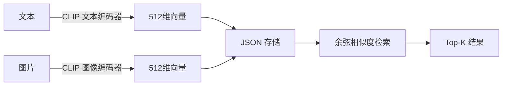

# 本地 Embedding Demo（Node.js + Transformers.js + pnpm）

一个基于**本地模型**的文本/图片 Embedding 向量化示例，核心特点：

- **完全本地运行**：使用 [Transformers.js v3](https://github.com/huggingface/transformers.js)（ONNX Runtime），无需任何 API Key，数据不出本机
- **文本 + 图片**：默认使用 CLIP 模型，将文本和图片映射到**同一向量空间**，支持跨模态检索（以文搜图、以图搜文）
- **JSON 存储**：向量以 JSON 文件存储，零数据库依赖，适合教学和轻量场景
- **TypeScript** + **tsx** 直接运行
- **pnpm** 管理依赖

## 与同仓库其他 Demo 的区别

| Demo | 模型运行 | API Key | 文本向量 | 图片向量 |
|------|----------|---------|----------|----------|
| `demo/rag` | DeepSeek 云端 API | 需要 | ✅（语义打分） | ❌ |
| `demo/deepseek_ts_embedding` | DeepSeek 云端 API | 需要 | ✅ | ❌ |
| **`demo/embedding`（本 Demo）** | **本地 ONNX Runtime** | **不需要** | **✅** | **✅** |

## 技术方案



- **运行时**：`@huggingface/transformers`（Transformers.js v3），基于 ONNX Runtime
- **默认模型**：`Xenova/clip-vit-base-patch32`（CLIP，512 维，文本+图片跨模态）
- **存储**：`data/vectors.json`（向量）+ `data/items.json`（条目元信息）

## 目录结构

```
demo/embedding/
├── .env.example          # 环境变量模板（模型名 + HF 镜像，无 API Key）
├── .gitignore
├── .npmrc                # npmmirror 镜像（npm 包加速）
├── package.json
├── tsconfig.json
├── README.md
├── data/
│   ├── texts/            # 待入库的文本（.md / .txt），每篇一个条目
│   ├── images/           # 待入库的图片（.png / .jpg / .webp）
│   ├── vectors.json      # 向量存储（自动生成，已 gitignore）
│   └── items.json        # 条目元信息（自动生成，已 gitignore）
└── src/
    ├── config.ts         # 配置：模型名、数据路径、HF 镜像、dtype
    ├── embed.ts          # 本地模型：文本 + 图片向量化
    ├── vectorstore.ts    # JSON 向量存储 + 余弦相似度检索
    ├── index.ts          # 入库：扫描 texts/ 和 images/ → 向量化 → 存 JSON
    ├── search.ts         # 语义检索（交互式 / 命令行 / 以图搜库）
    ├── sim.ts            # 图片相似度搜索（DINO 模型，图搜图专用）
    └── demo.ts           # 一键演示
```

## 快速开始

```bash
cd demo/embedding

# （可选）复制环境变量配置，按需修改模型名或镜像
cp .env.example .env

# 安装依赖
pnpm install

# 一键演示（首次运行会下载模型，q8 量化版约 60MB）
pnpm demo

# 入库自己的数据
pnpm index

# 语义检索（注意：pnpm search 是内置命令，需用 pnpm run search）
pnpm run search "你的搜索词"
```

> **首次运行提示**：模型会从 HuggingFace Hub 下载并缓存到本地。默认已配置 `hf-mirror.com` 镜像加速国内下载。下载完成后后续运行离线可用。

## 常用命令

| 命令 | 说明 |
|------|------|
| `pnpm demo` | 一键演示：入库示例文本 → 语义检索 → 跨模态提示 |
| `pnpm index` | 扫描 `data/texts/` + `data/images/` → 向量化 → 存 JSON |
| `pnpm run search` | 交互式语义检索（输入 `exit` 退出，`clear` 清空） |
| `pnpm run search "关键词"` | 单次文本检索 |
| `pnpm run search --image ./data/images/xx.jpg` | 以图搜库（跨模态，CLIP） |
| `pnpm run sim` | DINO 图片相似度入库（`data/images/` → 向量化） |
| `pnpm run sim --image ./data/images/xx.jpg` | DINO 以图搜图（图搜图专用，效果优于 CLIP） |
| `pnpm typecheck` | TypeScript 类型检查 |

> **注意**：`pnpm search` 是 pnpm 内置命令（搜索 npm 包），与本项目的 `search` 脚本冲突。执行语义检索时必须用 `pnpm run search`。

## 切换模型

编辑 `.env` 中的 `MODEL_NAME`：

| 模型 | 类型 | 维度 | 特点 |
|------|------|------|------|
| `Xenova/clip-vit-base-patch32` | 文本+图片 | 512 | 默认，跨模态检索，英文 |
| `Xenova/multilingual-e5-small` | 纯文本 | 384 | 支持中文，更小更快 |
| `Xenova/all-MiniLM-L6-v2` | 纯文本 | 384 | 英文，极速，体积最小 |

切换后需重新 `pnpm index`（向量维度可能变化）。

> 注意：纯文本模型不支持图片向量化，`embedImage` 会报错。

## 关于 CLIP 模型的文本检索

CLIP 主要为**跨模态（文本↔图片）检索**设计，其文本-文本相似度分数普遍偏高（0.8+），区分度不如专用文本模型。如果你的场景以**纯文本语义搜索**为主，推荐切换到 `Xenova/all-MiniLM-L6-v2` 或 `Xenova/multilingual-e5-small`，文本检索效果会显著提升。

## 图片相似度搜索（DINO）

CLIP 的图搜图能力较弱（它不是为图-图相似度设计的）。如果你需要**以图搜图**（找视觉相似的图片），使用 DINO 模型效果更好：

```bash
# 1. 入库（首次会下载 DINO 模型 ~40MB）
pnpm run sim

# 2. 以图搜图
pnpm run sim --image ./data/images/test1.png
```

DINO（Self-Distillation with NO labels）是 Meta 提出的视觉 Transformer，专为图像特征提取训练，图-图相似度远优于 CLIP。

| 模型 | 用途 | 文本 | 图片 | 图搜图效果 |
|------|------|------|------|-----------|
| CLIP（默认） | 文↔图跨模态 | ✅ | ✅ | ⚠️ 一般 |
| DINO（`pnpm run sim`） | 图↔图相似度 | ❌ | ✅ | ✅ 优秀 |

> DINO 使用独立的向量存储（`data/sim_vectors.json`），与 CLIP 向量互不干扰。可通过 `SIM_MODEL` 环境变量更换 DINO 模型（如 `Xenova/dino-vitb16`）。

## 数据类型（DTYPE）

默认使用 `q8`（量化）模型，体积小（~60MB）、兼容性好。如需更高精度可在 `.env` 中设置 `DTYPE=fp32`（~250MB），但部分 onnxruntime 版本可能不兼容 fp32 模型。

## 使用自己的数据

1. **文本**：把 `.md` / `.txt` 文件放入 `data/texts/`，运行 `pnpm index`
2. **图片**：把 `.png` / `.jpg` / `.webp` 文件放入 `data/images/`，运行 `pnpm index`
3. **检索**：`pnpm run search "关键词"` 或 `pnpm run search --image ./path/to/image.jpg`

## 工作流程

```
入库：文本/图片 → 本地模型向量化 → 向量 + 元信息存 JSON
检索：查询（文本/图片）→ 向量化 → 余弦相似度 Top-K → 混合结果
```

## 说明

- 数据量较大时（万级以上），可将 `vectorstore.ts` 的 JSON 存储替换为 Qdrant / Milvus / pgvector。
- 本地模型推理速度取决于 CPU 性能；如需 GPU 加速，可研究 ONNX Runtime 的 CUDA/WASM 后端。
- 模型缓存在项目根目录 `.cache/` 中（可通过 `src/embed.ts` 的 `env.cacheDir` 修改）。
