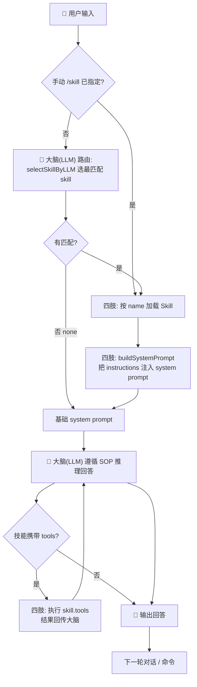
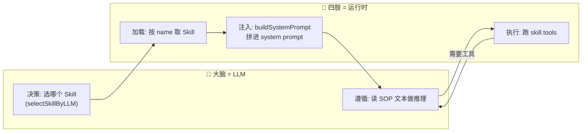

# LangChain TypeScript Agent（DeepSeek）

基于 **LangChain.js** + **TypeScript** 的标准 Agent 项目，使用 **DeepSeek** 作为 LLM。

## 项目结构

```
langChain_ts_agent/
├── src/
│   ├── config.ts          # DeepSeek 模型配置（ChatOpenAI 适配）
│   ├── tools.ts           # Agent 工具集（日期、计算器、文本处理）
│   ├── file_history.ts    # 文件持久化聊天历史
│   ├── logger.ts          # Agent 执行日志记录器
│   ├── chat.ts            # 基础多轮对话示例
│   ├── agent.ts           # Agent + 工具调用 + 记忆示例
│   ├── skills.ts          # Skill 抽象：注册表 + LLM 路由 + 注入
│   ├── skillAgent.ts      # Skill 演示：大脑选技能、四肢注入/执行
│   └── index.ts           # 入口文件
├── data/                  # 聊天历史持久化目录（gitignore）
├── logs/                  # 执行日志目录（gitignore）
├── .env.example           # 环境变量模板
├── tsconfig.json
└── package.json
```

## 快速开始

### 1. 安装依赖

```bash
npm install
```

### 2. 配置 API Key

复制 `.env.example` 文件为 `.env` 文件：

编辑 `.env` 文件，填入你的 [DeepSeek API Key](https://platform.deepseek.com/api_keys)：

```env
DEEPSEEK_API_KEY=sk-xxxxxxxxxxxxxxxx
DEEPSEEK_BASE_URL=https://api.deepseek.com/v1
DEEPSEEK_MODEL=deepseek-chat
```

### 3. 运行

```bash
npm run chat    # 基础多轮对话（已集成 Skill 自动路由）
npm run agent   # Agent + 工具调用
npm run skill   # Skill 演示：LLM 大脑选技能 + 运行时注入
```

## 核心概念

| 概念 | 文件 | 说明 |
|------|------|------|
| **ChatModel** | `config.ts` | 通过 `@langchain/openai` 适配 DeepSeek（兼容 OpenAI 接口） |
| **Tool** | `tools.ts` | 用 `tool()` + `zod` 定义可调用工具 |
| **Agent** | `agent.ts` | `createToolCallingAgent` 创建具备推理+工具调用能力的 Agent |
| **AgentExecutor** | `agent.ts` | Agent 执行循环，管理推理→调用→观察→输出 |
| **Memory** | `agent.ts` | `BufferWindowMemory` 滑动窗口记忆，自动注入对话上下文 |
| **持久化** | `file_history.ts` | `FileChatMessageHistory` 基于 JSON 文件的记忆持久化，重启不丢失 |

## Agent 交互命令

| 命令 | 说明 |
|------|------|
| 直接输入 | 与 Agent 对话，可使用工具 |
| `/clear` | 清空对话记忆（同时清除持久化文件） |
| `/memory` | 查看当前记忆状态（消息数、存储位置） |
| `/exit` | 退出程序 |

## 记忆机制

### 架构

```
用户输入 → AgentExecutor
            ├── BufferWindowMemory.loadMemoryVariables()  ← 只取最近 k 轮
            │     └── FileChatMessageHistory.getMessages() ← 从文件读取全量
            ├── LLM 调用（只收到窗口内上下文）
            └── BufferWindowMemory.saveContext()
                  └── FileChatMessageHistory.addMessages() ← 追加写入文件
```

### 关键参数

- **窗口大小** `k=10`：每次传给 LLM 最多 10 轮对话（20 条消息），避免 token 爆炸
- **持久化文件** `data/chat_history.json`：全量历史存于文件，超出窗口的消息不会丢失，只是不传给 LLM
- **重启恢复**：程序重启后自动从文件加载历史，实现跨会话记忆

## 内置工具

| 工具 | 功能 |
|------|------|
| `get_current_datetime` | 获取当前日期、时间、星期 |
| `calculator` | 安全数学表达式计算 |
| `count_words` | 统计文本字符数和词数 |
| `reverse_text` | 反转文本字符串 |

## Skill 支持（让 LLM 会「按方法做事」）

本示例演示 Agent / LLM 中如何使用 **Skill**。`npm run chat` 与 `npm run skill` 均已集成自动路由：大脑(LLM)选技能、运行时注入 SOP。运行体验：

```bash
npm run chat   # 基础对话，自动按话题匹配技能
npm run skill  # 同样的技能机制，作为独立演示入口
```

### Skill 应用流程图



> 关键：**实线菱形「大脑」节点代表 LLM 决策**（路由选 skill、遵循 SOP、是否需要工具）；**实线矩形「四肢」节点代表运行时执行**（加载、注入、跑工具）。LLM 始终只消费注入后的文本，从不直接持有 `Skill` 对象。

### Skill vs Tool（核心区别）

| | Tool（工具） | Skill（技能） |
|---|---|---|
| 本质 | 一个可被 LLM **直接调用**的原子函数 | 一段**被注入上下文的专业知识 / SOP** |
| 在 LLM 中怎么用 | Function Calling：LLM 把动作委托给代码 | Context Augmentation：指令进 system prompt，LLM 遵循 |
| 解决的痛点 | 「只有代码能做」的事（算数、联网） | 「只有方法/经验才能做好」的事（写邮件、讲代码） |

一句话：**Tool 让 LLM 会「做动作」，Skill 让 LLM 会「按方法做事」**。

### 大脑 / 四肢 分工（本项目设计要点）

> 大脑 = LLM（读 SOP、决策选技能）
> 四肢 = Agent 运行时（把技能注入 prompt、执行携带的 tools、跑循环）

- **Skill 的选择**由大脑（LLM）推理决定：运行时把技能目录交给 LLM，它返回最匹配的 `name`（见 `skills.ts` 的 `selectSkillByLLM`）。
- **Skill 的加载 / 注入 / 工具执行**由四肢（运行时）完成：`buildSystemPrompt` 把 `instructions` 拼进 system prompt。
- **LLM 从不直接接触 `Skill` 对象本身**，它只消费注入后的那段纯文本。



> 上图即「大脑决策、四肢执行」的具象化：选技能 / 遵循 SOP 是**推理**，落在大脑；加载 / 注入 / 执行工具是**机械动作**，落在四肢。

### 数据模型（行业共识 shape，对齐 MCP Prompt）

```ts
interface Skill {
  name: string;          // 元数据：给路由器选
  description: string;   // 元数据：触发条件
  instructions: string;  // 正文：注入 LLM 上下文
  tools?: unknown[];     // 可选：交给四肢执行的工具
}
```

该 shape 同时对应：MCP 的 **Prompt 原语**、`agents.md` 项目指令、以及 OpenAI Agents SDK 的 **handoff（子 Agent 委派）**。

### 本示例与行业标准的映射

| 本项目 | 行业标准 | 说明 |
|--------|----------|------|
| `Skill.instructions` | MCP **Prompt** | 知识/流程型技能以提示词形式提供 |
| `selectSkillByLLM` | Agent **Router / Handoff** | 让 LLM 决策把任务交给哪个专家 |
| `Skill.tools` | MCP **Tool** | 技能可携带可执行工具，由运行时执行 |
| 当前纯指令版 | `agents.md` / `CLAUDE.md` | 把领域 SOP 注入上下文 |

**升级为 MCP Server 的最小改造**（本项目为保持最小化未引入 SDK）：
1. `npm i @modelcontextprotocol/sdk`；
2. 把每个 `Skill` 注册为 MCP 的 `Prompt`（instructions）和/或 `Tool`（tools）；
3. 运行时改用 MCP Client 拉取并注入即可，上层 `Skill` 接口不变。

### Skill 交互命令（`npm run skill`）

| 命令 | 说明 |
|------|------|
| 直接输入 | 大脑(LLM)自动匹配技能并注入 SOP 后回答 |
| `/skills` | 查看可用技能列表 |
| `/skill <name>` | 手动加载指定技能（覆盖自动路由） |
| `/clear` | 清空对话上下文与已加载技能 |
| `/exit` | 退出程序 |

## 技术栈

- **运行时**: Node.js + TypeScript
- **框架**: LangChain.js v0.3
- **模型**: DeepSeek（通过 OpenAI 兼容接口）
- **工具校验**: Zod
- **开发工具**: tsx（热重载）

## 为什么用 DeepSeek？

- API 与 OpenAI 完全兼容，零切换成本
- 推理能力优秀，适合 Agent 场景
- 性价比高，适合开发调试和批量调用

## 自定义 Agent

1. 在 `tools.ts` 中定义新工具
2. 在 `agent.ts` 的 `tools` 数组中注册
3. 根据需要在 prompt 中添加使用规则

```ts
// 自定义工具示例
const myTool = tool(
  async ({ param }) => `结果：${param}`,
  {
    name: "my_tool",
    description: "工具描述",
    schema: z.object({ param: z.string() }),
  }
);
```

## 调整记忆策略

`agent.ts` 中 `MEMORY_WINDOW_SIZE` 控制记忆窗口大小：

```ts
const MEMORY_WINDOW_SIZE = 10; // 保留最近 10 轮对话
```

替换记忆类型（按需选择）：

```ts
// 方案 A：摘要记忆（全部历史压缩为一段摘要，最省 token）
import { ConversationSummaryMemory } from "langchain/memory";
const memory = new ConversationSummaryMemory({ llm: model, ... });

// 方案 B：混合记忆（近 3 轮原文 + 更早的摘要）
import { ConversationSummaryBufferMemory } from "langchain/memory";
const memory = new ConversationSummaryBufferMemory({ llm: model, maxTokenLimit: 2000, ... });
```
