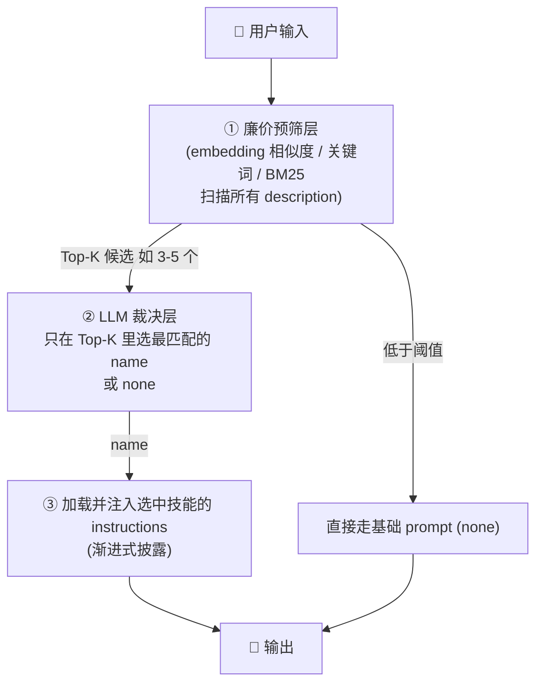

# Skill Router 知识手册

> 整理时间：2026-07-09
> 适用范围：本仓库 `demo/langChain_ts_agent` 的技能路由实现，以及业界 Agent 框架的路由范式对照。
> 关联文件：`src/skillAgent.ts`、`src/skillSandboxAgent.ts`、`src/skillLoader.ts`、`posts/AI/AI实践/2026-04-14-agent-skills-standard.md`、`posts/AI/AI实践/OpenClaw命令.md`

---

## 1. 什么是 Skill Router

Skill Router（技能路由器）负责在"用户一句话进来"时，决定**加载并注入哪个技能（Skill）的 SOP**，或者判定"都不需要"。

本仓库的路由入口是 `src/skillAgent.ts` 的 `selectSkillByLLM`：

```39:55:demo/langChain_ts_agent/src/skillAgent.ts
async function selectSkillByLLM(
  model: any,
  skills: SkillPackage[],
  input: string,
  logger?: AgentLogger
): Promise<SkillPackage | null> {
  // ...
}
```

核心范式：**把所有技能的 `name: description` 列表喂给 LLM，让它返回最匹配的 `name`（或 `none`）**。

---

## 2. 结论：description 驱动的 LLM 路由是业界主流基线

把技能 `description` 交给 LLM 决策选哪个，本身就是当前业界的标准做法。各主流框架都是这个范式：

| 框架 | 路由方式 | 与本仓库对应 |
|------|----------|--------------|
| **OpenClaw** | 按 `SKILL.md` 的 `description` 自动判断何时用 | 同 `description` 驱动 |
| **Claude Agent Skills (Anthropic)** | 模型读 frontmatter 的 `description`（含 WHEN），主动决定调用 | 同 `description` 驱动 |
| **Vercel Agent Skills** | `npx skills` 标准，按 description 触发 | 同 |
| **LangChain** | `RouterChain` / `MultiPromptChain`（LLM 路由） | 同本仓库做法 |
| **OpenAI Agents SDK** | `handoff`（description 驱动） | 同 |

> 依据：本仓库 `posts/AI/AI实践/2026-04-14-agent-skills-standard.md` 明确指出
> "智能触发：Agent 根据 SKILL.md 中的 description 自动判断何时使用该技能"。

### 本仓库做得对的关键点：渐进式披露（Progressive Disclosure）

路由只选 `name`，随后 `buildSystemPrompt` 只把**被选中的那一个**技能的 `instructions` 注入上下文，而不是把所有技能正文都塞进 context。这与 Anthropic 的 progressive disclosure 一致，能有效控制 token 消耗，应予以保留。

```27:36:demo/langChain_ts_agent/src/skillAgent.ts
function buildSystemPrompt(base: string, skill: SkillPackage | null, scriptOutput?: string): string {
  let text = base;
  if (skill) {
    text += `\n\n【已加载技能：${skill.name} | runtime=${skill.runtime}】\n${skill.instructions}`;
  }
  // ...
}
```

### 本仓库独有的工程权衡：两段式分离调用

本仓库把"路由"和"生成"拆成**两次独立调用**（`selectSkillByLLM` 先跑，再跑主对话）。这比 Claude/OpenClaw 把全部技能 description 塞进**同一个**上下文更省 token——代价是多一次 round-trip。在小技能集下，"两段式"反而更经济。

---

## 3. 纯 LLM 路由的短板

| 短板 | 说明 |
|------|------|
| **成本 / 延迟** | 每轮用户发言都先烧一次 LLM 做路由；技能数 N 越大，路由 prompt 越长。 |
| **上下文随 N 线性膨胀** | `skills.map(s => ...description)` 随技能数量增长，token 与准确率都受影响。 |
| **非确定性** | LLM 路由不保证同一输入每次选同一技能。 |
| **输出解析脆弱** | 若用 `String(res.content).trim().toLowerCase()` 硬匹配，模型若返回带反引号、或 `"say-hello 最合适"`、或多说一句解释，就会退化成无技能。 |
| **激活后粘性** | `if (!activeSkill)` 一旦选中就锁定到 `/clear`，多轮会话中途换话题不会切技能（设计取舍，非 bug）。 |

> 实现状态：本仓库已在 `selectSkillByLLM` 用 `withStructuredOutput`（Zod 受约束枚举）替换字符串硬匹配，
> 并保留"关键词提取"回退，由此**短板 4（输出解析脆弱）已消除**。

---

## 4. 规模化下的最佳实践：分层路由器（Tiered Router）

技能数量大时，业界共识是**两级**而非纯 LLM 或纯规则：



- **第①层（embedding / 关键词）**：近零成本、确定性、毫秒级，从 N 个技能砍到 Top-K。对应 `semantic-router` 库与 LangChain `SemanticRouter`。
- **第②层（LLM）**：只在 Top-K 上做语义消歧，prompt 短、准确率高、token 省。
- 既保留 LLM 的语义理解优势，又解决成本与规模准确率问题。

> 本仓库当前技能数少（demo 中 2 个），尚不需要预筛层；当技能 > ~15 个时再引入即可。

---

## 5. 针对本仓库的升级清单（实现状态）

1. **✅ 结构化路由输出（收益最高、改动最小）—— 已完成**
   用 `model.withStructuredOutput(Zod 枚举)` 让模型返回受约束的 `{ skill: name | "none" }`，
   替换原本的字符串硬匹配；并保留"关键词提取"回退以兼容不支持结构化输出的模型。
   代码见 `src/skillAgent.ts` 的 `selectSkillByLLM`。

2. **⬜ 轻量预筛层（技能 > ~15 个时再做）**
   先对 `description` 做 embedding / 关键词召回 Top-5，再喂给 LLM，解决成本与规模准确率问题。

3. **⬜ 路由策略明确化**
   要么"每轮重路由"（去掉 `if (!activeSkill)` 的粘性），要么保留粘性但加"显式切题检测"——二选一并写进注释，避免含糊。

---

## 6. 一句话总结

> 用 `description` 驱动 LLM 选技能是业界公认基线（OpenClaw / Claude / Cursor / Vercel / LangChain 皆然），本仓库的"两段式 + 渐进式披露"实现方向正确；
> 真正要补的是**输出结构化**（已完成）与**规模化下的分层预筛**（待技能规模增长时再做），而非推翻重来。
