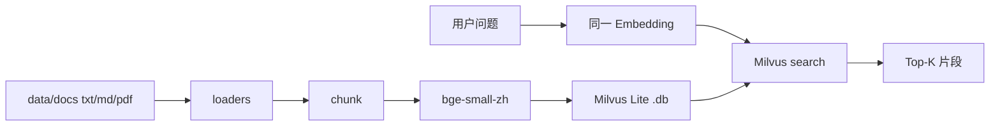

# Milvus Lite RAG Demo（Python + 本地向量库）

一个最小可运行的 **文档检索** 示例：把 `txt` / `md` / `pdf` 切片并向量化，写入 **Milvus Lite** 本地数据库，再做语义查询。

- **Milvus Lite** ： `MilvusClient("./data/milvus.db")`，嵌入式本地文件，无需 Docker / 独立服务
- **本地 Embedding** ： `sentence-transformers` + `BAAI/bge-small-zh-v1.5`（512 维），零 API Key
- **多格式文档** ： `.txt` / `.md` / `.pdf`
- 范围：入库 + Top-K 语义检索（不含 LLM 生成回答）

## 与同仓库其他 Demo 的区别

| Demo | 语言 | 向量存储 | Embedding | 文档格式 |
|------|------|----------|-----------|----------|
| `demo/rag` | TypeScript | JSON 文件 | DeepSeek 语义打分 / OpenAI 兼容 | md / txt |
| `demo/embedding` | TypeScript | JSON 文件 | Transformers.js 本地 | 文本 + 图片 |
| **`demo/milvus-rag-demo`（本 Demo）** | **Python** | **Milvus Lite** | **sentence-transformers 本地** | **txt / md / pdf** |

> Milvus Lite 仅通过 Python SDK（`pymilvus`）提供；因此本 Demo 使用 Python，而不是仓库里常见的 TypeScript。

## 技术方案



## 目录结构

```
demo/milvus-rag-demo/
├── .env.example
├── .gitignore
├── requirements.txt
├── README.md
├── data/
│   └── docs/             # 待入库文档（.txt / .md / .pdf）
└── src/
    ├── config.py         # 环境变量与路径
    ├── loaders.py        # 多格式文档加载
    ├── chunk.py          # 分块（段落 + 重叠窗口）
    ├── embed.py          # 本地向量化
    ├── store.py          # Milvus Lite 读写
    ├── index.py          # 入库 CLI
    ├── search.py         # 检索 CLI
    └── demo.py           # 一键演示
```

## 环境要求

- **Python ≥ 3.10**
- Windows / macOS / Linux（需能安装 `faiss-cpu`、`pyarrow` 等依赖的 wheel）
- 首次运行会下载 Embedding 模型（约百 MB 级）。若直连 HuggingFace 较慢，可在 `.env` 设置 `HF_ENDPOINT=https://hf-mirror.com`（镜像不可用时去掉该配置即可）

## 快速开始

> **Windows 注意**：若 `python --version` 显示 2.x（例如 `C:\Python27\python.exe`），不要用它创建 venv（没有 `venv` 模块）。请改用 Python 3.10+，或下面的「已有 .venv / uv」方式。

```bash
cd demo/milvus-rag-demo

# 方式 A：系统已有 Python 3.10+
python3 -m venv .venv          # 或: py -3.12 -m venv .venv
# Windows
.venv\Scripts\activate
# macOS / Linux
# source .venv/bin/activate

pip install -r requirements.txt
copy .env.example .env          # Windows；Linux/macOS 用 cp

python -m src.index             # 切片 → 向量化 → 写入 milvus.db
python -m src.search "向量数据库是什么"
python -m src.demo              # 一键：入库 + 预置查询
```

若本机默认 `python` 仍是 2.7，但目录里已有 `.venv`，可直接：

```powershell
cd demo/milvus-rag-demo
.\.venv\Scripts\Activate.ps1
python -m src.demo
```

也可用 [uv](https://github.com/astral-sh/uv)（无需改系统 PATH）：

```powershell
uv venv .venv --python 3.12
.\.venv\Scripts\Activate.ps1
uv pip install -r requirements.txt
python -m src.demo
```

## 常用命令

| 命令 | 说明 |
|------|------|
| `python -m src.index` | 读取 `data/docs` → 分块 → 向量化 → 写入 Milvus Lite（会重建 collection） |
| `python -m src.search` | 交互式语义检索（输入 `exit` 退出） |
| `python -m src.search "你的问题"` | 单次 Top-K 检索 |
| `python -m src.demo` | 一键演示完整入库 + 检索流程 |

## 工作流程

```
入库：文档 → 加载(txt/md/pdf) → 分块 → Embedding → Milvus Lite
检索：问题 → 同一 Embedding → COSINE Top-K → 片段 + score + 来源
```

## 替换为自己的知识库

把 `.txt` / `.md` / `.pdf` 放进 `data/docs/`，再执行 `python -m src.index` 即可。  
向量库文件默认在 `data/milvus.db`（已 gitignore）。

## 扩展到完整 Milvus

代码里把 `MilvusClient` 的 `uri` 从本地文件改成服务端地址即可，例如：

```python
MilvusClient(uri="http://localhost:19530", token="username:password")
```

其余 insert / search API 保持一致。

## 说明

- 写入与查询必须使用 **同一个 Embedding 模型**；换模型后需重新 `python -m src.index`。
- 本 Demo 不做 LLM 生成；若要完整 RAG 问答，可在检索结果上再接 DeepSeek / OpenAI 兼容 Chat API。
