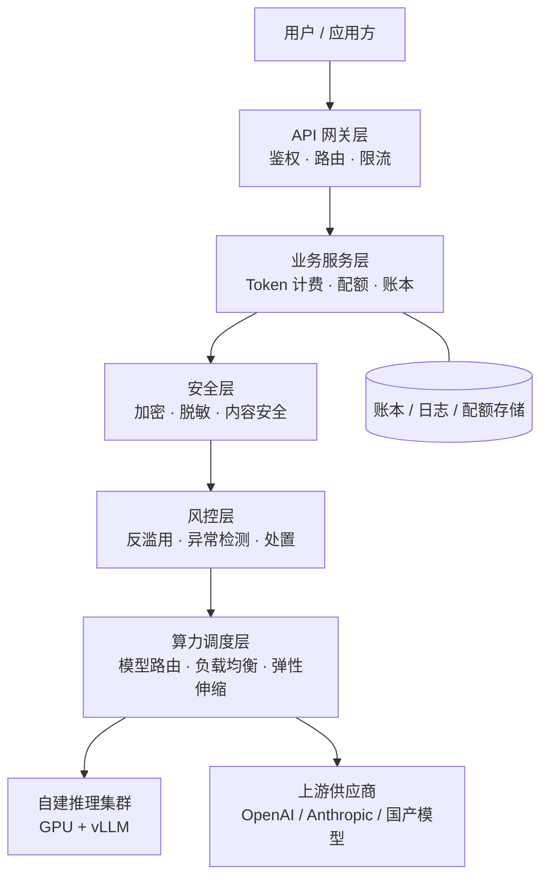

# 从 0 到 1 搭建大模型开放平台：算力、Token 计费、数据安全与风控

> 整理日期：2026-08-30
> 定位：面向 **LLM 中转站 / 开放平台** 的应用层架构知识——从算力平台到开放网关，从 Token 计费到数据安全与风控体系。

「中转站」的本质是一个 **LLM 开放平台** /ˌoʊpən ˈplætfɔːrm/ （Open Platform，开放平台）：向上以统一的 **API** /ˌeɪ piː ˈaɪ/ （ **Application Programming Interface** ，应用程序编程接口）对外提供服务，向下对接多家模型供应商或自建算力，中间用计费、限流、安全、风控四大系统兜底。本文按「算力 → 网关 → 计费 → 安全 → 风控」的顺序，拆解每一层的底层逻辑与落地要点。

## 一、全景架构



| 层 | 职责 | 关键词 |
|----|------|--------|
| API 网关 | 鉴权、模型路由、协议转换、限流入口 | Key、路由、熔断 |
| 业务服务 | 计费、配额、余额、订单 | Token 账本 |
| 安全层 | 传输/存储加密、脱敏、内容合规 | TLS、PII 脱敏 |
| 风控层 | 识别与拦截滥用、盗刷、违规内容 | 规则 + 模型 |
| 算力调度 | 把请求送到"最合适"的算力上 | 自建 vs 上游、弹性 |

## 二、从 0 到 1 搭建算力平台

### 2.1 算力从哪来

三种主流来源，成本与可控性依次变化：

| 来源 | 适用阶段 | 特点 |
|------|----------|------|
| 上游 API 采购 | 0 → 1 早期 | 零 GPU 投入，按 Token 付费转售，毛利来自**差价** |
| 云上 **GPU** /ˌdʒiː piː ˈjuː/ （ **Graphics Processing Unit** ，图形处理器）租用 | 有稳定流量后 | 弹性好，需自运维推理服务 |
| 自建机房 / 裸金属 | 规模化后期 | 成本最低，重资产，需专业运维 |

**建议路径**：中转站起步阶段完全不需要自建 GPU——先用上游 API 把商业闭环跑通，等单模型日耗 Token 量大且稳定后，再把热点模型迁到自建推理集群摊薄成本。

### 2.2 自建推理栈的最小集

1. **容器编排**： **K8s** /ˌkeɪ eɪts/ （ **Kubernetes** ，容器编排系统） + GPU 调度（`nvidia.com/gpu` 资源）；
2. **推理引擎**：vLLM（PagedAttention、Continuous Batching）或 SGLang，承载 **OpenAI 兼容协议**；
3. **模型仓库**：对象存储 + 模型版本管理（Hugging Face 格式权重）；
4. **弹性伸缩**：基于 **QPS** /ˌkjuː piː ˈes/ （ **Queries Per Second** ，每秒查询数）或 GPU 利用率的 Horizontal Pod Autoscaler；
5. **多级缓存**：Prompt 前缀缓存、KV Cache 复用，降低重复请求成本。

### 2.3 算力调度的核心问题

- **模型路由**：同一能力多个上游（如 gpt-4o 级别模型），按价格 / 延迟 / 成功率动态选路；
- **故障转移**：上游 5xx / 超时自动切备用渠道，用户无感；
- **配额隔离**：单上游渠道设并发与 RPM 上限，避免雪崩；
- **混部**：自建集群白天服务在线推理，夜间跑离线批处理（评测、数据清洗）。

## 三、大模型开放平台：网关层的底层逻辑

### 3.1 对外暴露什么

标准做法是**兼容 OpenAI 协议**（`/v1/chat/completions`、`/v1/embeddings` 等），用户把 `base_url` 一改即可迁移，获客成本最低。网关层要做的事：

1. **鉴权**：签发平台自己的 API Key（`sk-` 前缀），不是透传上游 Key；
2. **协议归一**：把不同上游的请求/响应格式归一到统一协议（含流式 SSE 转换）；
3. **模型映射**：对外模型名 → 内部渠道（多上游、多版本）；
4. **可观测**：请求日志、Trace、按 Key/模型 维度的用量统计。

### 3.2 渠道（Channel）抽象

中转站的核心数据结构是「渠道」：一个渠道 = 一个上游供应商 + 一个模型 + 密钥 + 权重 + 优先级。调度时按 **优先级 → 权重 → 健康度** 选择，失败自动降级。这层做对了，后面换供应商、做主备、压成本都是配置变更而非代码变更。

## 四、Token 系统底层逻辑

### 4.1 计价的计价单位：为什么是 Token

大模型按 **Token** /ˈtoʊkən/ （词元，模型分词后的最小计费单元）计费，输入与输出单价不同（输出通常贵 3~5 倍），不同模型单价差异可达百倍。计费公式：

```text
费用 = ceil(输入 tokens / 1M) × 输入单价 + ceil(输出 tokens / 1M) × 输出单价
```

### 4.2 预扣费 → 结算 → 退差的账本模型

因为只有流式结束后才知道真实消耗，主流采用**三段式账本**：

1. **预扣费**：请求前按 `max_tokens` 估算并冻结余额，余额不足直接拒绝（防白嫖）；
2. **结算**：请求完成后按实际 usage 扣费，解冻差额；
3. **对账**：异步任务核对账本流水与上游账单，发现盗刷或漏计。

TypeScript 最小实现（账本 + 预扣费）：

```typescript
interface LedgerEntry {
  userId: string;
  model: string;
  promptTokens: number;
  completionTokens: number;
  costUsd: number;
  type: "hold" | "settle" | "refund";
  createdAt: Date;
}

interface PricedModel {
  inputPerMillion: number;   // USD
  outputPerMillion: number;  // USD
}

function estimateCost(model: PricedModel, promptTokens: number, completionTokens: number): number {
  return (
    (promptTokens / 1_000_000) * model.inputPerMillion +
    (completionTokens / 1_000_000) * model.outputPerMillion
  );
}

// 预扣费：余额不足则拒绝请求
async function holdCredit(balance: number, est: number): Promise<boolean> {
  return balance >= est; // 生产环境需原子扣减（DB 乐观锁 / Redis Lua）
}

// 结算：按真实 usage 补扣或退还差额
function settleDelta(held: number, actual: number): number {
  return held - actual; // > 0 退还，< 0 补扣
}
```

### 4.3 限流与配额

| 维度 | 含义 | 典型实现 |
|------|------|----------|
| **RPM** /ˌɑːr piː ˈem/ （ **Requests Per Minute** ，每分钟请求数） | 防刷、防上游打爆 | Redis 滑动窗口 |
| **TPM** /ˌtiː piː ˈem/ （ **Tokens Per Minute** ，每分钟 Token 数） | 防单请求超大上下文滥用 | 窗口内累加 usage |
| 并发数 | 同时进行的请求数 | 信号量 / 计数器 |
| 月配额 | 商业套餐上限 | 配额表 + 定时重置 |

限流必须放在**鉴权之后、转发上游之前**，且按 Key 维度而非 IP 维度（一个企业客户可能整栋楼一个出口 IP）。

## 五、数据安全

### 5.1 三条边界

中转站天然看到用户全部请求内容，数据安全要守住三条边界：

1. **传输中**（in transit）：全链路 **TLS** /ˌtiː el ˈes/ （ **Transport Layer Security** ，传输层安全协议），证书自动续期；
2. **存储中**（at rest）：日志、账本落盘加密，密钥交给 **KMS** /ˌkeɪ em ˈes/ （ **Key Management Service** ，密钥管理服务）托管；
3. **使用中**（in use）：最小权限访问生产数据，操作审计留痕。

### 5.2 脱敏与合规

- 请求体进入日志前，先做 **PII** /ˌpiː aɪ ˈaɪ/ （ **Personally Identifiable Information** ，个人身份信息）检测与打码（手机号、身份证、邮箱、密钥串）；
- 日志分级：计量日志（只有 token 数与费用）默认保留，内容日志按需开启并设短 TTL；
- 权限模型用 **RBAC** /ˌɑːr bæk/ （ **Role-Based Access Control** ，基于角色的访问控制），敏感操作叠加 **ACL** /ˈeɪ siː el/ （ **Access Control List** ，访问控制列表）显式白名单；
- 展示端推理内容打码时注意：别把**加粗、音标之外**的原文直接拼进前端调试面板。

### 5.3 密钥安全

- 平台 Key 只存哈希（SHA-256），泄漏后可吊销重发；
- 上游 Key 加密存储（信封加密：数据密钥加密内容，KMS 主密钥加密数据密钥）；
- 禁止把上游 Key 下发给客户端——这是中转站存在的意义之一。

## 六、风控体系

### 6.1 风控要防什么

| 风险 | 表现 | 手段 |
|------|------|------|
| 盗刷 | 被盗 Key 高频大模型调用 | 异常用量告警、Key 熔断 |
| 白嫖/套利 | 注册送额度批量薅羊毛 | 设备指纹、手机号验证、新号限额 |
| 内容违规 | 生成违法有害内容 | 输入输出双向内容审核 |
| 转售倒卖 | 平台额度被二次封装转卖 | 企业实名、用量画像 |
| 上游封禁 | 用户滥用导致上游封号 | 渠道级限流、违规用户隔离 |

### 6.2 风控的三道闸门

1. **事前（准入）**：注册验证、实名分级、新用户限额、黑名单拦截；
2. **事中（拦截）**：规则引擎（频率、金额、特征）+ 实时内容审核（先审后发或流式边发边审）；
3. **事后（处置与迭代）**：异常账单回溯、账号冻结、案例反哺规则与模型。

### 6.3 异常检测的信号

- 单 Key 消耗速率突增（对比该 Key 历史基线的 z-score）；
- 请求分布异常：全部打最贵模型、`max_tokens` 恒等于上限、prompt 千篇一律（脚本特征）；
- 网络特征：同一 Key 多地并发、高频更换出口 **IP** /ˌaɪ ˈpiː/ （ **Internet Protocol** ，网际协议）地址。

## 七、技术选型参考

### 7.1 中转站 / 管理分发类（自带渠道、计费、令牌管理）

| 项目 | 地址 | 技术栈 | 特点 |
|------|------|--------|------|
| One API | [songquanpeng/one-api](https://github.com/songquanpeng/one-api) | Go | 鼻祖级项目（20K+ Star），OpenAI 兼容协议聚合多上游、令牌分发、额度计费、渠道负载均衡，绝大多数中转站的底座 |
| New API | [QuantumNous/new-api](https://github.com/QuantumNous/new-api) | Go | One API 二开版，支持更多模型（Claude / Gemini 原生、Midjourney、Rerank 等）、在线充值、数据看板，当前最流行 |
| One Hub | [MartialBE/one-hub](https://github.com/MartialBE/one-hub) | Go | One API 分支，重写了 UI 与性能，分组倍率更灵活 |
| uni-api | [yym68686/uni-api](https://github.com/yym68686/uni-api) | Python | 纯配置文件驱动（无数据库），多上游自动重试、加权负载均衡，适合个人轻量自用 |
| gpt-load | [tbphp/gpt-load](https://github.com/tbphp/gpt-load) | Go | 高并发透明代理，主打多 Key 池轮询与失败重试，配置简单 |
| Veloera | [Veloera/Veloera](https://github.com/Veloera/Veloera) | Go | New API 分支，增强渠道调度与计费细节 |

### 7.2 SDK + 代理网关类（偏应用内集成）

| 项目 | 地址 | 技术栈 | 特点 |
|------|------|--------|------|
| LiteLLM | [BerriAI/litellm](https://github.com/BerriAI/litellm) | Python | 国际主流，SDK + Proxy Server 双形态，统一 100+ 供应商协议，内置虚拟 Key、预算、限流、成本追踪 |
| Portkey AI Gateway | [Portkey-AI/gateway](https://github.com/Portkey-AI/gateway) | TypeScript | 轻量可嵌入，路由、fallback、缓存、护栏（guardrails），适合作为应用内网关 |

### 7.3 云原生 AI 网关类（基础设施级）

| 项目 | 地址 | 特点 |
|------|------|------|
| Higress（阿里开源） | [alibaba/higress](https://github.com/alibaba/higress) | 云原生网关 + AI 插件（ai-proxy、ai-token-ratelimit、ai-cache），生产级 |
| Apache APISIX | [apache/apisix](https://github.com/apache/apisix) | ai-proxy 等 AI 插件生态，老牌 API 网关扩展 |
| Kong AI Gateway | [Kong/kong](https://github.com/Kong/kong) | AI 插件体系完善，核心开源、部分企业功能收费 |

### 7.4 其他组件

| 组件 | 开源参考 |
|------|----------|
| 推理引擎 | vLLM、SGLang、SGLang Router |
| 内容安全 | 各云厂商内容安全 API + 自建敏感词 |
| 账本 | 事务型数据库（PostgreSQL）+ 流水表，禁止只靠内存记账 |

### 7.5 选型速查

- **个人 / 小团队快速搭建中转站** ：New API（功能全）或 uni-api（零数据库轻量）；
- **应用内统一多模型调用** ：LiteLLM；
- **企业级基础设施** ：Higress / Apache APISIX；
- **参考非开源方案** ：OpenRouter（SaaS，协议设计值得借鉴）。

> 自研 vs 开源：起步用 One API 系验证业务，量起来后把 **计费账本、风控、渠道路由** 三个核心模块换成自研——它们是中转站真正的护城河。

## 本文缩写

| 缩写 | 音标 | 全拼 | 中文 |
|------|------|------|------|
| **API** | /ˌeɪ piː ˈaɪ/ | Application Programming Interface | 应用程序编程接口 |
| **ACL** | /ˈeɪ siː el/ | Access Control List | 访问控制列表 |
| **GPU** | /ˌdʒiː piː ˈjuː/ | Graphics Processing Unit | 图形处理器 |
| **IP** | /ˌaɪ ˈpiː/ | Internet Protocol | 网际协议 |
| **K8s** | /ˌkeɪ eɪts/ | Kubernetes | 容器编排系统 |
| **KMS** | /ˌkeɪ em ˈes/ | Key Management Service | 密钥管理服务 |
| **PII** | /ˌpiː aɪ ˈaɪ/ | Personally Identifiable Information | 个人身份信息 |
| **QPS** | /ˌkjuː piː ˈes/ | Queries Per Second | 每秒查询数 |
| **RBAC** | /ˌɑːr bæk/ | Role-Based Access Control | 基于角色的访问控制 |
| **RPM** | /ˌɑːr piː ˈem/ | Requests Per Minute | 每分钟请求数 |
| **TLS** | /ˌtiː el ˈes/ | Transport Layer Security | 传输层安全协议 |
| **TPM** | /ˌtiː piː ˈem/ | Tokens Per Minute | 每分钟 Token 数 |
