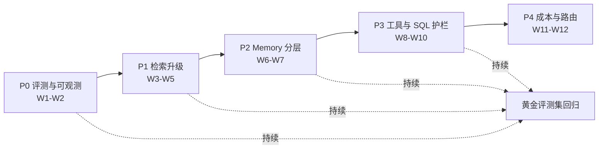

# 后台客服 Chatbot 发展路线图：从能用到好用

> 整理日期：2026-09-01
> 定位：给一个「链路已通但还很朴素」的后台客服 **Chatbot** /ˈtʃætbɒt/ （聊天机器人）制定升级路线——覆盖评测、检索、Memory、Agent 工具与成本治理，每个阶段都配可落地的示例与验收数字。

## 一、现状盘点

先客观描述这个 Chatbot 已有的能力与短板：

| 模块 | 现状 | 成熟度 |
|------|------|--------|
| 聊天界面 | 已上线，可用 | ✅ |
| **LLM** /ˌel el ˈem/ （ **Large Language Model** ，大语言模型）调用 | 单模型直调 | ✅ |
| **Agent** /ˈeɪ dʒənt/ （智能体）工具 | 已接入若干工具 | ⚠️ 缺治理 |
| **SQL** /ˌes kjuː ˈel/ （ **Structured Query Language** ，结构化查询语言）召回 | LLM 生成 SQL 查库 | ⚠️ 缺护栏 |
| 会话召回 | 依赖当前会话上下文 | ⚠️ 无摘要压缩 |
| 知识库 / **FAQ** /ˌef eɪ ˈkjuː/ （ **Frequently Asked Questions** ，常见问题） | 写死在配置里 | ⚠️ 更新靠人肉 |
| **Memory** /ˈmeməri/ （记忆） | 全量注入 **Prompt** /prɒmpt/ （提示词） | ⚠️ 无分层、易超长 |
| **BM25** /ˌbiː em ˌtwenti ˈfaɪv/ （ **Best Matching 25** ，经典关键词检索算法）关键词召回 | 没有 | ❌ 缺失 |
| 评测体系 | 没有 | ❌ 缺失 |

一句话结论： **链路已通，质量未知** 。当前最大的风险不是「功能少」，而是「每次改动都不知道变好还是变坏」——所以路线图的第一步不是加功能，而是建度量。

## 二、贯穿案例：「小知」后台客服助手

后文所有示例围绕同一个虚构但真实感的场景展开：

- 「小知」是某电商公司的内部后台客服助手，服务客服团队约 **200 人** ；
- 客服每天向小知提问约 **800 次** ，问题分布：订单 / 退款查询 45%、平台规则 30%、操作指引 15%、闲聊与越界 10%；
- 人工抽检当前解决率约 **62%** ，目标 12 周内做到 **85%+** ；
- 团队配置：1 名后端 + 0.5 名算法，预算有限，优先做「低垂果实」。

## 三、路线图总览



| 阶段 | 周期 | 主题 | 一句话目标 |
|------|------|------|-----------|
| **P0** | W1–W2 | 评测与可观测 | 先能度量，再谈优化 |
| **P1** | W3–W5 | 检索升级 | BM25 + 向量混合 **Recall** /rɪˈkɔːl/ （召回），FAQ 治理 |
| **P2** | W6–W7 | Memory 分层 | 会话摘要 + 用户画像，告别全量注入 |
| **P3** | W8–W10 | Agent 工具与 SQL 护栏 | 工具治理 + 只读 SQL 白名单 |
| **P4** | W11–W12 | 成本与模型路由 | 小模型分流，延迟与费用双降 |

核心原则： **每个阶段都以评测集指标提升为验收标准，没有数据的优化一律不上线** 。

## 四、P0：评测与可观测先行（W1–W2）

### 4.1 为什么评测先行

1. 没有评测集的优化等于盲修：换 **RAG** /ræɡ/ （ **Retrieval-Augmented Generation** ，检索增强生成）策略、调 Prompt 都可能「按下葫芦浮起瓢」；
2. 评测集是团队的共同语言：运营说「答得不好」，要能落到具体哪条用例、哪一步检索失败；
3. 回归要先于迭代：新版本跑分必须与旧版本对比，防止负优化静默上线。

**落地示例**：给小知建 50 条 **Golden Set** /ˈɡəʊldən set/ （黄金评测集），按真实问题分布配比——订单 / 退款 22 条、平台规则 15 条、操作指引 8 条、越界拒答 5 条，每条标注标准答案要点与期望调用的工具：

```yaml
# eval/golden-set.yaml —— 黄金评测集样例（节选）
- id: order-001
  question: "订单 2026082900123 退款到哪一步了？"
  expected_tools: [sql_order_query]     # 期望命中的工具
  answer_must_include:
    - "退款已提交"                       # 答案必须包含的要点
    - "预计 1-3 个工作日到账"
  answer_must_not_include:
    - "根据推测"                         # 出现即判负
  source: 真实工单 #20260829-047

- id: rule-003
  question: "生鲜类目 7 天无理由退货怎么算？"
  expected_tools: [faq_retrieval]
  answer_must_include:
    - "签收后 48 小时内提出"
  source: 平台规则 v3.2 第 4.1 条
```

冷启动不必追求大而全：50 条 ≈ 2 个工作日（含标注与评审），却能覆盖 90% 的高频场景。

### 4.2 每日回归脚本

**落地示例**：一条命令跑完整评测集（Node.js + TS）：

```typescript
// eval/run-regression.ts
import { readFileSync } from "node:fs";

interface GoldenCase {
  id: string;
  question: string;
  expected_tools: string[];
  answer_must_include: string[];
}

const cases: GoldenCase[] = JSON.parse(
  readFileSync("eval/golden-set.yaml", "utf-8"),
);

interface CaseResult {
  id: string;
  passed: boolean;
  failedPoints: string[];
}

async function runOne(c: GoldenCase): Promise<CaseResult> {
  const resp = await askBot(c.question);          // 调用小知的对话接口
  const failedPoints = c.answer_must_include.filter(
    (p) => !resp.answer.includes(p),
  );
  const toolMissed = !resp.toolsUsed.some((t) =>
    c.expected_tools.includes(t),
  );
  return {
    id: c.id,
    passed: failedPoints.length === 0 && !toolMissed,
    failedPoints: toolMissed ? ["工具未命中", ...failedPoints] : failedPoints,
  };
}

const results = await Promise.all(cases.map(runOne));
const passRate =
  (results.filter((r) => r.passed).length / results.length) * 100;
console.log(`通过率 ${passRate.toFixed(1)}%`);
// 判定标准：与上一版相比下降超过 1pp 即回归失败，禁止发布
```

代入小知的数字：v1.0 基线通过率 58%；同版连跑 3 次的波动（噪声带）为 ±1.2pp，因此把回归门槛定为「提升 ≥ 2pp 才算有效，下降 > 1pp 即拦截发布」。

### 4.3 线上反馈闭环

1. 界面加「赞 / 踩」按钮，踩选时必填原因标签（答非所问 / 信息过时 / 查不到数据 / 其他）；
2. 每周固定半小时「差评复盘会」：从踩反馈中挑 5–10 条，补进黄金评测集或修复知识库；
3. 记录三个北极星指标： **KPI** /ˌkeɪ piː ˈaɪ/ （ **Key Performance Indicator** ，关键绩效指标）解决率、转人工率、平均对话轮数。

**落地示例**：小知第 2 周的反馈看板——解决率 62% → 64%（修复了 3 条过时 FAQ）、转人工率 28% → 25%；「查不到数据」类差评占 41%，这直接指向 P1 的检索升级。

## 五、P1：检索升级——BM25 混合召回与 FAQ 治理（W3–W5）

### 5.1 为什么纯语义召回不够

当前写死的知识库靠「前缀匹配 / 规则命中」，有向量召回的团队也常遇到两类失败：

1. **专有名词失配**：用户问「FX001 退款规则」，语义检索匹配不到写成了「鲜汇生鲜平台退款协议」的文档——术语 → 文档名的映射，语义模型学不到，关键词检索一击即中；
2. **长尾编号类查询**：订单号、SKU 编码、工单号这类字符串，向量几乎无区分度，必须靠精确匹配。

**落地示例**：小知统计一周线上 query，发现 23% 的失败案例含业务编号或专有名词——这正是 BM25 最擅长的部分，预估补上混合检索后失败案例可减少三分之一。

### 5.2 混合检索与 **RRF** /ˌɑːr ɑːr ˈef/ （ **Reciprocal Rank Fusion** ，倒数排名融合）

方案：向量召回（语义）+ BM25 召回（关键词）各取 Top-K，用 RRF 融合排序，再可选接一层 **Rerank** /ˌriː ˈræŋk/ （重排序）模型。

**落地示例**：RRF 融合（Node.js + TS）：

```typescript
interface Hit {
  docId: string;
  rank: number;        // 各路召回内的排名，从 1 开始
}

/** RRF 融合：score = Σ 1 / (k + rank)，k 经验值取 60 */
function rrfFuse(
  vectorHits: Hit[],
  bm25Hits: Hit[],
  k = 60,
): { docId: string; score: number }[] {
  const scores = new Map<string, number>();
  for (const hit of [...vectorHits, ...bm25Hits]) {
    scores.set(
      hit.docId,
      (scores.get(hit.docId) ?? 0) + 1 / (k + hit.rank),
    );
  }
  return [...scores.entries()]
    .map(([docId, score]) => ({ docId, score }))
    .sort((a, b) => b.score - a.score);
}

// 向量召回第 2 名 + BM25 召回第 1 名的文档：
// 1/(60+2) + 1/(60+1) ≈ 0.0324，高于单路第 1 名的 1/61 ≈ 0.0164
```

小知的配置：向量 Top-20 + BM25 Top-20 → RRF 融合取前 8 → 进 Prompt。上线后黄金集通过率 58% → 67%（+9pp，超过 2pp 门槛，认定有效）。

### 5.3 FAQ 与写死知识库的治理

写死的 FAQ 是隐形债，三条治理规则：

1. **一问一档**：每条 FAQ 带 `question / answer / 生效日期 / 来源 / 负责人` 五要素，放进可检索的存储而非代码常量；
2. **过期看板**：生效超过 90 天未复核的 FAQ 自动打标，进每周复盘会；
3. **命中监控**：线上 FAQ 命中率与「命中后仍点踩」率双指标，后者高说明答案内容过期而非检索失败。

**落地示例**：小知把 132 条写死 FAQ 迁移到数据库，复核发现 17 条已过期（占 13%），其中「疫情期配送时效」类 5 条还在被命中——仅清掉这 5 条，规则类问题点踩率当周下降 18%。

## 六、P2：Memory 分层与会话治理（W6–W7）

### 6.1 全量注入的三个问题

1. **超长**：客服一天与同一个用户聊 40 轮，原始对话全注入必然撑爆上下文；
2. **稀释**：无关历史拉低关键信息的注意力权重（前文召回质量白做）；
3. **泄漏**：跨会话共享记忆若不加隔离，A 商家的数据可能出现在 B 商家的回答里。

### 6.2 三层 Memory 架构

| 层 | 内容 | 生命周期 | 注入方式 |
|----|------|----------|---------|
| 会话层 | 最近 N 轮原文 | 当前会话 | 全量注入 |
| 摘要层 | **Session Summary** /ˈseʃn ˈsʌməri/ （会话摘要），超 N 轮后滚动压缩 | 当前会话 | 注入一段摘要文本 |
| 画像层 | 用户 **Profile** /ˈprəʊfaɪl/ （画像）：身份、权限、历史偏好 | 跨会话持久 | 按用户 ID 检索后注入 |

**落地示例**：摘要压缩策略（Node.js + TS）：

```typescript
const RECENT_ROUNDS = 6;                       // 保留最近 6 轮原文

interface Message { role: "user" | "assistant"; content: string }

/** 超过阈值时：旧轮次折叠成摘要，只保留近 N 轮 */
async function buildContext(sessionId: string): Promise<Message[]> {
  const history: Message[] = await loadHistory(sessionId);
  if (history.length <= RECENT_ROUNDS * 2) return history;

  const older = history.slice(0, -RECENT_ROUNDS * 2);
  const recent = history.slice(-RECENT_ROUNDS * 2);
  const summary = await summarize(older);      // LLM 压缩为 ≤200 字摘要
  return [
    { role: "assistant", content: `[此前对话摘要] ${summary}` },
    ...recent,
  ];
}
```

代入小知的数字：40 轮的长会话，注入 Token /ˈtəʊ kən/ （词元）从约 12,000 降到约 3,500，单次请求成本下降 70%，黄金集通过率无回退（-0.4pp，在噪声带内）。

### 6.3 跨会话 Memory 的写入口径

不是所有对话都值得长期记住，建议白名单式写入画像：用户角色（客服组长 / 一线）、负责的类目、常查的报表路径。敏感字段（手机号、地址等 **PII** /ˌpiː aɪ ˈaɪ/ （ **Personally Identifiable Information** ，个人身份信息））一律不进长期记忆，只进会话层并随会话过期。

## 七、P3：Agent 工具治理与 SQL 护栏（W8–W10）

### 7.1 工具治理

工具多而描述模糊，是 Agent 选错工具的第一原因。三条规则：

1. **描述可判别**：每个工具的 description 写清「什么时候用 / 什么时候不用」，让模型在相似工具间能区分；
2. **数量收敛**：单次请求注入的工具不超过 10 个，低频工具合并或下线；
3. **调用监控**：记录每次工具调用的「模型选择 vs 期望工具」，连续两周零调用的工具直接下线。

**落地示例**：小知原来 9 个工具中有 3 个描述雷同（查订单 / 查订单详情 / 订单追踪），模型选错率 14%。合并为一个 `sql_order_query`（带查询维度参数）后，选错率降到 3%。

### 7.2 NL2SQL 护栏

**NL2SQL** /ˌen el tuː ˌes kjuː ˈel/ （ **Natural Language to SQL** ，自然语言转 SQL）是后台客服最有价值也最危险的能力——一条 UPDATE 就能改库。护栏四件套：

1. **只读账号**：数据库连接使用仅 SELECT 权限的账号，物理上兜底；
2. **白名单校验**：语句解析后校验仅允许 SELECT，且表 / 字段在白名单内；
3. **强制 LIMIT**：无 LIMIT 的 SELECT 自动补 `LIMIT 100`；
4. **失败兜底** /ˈfɔːlbæk/ ：连续两次生成失败则转人工，不硬猜。

**落地示例**：SQL 校验器（Node.js + TS）：

```typescript
const ALLOWED_TABLES = new Set(["orders", "refunds", "order_status_log"]);
const FORBIDDEN = /\b(insert|update|delete|drop|alter|truncate)\b/i;

interface SqlCheck { ok: boolean; reason?: string }

export function checkSql(sql: string): SqlCheck {
  const cleaned = sql.trim().replace(/;+\s*$/, "");
  if (FORBIDDEN.test(cleaned)) {
    return { ok: false, reason: "仅允许只读查询" };
  }
  if (!/^select\s/i.test(cleaned)) {
    return { ok: false, reason: "语句必须以 SELECT 开头" };
  }
  const tables = [...cleaned.matchAll(/(?:from|join)\s+([a-z_]+)/gi)]
    .map((m) => m[1]);
  const illegal = tables.filter((t) => !ALLOWED_TABLES.has(t));
  if (illegal.length > 0) {
    return { ok: false, reason: `表不在白名单: ${illegal.join(", ")}` };
  }
  if (!/\blimit\s+\d+/i.test(cleaned)) {
    return { ok: true, reason: "自动补 LIMIT 100" };  // 补齐后再执行
  }
  return { ok: true };
}

checkSql("SELECT * FROM orders");                        // ok，补 LIMIT
checkSql("SELECT * FROM user_passwords");                // 拦截：白名单外
checkSql("DELETE FROM refunds WHERE id = 1");            // 拦截：非只读
```

上线护栏当月，小知拦截越权查询 27 次（含 2 次模型幻觉出的不存在的表），零数据事故。

## 八、P4：成本与模型路由（W11–W12）

前四个阶段做完，该「省钱提速」了：

1. **分流路由**：闲聊、寒暄、规则改写类请求路由到小模型，复杂查询走大模型——小知按意图分类后，约 35% 的请求可降级，整体 Token 成本下降约 40%；
2. **缓存**：高频 FAQ 答案做语义缓存（问题改写但语义相同直接命中），小知 Top-50 高频问题覆盖了 31% 的请求量；
3. ** **Latency** /ˈleɪtənsi/ （延迟）预算**：为每步设预算——意图分类 200ms、检索 500ms、生成首 Token /ˈtəʊkən/ 2s，超预算环节进优化清单。

**落地示例**：路由判定用一个轻量分类 Prompt（Node.js + TS）：

```typescript
type Intent = "chitchat" | "faq" | "data_query";

/** 返回 true 表示可安全降级到小模型 */
export function routeToSmallModel(intent: Intent, hasToolCall: boolean): boolean {
  if (hasToolCall) return false;          // 需要工具编排的走大模型
  return intent === "chitchat" || intent === "faq";
}
```

## 九、十二周端到端排期

| 周次 | 交付物 | 验收标准 |
|------|--------|---------|
| W1–W2 | 黄金评测集 50 条 + 回归脚本 + 赞踩反馈 | 基线通过率出数；差评周复盘机制跑起来 |
| W3–W4 | BM25 + 向量混合召回 + RRF | 黄金集 +5pp 以上 |
| W5 | FAQ 迁库、过期清理、命中监控 | 过期 FAQ 清零 |
| W6–W7 | Memory 三层架构上线 | 长会话 Token 降 60%+，通过率无回退 |
| W8–W9 | 工具治理（合并 / 重写描述）+ 调用监控 | 工具选错率 < 5% |
| W10 | SQL 只读护栏四件套 | 越权拦截率 100%，误拦截 < 1% |
| W11 | 意图分流 + FAQ 语义缓存 | Token 成本 -30% 以上 |
| W12 | 延迟预算治理 + 阶段总结 | P95 首字延迟 < 3s；解决率 ≥ 85% |

里程碑判据：解决率 62% → 85%+，转人工率 28% → 15% 以下。

## 十、之后的方向（12 周以后）

1. **评测扩容**：黄金集从 50 条扩到 300 条，引入 LLM-as-Judge 自动打分，覆盖多轮对话场景；
2. **主动学习**：把「点踩 + 转人工」的对话自动聚类，每周产出候选 FAQ 供运营确认，形成数据飞轮；
3. **多租户与权限**：若后台服务多角色（客服 / 主管 / 商家），Memory 与 SQL 白名单需按角色隔离；
4. **语音与工单联动**：从「问答」走向「代办」——直接创建工单、催退款，把解决率指标升级为「零接触完结率」。

## 十一、附录：无数据库的评测落地

P0 的方案默认「有地方存评测数据」，若当前连数据库都没有，按本节做： **一切皆文件** ——黄金集进 git，运行结果落 **JSON** /ˈdʒeɪsən/ （ **JavaScript Object Notation** ，JS 对象表示法）与 **Markdown** /ˈmɑːkdaʊn/ （轻量级标记语言）文件，线上反馈追加 **JSONL** /ˈdʒeɪsən el/ （ **JSON Lines** ，逐行 JSON 文本格式）。零新增基础设施，一台能跑 Node 的机器即可。

### 11.1 评测要素与无库替代

| 评测要素 | 常规方案 | 无数据库方案 |
|----------|---------|-------------|
| 黄金评测集 | 存数据库表 | `eval/golden-set.yaml`，随代码走 git，改动可 code review |
| 运行结果 | 写库出报表 | 每轮落 `reports/*.md` + `baselines/*.json` 归档 |
| 线上反馈 | 反馈表 | 后端收到赞 / 踩时追加一行 JSONL 日志 |
| 版本对比 | SQL 聚合 | 脚本读两份基线 JSON 文件算差值 |

### 11.2 目录结构

```text
eval/
├── golden-set.yaml        # 黄金评测集（50 条）
├── run-regression.ts      # 回归入口：跑集合 → 出报告
├── judge.ts               # LLM-as-Judge 语义打分
├── diff-baseline.ts       # 与基线比差值，超门槛即非零退出
├── baselines/
│   └── v1.0.json          # 各版本基线成绩（git 管理）
└── reports/
    └── 2026-09-08-v1.1.md # 每轮运行报告（给人读）
```

### 11.3 一次埋点换「分层定位」

无库阶段最划算的一次改造：让对话接口在响应里带上 `used_sources` 字段（本轮实际引用的知识条目 ID 与工具名）。评测脚本即可区分两类失败：

- `used_sources` 为空或不含期望条目 → **检索没召回** ，去修 P1；
- 召回了但要点缺失 → **生成没答好** ，去修 Prompt 或换模型。

不加这个字段，所有失败只能笼统归因为「模型不行」，优化无从下手。

### 11.4 **LLM-as-Judge** /ˌel el ˈem əz dʒʌdʒ/ （大模型当裁判）补足语义判分

`must_include` 关键词断言只能覆盖封闭式问题；开放式回答用固定强模型按 **rubric** /ˈruːbrɪk/ （评分细则）打分（Node.js + TS）：

```typescript
// eval/judge.ts
import OpenAI from "openai";

const client = new OpenAI();

interface JudgeInput {
  question: string;
  reference: string;   // 标准答案要点
  answer: string;      // 待评测回答
}
interface JudgeResult {
  score: 0 | 0.5 | 1;
  reason: string;
}

const RUBRIC = `你是客服质检员。对比回答与标准答案要点，输出 JSON：
{"score": 0|0.5|1, "reason": "一句话理由"}
评分口径：要点齐全 = 1；要点在但表述误导 = 0.5；要点缺失或答非所问 = 0。`;

export async function judge(input: JudgeInput): Promise<JudgeResult> {
  const resp = await client.chat.completions.create({
    model: "gpt-4o",                 // 固定裁判模型，勿随业务模型切换
    temperature: 0,
    response_format: { type: "json_object" },
    messages: [
      { role: "system", content: RUBRIC },
      { role: "user", content: JSON.stringify(input) },
    ],
  });
  return JSON.parse(resp.choices[0].message.content ?? "{}");
}
```

小知代入：50 条用例里 32 条封闭题走关键词断言、18 条开放题走 Judge，一轮评测成本约 18 次 gpt-4o 调用 ≈ ¥2，两分钟跑完。

### 11.5 回归入口与基线对比

```typescript
// eval/run-regression.ts（节选）
import { readFileSync, writeFileSync } from "node:fs";

interface CaseOutput {
  id: string;
  passed: boolean;
  failedPoints: string[];   // 命中分层：retrieval-miss / generation-miss
}
interface Baseline {
  version: string;
  date: string;
  passRate: number;         // 如 58.0
  byCategory: Record<string, number>;
}

const results: CaseOutput[] = await runAll();
const passRate = (results.filter((r) => r.passed).length / results.length) * 100;

const base: Baseline = JSON.parse(
  readFileSync("eval/baselines/v1.0.json", "utf-8"),
);
const delta = passRate - base.passRate;

writeFileSync(
  `eval/reports/${new Date().toISOString().slice(0, 10)}-v1.1.md`,
  renderReport(results, passRate, delta),   // 报告含失败用例明细与失败层
);

if (delta < -1) {                           // 回归门槛：下降超 1pp 拦截
  console.error(`回归失败：${delta.toFixed(1)}pp`);
  process.exit(1);                          // CI 中直接阻断合入
}
```

操作节奏：每次发版前跑一轮 → 通过则把成绩存为新的 `baselines/vX.Y.json` 提交进 git → `reports/` 留档。两周后回看，两张基线 JSON 的 diff 就是完整的优化轨迹。

### 11.6 线上反馈：JSONL 替代反馈表

无库时赞 / 踩不进表，追加进按天滚动的 JSONL 文件（Node.js + TS）：

```typescript
// server/feedback.ts —— 客服点踩接口的落盘逻辑
import { appendFileSync } from "node:fs";

interface Feedback {
  ts: string;
  sessionId: string;
  question: string;
  answerId: string;
  verdict: "up" | "down";
  reason?: string;       // 答非所问 / 信息过时 / 查不到数据 / 其他
}

export function recordFeedback(fb: Feedback): void {
  appendFileSync(
    `feedback/${fb.ts.slice(0, 10)}.jsonl`,    // 按天一个文件
    JSON.stringify(fb) + "\n",
  );
}
```

每周复盘时一条命令聚合：`Get-Content feedback/*.jsonl | ConvertFrom-Json | Group-Object reason`（PowerShell）或 10 行 Node 脚本，即可得到「差评原因分布」——它就是下一周优化清单的输入。

### 11.7 什么时候引入数据库

三个信号出现任意一个，就把评测数据迁入库（SQLite 即可起步，无需服务端）：

1. 黄金集超过 200 条、多人在改，YAML 合并冲突频繁；
2. 需要按「场景 × 版本 × 时间」多维切片分析，文件脚本力不从心；
3. 反馈 JSONL 单日超过 1 万行，人工复盘检索困难。

迁移本身也简单：YAML → 表、JSONL → 表，脚本各 30 行，评测代码里把 `readFileSync` 换成一条 SELECT 而已——前期文件方案不会白做。

## 十二、分布式与多服务架构下的评测适配

先划清边界：分布式要改的不是「评测」，而是「采集与归因」。

| 组件 | 单机方案（第十一章） | 分布式方案 | 是否必须改 |
|------|---------------------|-----------|-----------|
| 黄金集 / 基线 / rubric | `eval/*.yaml` 进 git | **不变**——资产本就该单一事实源，50 人共用一份 yaml 是优点不是缺点 | ❌ |
| 评测 runner | 本地跑 | **CI** /ˌsiː ˈaɪ/ （ **Continuous Integration** ，持续集成）定时跑，指向灰度环境统一入口 | 换运行位置 |
| 反馈收集 | 本地 JSONL | 结构化日志上收，或网关收口写对象存储 | ✅ |
| 失败归因 | 响应里 `used_sources` 字段 | **Trace** /treɪs/ （调用链）贯穿全链路 | ✅ |

另一个常见误解：路线图 P1–P4 并不绑定单体——混合检索、Memory 分层、SQL 护栏都是逻辑分层，迁移到微服务后只是「模块边界变成服务边界」，方案原样适用。

### 12.1 反馈采集上收：两个梯度

多实例下本地 `appendFileSync` 必然把数据写散，按基础设施现状二选一：

- **梯度 A（零新组件）**：把落盘改成 stdout 结构化日志，交给已有日志管道（ **Loki** /ˈləʊki/ 或 Elasticsearch 系），复盘从「读文件」变「日志查询」；
- **梯度 B（独立收口）**：一个轻量 feedback-gateway 服务统一收 POST，按天分区写对象存储。

**落地示例**：梯度 B 的网关（Node.js + TS）：

```typescript
// feedback-gateway/index.ts —— 多实例反馈收口
import express from "express";
import { PutObjectCommand, S3Client } from "@aws-sdk/client-s3";

const app = express();
app.use(express.json());
const s3 = new S3Client({});

app.post("/feedback", async (req, res) => {
  const fb = { ts: new Date().toISOString(), ...req.body };
  const day = fb.ts.slice(0, 10);
  await s3.send(new PutObjectCommand({
    Bucket: "bot-feedback",
    // 按天分区 + 随机文件名：多实例并发写互不覆盖
    Key: `dt=${day}/part-${crypto.randomUUID()}.jsonl`,
    Body: JSON.stringify(fb) + "\n",
  }));
  res.sendStatus(204);
});
app.listen(8080);
```

日量千级以内一条反馈一个对象完全可接受；涨到万级再在网关内按天缓冲、批量合并写入。复盘时按 `dt=` 前缀拉全天分区即可，与单机读 JSONL 的下游脚本完全兼容。

### 12.2 Trace 贯穿：把「分层归因」从字段升级为链路

单机时 `used_sources` 一个字段够用；多服务后检索发生在 Retrieval 服务、工具在 Tool 服务，编排层看不到全貌——改用 **OpenTelemetry** /ˌəʊpən təˈlemɪtri/ （开放可观测性标准）打链路：

1. 编排层生成 `trace_id`，以 **W3C** /ˌdʌbəljuː θriː ˈsiː/ （ **World Wide Web Consortium** ，万维网联盟）Trace Context 标准的 `traceparent` 头透传到下游所有服务；
2. 每个 **Span** /spæn/ （链路片段）带属性：`retrieval` span 记命中条目 ID，`tool_call` span 记工具名 / 参数 / 报错，`llm_generate` span 记模型名与 Token 用量；
3. 评测脚本跑完一条用例后，按 `trace_id` 从 **Jaeger** /ˈjeɪɡər/ （开源链路追踪后端）拉全链路，自动归因失败层。

**落地示例**：链路归因（Node.js + TS）：

```typescript
// eval/attribute.ts —— 按 trace_id 拉链路，自动判失败层
interface Span {
  name: string;                        // retrieval / tool_call / llm_generate
  attributes: Record<string, unknown>;
}

/** 从 Jaeger/Tempo 的 HTTP API 拉一次对话的完整链路（略） */
declare function fetchSpans(traceId: string): Promise<Span[]>;

export async function attributeFailure(traceId: string): Promise<string> {
  const spans = await fetchSpans(traceId);
  const retrieval = spans.find((s) => s.name === "retrieval");
  const tool = spans.find((s) => s.name === "tool_call");
  if (retrieval && (retrieval.attributes.hit_count as number) === 0) {
    return "retrieval-miss";           // 检索层：零命中
  }
  if (tool && tool.attributes.error) {
    return `tool-failed:${String(tool.attributes.tool_name)}`;
  }
  return "generation-miss";            // 各层正常仍答错 → 生成层
}
```

归因结论从「单字段的两种态」升级为「全链路的三层态」，且不依赖任何单一服务如实上报——链路即事实。

### 12.3 黑盒评测：多服务对 runner 透明

评测 runner 只依赖一个配置——环境入口 URL，背后是一个服务还是八个服务无关紧要：

| 环境 | 入口 |
|------|------|
| 单机开发 | `http://localhost:3000/chat` |
| 灰度 / **Staging** /ˈsteɪdʒɪŋ/ （预发布环境） | `http://staging-gateway.internal/chat` |

节奏：每晚 02:00 **CI** 对 staging 全量跑 50 条出报告；发版前必跑，回归 > 1pp 阻断（门槛与第十一章一致）。同时注意分工——服务级 **SLI** /ˌes el ˈaɪ/ （ **Service Level Indicator** ，服务等级指标，各服务延迟 / 错误率，Prometheus /prəˈmiːθiəs/ 看板）管「稳不稳」，端到端黄金集管「答得好不好」，两者不可互相替代。

### 12.4 小知改造后的完整流水线（数字）

- **K8s** /ˌkeɪ eɪts/ （ **Kubernetes** ，容器编排系统）3 副本 + 统一网关；反馈经 gateway 落对象存储，日约 700 条 ≈ 200KB；
- OpenTelemetry SDK 注入 4 个服务，trace 全采样（日 800 会话量级扛得住），链路保留 7 天；
- 流水线：每晚 02:00 CI 跑黄金集 → 报告推群；发版前必跑，回归 > 1pp 阻断；
- 收益度量：单机时代人工翻日志定位一条失败平均 15 分钟；链路归因后脚本直接给出失败层，人工只复核存疑用例，平均 2 分钟。

## 本文缩写

| 缩写 | 音标 | 全拼 | 中文 |
|------|------|------|------|
| **LLM** | /ˌel el ˈem/ | Large Language Model | 大语言模型 |
| **RAG** | /ræɡ/ | Retrieval-Augmented Generation | 检索增强生成 |
| **FAQ** | /ˌef eɪ ˈkjuː/ | Frequently Asked Questions | 常见问题 |
| **BM25** | /ˌbiː em ˌtwenti ˈfaɪv/ | Best Matching 25 | 经典关键词检索算法 |
| **SQL** | /ˌes kjuː ˈel/ | Structured Query Language | 结构化查询语言 |
| **RRF** | /ˌɑːr ɑːr ˈef/ | Reciprocal Rank Fusion | 倒数排名融合 |
| **NL2SQL** | /ˌen el tuː ˌes kjuː ˈel/ | Natural Language to SQL | 自然语言转 SQL |
| **KPI** | /ˌkeɪ piː ˈaɪ/ | Key Performance Indicator | 关键绩效指标 |
| **PII** | /ˌpiː aɪ ˈaɪ/ | Personally Identifiable Information | 个人身份信息 |
| **JSON** | /ˈdʒeɪsən/ | JavaScript Object Notation | JS 对象表示法 |
| **JSONL** | /ˈdʒeɪsən el/ | JSON Lines | 逐行 JSON 文本格式 |
| **CI** | /ˌsiː ˈaɪ/ | Continuous Integration | 持续集成 |
| **K8s** | /ˌkeɪ eɪts/ | Kubernetes | 容器编排系统 |
| **W3C** | /ˌdʌbəljuː θriː ˈsiː/ | World Wide Web Consortium | 万维网联盟 |
| **SLI** | /ˌes el ˈaɪ/ | Service Level Indicator | 服务等级指标 |
