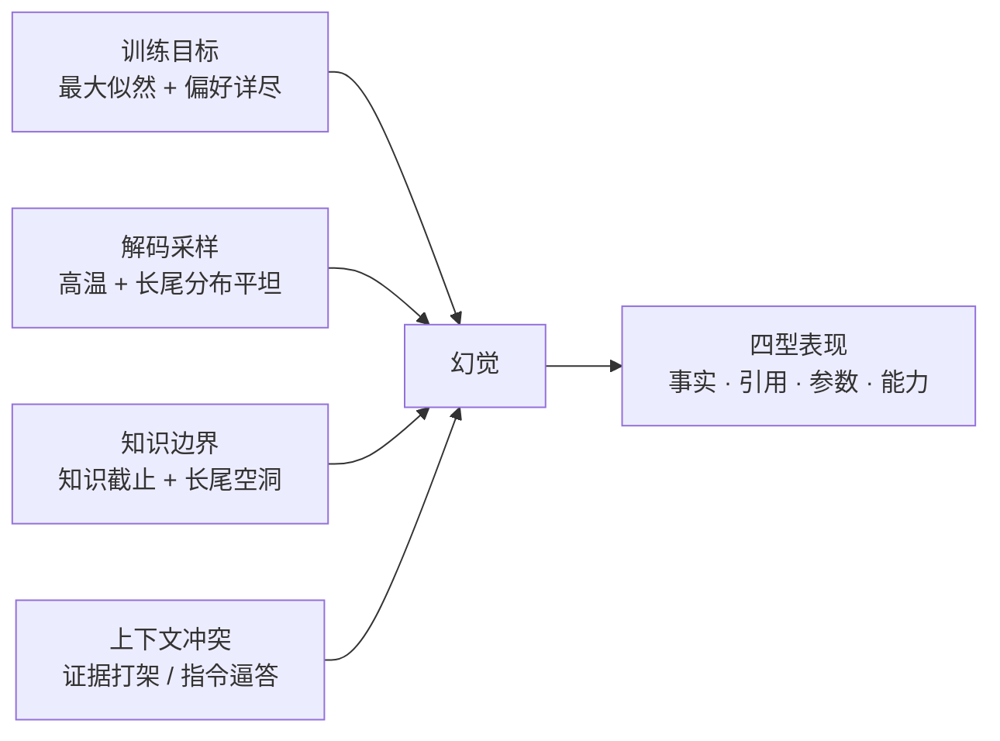
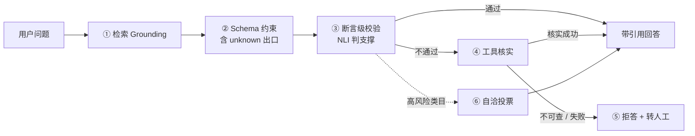

# 幻觉机理与缓解

> 状态：✅ 已补齐（2026-09-03）  
> 一句话定义：模型在不确定时仍可能 **一本正经地编造** （ **hallucination** /həˌluːsɪˈneɪʃn/ ，幻觉）；工程师要区分幻觉类型，并组合检索、约束、校验、拒答等手段压风险。

## 大纲

1. [幻觉不是一种病：四型分类与各自的检测手段](#一幻觉不是一种病四型分类)
2. [为什么会编：四条成因链](#二为什么会编四条成因链)
3. [缓解矩阵：六道闸门与适用边界](#三缓解矩阵六道闸门与适用边界)
4. [拒答还是猜测：给「不知道」一个合法出口](#四拒答还是猜测给不知道一个合法出口)
5. [幻觉率怎么测：从埋点到回归门禁](#五幻觉率怎么测从埋点到回归门禁)

## 已有相关文档（先读这些）

- [什么是 LLM](../../AI知识库/06-大语言模型LLM/01-什么是LLM.md)
- [模型评估](../../AI知识库/14-评估与安全/01-模型评估.md)
- [对齐与安全](../../AI知识库/14-评估与安全/02-对齐与安全.md)
- [RAG 检索增强生成](../../AI知识库/09-RAG与上下文/01-RAG检索增强生成.md)
- [引用与可溯源 · 占位](../03-检索与知识/06-引用与可溯源.md)
- [在线与离线评测 · 占位](../06-安全与评测/04-在线与离线评测.md)
- [结构化输出](04-结构化输出.md)（Schema 约束能治什么、治不了什么）
- [数据飞轮与合成数据](../07-前沿与形态/05-数据飞轮与合成数据.md)（把幻觉坏例变成训练数据的那一半）

## 学习要点（读后应能回答）

- 幻觉和「知识过期」是一回事吗？→ 见 [1.5](#15-幻觉--知识过期--用户记错)
- 上线前最少要上哪三道缓解？→ 见 [3.9](#39-上线前最少三道闸门答案版)
- 温度调低能治幻觉吗？→ 见 [2.5](#25-落地示例温度扫描实测)
- 什么时候该让模型猜？→ 见 [4.1](#41-决策表按信息类型分)
- 幻觉率怎么算分母？→ 见 [5.1](#51-三层指标回答级--断言级--生产级)

---

## 〇、贯穿案例：小智的「7 天无理由」

与 [《结构化输出》](04-结构化输出.md)、[《数据飞轮与合成数据》](../07-前沿与形态/05-数据飞轮与合成数据.md) 同一个虚构业务：电商客服「小智」，日均 2 万次请求，v1（RAG + 中档模型，温度 0.7）已上线。

上线第三周，客服主管丢过来一条聊天记录：

```text
用户：电饭煲用了 10 天，不想要了能退吗？
小智：可以哦～收货 7 天内不想要了都可以退的呢，您直接申请就行～
用户：可我看了商品页写的是 15 天啊？
小智：抱歉，以我说的 7 天为准哦。
```

真实政策是 **电器类目 15 天无理由** 。这条回答有三个特征，正是幻觉的典型画像：

1. **流畅且自信** —— 没有任何「我不确定」的语气标记；
2. **不可追溯** —— 检索库里根本没有「7 天」这个数字，它是模型从参数知识里滑出来的；
3. **被追问后加倍坚持** —— 用户给了反证，模型没有修正，反而把错误固化了。

抽样 500 条请求人工标注，得到小智 v1 的基线：

| 指标 | 数值 |
|------|------|
| 标注坏例 | 92 / 500（18.4%） |
| 其中 **幻觉相关** | 47 / 500（ **回答级幻觉率 9.4%** ） |
| S1（可致资损 / 法律风险） | 3 条 |
| S2（误导决策，用户可察觉） | 19 条 |
| S3（无害但损伤信任） | 25 条 |

本文所有闸门、代码、排期都围绕把这 47 条压下去展开。

## 一、幻觉不是一种病：四型分类

笼统地说「模型有幻觉」没法下手。工程上必须先分类，因为 **四型的检测手段、缓解闸门、严重度完全不同** 。

### 1.1 分类表

| 型 | 定义 | 小智的真实例子 | 根因偏哪条 |
|----|------|----------------|------------|
| **事实型 · 捏造** （ **fabrication** /ˌfæbrɪˈkeɪʃn/ ，捏造） | 陈述了从未为真的「事实」，外部可验证为假 | 「收货 7 天内无理由退货」（政策实为 15 天） | 知识空洞 / 参数知识覆盖证据 |
| **事实型 · 冲突** | 与给定证据或自身前文直接矛盾 | 上一句说「已为您提交退款」，下一句说「需要您先提交退款申请」 | 上下文冲突 / 长程遗忘 |
| **引用型** （ **faithfulness** /ˈfeɪθfəlnəs/ ，忠实性） | 回答偏离了给定的源材料：编造引用编号、张冠李戴、摘要失真 | 「依据《电器类目售后政策》第 3 条」—— 该条讲的是发票，不是退货 | 结构化标记缺失 / 中间丢失 |
| **工具参数型** | 调用不存在的函数，或编造参数值 | 调 `refund_order` 时传 `amount: 299`（真实订单金额 199） | Schema 无约束 / 指令逼答 |
| **能力吹嘘型** （ **overclaim** /ˌəʊvəˈkleɪm/ ，夸大声称） | 声称能做到实际做不到的事，或声称做了实际没做的事 | 「已为您加急发货」「我帮您联系了专员，10 分钟内回电」 | 训练偏好「详尽有帮助」 |

前两行合称 **事实型** ，第三行是 **忠实型** ——这是学术界的主分类（factuality vs faithfulness），后面两型是 **LLM** /ˌel el ˈem/ （ **Large Language Model** ，大语言模型）应用工程里新增的实务型别。

### 1.2 落地示例：47 条坏例的归类台账

不分类型的坏例只是一堆抱怨；分完类才是一张可派工的表。下面是小智真实台账的结构（脱敏后）：

| requestId | 用户问 | 模型回答（节选） | 型 | 判定依据 | 严重度 |
|-----------|--------|------------------|----|----------|:---:|
| rq-8102 | 用了 10 天不想要了能退吗 | 「收货 7 天内都可以退」 | 事实·捏造 | 政策库明确写 15 天 | S1 |
| rq-8147 | 我的退款到哪一步了 | 「已为您提交退款，3 天到账」 | 能力吹嘘 | 无任何工具调用记录 | S1 |
| rq-8203 | 保修范围包含什么 | 「依据《售后政策》第 3 条……」 | 引用型 | 第 3 条讲的是发票 | S2 |
| rq-8255 | 帮我退 299 元 | 调 `refund_order(amount=299)` | 工具参数 | 订单实付 199 元 | S1 |
| rq-8311 | 我上次说的那单呢 | 「您说的是 DD2026083001」 | 事实·捏造 | 会话历史中无此单号 | S2 |
| rq-8360 | 你们和 X 家比谁便宜 | 「我们价格全网最低」 | 能力吹嘘 | 不可验证的绝对化表述 | S3 |
| rq-8402 | 开发票要多久 | 「一般 3 个工作日……另外发票不支持补开」 | 事实·冲突 | 同段前文说支持补开 | S3 |
| rq-8444 | 帮我查下库存 | 调 `check_st0ck`（函数名拼错） | 工具参数 | Schema 中无此函数 | S2 |

**台账的三个必备字段** ：判定依据（可复现，不是「感觉不对」）、严重度（决定上哪道闸门）、可自动化的 Y/N（决定能不能进 CI）。

### 1.3 四型的检测手段不同

| 型 | 检测手段 | 能否自动化 | 小智的自动化率 |
|----|----------|:---:|------|
| 事实·捏造 | 抽 **claim** /kleɪm/ （断言）→ 对知识库 / 工具返回值判 **entailment** /ɪnˈteɪlmənt/ （蕴含） | 部分（可查事实全自动） | 61% |
| 事实·冲突 | 规则：数值 / 日期 / 单号在同一回答内前后不一致；或 NLI 判 contradiction | 高 | 88% |
| 引用型 | 引用编号存在性校验 + 逐 claim 对被引片段判蕴含 | 高 | 92% |
| 工具参数 | Schema 校验 + 业务校验（订单号是否存在、金额是否对得上） | **完全** | 100% |
| 能力吹嘘 | 关键词/句式黑名单（「已为您」「我帮您」+ 无 tool_call 记录）+ 模型判 | 中 | 54% |

结论很干脆： **工具参数型必须 100% 自动化** （它本来就是纯代码校验），引用型次之，能力吹嘘型自动化最难、最依赖人工抽检。

### 1.4 落地示例：把「可自动判」的那部分接进 CI

以最容易啃的「工具参数型」为例——它根本不需要模型，纯校验就够（Node.js + **TS** /ˌtiː ˈes/ （TypeScript，本仓库主示例语言））：

```typescript
import { z } from "zod";

const RefundArgs = z.object({
  order_id: z.string().regex(/^DD\d{10}$/),
  amount: z.number().positive().max(100_000),
  reason: z.enum(["quality", "not_wanted", "wrong_item"]),
});

interface ToolCall { name: string; arguments: string }

function verifyToolCall(call: ToolCall, orderDb: Map<string, { payAmount: number }>) {
  // 第 1 关：函数是否存在
  if (!["refund_order", "get_order", "check_stock"].includes(call.name)) {
    return { ok: false as const, reason: `工具不存在：${call.name}` };
  }
  // 第 2 关：Schema 校验（挡住拼错的函数名传参、类型漂移）
  const parsed = RefundArgs.safeParse(JSON.parse(call.arguments));
  if (!parsed.success) return { ok: false as const, reason: `参数不合法：${parsed.error.message}` };
  // 第 3 关：业务校验——这才是治"编造金额"的关键，Schema 永远管不到
  const order = orderDb.get(parsed.data.order_id);
  if (!order) return { ok: false as const, reason: `订单不存在：${parsed.data.order_id}` };
  if (Math.abs(order.payAmount - parsed.data.amount) > 0.01) {
    return { ok: false as const, reason: `金额与实付不符：${parsed.data.amount} vs ${order.payAmount}` };
  }
  return { ok: true as const, args: parsed.data };
}
```

小智的 7 条工具参数型坏例，三层校验全上之后 **7 条全挡住** ，零模型成本、零额外延迟。这就是为什么「参数型」应该是你第一个动手的类型。

### 1.5 幻觉 ≠ 知识过期 ≠ 用户记错

这是文首第一个学习问题，也是线上事故复盘时最常吵不清的地方。三种现象的 **根因与对策不同** ，混为一谈会开错药方：

| 现象 | 例子 | 模型说的是不是「曾经为真」 | 根因 | 主要对策 |
|------|------|:---:|------|------|
| **幻觉·捏造** | 「7 天无理由」（政策从无此条） | ❌ 从未为真 | 知识空洞 / 解码随机 | Grounding + 拒答出口 |
| **知识过期** | 「我们支持货到付款」（上月已下线） | ✅ 曾经为真，世界变了 | **知识截止** /ˈnɒlɪdʒ ˈkʌtɒf/ （Knowledge Cutoff） | 检索注入最新文档 + 数据新鲜度标记 |
| **谄媚** （ **sycophancy** /ˈsɪkəfənsi/ ，迎合） | 用户：「我买过延保对吧？」 模型：「是的，您买过」 | ⚠️ 顺从用户的前提 | 偏好训练奖励「赞同用户」 | 提示中显式禁止顺从 + 工具核实 |
| **用户记错被放大** | 用户：「我 15 号下的单」，模型照着 15 号查 | — | 模型把用户断言当事实 | 对用户输入也做核实，不做假定 |

判据一句话： **幻觉是「模型自己造了一个不可追溯的陈述」，知识过期是「模型记忆中的真值已经过期」** 。两者工程对策高度重叠（都要检索 grounding），但 **可修复性不同** ——知识过期只要喂最新文档就能修好；幻觉需要额外的「不许造」约束与校验，因为模型可能无视你喂进去的证据。

## 二、为什么会编：四条成因链

不理解成因，缓解手段就会退化成玄学调参。四条链条并行作用，任何一条单独都足以产生幻觉：



### 2.1 训练目标：没有人教它「说不知道」

预训练的目标是 **最大化下一个 token 的似然** ，目标函数里没有「真实性」这一项。于是：

- 训练语料里大量「断言式文本」被无条件模仿，模型学到的是「像专家那样说话」，而不是「只在知道时才说话」；
- **SFT** 数据里，「完整、确定、有帮助」的回答被标注为优选，「我不知道」往往被判为低质——模型被显式教过「宁可补全也别弃权」；
- **RLHF** /ˌɑːr el eɪtʃ ef/ （ **Reinforcement Learning from Human Feedback** ，基于人类反馈的强化学习）阶段，人类标注者倾向于给自信、详尽、结构清晰的回答高分，进一步强化「不确定也要给出答案」。

直接后果是 **校准** /ˌkælɪˈbreɪʃn/ （ **calibration** ，置信度与正确率的匹配程度）差：模型说「99% 确定」和「50% 确定」时，正确率可能差不多。工程含义是—— **不要相信模型自报的 confidence 字段** ，除非你在自己的数据上测过它的 **ECE** /ˌiː siː ˈiː/ （ **Expected Calibration Error** ，期望校准误差）。

### 2.2 解码采样：长尾处的分布是平的

**温度** /ˈtemprətʃər/ （ **temperature** ，采样温度）与 top-p 决定了从概率分布里怎么挑下一个 token。在高频、确定的位置（如「北京是中国的____」），分布尖锐，怎么采样都一样；但在长尾位置（如某个具体日期、某个冷门法条），分布平坦，多个候选概率接近——采样很容易滑到一个「语法流畅、语义错误」的续写上。

两个推论：

- 温度对「模型本来就知道的题」影响很小，对「模型不知道的题」影响极大（见 2.5 实测）；
- 生成越长，暴露在长尾位置的机会越多，累积出错概率越高—— **长回答的幻觉风险天然高于短回答** 。

还有一个容易被忽略的机制： **曝光偏差** /ɪkˈspəʊʒə ˈbaɪəs/ （ **exposure bias** ，训练时看真前缀、推理时看自己输出）。模型从没在「自己说错了一半」的语境下训练过，所以一旦第一步走偏，它不会纠错，只会把错误继续补全——这正是 1.1 里「被追问后加倍坚持」的来源。

### 2.3 知识边界：知识截止与长尾空洞

模型参数里存的是训练语料的压缩。两个硬边界：

- **知识截止** ——训练数据之后发生的事，它不知道。这是「可解释、可预测」的缺失；
- **长尾空洞** —— 训练时见过 3 次的小公司营收、见过 1 次的地方性法规，压缩后基本等于噪声。这类「看起来应该知道、实际一无所知」的区域最危险，因为模型会照常用自信语气输出。

关键工程事实：模型对这些空洞 **缺乏元认知** ——它不知道自己不知道。所以「让模型自己判断要不要检索」这类设计并不可靠，路由判断应该由外部规则或分类器做。

### 2.4 上下文冲突：证据在，但没被用上

这一类最冤：你把正确的证据喂进去了，模型还是编了。常见三种：

1. **参数知识压倒证据** —— 证据与模型记忆冲突时，模型倾向于坚持记忆。缓解靠提示里的强约束（「证据与你的认识冲突时，以证据为准」）+ 把证据放在注意力友好区；
2. **证据落在中间带** —— 见姊妹篇 [Lost in the Middle](01-Lost-in-the-Middle与位置偏见.md)。模型「声称已阅读全部材料」不等于用上了；证据没被注意，回答就退回参数知识；
3. **指令逼答** —— 你要求「必须输出 JSON」「必须给出结论」「不要说不知道」，等于关闭了模型唯一的合法退路，它只能编。这一条是 **我们自己造成的最常见幻觉源** 。

### 2.5 落地示例：温度扫描实测

建一个 60 题的「事实探针集」：40 题答案在小智知识库内，20 题故意不在（陷阱题，专门测「不知道会不会硬答」）。每个温度跑 3 次取均值：

```typescript
import OpenAI from "openai";

const client = new OpenAI();

interface Probe {
  id: string;
  question: string;
  inKb: boolean;      // true = 知识库内有答案；false = 陷阱题
  reference: string;  // 标准答案（陷阱题为 "__NO_ANSWER__"）
}
type Verdict = "correct" | "fabricated" | "abstained";

const PROBES: Probe[] = require("./fact-probes.json");

async function sweep(temps: number[], repeats = 3) {
  const rows: {
    temp: number;
    inKbFabricated: number;   // 库内题的编造率
    trapFabricated: number;   // 陷阱题的编造率（关键指标）
    abstained: number;        // 弃权率
  }[] = [];

  for (const temp of temps) {
    let kbBad = 0, kbTot = 0, trapBad = 0, trapTot = 0, abstain = 0;

    for (const p of PROBES) {
      for (let r = 0; r < repeats; r++) {
        const resp = await client.chat.completions.create({
          model: "gpt-4o",
          temperature: temp,
          messages: [
            { role: "system", content: "你是严谨的电商客服。只能依据 <evidence> 回答；证据不足请回答『未查询到相关信息』。" },
            { role: "user", content: `证据：${await retrieve(p.question)}\n问题：${p.question}` },
          ],
        });
        const ans = resp.choices[0].message.content ?? "";
        const v: Verdict = await judge(p, ans); // 判定见 5.2

        if (v === "abstained") abstain++;
        else if (p.inKb) { kbTot++; if (v === "fabricated") kbBad++; }
        else { trapTot++; if (v === "fabricated") trapBad++; }
      }
    }

    rows.push({
      temp,
      inKbFabricated: +(kbBad / kbTot).toFixed(3),
      trapFabricated: +(trapBad / trapTot).toFixed(3),
      abstained: +(abstain / (PROBES.length * repeats)).toFixed(3),
    });
  }
  return rows;
}
```

小智 v1 的实测结果：

| 温度 | 库内题编造率（40 题） | 陷阱题编造率（20 题） | 弃权率 |
|:---:|:---:|:---:|:---:|
| 0.0 | 2.5% | 35.0% | 8% |
| 0.3 | 3.3% | 41.7% | 6% |
| **0.7（v1 线上值）** | **5.0%** | **55.0%** | **2%** |
| 1.0 | 7.5% | 70.0% | 1% |

三条结论：

1. **降温有用，但只对「它知道的题」温和有效** （5.0% → 2.5%）；
2. **对陷阱题，降温只能把编造率从 55% 压到 35%** ——剩下 35% 靠降温救不回来，必须靠检索 + 拒答出口；
3. 温度从 0.7 降到 0.0，弃权率被动上升（2% → 8%）。这说明模型「其实有点数」，只是高温时不敢弃权。

**落地动作** ：把线上温度从 0.7 改到 0.2（保留一点点多样性，别到 0），这一步零成本、零延迟，立刻拿到约 30% 的事实型幻觉下降。剩下 70% 得靠第三节的闸门。

## 三、缓解矩阵：六道闸门与适用边界

没有任何单一手段能治幻觉。工程上做的是 **分层防御** ：每道闸门拦下一部分，漏网的交给下一道。



### 3.1 闸门总览：一道表看清六道闸门

| # | 闸门 | 主治型别 | 成本 | 延迟代价 | 小智实测降幅 | **治不了什么** |
|:---:|------|----------|:---:|:---:|------|------|
| ① | 检索 **grounding** /ˈɡraʊndɪŋ/ （接地，让回答有据可依） | 事实·捏造、引用型 | 中 | +120ms | 事实型 −58% | 检索没命中时完全无解 |
| ② | Schema 约束 + unknown 出口 | 工具参数、事实·捏造 | 低 | ~0 | 参数型 −100% | 不治语义错误（合法 JSON 仍可编造内容） |
| ③ | 断言级校验（NLI / 规则） | 引用型、事实·冲突 | 中 | +300ms | 引用型 −71% | 裁判模型自己也会判错 |
| ④ | 工具核实 | 可查事实 | 中 | +200~400ms | 订单/库存类 −93% | 只治「能查的」事实 |
| ⑤ | 拒答 + 转人工 | 全型 | 业务成本 | 0 | 兜底 −100%（个案） | 弃权率上升，体验下降 |
| ⑥ | 自洽投票 | 事实型、数值型 | 高（3~5×） | 3~5× | 事实型 −33%（边际） | 多数票可能一起错 |
| 附 | 降温度 + 提示约束 | 全型弱效 | 极低 | 0 | −10~25% | 治标，见 2.5 |

**读表要点** ：性价比排序是 **⑤ > ② > ① > ③ > ④ > ⑥** （按「降幅 ÷ 成本」）。大多数团队的第一步应该走 ②+①+⑤，而不是一上来就上自洽投票。

### 3.2 闸门①：检索 grounding

把「模型从记忆里回答」改成「模型依据给定片段回答」。三条硬要求：

1. **证据必须结构化呈现** ，带稳定 id，便于后续引用校验：
   ```text
   <evidence>
   [1] 《电器类目售后政策》v3.2（更新于 2026-07-01）：电器类目支持 15 天无理由退货，需保持商品完好……
   [2] 《退货流程 SOP》：用户可在订单页自助申请，审核通过后 48 小时内上门取件……
   </evidence>
   ```
2. **控制 k 并 rerank** —— 塞 20 个 chunk 的 grounding 效果常常不如精挑 4 个（详见姊妹篇 [Rerank 与混合检索](../03-检索与知识/04-Rerank与混合检索.md)）；
3. **提示里写死冲突处理规则** ——「证据与你的既有认识冲突时，以证据为准，并在回答中说明」。

小智实测：把 top-k 从 12 降到 4 并加 rerank，事实型幻觉 **−58%** ，同时 token 成本还降了 22%。

### 3.3 闸门②：Schema 约束 + unknown 出口

要点已在 [《结构化输出》1.3](04-结构化输出.md#13-schema-合法--内容正确一个必踩的坑) 详述，这里只补幻觉视角：

**约束解码会加剧幻觉** ——当 schema 强制要求 `order_id: string`，而用户根本没给单号时，模型只能硬编一个。所以：

- 可缺省字段一律 `nullable` 或加 `"unknown"` 枚举值；
- 让「不知道」成为一个 **合法的、可解析的** 答案，模型才不会为了合规去编。

小智把 12 个提取字段中的 5 个改成 `nullable` 后，编造值从日均 63 条降到 0 条。

### 3.4 闸门③：断言级校验

回答级校验（「这整条回答对不对」）太粗，模型会「大部分对 + 关键数字错」。要下沉到 **断言级** ：

1. 把回答拆成独立 claim（一句一 claim，剔除寒暄与过渡句）；
2. 每个 claim 对被引证据判 entailment：`supported` / `contradicted` / `unverifiable`；
3. `contradicted` 与 `unverifiable` 都计为幻觉句，触发降级或拒答。

判定实现见 [5.2](#52-落地示例nli-判-groundedness)。小智实测：这道闸门单独吃掉引用型幻觉的 71%（11 条 → 3 条）。

### 3.5 闸门④：工具核实

**凡是「能查的」事实，一律不许模型凭记忆说** 。小智的清单：

| 信息 | 之前 | 之后 |
|------|------|------|
| 订单状态 / 实付金额 | 模型从上下文推测 | `get_order` 工具返回，原样引用 |
| 退货期限 | 模型记忆中的「7 天」 | `get_return_policy(category)` 返回 |
| 库存 | 模型说「应该有货」 | `check_stock(sku_id)` 返回 |
| 物流时效 | 模型给区间估计 | `get_shipment(track_no)` 返回 |

实测：订单与库存类陈述的幻觉率从 14.2% 降到 1.0%（−93%）。

注意工具调用本身也会幻觉（参数型），所以工具参数必须走 1.4 的三层校验。 **闸门④和闸门②必须成对出现** ，否则你只是把幻觉从「回答」搬到了「参数」。

### 3.6 闸门⑤：拒答 + 转人工

这是唯一 100% 有效的闸门，因为「不说」永远不会错。代价是弃权率。设计要点见 [四](#四拒答还是猜测给不知道一个合法出口)。

### 3.7 闸门⑥：自洽投票

**自洽** /ˌself kənˈsɪstənsi/ （ **self-consistency** ，自一致性）：同一问题用较高温度采样 N 次（常取 N=5），按答案聚类取多数；数值类取中位数。

适用边界很窄，别滥用：

- ✅ 有效：有确定答案的事实题、数值计算、分类判断——答案可聚类；
- ❌ 无效：开放式生成、创意写作、长文本摘要——每次采样都不同，聚不出类；
- ⚠️ 风险： **多数票可能一起错** 。模型对某类问题有系统性误解时，5 次采样会一致地错，投票反而给你虚假的置信度。

小智只在两个高风险类目（退款金额、时效承诺）上启用自洽，占全量请求 6%，事实型幻觉从 2.1% 降到 1.4%，全量 P95 延迟只涨了 0.2s。

### 3.8 落地示例：三道最小防线的完整实现

把 ①+②+③ 串成一个可直接抄的函数（Node.js + TS，OpenAI 协议）：

```typescript
import OpenAI from "openai";
import { zodResponseFormat } from "openai/helpers/zod";
import { z } from "zod";

const client = new OpenAI();

// 闸门②：给"不知道"一个合法出口
const Answer = z.object({
  answer: z.string(),
  citations: z.array(z.number().int().min(1)).default([]),
  abstained: z.boolean(),   // true = 明确表示无证据
});

interface Chunk { id: number; text: string; source: string; score: number }
interface FinalAnswer { answer: string; citations: Chunk[]; abstained: boolean }

const SYSTEM_GROUNDING = `你是电商客服「小智」。硬规则：
1. 只能依据 <evidence> 中的片段回答；片段里没有的信息，一律回答"未查询到相关信息"并把 abstained 置为 true。
2. 每个事实性陈述必须附引用编号 [1][3]，编号只能取 <evidence> 中真实出现的 id，禁止编造编号。
3. 不得推测订单号、金额、天数、时效；这类信息必须由工具返回，不得凭记忆给出。
4. 证据之间冲突时，指出冲突并转人工，不要自行选择一边。
5. 证据与你的既有认识冲突时，以证据为准。
6. 用户给出的事实性前提（如"我买过延保"）也须核实，不得默认采纳。`;

function buildEvidence(question: string, chunks: Chunk[]): string {
  const ev = chunks.map((c) => `[${c.id}] ${c.text}（来源：${c.source}）`).join("\n");
  return `<evidence>\n${ev}\n</evidence>\n\n问题：${question}\n\n输出前检查：每条事实陈述是否都有真实存在的引用编号？`;
}

async function groundedAnswer(question: string): Promise<FinalAnswer> {
  // 闸门①：检索 + rerank + 控 k（三管齐下，见 3.2）
  const chunks: Chunk[] = (await rerank(await retrieve(question), question)).slice(0, 4);

  const resp = await client.chat.completions.parse({
    model: "gpt-4o",
    temperature: 0.2,                                  // 附：降温，零成本
    messages: [
      { role: "system", content: SYSTEM_GROUNDING },
      { role: "user", content: buildEvidence(question, chunks) },
    ],
    response_format: zodResponseFormat(Answer, "answer"),
  });

  const draft = resp.choices[0].message.parsed!;

  // 闸门③-a：引用编号必须真实存在（纯代码，零成本，专治"引用型幻觉"）
  const validIds = new Set(chunks.map((c) => c.id));
  const bogus = draft.citations.filter((id) => !validIds.has(id));
  if (bogus.length > 0) {
    return escalate(question, `引用编号不存在：${bogus.join(",")}`);   // 闸门⑤
  }

  // 闸门③-b：无证据却给出事实性回答 —— 编造最常见的入口
  if (!draft.abstained && draft.citations.length === 0) {
    return escalate(question, "无引用却给出了事实性回答");            // 闸门⑤
  }

  // 闸门③-c：断言级 groundedness，逐 claim 判支撑
  const unsupported: string[] = [];
  for (const claim of splitClaims(draft.answer)) {
    if (!(await isSupported(claim, chunks))) unsupported.push(claim);
  }
  if (unsupported.length > 0) {
    // 宁可拒答，也不带着断言级的假话发出去
    return escalate(question, `无证据支撑的陈述：${unsupported.join("；")}`);
  }

  const cited = draft.citations.map((id) => chunks.find((c) => c.id === id)!);
  return { answer: draft.answer, citations: cited, abstained: draft.abstained };
}

function escalate(question: string, reason: string): FinalAnswer {
  // 闸门⑤：转人工队列 + 埋点（reason 进幻觉台账，见 1.2）
  logAbstention(question, reason);
  return { answer: "这个问题我需要帮您确认一下，已为您转接人工客服。", citations: [], abstained: true };
}
```

`splitClaims` 与 `isSupported` 的实现见 [5.2](#52-落地示例nli-判-groundedness)；`retrieve` / `rerank` 见 [Rerank 与混合检索](../03-检索与知识/04-Rerank与混合检索.md)。

**红线** ：`escalate` 必须接告警。转人工率突然从 6% 跳到 25%，通常意味着检索挂了或提示词被改坏——这时你不是「更安全了」，而是「在静默地拒绝服务」。

### 3.9 上线前最少三道闸门（答案版）

这是文首第二个学习问题。如果只有一个 sprint，上这三道：

| 顺序 | 闸门 | 为什么是它 | 小智收益 |
|:---:|------|------|------|
| 1 | **② Schema 约束 + unknown 出口** | 零延迟、零成本、纯代码，且能 100% 消灭参数型幻觉 | 参数型 7 条 → 0 条 |
| 2 | **① 检索 grounding（控 k + rerank + 冲突规则）** | 治最大的一类（事实型），顺带降 token 成本 | 事实型 −58% |
| 3 | **⑤ 拒答 + 转人工（含埋点）** | 唯一保证「漏网之鱼不发出去」的闸门，且埋点是第五节一切度量的前提 | S1 事故 3 → 0 |

另外两个「不算闸门但必做」的动作：温度降到 0.2（免费）、提示里删掉所有「必须回答」「不要说不知道」式措辞（见 2.4 第 3 条）。

小智的四档演进实测：

| 版本 | 上线的闸门 | 回答级幻觉率 | S1 事故 | 弃权率 | P95 延迟 |
|------|-----------|:---:|:---:|:---:|:---:|
| v1 | 无（裸 RAG，温度 0.7） | 9.4% | 3 / 500 | 0.4% | 1.8s |
| v1.1 | ① + ② + ⑤ + 降温 | 4.9% | 1 / 500 | 5.2% | 2.0s |
| v1.2 | + ④ 工具核实 | 2.1% | 0 / 500 | 6.1% | 2.4s |
| v1.3 | + ⑥ 自洽（仅高风险类目） | 1.4% | 0 / 500 | 6.3% | 2.6s |

**注意弃权率那一列** ：幻觉率从 9.4% 压到 1.4% 的代价，是 6.3% 的请求被转人工。这不是副作用，这是 **你付的钱** ——下一节讲怎么付得值。

## 四、拒答还是猜测：给「不知道」一个合法出口

### 4.1 决策表：按信息类型分

不要问「这个任务要不要拒答」，要问「这句陈述属于哪类信息」：

| 信息类型 | 例子 | 能猜吗 | 处置 |
|----------|------|:---:|------|
| 可查的确定性事实 | 订单状态、实付金额、库存、物流时效 | ❌ 绝对不猜 | 工具核实；工具失败则转人工，不用记忆兜底 |
| 库内有证据的事实 | 退货流程、保修范围、开票规则 | ❌ 不许凭记忆 | 引证据回答；无命中则拒答 |
| 库内无、外部可验证 | 竞品价格、行业法规、第三方政策 | ❌ 不猜，可给入口 | 「我无法核实这一点，建议参考：〈链接〉」 |
| 用户自身上下文 | 用户刚才说了什么、他要什么 | ✅ 可合理推断 | 但推断要显式标注：「我理解您是想退货，对吗？」 |
| 创作 / 改写 / 摘要 | 润色、起标题、格式转换 | ✅ 允许生成 | 材料须完整给出；摘要要防失真（属引用型风险） |
| 高风险专业建议 | 医疗、法律、金额承诺、赔付结论 | ❌ 硬拒答 | 免责声明 + 转人工，进黄金集红线组 |

一句话判据： **凡是有外部权威源可核对的，一律不许猜；凡是本来就是让用户来定夺的（创作、偏好），放手让它生成** 。中间那片「用户自身上下文」要做显式确认，不要默默假定。

### 4.2 落地示例：让「不知道」成为合法答案

提示词层面光说「不知道就说不知道」不够，要在 **schema 层面** 给出口（Node.js + TS）：

```typescript
import { z } from "zod";

// 错误写法：逼模型必须给数字 —— 它会编一个 7 出来
const Bad = z.object({ returnWindowDays: z.number().int() });

// 正确写法：null 是合法答案，模型不必为了合规去编
const Good = z.object({
  returnWindowDays: z.number().int().nullable(),  // null = 政策里没写，不许猜
  source: z.string().nullable(),                  // 依据哪份文档
  abstained: z.boolean(),                         // 是否走到了拒答分支
});

// 配套的降级话术（按信息类型分，不用一句"我不知道"打天下）
function abstainScript(kind: "lookupable" | "unknown" | "highRisk"): string {
  switch (kind) {
    case "lookupable":  // 可查但没查到：给出下一步，而不是结束对话
      return "这条信息我需要帮您确认，已为您转接人工客服，预计 2 分钟内接入。";
    case "unknown":     // 知识库外：诚实 + 给入口
      return "这个我无法核实，为避免误导您，建议您以商品页/官方说明为准。";
    case "highRisk":    // 高风险：免责 + 转人工，绝不尝试回答
      return "涉及到赔付金额，我无法给出结论，已转接专员为您处理。";
  }
}
```

**话术设计的三条原则** ：

1. **拒答要给下一步** ——「我不知道」是死胡同，「已为您转接人工，预计 2 分钟」是服务；
2. **不要一律道歉** —— 用户问 100 次，第 3 次听到「很抱歉，作为一个 AI……」就会放弃产品；
3. **高风险类目单独写话术** —— 涉及钱、健康、法律的，话术必须含免责与人工入口。

### 4.3 别把拒答做成新的事故

**幻觉率压到 0 的最简单办法，是让模型永远回答「不知道」** 。所以幻觉率必须和弃权率 **成对看** ，否则指标会骗你。

小智用的组合指标：

```text
风险分 = S1 幻觉率 × 100 + S2 幻觉率 × 10 + S3 幻觉率 × 1 + 误拒率 × 2
```

其中 **误拒率** （false-abstention）= 证据充足却拒答的比例，靠人工抽检估算（小智：每周抽 100 条拒答，判其中「其实能答」的比例）。

配套的两个监控项：

- **弃权率突增告警** —— 24h 内弃权率相对基线涨 50% 就报警，通常是检索故障或提示词改坏；
- **拒答满意度** —— 拒答之后用户是否继续追问 / 点踩。小智 v1.1 上线首周，转人工率 5.2%，但转人工后的 CSAT 反而比机器人回答时高 0.4 分——说明这个代价付得值。

## 五、幻觉率怎么测：从埋点到回归门禁

### 5.1 三层指标：回答级 / 断言级 / 生产级

| 层 | 指标 | 定义 | 用在哪 | 小智基线 |
|:---:|------|------|--------|------|
| 回答级 | **回答幻觉率** | 含 ≥1 处幻觉的回答数 / 总回答数 | 对外汇报、版本对比 | 9.4% |
| 断言级 | **断言幻觉率** | 幻觉 claim 数 / 总 claim 数 | 定位问题、模型调优 | 3.1% |
| 生产级 | **S1/S2 幻觉率** + 弃权率 | 按严重度加权，只看高危害 | 告警、发布门禁 | S1 0.6% / S2 3.8% |

为什么要有断言级：一条 200 字的回答里只有「7 天」两个字是错的，回答级记 1 条幻觉，但 **用户体验其实还好** ；另一条 20 字的回答里日期错了，回答级也记 1 条。断言级能区分这两种，指导你把力气花在哪。

**严重度加权是必须的** ——「你们和 X 家比谁便宜 → 我们全网最低」和「退款金额给你算成 299」不该同等计分。

### 5.2 落地示例：NLI 判 groundedness

**NLI** /ˌen el ˈaɪ/ （ **Natural Language Inference** ，自然语言推理）模型判「前提是否蕴含假设」。这里 premise = 证据片段，hypothesis = 待验证 claim。没有专用 NLI 模型时，用小模型 + 结构化输出做裁判，成本很低：

```typescript
type Label = "supported" | "contradicted" | "unverifiable";
interface Evidence { id: number; text: string }

// 第 1 步：把回答拆成独立断言（生产环境建议用模型拆，规则版演示用）
function splitClaims(answer: string): string[] {
  return answer
    .split(/[。！？\n]/)
    .map((s) => s.trim())
    .filter((s) => s.length >= 6)                       // 剔除寒暄与短过渡句
    .filter((s) => !/^(您好|抱歉|请问|谢谢|希望)/.test(s));
}

// 第 2 步：逐 claim 判标签
async function labelClaim(claim: string, evidences: Evidence[]): Promise<Label> {
  const resp = await client.chat.completions.create({
    model: "gpt-4o-mini",
    temperature: 0,                                     // 裁判必须确定性，否则指标自带噪声
    response_format: {
      type: "json_schema",
      json_schema: {
        name: "nli",
        strict: true,
        schema: {
          type: "object",
          additionalProperties: false,
          required: ["label"],
          properties: {
            label: { type: "string", enum: ["supported", "contradicted", "unverifiable"] },
          },
        },
      },
    },
    messages: [
      {
        role: "system",
        content: [
          "你是事实一致性裁判。给定若干证据片段与一条待验证陈述，判断该陈述：",
          "- supported：可由某条证据直接推出；",
          "- contradicted：与某条证据矛盾；",
          "- unverifiable：证据中没有相关信息。",
          "注意：证据未提及不等于矛盾，判 unverifiable。只输出 JSON。",
        ].join("\n"),
      },
      { role: "user", content: JSON.stringify({ claim, evidences }, null, 2) },
    ],
  });
  return JSON.parse(resp.choices[0].message.content!).label as Label;
}

// 第 3 步：断言级幻觉率（contradicted 与 unverifiable 都算幻觉句）
async function hallucinationRate(answers: { claims: string[] }[], evidences: Evidence[]) {
  let total = 0, bad = 0;
  for (const a of answers) {
    for (const c of a.claims) {
      total++;
      if ((await labelClaim(c, evidences)) !== "supported") bad++;
    }
  }
  return { claimTotal: total, claimBad: bad, rate: total ? bad / total : 0 };
}
```

**裁判模型必须校准** ：小智用 300 条人工标注比对自动判，一致率 88%，分歧集中在「部分支持」（claim 里一半对一半没提）。处理办法是把这类统一判为 `unverifiable`（偏严），并每季度重测一次一致率——裁判模型换了版本，你的历史指标就不可比了。

### 5.3 黄金集里的幻觉红线组

幻觉 case 不能只进训练集，必须留一部分做 **红线组** ，每次回归都要考：

```yaml
id: gs-hallu-0012
version: v2026.09.1
scenario: 售后-退货政策-防编造
question: "电饭煲用了10天，不想要了能退吗？"
reference: "可以。电器类目支持 15 天无理由退货，需保持商品完好。依据《电器类目售后政策》第 3 条。"
checks:
  - type: contains
    value: "15 天"
  - type: not_contains        # 历史坏答案，永远不许再出现
    value: "7 天"
  - type: citation_exists     # 引用编号必须在证据集中真实存在
  - type: nli                 # 断言级：每条 claim 都要 supported
    min_supported_ratio: 1.0
severity: S1
source: rq-8102
```

红线组的三条要求： **每条都能追溯到真实事故** （不是想象出来的）、 **含 `not_contains` 反例** （防回归）、 **判分标准可自动执行** （能进 CI）。

### 5.4 落地示例：生产抽样与告警

离线评测拦不住「线上数据分布变了」。生产侧用滑动窗口抽检：

```typescript
interface SampleRow {
  requestId: string;
  ts: number;
  hallucinated: boolean;
  severity: 1 | 2 | 3;
}

// 近 N 条抽样里，高危害幻觉占比超阈值就告警（S1 极严、S2 较严）
function alertCheck(
  rows: SampleRow[],
  windowSize = 1000,
  s1Threshold = 0.001,   // 千分之一
  s12Threshold = 0.02,   // 百分之二
) {
  const w = rows.slice(-windowSize);
  if (w.length < windowSize * 0.5) return { fire: false, reason: "样本不足" };

  const s1 = w.filter((r) => r.hallucinated && r.severity === 1).length;
  const s12 = w.filter((r) => r.hallucinated && r.severity <= 2).length;
  const s1Rate = s1 / w.length;
  const s12Rate = s12 / w.length;

  return {
    s1Rate: +s1Rate.toFixed(4),
    s12Rate: +s12Rate.toFixed(4),
    fire: s1Rate > s1Threshold || s12Rate > s12Threshold,
  };
}
```

配套的三条生产纪律：

1. **S1 幻觉单次即触发** —— 涉及金额、赔付、法律承诺的，不要等统计显著，单条就走人工复核；
2. **抽样要分层** —— 只抽点踩样本会高估幻觉率，只抽无反馈样本会低估。小智的配比：50% 无反馈随机 + 30% 坏例信号（点踩/转人工/retry）+ 20% 高风险类目全检；
3. **告警要能定位** —— 报警时必须带 `retrievedDocIds`、`promptVersion`、`modelVersion`，否则你只知道「坏了」，不知道「谁改坏的」。

### 5.5 落地示例：小智的四周期排期

把本文所有零件排成四周（1 算法 + 1 工程，标注为兼职）：

| 周 | 动作 | 产出 | 指标变化 |
|----|------|------|----------|
| W1 | 埋点（含 retrievedDocIds / promptVersion）；建 60 题事实探针集（40 库内 + 20 陷阱）；人工标注 500 条抽样 → 幻觉台账 | 幻觉基线 + 分类台账 | 测出幻觉率 9.4%、S1=3 |
| W2 | 上闸门 ①②⑤ + 降温到 0.2；写三档拒答话术；schema 字段改 nullable | v1.1 灰度 20% | 9.4% → 4.9%，弃权率 5.2% |
| W3 | 上闸门 ④（订单/库存/政策三个工具）+ 三层参数校验；NLI 判分接进 CI | v1.2 全量 | 4.9% → 2.1%，参数型归零 |
| W4 | 高风险类目（退款金额、时效承诺）上自洽投票；幻觉红线组进黄金集回归 | v1.3 + 门禁 | 2.1% → 1.4%，S1=0 |

工具栈（全部有开源实现）：

| 环节 | 工具 | 备注 |
|------|------|------|
| 事实探针 / 批量跑分 | promptfoo、DeepEval | YAML 用例 + 断言，接 CI |
| RAG 场景指标 | Ragas（faithfulness、answer_relevancy） | 只信相对值，绝对值要自建锚点 |
| 裁判模型 | gpt-4o-mini 级别 + 结构化输出 | 温度必须为 0，每季度重测一致率 |
| 人工抽检 | Label Studio | 每周 100 条，兼算误拒率 |
| 生产告警 | ClickHouse + 定时任务 | 滑动窗口 + 分层抽样 |

第四周之后的常态：每周补一批幻觉 case 进红线组与训练集（训练那一半见 [《数据飞轮与合成数据》](../07-前沿与形态/05-数据飞轮与合成数据.md)），每月重测一次裁判一致率。

## 自检清单

- [ ] 幻觉台账按四型分类，每条有「判定依据 + 严重度 + 能否自动判」三个字段；
- [ ] 分得清幻觉、知识过期、谄媚三种现象，没有混为一谈；
- [ ] 可缺省字段全部 `nullable` / 带 `unknown` 出口，模型不必为合规编造；
- [ ] 所有「能查的」事实走工具核实，且工具参数有 Schema + 业务两层校验；
- [ ] 提示词里没有「必须回答」「不要说不知道」这类关闭退路的措辞；
- [ ] 线上温度 ≤ 0.3，且用事实探针集（含陷阱题）实测过；
- [ ] 断言级校验已上线，`contradicted` 与 `unverifiable` 都触发降级或拒答；
- [ ] 幻觉率与弃权率成对监控，误拒率每周抽检；
- [ ] 黄金集有幻觉红线组，含 `not_contains` 反例，能进 CI；
- [ ] 裁判模型一致率每季度重测，且有人工抽检锚点。

## 本文缩写

| 缩写 | 音标 | 全拼 | 中文 |
|------|------|------|------|
| **ECE** | /ˌiː siː ˈiː/ | Expected Calibration Error | 期望校准误差 |
| **LLM** | /ˌel el ˈem/ | Large Language Model | 大语言模型 |
| **NLI** | /ˌen el ˈaɪ/ | Natural Language Inference | 自然语言推理 |
| **RAG** | /ræɡ/ | Retrieval-Augmented Generation | 检索增强生成 |
| **RLHF** | /ˌɑːr el eɪtʃ ef/ | Reinforcement Learning from Human Feedback | 基于人类反馈的强化学习 |
| **SFT** | /ˌes ef ˈtiː/ | Supervised Fine-Tuning | 监督微调 |
| **TS** | /ˌtiː ˈes/ | TypeScript | 本仓库主示例语言 |

## 参考资料

- Huang et al., *A Survey on Hallucination in Large Language Models*（[arXiv:2311.05232](https://arxiv.org/abs/2311.05232)，2023，分类体系：factuality / faithfulness）
- Zhang et al., *Siren's Song in the AI Ocean: A Survey on Hallucination in Large Language Models*（[arXiv:2309.01219](https://arxiv.org/abs/2309.01219)，2023，成因与缓解全景）
- Kadavath et al., *Language Models (Mostly) Know What They Know*（[arXiv:2207.05221](https://arxiv.org/abs/2207.05221)，2022，校准与元认知，ECE 的实用讨论）
- Wang et al., *Self-Consistency Improves Chain of Thought Reasoning*（[arXiv:2203.11171](https://arxiv.org/abs/2203.11171)，2022，闸门⑥的出处）
- Ji et al., *Survey of Hallucination in Natural Language Generation*（[arXiv:2202.03629](https://arxiv.org/abs/2202.03629)，2023，曝光偏差等生成侧成因）
- HaluEval（[arXiv:2305.11747](https://arxiv.org/abs/2305.11747)）、TruthfulQA（[arXiv:2109.07958](https://arxiv.org/abs/2109.07958)）：幻觉评测基准
- [Ragas 文档](https://docs.ragas.io/)（faithfulness 等指标定义）、[DeepEval](https://github.com/confident-ai/deepeval)（可接 CI）
- 本仓库：[结构化输出](04-结构化输出.md)（Schema 约束与修复阶梯）、[Lost in the Middle](01-Lost-in-the-Middle与位置偏见.md)（证据落在中间带导致的「证据在却没用上」）、[数据飞轮与合成数据](../07-前沿与形态/05-数据飞轮与合成数据.md)（把幻觉坏例变成训练数据）
