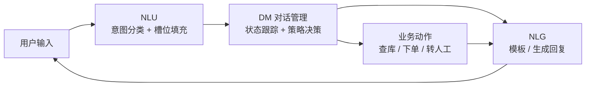
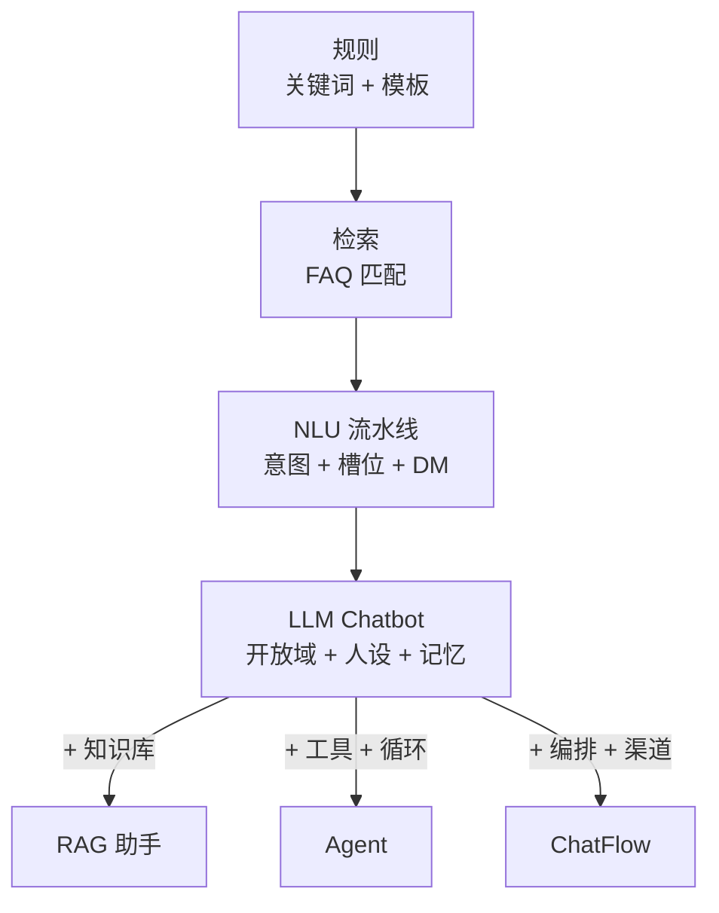

# Chatbot 概念与形态演进

> 最后修改时间：2026-09-11 21:58

> 状态：✅ 正文已补  
> 一句话定义： **Chatbot（聊天机器人）** 是以对话为界面的程序；从意图/槽位 NLU，演进到 LLM 驱动的开放域助手，再分化出 RAG 助手、Agent、ChatFlow 等形态。

## 你为什么要学这个

行业里「chatbot」「助手」「Agent」混用。分不清概念，就会用错架构（例如用纯聊天硬扛要工具编排的任务）；反过来，「什么都要 LLM」是另一端的常见浪费——大量高频、封闭、追求可控的场景，规则与 NLU 时代的方案至今仍是最优解。

学完应能：说清 Chatbot 的经典部件（回合 / 会话 / 意图 / 槽位 / DM）、前 LLM 三代形态各自的适用面、LLM 改变了什么与没改变什么，以及「能聊天」与「能办事」的分界线在哪一层。

## 1. 经典定义：回合、会话、意图、槽位、对话管理

### 1.1 五个基本概念

| 概念 | 英文 | 一句话含义 | 例子 |
|------|------|-----------|------|
| 回合 | Turn | 一次「用户说 → 系统答」的最小交互单元 | 「我想退货」→「请提供订单号」 |
| 会话 | Session / Conversation | 一连串回合构成的任务单元，跨回合保持状态 | 同一用户 10 分钟内的连续咨询 |
| 意图 | Intent | 用户本回合想干什么（分类标签） | `query_order` / `refund` / `chitchat` |
| 槽位 | Slot | 完成意图所需的结构化参数 | `orderId`、`reason`、`city` |
| 对话管理 | DM（Dialogue Management） | 决定「系统下一句做什么」的策略中枢 | 槽位不齐 → 追问；槽位齐 → 调业务 API |

两个常伴概念：

- **NLU**（Natural Language Understanding，自然语言理解）：把用户的话变成 `{intent, slots}` 结构 = 意图分类 + 槽位填充。
- **NLG**（Natural Language Generation，自然语言生成）：把系统决策变成人话；前 LLM 时代多为模板填充（「您的订单 {orderId} 已发货」）。

### 1.2 经典流水线



语音机器人在这条链前后各加一段：ASR（语音识别）→ … → TTS（语音合成）；文本 Chatbot 从 NLU 起步。DM 内部通常再分两件事：

- **DST**（Dialogue State Tracking，对话状态跟踪）：维护「当前意图 + 已填槽位」这张状态表。
- **Policy**（对话策略）：根据状态表决定下一步——追问、澄清、执行、转人工，还是结束会话。

### 1.3 最小可跑的任务型对话（TS）

```typescript
// 经典任务型 Chatbot 最小骨架：规则 NLU + 槽位填充式 DM（无 LLM）
interface DialogState {
  intent: "query_order" | "refund" | null;
  slots: { orderId?: string; reason?: string };
}

/** NLU：关键词规则做意图识别与槽位抽取（前 LLM 时代的典型做法） */
function nlu(text: string, state: DialogState): DialogState {
  const slots = { ...state.slots };
  let { intent } = state;

  if (/退|换货/.test(text)) intent = "refund";
  else if (/订单|快递|到哪/.test(text)) intent = "query_order";

  const orderId = text.match(/\d{10,}/)?.[0]; // 订单号 = 连续长数字
  if (orderId) slots.orderId = orderId;

  return { intent, slots };
}

/** DM：槽位不齐就追问，齐了就执行业务动作 */
function dm(state: DialogState): string {
  if (!state.intent) return "您好，请问是想查订单还是办理退款？";
  if (!state.slots.orderId) return "好的，请提供一下订单号～";
  if (state.intent === "query_order") return queryOrderApi(state.slots.orderId);
  if (!state.slots.reason) return "收到，请问退款原因是什么？";
  return createRefundApi(state.slots.orderId, state.slots.reason);
}
```

记住这个骨架：**LLM 时代换掉的只是 NLU 与 NLG 两段，DM 的工程问题（状态放哪、何时追问、何时执行、何时转人工）一个都没少**——展开见 [会话状态管理](03-会话状态管理.md)。

## 2. 前 LLM 三代形态：规则 / 检索 / NLU 流水线

### 2.1 规则时代（1966– ）

- 代表：ELIZA（1966，关键词 + 模板扮演「心理治疗师」）、IVR 电话按键树、IM 关键词自动回复。
- 原理：`if 关键词命中 then 返回模板`——没有「理解」，只有匹配。
- 遗产至今：按键导航、快捷指令。**可控、零成本、零幻觉**，封闭流程里依然是最优解之一。

### 2.2 检索时代（FAQ 匹配）

- 原理：把用户问题与 FAQ 库中的问题算相似度（早期 TF-IDF / BM25，后期 Embedding），返回最相似那条的标准答案。
- 本质是「问答对查找」，不生成新内容——**答案上限 = FAQ 库的维护质量**。
- 现代遗存：企业客服的 FAQ 语义缓存，命中即返回，省钱省延迟（见 [客服 Chatbot 路线图](../../AI实践/客服Chatbot发展路线图-2026-09-01.md) 的意图分流）。

### 2.3 NLU 流水线时代（约 2015–2020）

- 代表：Dialogflow、LUIS、wit.ai、Rasa。
- 形态：即第 1 节的流水线——训练意图分类器 + 槽位抽取器 + 手写对话规则（Rasa 里叫 stories / rules）。
- 优点：可控、便宜、快（几十毫秒）、行为可复现。
- 痛点：
  1. **长尾爆炸**（「长尾」的确切含义见 2.4）：用户表达千变万化，意图永远标不完，fallback 率居高不下；
  2. **标注成本**：每加一个意图都要攒样本、训练、回归；
  3. **多轮脆弱**：用户中途换意图、指代消解（「那第二件呢？」）处理得很勉强；
  4. **只会说不会做**：DM 能调单个 API，但多工具编排、条件分支、子流程要硬写代码。

### 2.4 术语澄清：本文说的「长尾」是什么

先破除一个常见误读：本文反复出现的 **长尾** /ˌlɒŋ ˈteɪl/ 不是「提示词很长」，它描述的是 **用户问法的分布形态**（下文的「长尾提示词」也是这个意思）。

**长尾** 一词来自 Chris Anderson 2004 年提出的 **The Long Tail** /ðə ˌlɒŋ ˈteɪl/ （长尾理论，2006 年成书）：把一类需求按发生频次从高到低排序，画出的曲线总是「极少数头部极高 + 海量尾部极低」——头部几项吃掉大半流量，后面成千上万项各自只占可怜的一点点。

落在对话系统上，「小知」（内部客服 200 人、日均 800 问）一周 5,600 条 query 的分布长这样：

| 分区间 | 问法种类 | 占流量 | 单个问法频次 | 工程含义 |
|--------|---------|--------|-------------|---------|
| 头部 | 约 20 种 | 约 57% | 日均上百次 | 值得写规则、训分类器、做 FAQ 缓存 |
| 腰部 | 约 1,000 种 | 约 19% | 日均 1~10 次 | 勉强能标，维护成本高、收益低 |
| 长尾 | 1,347 种（一周只出现 1 次） | 约 24% | 一周 1 次 | 标不完也标不及，规则必然 miss |

所以 **长尾提示词** 指的是： **低频、多样、事前没被覆盖到的用户输入（prompt）** ，不是「很长的提示词」。两者别混：

- **长提示词** ：单条 prompt 字数多、上下文长，工程上关心 token 预算与上下文位置；
- **长尾提示词** ：单条并不长，但罕见、表达怪，训练集与测试集里都没见过——关心的是覆盖率与泛化能力。

**落地示例**：用一周日志量出自己产品的长尾（Node.js + TS）。

```typescript
interface QueryRow { text: string; count: number }

/** 归一化：小写 + 去空白 + 去标点，避免同一问法被拆成多条 */
const norm = (s: string): string => s.toLowerCase().replace(/[\s\p{P}]/gu, "");

interface TailReport {
  total: number;
  headShare: number;       // 头部 20 个问法占多少流量
  singletonShare: number;  // 只出现 1 次的问法占多少流量
  singletonTypes: number;  // 只出现 1 次的问法有几种
}

function profileTail(rows: QueryRow[]): TailReport {
  const merged = new Map<string, number>();
  for (const { text, count } of rows) {
    const key = norm(text);
    merged.set(key, (merged.get(key) ?? 0) + count);
  }
  const freq = [...merged.values()].sort((a, b) => b - a);
  const total = freq.reduce((sum, n) => sum + n, 0);
  const head = freq.slice(0, 20).reduce((sum, n) => sum + n, 0);
  const once = freq.filter((n) => n === 1);
  return {
    total,
    headShare: +((head / total) * 100).toFixed(1),
    singletonShare: +((once.length / total) * 100).toFixed(1),
    singletonTypes: once.length,
  };
}

// 「小知」代入 5,600 条 → { total: 5600, headShare: 57.0, singletonShare: 24.1, singletonTypes: 1347 }
```

量出来之后的动作清单，正好对应本文后面的每一节：

1. **头部** → 规则 / FAQ 缓存 / 小模型（2.1~2.3 三代：便宜、稳、快）；
2. **尾部** → 大模型泛化兜底（3.1 的「长尾天然覆盖」），配 RAG 与拒答护栏；
3. **示例与评测** → few-shot 示例优先覆盖尾部边界反例，黄金评测集单列长尾组（见 [Few-shot 示例排序与位置](../01-LLM核心行为/05-Few-shot示例排序与位置.md)）；
4. **兜不住的尾巴** → 转人工，别硬扛（3.4 的分流图）。

> 本文所有「长尾」都指 query / 意图分布上的长尾。本仓库另有一处「长尾」指 **延迟分位** （P95 / P99）的长尾，那是同一统计思想用在性能维度，见 [流式输出工程](04-流式输出工程.md)。

### 2.5 三代对比

| 维度 | 规则 | 检索 FAQ | NLU 流水线 |
|------|------|----------|-----------|
| 理解能力 | 无（匹配） | 弱（相似度） | 中（意图 + 槽位） |
| 覆盖面 | 极窄 | = FAQ 库 | 受限于标注意图集 |
| 可控性 | 极高 | 高 | 高 |
| 成本 / 延迟 | 极低 | 低 | 低 |
| 典型失败 | 关键词没料到 | 问法一变就 miss | 长尾 miss、多轮跑偏 |
| 至今适用 | 封闭流程、快捷指令 | 高频标准问答 | 强合规、高并发客服 |

**经验法则**：这三代没有「过时」，只是退守到各自最擅长的防区；现代客服 Bot 的主流形态是「三代打底 + LLM 兜底长尾」的混合架构（见 3.4）。

## 3. LLM Chatbot：开放域、人设、安全、记忆

### 3.1 LLM 改变了什么

| 能力 | 前 LLM | LLM 时代 |
|------|--------|----------|
| 覆盖面 | 意图集 / FAQ 库内 | 开放域，长尾天然覆盖 |
| 理解 | 分类器 + 抽取器两步 | 一次调用同时出意图 + 槽位 + 情绪 |
| 生成 | 模板填空 | 自由生成，可换风格、可解释推理 |
| 人设 | 写死话术 | system prompt 定义角色、口吻、边界 |
| 多轮 | 手写规则 | 上下文内自然指代、省略、话题切换 |

一次调用替代整条 NLU 流水线（结构化输出细节见 [结构化输出](../01-LLM核心行为/04-结构化输出.md)）：

```typescript
// LLM 时代：一次调用同时完成意图识别 + 槽位抽取
const res = await client.chat.completions.create({
  model: "gpt-4o-mini",
  response_format: { type: "json_object" },
  messages: [
    {
      role: "system",
      content:
        '把用户消息解析为 JSON：{"intent":"query_order|refund|chitchat",' +
        '"slots":{"orderId":string|null,"reason":string|null}}',
    },
    { role: "user", content: "上次买的那双鞋想退了，单号 2026082900123" },
  ],
});
// → {"intent":"refund","slots":{"orderId":"2026082900123","reason":null}}
```

意图路由的提示词工程（示例怎么选、怎么排、多少条才值）见 [Few-shot 示例排序与位置](../01-LLM核心行为/05-Few-shot示例排序与位置.md) 的「小智」案例。

### 3.2 LLM 没改变什么

1. **回合 / 会话 / 状态仍是工程问题**：上下文窗口不是无限记忆，摘要、变量、长期记忆照样要做（[会话状态管理](03-会话状态管理.md)）。
2. **幻觉与知识时效**：模型会一本正经地编造，知识有截止日期——所以需要 RAG。
3. **「能聊 ≠ 能办」**：纯 LLM Chatbot 仍只是对话界面，写操作要靠工具调用与编排。
4. **成本与延迟**：开放域生成的 token 成本和首字延迟，远高于规则命中——所以需要分流与缓存。

### 3.3 形态分化：LLM Chatbot 不是终点



- **RAG 助手**：LLM + 检索，解决幻觉与时效（[RAG 范式](../../AI编程范式/AI应用开发范式/02-rag.md)）；
- **Agent**：LLM + 工具 + 循环，从「回答」升级为「动手办事」（[Agent 范式](../../AI编程范式/AI应用开发范式/03-agent.md)、[什么是 Agent](../../Agent开发知识/01-基础概念/01-什么是Agent.md)）；
- **ChatFlow**：把以上能力装进「会话 + 编排 + 渠道」的产品形态（见第 5 节）。

### 3.4 现代真实形态：混合架构

生产环境的客服 Bot 几乎没有「纯 LLM」，而是分层分流：

```text
用户消息
 ├─ 高频封闭意图（查订单 / 查物流）→ 规则 / 小模型 / FAQ 缓存   ← 快、省、稳
 ├─ 知识型问题（平台规则）        → RAG 检索 + 生成
 ├─ 长尾开放问题                  → 大模型兜底
 └─ 越界 / 敏感                    → 拒答 + 转人工
```

「小知」案例（内部客服 200 人、日均 800 问）按意图分流后，约 35% 请求可降级到小模型，整体 token 成本降约 40%——完整路线见 [客服 Chatbot 发展路线图](../../AI实践/客服Chatbot发展路线图-2026-09-01.md)。

## 4. 与 Assistant / Copilot / Agent 的边界

| 形态 | 本质 | 交互 | 自主性 | 代表 |
|------|------|------|--------|------|
| Chatbot | 以对话为界面的程序 | 多轮问答 | 低（被动应答） | 客服 Bot、FAQ 机器人 |
| Assistant | 面向个人的助手产品 | 多轮 + 多模态 + 常驻 | 中（有记忆与集成） | Siri、Google Assistant |
| Copilot | 嵌入宿主工作流的副驾 | 宿主内建议 / 代操作 | 中（人主导，AI 辅助） | GitHub Copilot、Office Copilot |
| Agent | LLM + 工具 + 循环 | 多步行动 | 高（自主规划执行） | Claude Code、Devin |

判别口诀：

- **有没有界面宿主**？嵌在 IDE / 文档里的是 Copilot；独立对话窗口的是 Chatbot / Assistant。
- **控制流在谁手里**？代码 / 图写死的是 Workflow；LLM 现场决定下一步的是 Agent（[Agent 设计模式与工作流](../../Agent开发知识/13-进阶与工程化/01-Agent设计模式与工作流.md)）。
- **能不能改环境**？只回话是 Chatbot；能写文件、下单、发邮件的是 Agent。

**「能聊天」和「能办事」差在哪一层？** 差在行动层：工具调用 + 执行循环 + 结果反馈。能聊天只需要 NLU / NLG；能办事要把「意图 → 工具 → 结果 → 下一步」闭成环——这正是 Chatbot 与 Agent 的分界线（对照 [什么是 Agent](../../Agent开发知识/01-基础概念/01-什么是Agent.md) 第 2 节的对比表）。

## 5. 与本仓库 ChatFlow 的关系（产品编排层）

- **Chatbot 是「形态」概念**：以对话为界面，回答「产品长什么样」；
- **ChatFlow 是「实现范式」**：Session + Orchestration + Knowledge + Tools + Channels，回答「系统怎么搭」。

一个 LLM Chatbot 要变成可运营的产品，要补的正是 ChatFlow 那一层：

| Chatbot 缺的 | ChatFlow 提供 |
|--------------|---------------|
| 分支与子流程 | 编排节点（条件、循环、子流程） |
| 知识时效 | 知识库 / RAG 节点 |
| 办事能力 | 工具 / API / MCP 节点 |
| 多端触达 | 渠道接入（Web、企微、飞书…） |
| 运营兜底 | 人工接管、敏感词、输出审核 |

单轮无编排的 Chatbot，可视为 ChatFlow 的**退化形态**；反过来，ChatFlow 画布里跑的每一个会话，呈现给用户的就是一个 Chatbot。详见 [什么是 ChatFlow](../../ChatFlow/00-什么是ChatFlow.md)。

## 6. 典型指标：完成率、轮次、升级人工率

| 指标 | 定义 | 为什么重要 |
|------|------|-----------|
| 任务完成率 / 解决率 | 会话达成用户目标的占比 | 北极星指标；「小知」从 62% 冲 85%+ |
| 平均轮次 | 完成一个任务花的回合数 | 轮次过多 = 追问设计差或理解失败 |
| 升级人工率 | 转人工会话占比 | 直接决定省下多少人力；过高说明覆盖不足 |
| 首响 / 首 token 延迟 | 用户发出到收到第一个字 | 体验生死线；见 [流式输出工程](04-流式输出工程.md) |
| 拒答率 / 误拒率 | 该答不答 / 不该答乱答 | 一对孪生指标，必须一起看 |
| CSAT | 会话级满意度打分 | 主观但不可替代 |
| 单会话成本 | token + 检索 + 人工摊销 | 分流与缓存优化的依据 |

工程提醒：**先建黄金评测集，再谈优化**——没有度量的改动等于盲修（[客服 Chatbot 路线图](../../AI实践/客服Chatbot发展路线图-2026-09-01.md) 的 P0 阶段）。

## 学习要点（应能回答）

- **Chatbot 一定要用 LLM 吗？** 不一定。封闭高频场景（按键流程、FAQ、强合规客服）用规则 / 检索 / NLU 更稳、更便宜、更快；LLM 的价值在长尾与开放域。主流做法是混合分流，而非全量替换。
- **「能聊天」和「能办事」差在哪一层？** 差在行动层：工具调用 + 执行循环 + 结果反馈。NLU / NLG 只解决「听懂与说清」；办事要把「意图 → 工具 → 结果 → 下一步」闭成环——这正是 Chatbot 与 Agent 的分界。
- **LLM 替代了经典流水线的哪几段？** NLU 与 NLG；DM（状态、追问、转人工）依旧是工程问题。
- **本文说的「长尾」是「长提示词」吗？** 不是。长尾指用户问法分布上低频、多样的尾部；「长尾提示词」= 长尾输入，与提示词的 **长度** 无关。头部（约 57% 流量）交给规则 / FAQ / 小模型，尾部（约 24% 的问法一周只出现一次）只能靠大模型泛化兜底（见 2.4）。
- **什么时候该从 Chatbot 升级？** 出现「需要多步工具编排」「需要知识库」「需要多渠道运营」任一信号时——详见 [形态选型决策树](02-形态选型决策树.md)。

## 已有相关文档（先读这些）

- [什么是 Agent](../../Agent开发知识/01-基础概念/01-什么是Agent.md)（含与聊天机器人对比）
- [什么是 ChatFlow](../../ChatFlow/00-什么是ChatFlow.md)
- [Agent 关键词大全](../../Agent开发知识/01-基础概念/03-Agent概念与关键词大全一览表.md)
- [Agent 设计模式与工作流](../../Agent开发知识/13-进阶与工程化/01-Agent设计模式与工作流.md)（Workflow vs Agent 判别）
- [客服 Chatbot 发展路线图](../../AI实践/客服Chatbot发展路线图-2026-09-01.md)（混合架构与指标实战）
- [Few-shot 示例排序与位置](../01-LLM核心行为/05-Few-shot示例排序与位置.md)（「小智」意图路由案例）
- [形态选型决策树 · 占位](02-形态选型决策树.md) · [会话状态管理 · 占位](03-会话状态管理.md) · [流式输出工程 · 占位](04-流式输出工程.md)

## 参考资料

- Weizenbaum, *ELIZA — A Computer Program for the Study of Natural Language Communication Between Man and Machine*（1966，规则时代起点）
- Chen et al., *A Survey on Dialogue Systems*（任务型对话 / NLU 流水线综述）
- Rasa、Google Dialogflow 官方文档（NLU 流水线时代的工业实现）
- 本仓库：[ChatFlow](../../ChatFlow/00-什么是ChatFlow.md) · [RAG 范式](../../AI编程范式/AI应用开发范式/02-rag.md) · [Agent 范式](../../AI编程范式/AI应用开发范式/03-agent.md)
