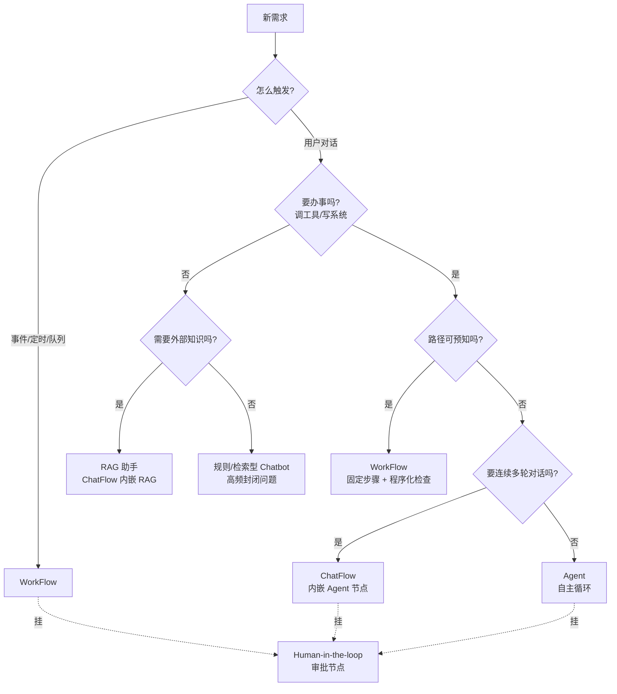

# 形态选型决策树

> 最后修改时间：2026-09-11 22:09

> 状态：✅ 正文已补  
> 一句话定义：按任务是否需要 **外部知识 / 多步工具 / 后台触发 / 多轮会话** ，在 Chatbot、RAG、Agent、WorkFlow、ChatFlow 之间选型。

## 你为什么要学这个

过度 Agent 化与「只做个聊天框」是两端常见错误。选型错了，后面全是补丁：用 Agent 硬扛客服 FAQ，是拿最贵、最慢、最不可控的方案做最简单的事；用纯聊天框硬扛报销审批，是永远做不出「能办事」的产品。

学完应能：拿着一个真实需求，问完 6 个问题就圈定形态；识别「该组合而非二选一」的场景；并说清与 Anthropic「Workflow vs Agent」经验的对应关系。

## 1. 决策问题清单：先问这 6 个问题

选型不是看技术热度，而是逐个回答以下问题（顺序即决策顺序）：

| # | 问题 | 答案指向 |
|---|------|----------|
| Q1 | **任务怎么触发？** 用户主动发起对话，还是事件/定时/消息队列触发？ | 对话触发 → Chatbot/ChatFlow；事件触发 → WorkFlow |
| Q2 | **需要外部知识吗？** 答案在文档/库/库里，还是在模型能力内？ | 需要知识注入 → RAG（作为子能力） |
| Q3 | **要「办事」吗？** 只回答问题，还是要调工具/写系统/改环境？ | 有写操作或多步工具 → Agent 或 WorkFlow |
| Q4 | **路径可预知吗？** 步骤能提前写死，还是要模型现场决定下一步？ | 可预知 → WorkFlow；不可预知 → Agent |
| Q5 | **要多轮会话吗？** 一问一答就结束，还是连续多轮、跨渠道、要运营？ | 多轮 + 渠道 + 运营 → ChatFlow |
| Q6 | **要不要人审 / 人在环上？** 关键动作（支付、删改、对外发布）谁签字？ | 要 → HITL 节点（任何形态都可挂） |

两个隐含原则：

- **形态可以组合**：这 6 问圈出的是「主形态 + 子能力」。例如客服 = ChatFlow 主形态 + RAG 子能力 + FAQ 缓存。
- **Q3、Q4 是分水岭**：「要办事」决定你逃出纯聊天；「路径可否预知」决定 Workflow 还是 Agent——这正是 Anthropic 的核心判据（见第 5 节）。

## 2. 决策树与对照表

### 2.1 决策树



### 2.2 五形态对照表

| 维度 | Chatbot | RAG 助手 | WorkFlow | Agent | ChatFlow |
|------|---------|----------|----------|-------|----------|
| 触发 | 对话 | 对话 | 事件/定时/队列 | 任务目标 | 对话 |
| 会话 | 可多轮 | 可多轮 | 无/弱会话 | 任务内状态 | **多轮 + 状态机** |
| 知识 | 无/FAQ | **检索注入** | 可挂 RAG 节点 | 可挂 RAG 工具 | 可挂知识库 |
| 行动 | 无/单个 API | 无 | **预定义步骤** | **动态循环** | 可挂工具节点 |
| 可控性 | 高 | 中高 | **最高** | 最低 | 高（路径可控） |
| 成本/延迟 | 最低 | 低 | 低且可预算 | **最高且波动** | 中 |
| 典型代表 | FAQ 客服、按键导航 | 企业知识助手 | 报销审批、日报生成 | Claude Code、Devin | Dify Chatflow 客服 |

一句话定位：**Chatbot 是界面，RAG 是知识能力，WorkFlow 是可控流水线，Agent 是自主循环，ChatFlow 是产品化的对话编排。** 前四者是能力/形态，可互相组合（见第 3 节）。

## 3. 组合模式：不是二选一，而是搭积木

### 3.1 ChatFlow 内嵌 RAG（最常见）

客服/知识助手的标准解：会话编排为主干，知识型节点走检索。

```text
ChatFlow 主干
  ├─ 意图分类节点 →「平台规则」→ RAG 检索节点 → 生成（带引用）
  ├─ 「查订单」→ 工具节点（只读 API）
  └─ 「闲聊/长尾」→ 大模型直答
```

「小知」案例即此形态：意图分流后约 35% 请求降级到小模型，token 成本降约 40%（[客服 Chatbot 路线图](../../AI实践/客服Chatbot发展路线图-2026-09-01.md)）

### 3.2 WorkFlow 调 Agent（批处理中的难一步）

流水线整体可控，个别步骤开放、交给 Agent 节点处理：

```text
WorkFlow：每日 1000 篇文档处理
  ├─ 抓取/清洗（固定节点）
  ├─ 复杂摘要与信息抽取（Agent 节点：按文档类型自选策略）
  └─ 人审 + 发布（HITL 节点）
```

原则：**Agent 节点要有预算上限与超时**，失败则走降级路径（如丢弃或转人工），不能让一个节点拖垮整条流水线。

### 3.3 Agent 调 WorkFlow（把固定流程封装成工具）

反向组合：Agent 循环中遇到固定 SOP，调用一个「工作流工具」而非自己一步步试：

```typescript
// 把固定流程注册为 Agent 的一个工具，而不是让 Agent 自由发挥
const tools = [
  {
    type: "function",
    function: {
      name: "process_refund",
      description: "走标准退款流程：校验订单→风控检查→创建退款单。必须用本工具，不要自行调用底层 API",
      parameters: {
        type: "object",
        properties: { orderId: { type: "string" } },
        required: ["orderId"],
      },
    },
  },
];
```

收益：SOP 内的合规步骤不依赖模型临场发挥；Agent 只决定「何时走这个流程」。

### 3.4 组合速查

| 组合 | 何时用 | 关键约束 |
|------|--------|----------|
| ChatFlow + RAG | 知识型客服/助手 | 引用可溯源、拒答策略 |
| ChatFlow + Agent 节点 | 长尾任务在对话内闭环 | 预算上限、关键动作二次确认 |
| WorkFlow + Agent 节点 | 批处理中的开放子步骤 | 超时、降级、幂等 |
| Agent + WorkFlow 工具 | 固定 SOP 封装成工具 | 工具描述写明「必须走此流程」 |
| ChatFlow 触发 WorkFlow | 对话里发起、后台执行 | 异步回执（见下） |

跨形态交接提醒：**对话（前台）与流水线（后台）职责分离**——对话里只触发任务并回执「已提交，预计 10 分钟完成」，重活交给 WorkFlow 异步跑（[ChatFlow 设计要点](../../ChatFlow/00-什么是ChatFlow.md) 第 7 节）。

## 4. 反模式案例

| 反模式 | 症状 | 正解 |
|--------|------|------|
| **FAQ 全上 Agent** | 高频封闭问题（查订单号规则）也走 Agent 循环：延迟数秒、成本翻倍、偶尔还自己调错 API | ChatFlow 意图分流：高频走规则/FAQ 缓存，长尾才给 LLM/Agent |
| **办事任务硬扛纯聊天** | 「帮我报销」做了个会说话的机器人，但永远不会真的提交单据 | Q3=是：必须有工具调用与业务系统对接（Agent 或 WorkFlow） |
| **用 ChatFlow 画布做批处理** | 每天定时跑 1000 条数据，却搭在带会话的对话编排里，无法并发、无法观测 | 无会话批处理 → WorkFlow（触发器 Cron/队列） |
| **可预知路径硬上 Agent** | 「查天气→生成播报」两步固定任务让 Agent 自由发挥，结果偶尔跳步、无法复现 | 固定两步 → Prompt Chaining / Workflow（Anthropic 法则：能写死就不上 Agent） |
| **RAG 硬扛任务型对话** | 退款流程全靠「检索相似问答」拼出来，槽位追问全乱 | 任务型对话需要 DM（槽位/状态）；RAG 只管知识注入 |
| **无预算的 Agent 节点** | 流水线里嵌的 Agent 死循环重试，拖垮整批任务 | Agent 节点必须设超时、步数上限、失败降级 |

## 5. 与 Anthropic「Workflow vs Agent」对齐

本仓库 [Agent 设计模式与工作流](../../Agent开发知识/13-进阶与工程化/01-Agent设计模式与工作流.md) 已整理 Anthropic《Building Effective Agents》的判据，与本决策树的对应：

| Anthropic 经验法则 | 对应本树 |
|--------------------|----------|
| 能用固定流程解决，**不要**用 Agent | Q4=可预知 → Workflow（5 种模式：Prompt Chaining / Routing / Parallelization / Orchestrator-Worker / Evaluator-Optimizer） |
| 步骤无法预测 + 需与环境反复交互，才用自主 Agent | Q4=不可预知 且 Q3=要办事 → Agent（ReAct 循环） |
| 介于两者之间，用 Workflow 模式逐步提升灵活度 | Q4 模糊时先上 Routing / Prompt Chaining，别直接跳 Agent |
| 复杂度是最后手段：先找最简方案 | 本树自上而下第一个命中的形态即是起点；组合（第 3 节）优于一步到位 |

**升级信号（何时从 Chatbot → Agent）**：出现任一信号，就该评估升级行动层——

1. 用户开始要求「帮我做」而非「告诉我」（要办事 = Q3 转是）；
2. 单工具调用演变成「查→算→写→通知」多步链（Q4 不可预知）；
3. 长尾意图暴增，规则与 FAQ 的 miss 率压不住（知识/意图覆盖见顶）；
4. 对话中频繁出现「等我确认后继续」的跨轮任务状态。

## 6. 三场景速答（学习要点落地）

| 场景 | 决策路径 | 选型 |
|------|----------|------|
| **客服 FAQ** | 对话触发 + 无写操作 + 要知识 + 路径可预知 | ChatFlow + RAG + FAQ 语义缓存；高频封闭意图走规则/小模型 |
| **报销审批** | 表单/事件触发 + 写操作 + 路径固定 + 必须人审 | WorkFlow（结构化抽取 → 规则校验 → HITL 审批节点 → 写 ERP） |
| **代码修复** | 任务触发 + 写操作（改文件/跑命令）+ 步骤不可预知 + 需反馈闭环 | Agent（ReAct 循环），配人在环上与预算上限 |

共同点：三个场景都逃不出 Q1–Q6 的问询顺序——**先触发方式，再知识/行动，再路径可预知性，最后人审**。

## 学习要点（应能回答）

- **客服 FAQ、报销审批、代码修复各选哪条路径？** 见第 6 节速答表：分别是 ChatFlow+RAG、WorkFlow+HITL、Agent。
- **什么信号说明「该从 Chatbot 升级到 Agent」？** 见第 5 节四个升级信号：要办事、多步链、长尾爆发、跨轮任务态。
- **形态能组合吗？** 能且应该：ChatFlow 内嵌 RAG/Agent、WorkFlow 调 Agent、Agent 把 SOP 封装成工作流工具——先圈主形态，再挂子能力。
- **Workflow 和 Agent 的分水岭？** 路径可预知 → Workflow（可控、可复现、便宜）；不可预知 → Agent（自主、灵活、贵且要护栏）。

## 已有相关文档（先读这些）

- [Chatbot 概念与形态演进](01-Chatbot概念与形态演进.md)（五种形态从何而来）
- [WorkFlow 是什么](../../WorkFlow/00-什么是WorkFlow.md)
- [ChatFlow 是什么](../../ChatFlow/00-什么是ChatFlow.md)
- [Agent 设计模式与工作流](../../Agent开发知识/13-进阶与工程化/01-Agent设计模式与工作流.md)（Anthropic 五模式 + Agent 取舍）
- [什么是 Agent](../../Agent开发知识/01-基础概念/01-什么是Agent.md)
- [应用范式 · Agent](../../AI编程范式/AI应用开发范式/03-agent.md) · [应用范式 · RAG](../../AI编程范式/AI应用开发范式/02-rag.md)
- [客服 Chatbot 发展路线图](../../AI实践/客服Chatbot发展路线图-2026-09-01.md)（混合架构实例）
- [会话状态管理](03-会话状态管理.md) · [流式输出工程](04-流式输出工程.md)（选中形态后的两块工程底座）

## 参考资料

- Anthropic, *Building Effective Agents*（2024，Workflow vs Agent 的取舍原始出处）
- 本仓库：[Agent 设计模式与工作流](../../Agent开发知识/13-进阶与工程化/01-Agent设计模式与工作流.md)（五模式详解）
- 本仓库：[WorkFlow 选型直觉](../../WorkFlow/00-什么是WorkFlow.md) · [ChatFlow 与相关概念边界](../../ChatFlow/00-什么是ChatFlow.md)
