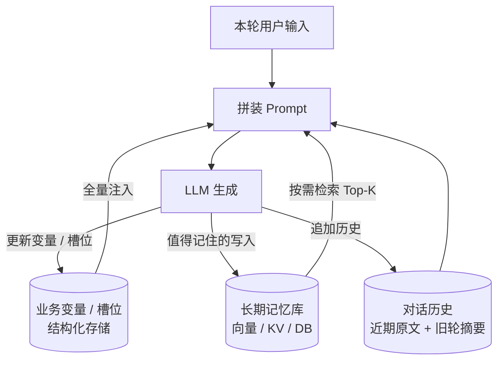

# 会话状态管理

> 最后修改时间：2026-09-11 22:09

> 状态：✅ 正文已补  
> 一句话定义：多轮对话里用 **Session / 变量 / 槽位 / 摘要记忆** 保持一致性，避免每轮都从零理解。

## 你为什么要学这个

纯拼历史消息会爆上下文、丢关键约束、串会话。Chatbot/ChatFlow/Agent 都依赖状态设计：状态放错地方（全在 prompt 里），长会话必然失控；状态放对分层，才能既记得住、又花得起 token。

学完应能：把「状态」拆成三类并各配对存储；用「LLM 抽取 + 结构化落库」的混合法管理槽位；设计滚动摘要与记忆写入；并按用户/会话两级键做隔离与合规。

## 1. 先拆解：状态到底有哪几类

「会话状态」不是一坨消息历史，而是三类职责不同的数据：

| 类别 | 内容 | 举例 | 特征 |
|------|------|------|------|
| **对话历史**（短期） | 原始多轮消息 | 最近 N 轮 user/assistant 文本 | 自然语言、增长快、可压缩 |
| **业务变量 / 槽位**（结构化） | 任务推进所需字段 | `orderId`、`intent`、已确认的决策 | 强类型、必须精确、驱动流程 |
| **长期记忆**（跨会话） | 偏好、事实、历史决策 | 「用户是川菜爱好者」「上次的退款单号」 | 带元数据、按需检索注入 |



三类的管理策略完全不同：历史**可丢可压**、变量**必须精确**、记忆**要检索要过期**。

## 2. 状态放哪：客户端 / 服务端 / 缓存 / DB / 向量库

| 位置 | 放什么 | 优点 | 风险 | 适用 |
|------|--------|------|------|------|
| **客户端**（localStorage/cookie） | sessionId、少量展示态 | 免服务端存储、天然分用户 | 不可信、清缓存即丢、跨设备不同步 | 只存 session 标识，**不存状态本体** |
| **服务端内存** | 进行中会话的热状态 | 最快 | 重启即丢、多实例不共享 | 单实例 demo、原型 |
| **Redis 等缓存**（推荐主力） | 会话历史窗口、槽位、TTL | 快、自带过期、可横向扩展 | 需持久化兜底 | 生产对话产品的第一落点 |
| **关系型 DB** | 需要审计/回放/事务的状态 | 持久、可查、可审计 | 慢，不宜每轮读写 | 已确认决策、工单、审计日志 |
| **向量库** | 长期记忆片段 | 语义检索召回往事 | 召回可能不准、要元数据过滤 | 长期记忆（[记忆系统](../../Agent开发知识/04-记忆系统/01-记忆系统.md)） |

**经验分工**：客户端只带 `sessionId`；每轮读写走 Redis（历史窗口 + 槽位）；关键动作落 DB（审计）；长期记忆进向量库。这一分工与 [记忆系统](../../Agent开发知识/04-记忆系统/01-记忆系统.md) 三层（短期/工作/长期）完全对应——Redis 里的历史窗口即短期记忆，scratchpad/槽位即工作记忆，向量库即长期记忆。

### 2.1 最小会话存取骨架（TS）

```typescript
// Redis 为主力的会话状态存取：两级键（userId:sessionId）+ TTL + JSON 序列化
import { Redis } from "ioredis";
const redis = new Redis();

interface SessionState {
  history: { role: "user" | "assistant"; content: string }[]; // 短期：近 N 轮
  slots: Record<string, string | null>;                        // 工作期：业务槽位
  summary: string | null;                                      // 旧轮滚动摘要
  updatedAt: number;
}

const TTL_SECONDS = 24 * 60 * 60; // 会话级 TTL：一天不活跃即过期

const key = (userId: string, sessionId: string) =>
  `session:${userId}:${sessionId}`; // 两级键，天然隔离多用户多会话

export async function loadSession(userId: string, sessionId: string): Promise<SessionState> {
  const raw = await redis.get(key(userId, sessionId));
  return raw
    ? (JSON.parse(raw) as SessionState)
    : { history: [], slots: {}, summary: null, updatedAt: Date.now() };
}

export async function saveSession(userId: string, sessionId: string, s: SessionState) {
  // 每次写入都续期 TTL：活跃会话不过期，沉默会话自动清理
  await redis.set(key(userId, sessionId), JSON.stringify(s), "EX", TTL_SECONDS);
}
```

## 3. 槽位填充 vs LLM 自由对话：混合才是正解

两极都很糟：**纯槽位**像审讯（「请提供订单号」「请提供退款原因」一路追问），**纯自由对话**则关键参数永远不精确（LLM 复述订单号会抄错）。
混合原则：**让 LLM 负责听懂和追问（体验），让结构化槽位负责存真（精确）。**

| 职责 | 交给谁 |
|------|--------|
| 从自然语言里抽槽位（含指代消解：「那第二件也退了」） | LLM（结构化输出） |
| 槽位校验（格式、存在性、权限） | 程序（代码校验，不信 LLM） |
| 缺槽时的追问话术 | LLM（结合上下文自然地问） |
| 槽位值的最终保存与流转 | 结构化存储（Redis/DB） |

```typescript
// 混合式槽位管理：LLM 抽取 + 程序校验 + 状态合并
interface Extracted { intent: string | null; slots: Record<string, string | null>; }

async function updateSlots(state: SessionState, userText: string): Promise<Extracted> {
  // 1) LLM 抽取：把当前输入 + 已有槽位一起给它，解决指代与省略
  const extracted = await llmExtract(userText, state.slots); // 结构化输出 JSON
  // 2) 程序校验：格式类约束不交给 LLM 判断
  if (extracted.slots.orderId && !/^\d{12,}$/.test(extracted.slots.orderId)) {
    extracted.slots.orderId = null; // 不合法不落库，留给下一轮追问
  }
  // 3) 合并：新值覆盖旧值，LLM 未提及的槽位保持不变
  for (const [k, v] of Object.entries(extracted.slots)) {
    if (v !== null) state.slots[k] = v;
  }
  return extracted;
}
```

要点：抽取时**把已有槽位一并传给模型**，模型才能正确处理「换成第二件」这类对旧槽位的引用；校验失败**静默置空并追问**，而不是把错误值带进业务系统。

## 4. 摘要压缩与「记忆写入」策略

### 4.1 滚动摘要：给历史装滑动窗口

历史无限拼下去必然爆上下文（见 [Lost in the Middle](../01-LLM核心行为/01-Lost-in-the-Middle与位置偏见.md)：旧信息既贵又容易被忽略）。标准做法是**近端保留原文，远端压成摘要**：

```text
Prompt 里的历史区 = [滚动摘要（旧轮压缩）] + [最近 K 轮原文]
```

触发与内容规则：

1. **何时压**：历史超过预算阈值（如 20 轮或 8K token）触发，把最旧的若干轮并入摘要。
2. **压什么**：摘要必须显式保留**硬约束、已确认决策、关键槽位来源**——「用户已确认退款订单 2026082900123，原因：质量问题」这类事实绝不能被摘要丢掉（呼应 [Lost in the Middle](../01-LLM核心行为/01-Lost-in-the-Middle与位置偏见.md) 的提醒：摘要会丢约束）。
3. **怎么存**：摘要本身也是会话状态的一部分（`summary` 字段），每轮随会话一起读写。

```typescript
// 滚动摘要：把窗口外的旧轮并入摘要，窗口内保留原文
async function compactHistory(state: SessionState, keepTurns = 10): Promise<void> {
  if (state.history.length <= keepTurns) return;
  const [oldPart, recentPart] = [
    state.history.slice(0, -keepTurns),
    state.history.slice(-keepTurns),
  ];
  state.summary = await llmSummarize(
    state.summary, // 旧摘要 + 旧轮 → 新摘要（增量式，不重读全部）
    oldPart,
    "必须保留：已确认的决策、订单号/金额等关键数字、用户的硬性约束",
  );
  state.history = recentPart;
}
```

### 4.2 记忆写入：什么值得跨会话记住

不是所有对话都值得写进长期记忆。写入策略与 [记忆系统](../../Agent开发知识/04-记忆系统/01-记忆系统.md) 的提取环节一致：

| 该写 | 不该写 |
|------|--------|
| 用户偏好（「不吃辣」） | 一次性事实（「今天天气」） |
| 稳定事实（职业、所在城市） | 短期意图（「今天想吃粤菜」——只进会话，不进长期） |
| 关键决策与结论（上次选了哪个方案） | 闲聊内容 |
| 纠错信息（「之前说的过敏源搞错了」→ 覆盖旧记忆） | 未确认的猜测 |

写入时带元数据（时间、来源、类型、置信度），并设计**过期与纠错**：新信息与旧记忆冲突时按时间戳/置信度仲裁，过期信息衰减删除。摘要压缩与记忆写入的分界：**摘要管本会话内不丢线索，记忆写入管跨会话可复用**。

## 5. 多用户、多会话隔离与合规

### 5.1 隔离：两级键 + 最小权限

- **键设计**：`userId:sessionId` 两级键（见 2.1 代码），同一用户的多条会话（网页 + 小程序）互不串台；
- **服务端鉴权**：加载会话前校验 `sessionId` 归属于当前 `userId`——**不要信客户端传来的任何状态**，客户端只配提供标识；
- **记忆隔离**：长期记忆检索必须加 `userId` 元数据过滤，否则 A 用户的记忆会「串」进 B 用户的回答，是严重的隐私事故。

### 5.2 过期与隐私删除

| 需求 | 做法 |
|------|------|
| 会话过期 | Redis TTL（活跃续期、沉默过期，见 2.1）；过期后如需回访再从 DB 拉审计数据重建 |
| 用户注销 / 删除请求（GDPR 类） | 按 `userId` 前缀批量删除会话键 + 向量库按元数据过滤删除记忆 + DB 记录留痕 |
| 敏感信息脱敏 | 写入长期记忆前先脱敏（身份证、卡号不进向量库） |
| 审计与回放 | 关键决策（支付、改绑）落 DB，带时间戳可回放；对话原文按合规要求定保留期 |

## 6. 与 Memory 模块、ChatFlow 变量的对应关系

本篇的会话状态是 [记忆系统](../../Agent开发知识/04-记忆系统/01-记忆系统.md) 三层在**对话产品**里的落地：

| 本篇概念 | 记忆系统三层 | Memory-Augmented 模式 | ChatFlow 产品叫法 |
|----------|--------------|----------------------|-------------------|
| 对话历史（近 N 轮原文） | 短期记忆 | Working/Short-term Memory | 会话历史节点 |
| 槽位 / 业务变量 | 工作记忆 | scratchpad | **会话变量**（ChatFlow 的变量节点即结构化槽位的产品化） |
| 滚动摘要 | 短期→压缩态 | — | 会话摘要/压缩（Dify 等平台内置） |
| 长期记忆（跨会话） | 长期记忆 | Long-term/Episodic Memory | 用户画像 / 长期记忆节点 |

进一步的关系：记忆系统管「**怎么存、怎么取**」，[上下文工程](../../Agent开发知识/13-进阶与工程化/02-上下文工程.md) 管「**取出来怎么组装进这一次调用**」（选择/压缩/分层/淘汰四大操作），本篇管「**对话产品里状态分几类、放哪里、怎么隔离**」——三者是同一件事在存储、组装、产品三个视角的切面。

## 学习要点（应能回答）

- **哪些状态必须结构化存储，哪些可以只靠对话历史？** 驱动流程的参数（槽位、已确认决策、权限态）必须结构化——LLM 复述会错、程序要校验、审计要落 DB；氛围性上下文（闲聊、语气、近几轮原文）靠历史即可，且可压可丢。
- **会话过期与隐私删除怎么做？** Redis TTL + 活跃续期做沉默过期；删除请求走「缓存按前缀删 + 向量库按元数据删 + DB 留痕」三步；敏感信息在写入长期记忆前脱敏。
- **槽位和自由对话怎么混？** LLM 负责抽取与追问话术，程序负责校验与落库；抽取时带上已有槽位以处理指代。
- **摘要什么时候做、保什么？** 超预算即压、增量式合并；硬约束与已确认决策必须在摘要模板里显式保留。

## 已有相关文档（先读这些）

- [记忆系统](../../Agent开发知识/04-记忆系统/01-记忆系统.md)（三层记忆与检索/注入/遗忘）
- [Memory-Augmented 模式](../../Agent设计模式/06-Memory-Augmented模式.md)
- [ChatFlow 是什么](../../ChatFlow/00-什么是ChatFlow.md)（变量/槽位的产品化）
- [上下文工程](../../Agent开发知识/13-进阶与工程化/02-上下文工程.md)（组装侧的四大操作）
- [Lost in the Middle 与位置偏见](../01-LLM核心行为/01-Lost-in-the-Middle与位置偏见.md)（为什么旧历史可压可丢）
- [Chatbot 概念与形态演进](01-Chatbot概念与形态演进.md)（槽位/DM 的经典出处）

## 参考资料

- 本仓库：[记忆系统](../../Agent开发知识/04-记忆系统/01-记忆系统.md) · [上下文工程](../../Agent开发知识/13-进阶与工程化/02-上下文工程.md)
- Mem0 / LangChain Memory 文档（长期记忆写入与冲突仲裁的工业实现）
- Redis 官方文档：TTL、key 过期策略
