# 流式输出工程

> 最后修改时间：2026-09-11 22:09

> 状态：✅ 正文已补  
> 一句话定义：把模型生成以 **流式（SSE 等）** 推到前端，优化首字延迟与体验；并处理工具调用、取消、断线。

## 你为什么要学这个

非流式「转圈 10 秒」会毁掉对话产品；但流式与工具调用、结构化输出、计费统计纠缠在一起：中途要切工具调用、用户会中途打断、断线要能重连、护栏没法等全文。这些工程问题不解决，流式只会把「慢」变成「乱」。

学完应能：说清 SSE/WS/SDK 三种协议的取舍；用 TTFT/TPOT 定体验预算；写出流式中途 tool call 的状态机；处理取消/重连/半包；并回答「护栏何时做、Agent 哪些步骤给用户看」。

## 1. 流式协议：SSE / WebSocket / SDK stream

| 协议 | 原理 | 优点 | 局限 | 适用 |
|------|------|------|------|------|
| **SSE**（Server-Sent Events） | HTTP 长连接 + `text/event-stream`，服务端单向推 `data:` 帧 | 复用 HTTP 基建（鉴权/网关/CDN）、浏览器原生 `EventSource`、自动重连 | **单向**（取消要另想办法）、纯文本帧 | **LLM 文本输出的默认选择** |
| **WebSocket** | 双向全双工 | 真双向、低开销 | 网关/代理配置复杂、断连重连要自建 | 语音实时对话、多端同步（[Voice/Realtime](../07-前沿与形态/03-Voice-Realtime.md)） |
| **SDK stream** | 厂商 SDK 封装的异步迭代器（底层仍是 SSE） | 免手写解析、跨厂商统一 | 绑定 SDK 版本 | 服务端消费模型流（见 [LLM API](../../AI编程范式/AI应用开发范式/09-llm-api.md)） |

**选型直觉**：文本对话产品 = SSE 就够（「服务端→客户端」单向上行流）；只有客户端也要持续上行（语音流、协同光标）才上 WebSocket。服务端到模型厂商之间用 SDK stream，服务端到浏览器之间用 SSE——两段解耦，中间正好插入护栏、计费、工具执行。

一次 LLM 流式调用的标准形态：

```typescript
// 服务端：SDK stream 消费模型输出（这段是 LLM API 的标准用法）
const stream = await client.chat.completions.create({
  model: "gpt-4o-mini",
  messages,
  stream: true, // 关键开关：响应变为异步迭代器
});
for await (const chunk of stream) {
  const delta = chunk.choices[0]?.delta;
  // delta.content：文本增量；delta.tool_calls：工具调用增量（见第 3 节）
}
```

## 2. TTFT、token/s 与用户感知延迟

流式的价值不是「更快算完」，而是**改变用户对等待的感知**——先看到字，等待就被「打字中」接管了。三个核心指标（行业标准详见 [LLM 核心性能指标全景手册](../06-安全与评测/06-LLM%20核心性能指标全景手册.md)）：

| 指标 | 定义 | P95 行业标准 | 优化抓手 |
|------|------|--------------|----------|
| **TTFT**（首 token 时延） | 请求发出 → 第一个 token 到达 | 优秀 < 800ms；卡顿 > 2s | 减小 prompt（Prefill 变短）、语义缓存、就近部署 |
| **TPOT**（单 token 间隔） | 相邻两 token 的时间差 | 流畅 10–40ms；卡顿 > 80ms | 换更小/更快的模型、提高并发配额 |
| **E2E**（总时延） | 全部输出完成 | = TTFT + TPOT × (token 数 − 1) | 非流式场景才直接暴露给用户 |

工程要点：

1. **看分位不看均值**：P95/P99 的长尾才决定「偶尔卡死」的差评（手册核心原则）。
2. **TTFT 优先于 E2E**：对话产品的体验生死线是首字——800ms 内出第一个字，后面哪怕慢一点，用户也在「读」而不是「等」。
3. **流式不省总时长，省的是感知**：E2E 基本不变，但「转圈 8 秒」变成「0.8 秒出字 + 打字机」，感知延迟差一个数量级。
4. **中间层的 TTFT 要扣掉上游**：网关记录「上游首字时间」与「下游首字时间」之差，才知道延迟是自己加的还是模型给的。

## 3. 流式中途触发 tool call 的状态机

流式最麻烦的一点：**模型的回复不是纯文本流**。它可能答到一半决定调工具，此时 `delta.tool_calls` 分片到达——函数名一次给全，**arguments JSON 被切成多个增量分片**，必须累积拼接完才知道参数是什么。

### 3.1 状态机

```mermaid
stateDiagram-v2
    [*] --> IDLE
    IDLE --> STREAMING_TEXT: 收到 content 增量
    STREAMING_TEXT --> TOOL_PENDING: 收到 tool_calls 分片<br/>暂停对用户的输出
    TOOL_PENDING --> TOOL_PENDING: arguments 分片持续累积
    TOOL_PENDING --> TOOL_EXECUTING: finish_reason=tool_calls<br/>且参数 JSON 解析成功
    TOOL_EXECUTING --> STREAMING_TEXT: 工具结果作为 tool 消息回传<br/>模型继续生成（继续推给前端）
    STREAMING_TEXT --> DONE: finish_reason=stop
    TOOL_EXECUTING --> FAILED: 解析失败/工具报错
    FAILED --> STREAMING_TEXT: 结构化错误回传模型自纠
    DONE --> [*]
```



三个易错点：

1. **不要把 tool call 分片当文本推给前端**——用户会看到半截 JSON 裸奔；
2. **arguments 要累积到最后一个分片再 `JSON.parse`**，半途解析必炸（重试/修复策略见 [输出解析与修复](../04-Agent与编排/03-输出解析与修复.md)）；
3. **工具执行期间前端要有过渡态**（「正在查询订单…」），不能既不出字也不转圈。

### 3.2 累积分片的实现（TS）

```typescript
// 按 id 累积 tool_calls 分片：一个 chunk 里函数名先到，arguments 逐段补全
interface ToolCallAccum {
  index: number;
  id: string;
  name: string;
  arguments: string; // 逐分片拼接，最终才是完整 JSON
}

function accumulateToolCalls(
  accum: Map<number, ToolCallAccum>,
  deltaToolCalls: { index: number; id?: string; function?: { name?: string; arguments?: string } }[],
): Map<number, ToolCallAccum> {
  for (const part of deltaToolCalls) {
    const cur =
      accum.get(part.index) ??
      ({ index: part.index, id: part.id ?? "", name: "", arguments: "" } as ToolCallAccum);
    if (part.id) cur.id = part.id;               // id 通常只在首个分片出现
    if (part.function?.name) cur.name += part.function.name;
    if (part.function?.arguments) cur.arguments += part.function.arguments; // 关键：拼接
    accum.set(part.index, cur);
  }
  return accum;
}
// 流结束时：对每个 accum 条目 JSON.parse(arguments) → 执行工具 → 结果以 tool 消息回传 → 继续流式下一轮
```

这与 [Function Calling](../../Agent开发知识/03-工具调用/01-Function-Calling.md) 的「宿主执行→结果回传→模型继续」循环是同一件事，只是每一步都发生在流上。

## 4. 取消、重连、半包与缓冲

### 4.1 取消：两头都要断

用户点「停止」时：

- **前端**：`AbortController` 断开 SSE/请求；
- **服务端**：监听断开事件，**同时取消对上游模型的请求**——不取消则白烧 token（计费按上游产出算），这是流式系统最常见的成本漏洞；
- **状态落盘**：被截断的回答也要写回会话历史（标注 `interrupted`），否则下一轮上下文对不上。

```typescript
// 服务端：客户端断开 → 级联取消上游，止损 token
const upstream = await client.chat.completions.create({ ..., stream: true });
res.on("close", () => {
  if (!res.writableEnded) {
    upstream.controller.abort(); // 客户端已走，上游立刻停
    savePartialToHistory(sessionId, bufferedText, { interrupted: true });
  }
});
```

### 4.2 重连：SSE 自动重连 + 断点续传

SSE 自带重连（`EventSource` 断线自动重试，带 `Last-Event-ID`），但**模型流不可重放**——重连后不能从第 N 个 token 续传，只剩两种策略：

| 策略 | 做法 | 适用 |
|------|------|------|
| **结果补偿** | 服务端继续把流跑完落库，客户端重连后拉取已生成的完整部分 | 默认：生成结果宝贵 |
| **放弃重来** | 重连即重新发起请求（旧结果异步丢弃不落库） | 网络抖动频繁且生成便宜 |

前端体验上配「断线重连中…」提示，不要静默空白。

### 4.3 半包与缓冲：SSE 解析的正确姿势

TCP 不保证 `data:` 帧按完整块到达——**一个 chunk 可能切断在 JSON 中间**（半包），也可能一次含多帧。解析必须用缓冲区按事件边界切分：

```typescript
// 健壮的 SSE 解析：缓冲 + 按 \n\n 事件边界切分 + 处理半包
function createSseParser(onEvent: (data: string) => void) {
  let buffer = "";
  return (chunk: string) => {
    buffer += chunk;
    let idx: number;
    while ((idx = buffer.indexOf("\n\n")) !== -1) { // 事件以空行分隔
      const rawEvent = buffer.slice(0, idx);
      buffer = buffer.slice(idx + 2);              // 残缺尾部留在缓冲区等下个 chunk
      for (const line of rawEvent.split("\n")) {
        if (line.startsWith("data:")) {
          const data = line.slice(5).trimStart();
          if (data !== "[DONE]") onEvent(data);    // 跳过结束哨兵
        }
      }
    }
  };
}
```

反例警示：直接对每个 `chunk` 做 `JSON.parse` 的代码，在压测下半包率 100% 必炸——**流式解析永远是「缓冲 + 边界切分」，不是「逐块解析」**。

## 5. 前端渲染：打字机、引用角标与安全过滤

### 5.1 打字机：出字节奏自己控

不要把每个 delta 直接 `+=` 到 DOM——模型 TPOT 波动时文字会忽快忽停。标准做法：**delta 全部入队，渲染器按固定间隔出字**（队列长了加速出字追平）：

```typescript
// 打字机渲染：入队与出字解耦，节奏稳定；追帧防止越落越远
class Typewriter {
  private queue: string[] = [];
  private done = false;
  constructor(private el: HTMLElement) { this.tick(); }

  push(delta: string) { this.queue.push(delta); }
  finish() { this.done = true; }

  private tick = () => {
    if (this.queue.length > 0) {
      // 队列越长一次吐越多：既保节奏又不让显示落后生成太远
      const burst = Math.min(this.queue.length, Math.ceil(this.queue.length / 8) + 1);
      this.el.textContent += this.queue.splice(0, burst).join("");
    }
    if (!this.done || this.queue.length > 0) requestAnimationFrame(this.tick);
  };
}
```

### 5.2 引用角标与渐进 Markdown：别急着渲染半截结构

- **渐进渲染问题**：Markdown 边流边解析，会出现「半张表格闪现重排」「未闭合代码块占满屏幕」。缓解：块级内容（表格/代码块）等闭合后再渲染，行内文本实时出字。
- **引用角标**（RAG 场景）：引用标记 `【1】` 出现时先渲染为普通文本，块尾再挂可点击的引用列表——**不要在流中途就发检索请求**，引用在生成前已确定（[引用与可溯源](../03-检索与知识/06-引用与可溯源.md)）。

### 5.3 流式输出护栏：滑窗检测 + 延迟渲染

**流式场景如何做输出护栏？** 难点是：等全文出来再过滤等于放弃流式，逐字过滤又看不见跨字词。工程答案是**滑窗检测 + 有意落后几字渲染**：

```typescript
// 滑动窗口护栏：渲染落后缓冲 1–2 秒的量，敏感内容在滑窗内被发现即可拦截
class StreamGuardrail {
  private pending = ""; // 尚未放行给 Typewriter 的缓冲

  constructor(private window = 32) {} // 检测窗：覆盖跨 token 的敏感词

  feed(delta: string, typewriter: Typewriter): void {
    this.pending += delta;
    const windowText = this.pending.slice(-this.window * 2);
    if (containsSensitive(windowText)) {
      typewriter.push("[内容已过滤]"); // 命中：只放行到命中点之前，后续丢弃
      this.pending = "";
      return;
    }
    const safeLen = Math.max(0, this.pending.length - this.window); // 留窗尾防跨字词
    if (safeLen > 0) {
      typewriter.push(this.pending.slice(0, safeLen));
      this.pending = this.pending.slice(safeLen);
    }
  }
}
```

分层兜底：滑窗拦「快」，**落库前全文复审**拦「漏」（流式过滤为体验妥协，最终一致由 [护栏产品化](../06-安全与评测/02-护栏产品化.md) 的完整审核链保证）；越权内容（工具调用参数）则根本不该进文本流，在 3.1 的 `TOOL_PENDING` 态就拦截。

### 5.4 Agent 多步时哪些步骤该流式给用户看？

**原则：流「用户关心的结果与进度」，不流「模型的内心独白与原始工具返回」。**

| 给用户看 | 不给用户看 |
|----------|------------|
| 最终回答的正文（全程流式） | 工具调用参数 JSON、原始 API 返回 |
| 关键进度态：「正在检索知识库…」「已找到 3 条相关政策」 | 规划独白（plan 的完整文本） |
| 长工具执行的过渡提示（查询中/运行中） | 重试、自纠的中间轮 |

工程模式：**步骤级 UI 事件 + 仅末段文本流**——Agent 循环的中间步骤以离散的「步骤事件」推给前端（渲染为进度条/checklist），只有最后一步面向用户的回答才真正逐字流式（Claude Code 的 spinner + 最终输出即此形态）。好处：用户有进度感、不被内部噪声刷屏，计费统计也按步骤可观测。

## 学习要点（应能回答）

- **流式场景如何做输出护栏？** 滑窗检测 + 渲染有意落后（留窗尾防跨字词），命中即断流；落库前再全文复审兜底；工具参数在 TOOL_PENDING 态就拦截，不进文本流。
- **Agent 多步时哪些步骤该流式给用户看？** 最终回答流式；中间步骤以离散进度事件呈现（「正在检索…」）；工具参数、原始返回、自纠过程一律不给看。
- **TTFT 和 TPOT 哪个优先？** 对话产品优先 TTFT（首字 < 800ms 是生死线）；TPOT 决定打字顺滑度（10–40ms 流畅）。
- **tool call 的 arguments 什么时候解析？** 累积到该分片序列结束、`finish_reason=tool_calls` 时再 `JSON.parse`；半途必炸。
- **客户端断开就完事了吗？** 不——必须级联 abort 上游请求止损 token，并把半截回答标注后写回历史。
- **SSE 是单向的，HITL 确认如何交互？** SSE 专注流式输出，REST API/WebSocket 负责确认响应；Server 端用 `await waitForApproval()` 阻塞推理，前端弹出确认卡后通过 POST 发送响应，确认后 Server 继续流式循环。

## 6. 人在环（HITL）的流式暂停与恢复

### 6.1 问题：SSE 单向，确认响应需要双向

**HITL** /eɪtʃ aɪ ti ɛl/ （Human-in-the-Loop，人在环）在风险操作（L4/L5 工具调用）时需要用户确认，但 SSE 是服务端单向推的协议——用户点「确认」怎么让服务端知道？

**核心矛盾**：
- SSE：Server → Client 单向流（文本增量、tool call 分片）
- HITL 确认：Client → Server 双向通信（approve/reject）

### 6.2 三种方案对比

| 方案 | 复杂度 | 适用场景 | 推荐度 |
|------|--------|----------|--------|
| **SSE + REST API** | 低 | 需要确认时暂停，用户点击后通过 POST 发送响应 | ⭐⭐⭐⭐⭐ |
| **SSE + WebSocket** | 中 | 实时性要求高，需要状态同步（审批链路进度） | ⭐⭐⭐⭐ |
| **纯 SSE 事件驱动** | 高 | 想全用 SSE 但要绕很多弯（本质还是 REST API） | ⭐⭐ |

**推荐方案一：SSE + REST API**——SSE 专注流式输出，REST API 专注状态管理，职责清晰且实现简单。

### 6.3 完整交互流程（SSE + REST API）

```
用户发送消息
  ↓
前端 POST /api/chat-sse
  ↓
Server 建立 SSE 连接
  ↓
LLM 流式生成（SDK stream）
  ↓
检测到 L4/L5 工具调用
  ↓
Server 发送 SSE 事件：approval_required
  ↓
Server 暂停推理（await waitForApproval）
  ↓
前端收到事件 → 弹出确认卡
  ↓
用户点击"确认" / "拒绝"
  ↓
前端 POST /api/approvals/:id/respond { action: "approve" }
  ↓
Server 收到响应 → 恢复推理 / 拒绝终止
  ↓
继续流式输出 / 结束
```

### 6.4 服务端实现：SSE 流 + HITL 暂停

**核心思路**：
1. SSE 流中检测到需要确认的工具调用时，发送 `approval_required` 事件
2. Server 端用 `await waitForApproval()` 阻塞流式生成
3. 事件发射器（EventEmitter）接收 REST API 的确认响应
4. 确认通过后继续执行工具调用并继续流式输出

```typescript
// ===== models/approval.ts =====
interface Approval {
  id: string;
  sessionId: string;
  toolCall: { name: string; args: any };
  riskLevel: "L3" | "L4" | "L5";
  status: "pending" | "approved" | "rejected" | "timeout";
  createdAt: Date;
  userId: string;
}

const approvals = new Map<string, Approval>();

// ===== routes/chat-sse.ts =====
import { EventEmitter } from "events";

interface ApprovalRequest {
  approvalId: string;
  toolCall: { name: string; args: any };
  riskLevel: string;
}

const approvalEmitter = new EventEmitter();

export async function chatSSE(
  req: Request, res: Response, next: NextFunction,
): Promise<void> {
  const { userId, message } = req.body;
  const sessionId = generateSessionId();

  // SSE 响应头
  res.setHeader("Content-Type", "text/event-stream");
  res.setHeader("Cache-Control", "no-cache");
  res.setHeader("Connection", "keep-alive");

  const sendEvent = (event: string, data: any) => {
    res.write(`event: ${event}\n`);
    res.write(`data: ${JSON.stringify(data)}\n\n`);
  };

  try {
    // 调用 LLM 流式生成
    for await (const chunk of llmStream({ userId, message })) {
      // 检测是否需要 HITL 确认
      if (chunk.type === "tool_call" && needsApproval(chunk.tool)) {
        const approvalId = generateApprovalId();
        const approval: Approval = {
          id: approvalId,
          sessionId,
          toolCall: chunk.tool,
          riskLevel: chunk.tool.riskLevel,
          status: "pending",
          createdAt: new Date(),
          userId,
        };
        approvals.set(approvalId, approval);

        // 发送需要确认事件
        sendEvent("approval_required", {
          approvalId,
          tool: chunk.tool.name,
          args: chunk.tool.args,
          riskLevel: chunk.tool.riskLevel,
          message: `确认执行 ${chunk.tool.name}？`,
        });

        // 暂停推理，等待确认
        const approved = await waitForApproval(approvalId);
        if (!approved) {
          sendEvent("error", { message: "操作被拒绝" });
          return;
        }

        // 确认通过，继续执行工具调用
        const toolResult = await executeTool(chunk.tool);
        sendEvent("tool_result", toolResult);
        continue;
      }

      // 正常流式输出
      if (chunk.type === "text") {
        sendEvent("message", { content: chunk.content });
      }
    }

    sendEvent("done", {});
  } catch (error) {
    sendEvent("error", { message: error.message });
  } finally {
    res.end();
  }
}

// 等待审批结果
function waitForApproval(approvalId: string): Promise<boolean> {
  return new Promise((resolve) => {
    const timeout = setTimeout(() => {
      approvalEmitter.off(approvalId, handler);
      approvals.delete(approvalId);
      resolve(false); // 超时 = 拒绝
    }, 48 * 60 * 60 * 1000); // 48 小时超时

    const handler = (approved: boolean) => {
      clearTimeout(timeout);
      approvals.delete(approvalId);
      resolve(approved);
    };

    approvalEmitter.once(approvalId, handler);
  });
}

function needsApproval(tool: { name: string; riskLevel: string }): boolean {
  return ["L3", "L4", "L5"].includes(tool.riskLevel);
}

// ===== routes/approvals.ts =====
export async function respondApproval(
  req: Request, res: Response, next: NextFunction,
): Promise<void> {
  const { id } = req.params;
  const { action } = req.body; // "approve" | "reject"

  const approval = approvals.get(id);
  if (!approval) {
    return res.status(404).json({ error: "审批记录不存在" });
  }

  const approved = action === "approve";
  approvalEmitter.emit(id, approved);

  res.json({ success: true, status: approved ? "approved" : "rejected" });
}
```

### 6.5 前端实现：SSE 接收 + 确认卡 UI

**关键点**：
1. SSE 接收 `approval_required` 事件时暂停显示（`isStreaming = false`）
2. 弹出确认卡，用户点击后通过 REST API 发送响应
3. 收到 `tool_result` 事件后恢复流式显示（`isStreaming = true`）

```typescript
// ===== hooks/useChatSSE.ts =====
import { useState, useCallback, useRef } from "react";

interface ApprovalRequest {
  approvalId: string;
  tool: string;
  args: any;
  riskLevel: string;
  message: string;
}

export function useChatSSE(userId: string) {
  const [messages, setMessages] = useState<Message[]>([]);
  const [pendingApproval, setPendingApproval] = useState<ApprovalRequest | null>(null);
  const [isStreaming, setIsStreaming] = useState(false);
  const eventSourceRef = useRef<EventSource | null>(null);

  const startChat = useCallback(async (userMessage: string) => {
    setIsStreaming(true);
    setMessages((prev) => [...prev, { role: "user", content: userMessage }]);

    // 建立 SSE 连接
    const eventSource = new EventSource(
      `/api/chat-sse?userId=${userId}`,
    );
    eventSourceRef.current = eventSource;

    eventSource.addEventListener("message", (e) => {
      const { content } = JSON.parse(e.data);
      setMessages((prev) => {
        const last = prev[prev.length - 1];
        if (last?.role === "assistant") {
          return [...prev.slice(0, -1), { role: "assistant", content: last.content + content }];
        }
        return [...prev, { role: "assistant", content }];
      });
    });

    eventSource.addEventListener("approval_required", (e) => {
      const approval: ApprovalRequest = JSON.parse(e.data);
      setPendingApproval(approval); // 触发确认卡弹出
      setIsStreaming(false); // 暂停流式输出显示
    });

    eventSource.addEventListener("tool_result", (e) => {
      const result = JSON.parse(e.data);
      setMessages((prev) => [...prev, { role: "system", content: `工具执行结果：${result}` }]);
      setIsStreaming(true); // 恢复流式输出
    });

    eventSource.addEventListener("error", (e) => {
      const { message } = JSON.parse(e.data);
      alert(`错误：${message}`);
      eventSource.close();
      setIsStreaming(false);
    });

    eventSource.addEventListener("done", () => {
      eventSource.close();
      setIsStreaming(false);
    });

    // 发送初始消息
    await fetch("/api/chat-sse", {
      method: "POST",
      headers: { "Content-Type": "application/json" },
      body: JSON.stringify({ userId, message: userMessage }),
    });
  }, [userId]);

  const respondApproval = useCallback(async (approvalId: string, action: "approve" | "reject") => {
    await fetch(`/api/approvals/${approvalId}/respond`, {
      method: "POST",
      headers: { "Content-Type": "application/json" },
      body: JSON.stringify({ action }),
    });

    setPendingApproval(null); // 关闭确认卡
    setIsStreaming(true); // 等待 SSE 恢复
  }, []);

  return { messages, startChat, pendingApproval, respondApproval, isStreaming };
}

// ===== components/ChatBox.tsx =====
export function ChatBox() {
  const { messages, startChat, pendingApproval, respondApproval, isStreaming } = useChatSSE(userId);
  const [input, setInput] = useState("");

  const handleSubmit = async (e: React.FormEvent) => {
    e.preventDefault();
    if (!input.trim()) return;
    await startChat(input);
    setInput("");
  };

  return (
    <div>
      {/* 消息列表 */}
      <div className="messages">
        {messages.map((msg, i) => (
          <div key={i} className={`message ${msg.role}`}>
            {msg.content}
          </div>
        ))}
        {isStreaming && <div className="typing">LLM 正在输入...</div>}
      </div>

      {/* 确认卡 */}
      {pendingApproval && (
        <div className="approval-dialog">
          <h3>{pendingApproval.message}</h3>
          <div className="approval-details">
            <p><strong>工具：</strong>{pendingApproval.tool}</p>
            <p><strong>参数：</strong>{JSON.stringify(pendingApproval.args, null, 2)}</p>
            <p><strong>风险等级：</strong>{pendingApproval.riskLevel}</p>
          </div>
          <div className="approval-actions">
            <button
              onClick={() => respondApproval(pendingApproval.approvalId, "reject")}
              className="btn btn-danger"
            >
              拒绝
            </button>
            <button
              onClick={() => respondApproval(pendingApproval.approvalId, "approve")}
              className="btn btn-primary"
            >
              确认
            </button>
          </div>
        </div>
      )}

      {/* 输入框 */}
      <form onSubmit={handleSubmit}>
        <input
          value={input}
          onChange={(e) => setInput(e.target.value)}
          placeholder="输入消息..."
          disabled={isStreaming || !!pendingApproval}
        />
        <button type="submit" disabled={isStreaming || !!pendingApproval}>
          发送
        </button>
      </form>
    </div>
  );
}
```

### 6.6 方案二：SSE + WebSocket（实时状态同步）

如果需要前端实时展示「审批链路状态」（如「部门经理审批中…」），用 WebSocket 补充 SSE：

```typescript
// ===== server/websocket.ts =====
import { WebSocketServer, WebSocket } from "ws";

const wss = new WebSocketServer({ port: 8080 });

wss.on("connection", (ws: WebSocket) => {
  ws.on("message", (data) => {
    const { type, userId, approvalId, action } = JSON.parse(data.toString());

    if (type === "subscribe") {
      // 订阅用户的审批状态更新
      ws.userId = userId;
    }

    if (type === "approval_response") {
      // 处理审批响应
      approvalEmitter.emit(approvalId, action === "approve");
    }
  });
});

// 审批状态变更时广播
function broadcastApprovalStatus(approvalId: string, status: string) {
  wss.clients.forEach((client) => {
    if (client.readyState === WebSocket.OPEN) {
      client.send(JSON.stringify({
        type: "approval_status",
        approvalId,
        status,
      }));
    }
  });
}
```

前端用 WebSocket 处理审批响应，SSE 继续处理 LLM 流式输出。

### 6.7 关键要点

| 问题 | 解决方案 |
|------|----------|
| SSE 单向，如何发送确认？ | 用 POST /api/approvals/:id/respond 发送响应 |
| 如何暂停推理？ | Server 端用 `await waitForApproval()` 阻塞流式生成 |
| 前端如何知道需要确认？ | SSE 发送 `approval_required` 事件 |
| 如何恢复流式输出？ | 确认后 Server 继续 `for await` 循环，SSE 继续发送 `message` 事件 |
| 超时怎么办？ | Server 端 48 小时后自动拒绝（L4/L5），前端关闭确认卡 |

**工程建议**：
- 推荐方案一：SSE + REST API，最简单，SSE 专注流式输出，REST API 专注状态管理
- 审批状态需要实时更新时：加 WebSocket 广播 `approval_status` 事件
- 超时设置：L4/L5 工具调用超时 48 小时，前端配置「确认已过期」提示

## 已有相关文档（先读这些）

- [LLM API](../../AI编程范式/AI应用开发范式/09-llm-api.md)（各家 SDK 的 stream 用法）
- [OpenAI.md](../../Agent开发知识/10-框架与工具/OpenAI.md)
- [Function Calling](../../Agent开发知识/03-工具调用/01-Function-Calling.md)（工具回传循环，本篇是其流式版）
- [ChatFlow 是什么](../../ChatFlow/00-什么是ChatFlow.md)（渠道层如何消费流）
- [LLM 核心性能指标全景手册](../06-安全与评测/06-LLM%20核心性能指标全景手册.md)（TTFT/TPOT/Goodput 全指标）
- [护栏产品化](../06-安全与评测/02-护栏产品化.md) · [输出解析与修复](../04-Agent与编排/03-输出解析与修复.md)

## 本文缩写

| 缩写 | 音标 | 全拼 | 中文 |
|------|------|------|------|
| **SSE** | /es es ˈiː/ | Server-Sent Events | 服务端推送事件 |
| **HITL** | /eɪtʃ aɪ ti ɛl/ | Human-in-the-Loop | 人在环 |
| **TTFT** | /ti ti ti ɛf/ | Time To First Token | 首字延迟 |
| **TPOT** | /ti pi oʊ ti/ | Time Per Output Token | 单 token 间隔 |

## 参考资料

- MDN：使用 Server-Sent Events（EventSource / Last-Event-ID / 自动重连）
- OpenAI / Anthropic SDK 文档：streaming 与 tool call delta 分片语义
- 本仓库：[LLM 核心性能指标全景手册](../06-安全与评测/06-LLM%20核心性能指标全景手册.md)（分位值与 SLA 制定）
