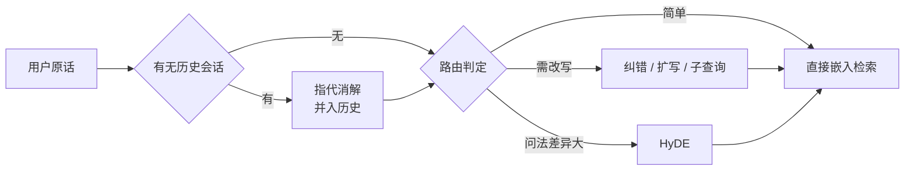

# 查询改写与 HyDE

> 状态：✅ 已补齐（2026-09-12）  
> 一句话定义：用户原话往往不适合直接检索；通过改写、扩写、多查询或 HyDE（先假想答案再嵌入）提升召回。

## 大纲

1. [为什么原话不能直接检索](#一为什么原话不能直接检索)
2. [改写四型与路由](#二改写四型与路由)
3. [HyDE：假想答案再嵌入](#三hyde假想答案再嵌入)
4. [多查询与融合](#四多查询与融合)
5. [端到端落地示例：四周迭代](#五端到端落地示例四周迭代)

## 已有相关文档（先读这些）

- [Chunking 策略 · 本系列](./01-Chunking策略.md)
- [Embedding 选型 · 本系列](./02-Embedding选型.md)
- [RAG](../../AI知识库/09-RAG与上下文/01-RAG检索增强生成.md)
- [Memory-Recall](../../Agent开发知识/04-记忆系统/02-Memory-Recall.md)
- [RAG 核心概念](../../Agent开发知识/07-RAG与知识集成/02-RAG%20核心概念与原理：Chunking、Embedding、相似度、HNSW%20与多路召回.md)

## 学习要点（读后应能回答）

- 短查询与长会话追问各用什么改写？→ 见 [2.3 路由表](#23-路由表什么查询做什么)
- HyDE 何时会引入更大噪声？→ 见 [3.3](#33-hyde的失效边界)

---

## 一、为什么原话不能直接检索

改写的前提是：**文档块的语言形态与用户提问的语言形态存在系统性错配**。嵌入模型把两者映射到同一空间，但「问法」与「写法」的向量天然不靠近。小北日志里的三类典型错配：

| 病型 | 真实查询（脱敏） | 为什么召回不到 | 对症 |
|------|------------------|----------------|------|
| 多轮指代 | 用户先问「报销标准是什么」，下一轮问「那北京呢？」 | 「北京」单独立不成句，嵌入无语义锚点 | 指代消解 |
| 短查询口语 | 「电脑坏了怎么办」 | 与《IT 设备报修制度》的书面表述向量距离远 | 扩写 |
| 术语错配 | 「把钱要回来」 | 文档里叫「退款」，同义不同词 | 术语归一 / 扩写 |

三类病占小北检索 bad case 的 41%——**切分与选型做完（hit@5 = 86.2%）之后的剩余误差，大头在查询侧**，这正是本章的地盘。

### 1.1 改写的位置

改写发生在检索之前、理解之后：



## 二、改写四型与路由

### 2.1 四种改写类型

| 类型 | 做什么 | 例子 |
|------|--------|------|
| 纠错 | 修错别字、谐音词 | 「报销Standard」→「报销标准」 |
| 指代消解 | 把代词 / 省略补全成独立完整问题 | 「那北京呢？」→「北京地区的差旅住宿报销标准是多少」 |
| 扩写 | 补齐口语省略、加上约束与同义词 | 「电脑坏了」→「公司电脑故障如何申请报修与备用机」 |
| 子查询拆分 | 复合问题拆成可独立检索的多个子问题 | 「年假没休完能折现吗，跨年呢？」→ 子问 1「未休年假折现政策」+ 子问 2「年假跨年清零规则」 |

**落地示例**：多轮指代消解（Node.js + TS，OpenAI 协议）：

```typescript
import OpenAI from "openai";

const client = new OpenAI();

interface Turn { role: "user" | "assistant"; content: string; }

// 只取最近 3 轮，压缩成本；温度 0 保证改写稳定
export async function resolveCoreference(
  history: Turn[], query: string,
): Promise<string> {
  const resp = await client.chat.completions.create({
    model: "gpt-4o-mini",
    temperature: 0,
    messages: [
      {
        role: "system",
        content:
          "把用户最新发言改写成一个不依赖上下文、可独立检索的完整问题。" +
          "保留原意，补全指代与省略，只输出改写后的问题。若本就完整，原样输出。",
      },
      ...history.slice(-6),
      { role: "user", content: query },
    ],
  });
  return resp.choices[0].message.content ?? query;
}
// 「那北京呢？」+ 前轮「报销标准是什么」
//   → 「北京地区的差旅住宿报销标准是多少」
```

### 2.2 子查询拆分

复合问题是召回黑洞：拆开后每个子问题独立检索、结果合并（合并算法见 [四](#四多查询与融合)）。

**落地示例**：结构化子查询输出（Node.js + TS）：

```typescript
export interface SubQuery { text: string; }

export async function decompose(query: string): Promise<SubQuery[]> {
  const resp = await client.chat.completions.create({
    model: "gpt-4o-mini",
    temperature: 0,
    response_format: { type: "json_object" }, // 强制 JSON，便于解析
    messages: [
      {
        role: "system",
        content:
          '把问题拆成 1~3 个可独立检索的子问题，输出 JSON：' +
          '{"sub_queries": [{"text": "..."}]}。简单问题不必拆。',
      },
      { role: "user", content: query },
    ],
  });
  const parsed = JSON.parse(resp.choices[0].message.content ?? "{}");
  return parsed.sub_queries?.length ? parsed.sub_queries : [{ text: query }];
}
```

### 2.3 路由表：什么查询做什么

改写全是 LLM 调用——每次 +300~800ms 延迟与成本。**不是每个查询都值得改写**，路由规则按查询特征分级：

| 查询特征 | 判定依据 | 动作 | 延迟预算 |
|----------|----------|------|----------|
| 会话内追问（有历史） | 存在多轮上下文 | 指代消解（必做，轻量模型） | +300ms |
| 含错别字 / 命中率历史低 | 规则 + 命中率低于阈值的查询缓存 | 纠错 + 扩写 | +500ms |
| 复合句（含「以及」「另外」，或 ≥ 2 个问号语义） | 轻量分类器 | 子查询拆分 + 多路检索 | +600ms |
| 独立、具体、名词性强 | 长度适中且含明确实体 | **直通，不改写** | +0ms |

路由的意义：小北线上 63% 的查询走直通，改写成本只花在 37% 的查询上。

## 三、HyDE：假想答案再嵌入

**HyDE** /ˈhaɪd/ （Hypothetical Document Embeddings，假设性文档嵌入）的思路反直觉：检索前先让 LLM **凭空写一个假答案**，用假答案的向量去检索——因为「假答案」与库里「真答案」同为文档形态，向量距离远比「问题 ↔ 答案」近。

### 3.1 原理与流程


关键认知：**假答案的内容对不对不重要，形态像才重要**。它只是把「问句」翻译成「文档腔」的桥梁，检索命中的仍是库里的真文档。

### 3.2 落地示例

```typescript
export async function hydeSearch(
  query: string, search: (q: string) => Promise<{ chunkId: string }[]>,
): Promise<{ chunkId: string }[]> {
  const resp = await client.chat.completions.create({
    model: "gpt-4o-mini",
    temperature: 0.7, // 略高温度换形态多样性，内容不需正确
    messages: [
      {
        role: "system",
        content:
          "写一段 100 字以内的文档片段，直接回答下面的问题。" +
          "写成公司制度/技术文档的口吻，不要任何开场白。",
      },
      { role: "user", content: query },
    ],
  });
  const hypothetical = resp.choices[0].message.content ?? query;
  return search(hypothetical); // 用假答案的向量检索真文档
}
```

小北实测：问法与写法差异最大的场景（口语化的制度咨询），HyDE 让 hit@5 从 83% 升到 89%；但对代码库查询是灾难（见 3.3）。

### 3.3 HyDE 的失效边界

这是文首第二个学习问题。HyDE 在三种情况下**引入的噪声大于收益**：

1. **专名 / 符号精确匹配场景**：查 `calcRefund` 函数，假答案会生成一个名字对不上的伪函数——嵌入后反而把语义相近但符号不同的块拉进 top-k，符号查询靠关键词精确命中（见 [04 篇](./04-Rerank与混合检索.md) 混合检索），HyDE 属于帮倒忙；
2. **知识库不覆盖的问题**：假答案写得头头是道，库里根本没有对应文档，召回的全是「语义擦边」的块，且假答案的自信口吻还会污染生成端，诱导模型编造；
3. **事实密集型短问题**：「年假几天」这类 5 个字就能问清的事，假答案 100 字里 95 字是编造细节，嵌入向量被这些细节带偏。

判定口诀：**HyDE 救「问法不像写法」，毁「答案靠精确词」**。上 HyDE 前先看 bad case 归因：错配型占比高才值得开。

## 四、多查询与融合

子查询 / 扩写 / HyDE 各产出一路查询，各检索一次，得到多份排序列表——**融合**把它们合成一份。小北用最简单的 RRF（Reciprocal Rank Fusion 的默认特例，详见 [04 篇](./04-Rerank与混合检索.md)）：

**落地示例**：多路结果融合去重（Node.js + TS）：

```typescript
export function mergeMultiQuery(
  lists: { chunkId: string }[][], maxResults = 10,
): { chunkId: string }[] {
  const score = new Map<string, number>();
  for (const list of lists) {
    for (let i = 0; i < list.length; i++) {
      const id = list[i].chunkId;
      score.set(id, (score.get(id) ?? 0) + 1 / (60 + i)); // 简易 RRF：k=60
    }
  }
  return [...score.entries()]
    .sort((a, b) => b[1] - a[1])
    .slice(0, maxResults)
    .map(([chunkId]) => ({ chunkId }));
}
```

融合的隐含收益：**同一块被多路同时命中会累积分数**——「扩写查询」和「HyDE 查询」都指向它时，它几乎必然是正确答案。小北数据：双路同时命中的块，最终被引用率 91%，单路命中仅 62%。

## 五、端到端落地示例：四周迭代

把「小北」的查询侧改造排进四周（衔接 [02 篇](./02-Embedding选型.md) 之后的 86.2% 基线）：

| 周 | 动作 | 产出 | 指标 |
|----|------|------|------|
| W1 | 500 条查询日志按错配类型归因；搭路由规则骨架（直通 63%） | 归因报告 + 路由 v1 | 基线 hit@5 = 86.2% |
| W2 | 指代消解上线（多轮会话全量）；纠错扩写接纠错白名单 | 改写服务 | 会话类查询 hit@5 +4.1pp |
| W3 | 子查询拆分 + 多路融合上线；HyDE 仅对口语化制度查询开启 | 多路检索管道 | hit@5 = 90.6% |
| W4 | 全链路延迟优化（改写并行化、轻量模型下沉）；灰度全量 | 查询侧 v2 | p95 延迟 1.9s，hit@5 = 90.6% |

工具速查：

| 环节 | 工具 | 备注 |
|------|------|------|
| 改写模型 | 轻量 LLM（gpt-4o-mini / 国产小杯） | 温度 0，输出结构化 |
| 查询分析 | LlamaIndex QueryTransform、LangChain MultiQueryRetriever | 开箱即用的改写器 |
| 评测 | 复用 01 篇标注集 + 查询侧分层指标 | 会话查询单独分组评测 |
| 多路融合 | 自写 RRF（本文代码）或 LangChain EnsembleRetriever | 40 行以内，不建议引框架 |

## 自检清单

- [ ] 有查询错配归因数据，改写策略由数据驱动而非全量开启；
- [ ] 路由先行：直通查询不走改写，延迟与成本可控；
- [ ] 多轮会话必做指代消解，改写模型与温度固定可复现；
- [ ] HyDE 只用于问法-写法错配场景，符号/专名查询已明确禁用；
- [ ] 多路结果有统一融合与去重，多路命中加权可观测。

## 本文缩写

| 缩写 | 音标 | 全拼 | 中文 |
|------|------|------|------|
| **HyDE** | /ˈhaɪd/ | Hypothetical Document Embeddings | 假设性文档嵌入 |
| **RRF** | /ˌɑːr ɑːr ˈef/ | Reciprocal Rank Fusion | 倒数排名融合 |

## 参考资料

- [Precise Zero-Shot Dense Retrieval without Relevance Labels (HyDE)](https://arxiv.org/abs/2212.10496)（Gao 等，2022）
- [Query Transformations · LlamaIndex 文档](https://docs.llamaindex.ai/en/stable/optimizing/production_rag/)
- [RAG-Fusion](https://arxiv.org/abs/2402.03367)（Raudaschl，2024，多查询融合）
- [Memory-Recall · 本仓库](../../Agent开发知识/04-记忆系统/02-Memory-Recall.md)
