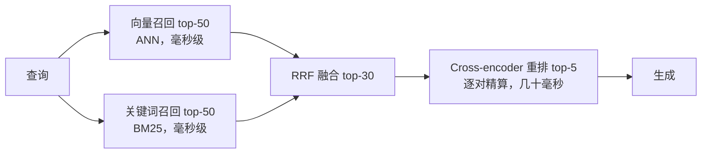
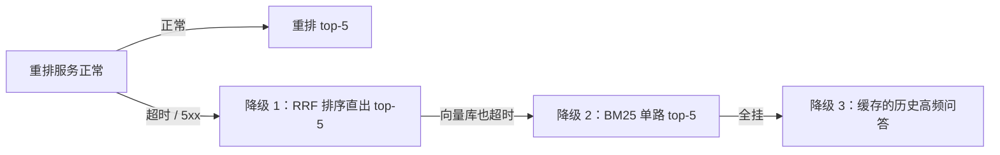

# Rerank 与混合检索

> 状态：✅ 已补齐（2026-09-12）  
> 一句话定义：用稀疏检索（如 BM25）+ 向量召回，再用 **重排模型** 精排，平衡关键词命中与语义相似。

## 大纲

1. [召回 vs 精排：漏斗分工](#一召回-vs-精排漏斗分工)
2. [单路检索的死穴](#二单路检索的死穴)
3. [混合检索与 RRF 融合](#三混合检索与-rrf-融合)
4. [Cross-encoder 重排](#四cross-encoder-重排)
5. [延迟预算与降级](#五延迟预算与降级)
6. [端到端落地示例：四周迭代](#六端到端落地示例四周迭代)

## 已有相关文档（先读这些）

- [Chunking 策略 · 本系列](./01-Chunking策略.md)
- [Embedding 选型 · 本系列](./02-Embedding选型.md)
- [查询改写与 HyDE · 本系列](./03-查询改写与HyDE.md)
- [RAG 工程化与 GraphRAG](../../Agent开发知识/13-进阶与工程化/07-RAG工程化与GraphRAG.md)
- [向量数据库](../../AI知识库/09-RAG与上下文/03-向量数据库.md)

## 学习要点（读后应能回答）

- 只有向量、只有关键词各会死在哪类问题上？→ 见 [二](#二单路检索的死穴)
- 重排失败怎么降级？→ 见 [五](#五延迟预算与降级)

---

## 一、召回 vs 精排：漏斗分工

**Rerank** /ˌriːˈræŋk/ （Rerank，重排）与混合检索解决的是同一个矛盾：**召回要快而广，排序要准而深**。工程上把检索做成漏斗，逐层收窄：



| 层 | 模型形态 | 单条成本 | 深度 | 职责 |
|----|----------|----------|------|------|
| 召回 | **Bi-encoder** /ˌbaɪ ˈenkoʊdər/ （双塔编码器，查询与文档独立编码） | 预计算，查询时只算 1 次向量 | 50~1000 | 别漏 |
| 精排 | **Cross-encoder** /krɒs ˈenkoʊdər/ （交叉编码器，查询与文档拼接后联合编码） | 每对都要跑一次模型 | 5~10 | 排准 |

分工的逻辑：Bi-encoder 把文档预先编码成向量，查询时算一次相似度即可，快但「各自编码看不见彼此」；Cross-encoder 把查询与文档拼在一起过模型，token 级交互看得见彼此，准但每对都要跑一次——**用不准的模型捞全量，用准的模型排候选**。

## 二、单路检索的死穴

这是文首第一个学习问题。两条路线各有结构性盲区，bad case 归因时对号入座：

| 检索路 | 死穴场景 | 小北真实案例 | 症状 |
|--------|----------|--------------|------|
| 只有向量 | 专名 / 符号 / 编号精确匹配 | 查「HR-2024-017 号文」，语义近的制度文排前面，目标文件反而在 top-20 外 | 找得到「很像的」，找不到「就这个」 |
| 只有向量 | 生僻缩写与黑话 | 「BS7799 是啥」——语料里从未出现，嵌入漂到「信息安全」泛化区 | 语义泛化，锚定失败 |
| 只有关键词 | 同义改写 | 「把钱要回来」查不到「退款流程」——零词重叠 | 词不对即全错 |
| 只有关键词 | 跨语言 | 中文查询查英文文档，词表完全不相交 | 混合语料库直接失明 |

结论一句话：**向量管「意思一样」，关键词管「就是这个」**，混合检索不是锦上添花，是互为保底。

## 三、混合检索与 RRF 融合

### 3.1 BM25：关键词路怎么算

**BM25** /ˌbiː em ˈtwenti faɪv/ （Best Matching 25，第 25 版最佳匹配算法）是稀疏检索的事实标准：词频 × 逆文档频率 × 长度归一。绝大多数向量数据库（Elasticsearch、Milvus、Qdrant）与全文引擎都内置，无需自研。

小北配置要点：

- 分词：中文用 jieba 类分词器，代码库保留符号原样（`calcRefund` 不许被切碎）；
- 制度文档按标题路径加权（标题命中的块得分 × 1.5）；
- 每路召回 top-50，深度不足比延迟超标更伤——漏斗第一层就漏了，后面全白搭。

### 3.2 RRF：两路分数怎么合

向量分数（余弦，0~1）与 BM25 分数（无界，量纲不同）**不可直接相加**。 **RRF** /ˌɑːr ɑːr ˈef/ （Reciprocal Rank Fusion，倒数排名融合）只用排名不算分数，天然规避量纲问题：

$$\text{RRF}(d) = \sum_{r \in R} \frac{1}{k + \text{rank}_r(d)}, \quad k = 60$$

其中 $R$ 是各路检索列表，$\text{rank}_r(d)$ 是文档 $d$ 在第 $r$ 路中的排名（从 1 起），$k$ 是平滑常数：排名越靠前贡献越大，排名靠后衰减越缓。

**落地示例**：RRF 融合（Node.js + TS）：

```typescript
interface Hit { chunkId: string; score: number }

// k=60 是论文默认值：第 1 名贡献 1/61，第 60 名贡献 1/120，衰减平缓
export function rrfMerge(
  lists: Hit[][], k = 60, maxResults = 30,
): { chunkId: string; rrfScore: number; hits: number }[] {
  const acc = new Map<string, { rrfScore: number; hits: number }>();
  for (const list of lists) {
    list.forEach((hit, i) => {
      const prev = acc.get(hit.chunkId) ?? { rrfScore: 0, hits: 0 };
      acc.set(hit.chunkId, {
        rrfScore: prev.rrfScore + 1 / (k + i + 1),
        hits: prev.hits + 1, // 记录被几路同时命中
      });
    });
  }
  return [...acc.entries()]
    .sort((a, b) => b[1].rrfScore - a[1].rrfScore)
    .slice(0, maxResults)
    .map(([chunkId, s]) => ({ chunkId, ...s }));
}
```

## 四、Cross-encoder 重排

### 4.1 为什么重排能涨点

Cross-encoder 把 `[CLS] 查询 [SEP] 文档 [SEP]` 拼接后整体过模型，注意力可以逐 token 对齐查询与文档——「报销标准」能精确对齐到块里的「限额」，而 Bi-encoder 只能各编各的向量。代价是每对都要跑一次前向，**只能用在几十条的候选上**。

小北实测（融合 top-30 → 重排 top-5，bge-reranker 类模型自托管单卡）：

| 配置 | hit@5 | 重排耗时 |
|------|-------|----------|
| 仅向量召回 | 81% | — |
| 向量 + BM25（RRF） | 86.2% | +0ms |
| RRF + Cross-encoder 重排 | **92.4%** | +85ms |

**重排是漏斗里性价比最高的一层**：85ms 换 6.2pp，比换 embedding 便宜得多。

### 4.2 落地示例：重排调用与超时降级

```typescript
interface RerankHit { chunkId: string; relevanceScore: number }

// 调用 rerank 服务（Jina / Cohere / bge-reranker 推理服务均为该协议形态）
export async function rerank(
  query: string, candidates: Hit[], topN = 5, timeoutMs = 150,
): Promise<RerankHit[]> {
  const ctrl = new AbortController();
  const timer = setTimeout(() => ctrl.abort(), timeoutMs); // 硬超时
  try {
    const resp = await fetch("https://rerank.internal/v1/rerank", {
      method: "POST",
      signal: ctrl.signal,
      headers: { "Content-Type": "application/json" },
      body: JSON.stringify({
        model: "bge-reranker-v2-m3",
        query,
        documents: candidates.map((c) => c.chunkId), // 实际传块文本
        top_n: topN,
      }),
    });
    if (!resp.ok) throw new Error(`rerank ${resp.status}`);
    return (await resp.json()).results as RerankHit[];
  } finally {
    clearTimeout(timer);
  }
}
```

## 五、延迟预算与降级

### 5.1 全链路预算表

小北的目标：检索段 p95 < 500ms。每层都有预算与超时，**任何一层超时都降级而不是报错**：

| 层 | p95 预算 | 超时动作 |
|----|----------|----------|
| 查询改写（[03 篇](./03-查询改写与HyDE.md)） | 300ms（仅 37% 查询触发） | 放弃改写，用原话检索 |
| 向量 + BM25 双路召回 | 80ms | 单路返回 |
| RRF 融合 | 5ms（纯内存计算） | 不可能超时 |
| Cross-encoder 重排 | 150ms | 用 RRF 排序直出 |
| 生成前组装 | 20ms | — |

### 5.2 降级链

这是文首第二个学习问题的答案。重排失败不是异常，是**设计内路径**，降级链逐级兜底：



**落地示例**：带降级的检索编排（Node.js + TS）：

```typescript
type Source = "rerank" | "rrf" | "bm25";

export async function retrieveWithFallback(
  query: string,
): Promise<{ hits: { chunkId: string }[]; source: Source }> {
  const [vecHits, bm25Hits] = await Promise.allSettled([
    vectorSearch(query, 50),
    bm25Search(query, 50),
  ]);
  const lists = [
    vecHits.status === "fulfilled" ? vecHits.value : [],
    bm25Hits.status === "fulfilled" ? bm25Hits.value : [],
  ].filter((l) => l.length > 0);
  if (lists.length === 0) return { hits: faqCache(query, 5), source: "bm25" };

  const fused = rrfMerge(lists);
  try {
    // 重排失败走 RRF 顺序，指标埋点区分 source 以便归因
    return { hits: await rerank(query, fused), source: "rerank" };
  } catch {
    return { hits: fused.slice(0, 5), source: "rrf" };
  }
}
```

两个工程纪律：

- **降级必须可观测**：`source` 进日志与指标面板，rerank 降级率 > 5% 告警——否则降级悄悄吃掉 6 个点而没人知道；
- **评测按 source 分层**：回归报告里「重排成功」与「降级路径」的 hit@5 分开统计，混在一起会掩盖降级造成的指标虚跌。

## 六、端到端落地示例：四周迭代

把「小北」的精排改造排进四周（衔接 [03 篇](./03-查询改写与HyDE.md) 之后的 90.6% 基线）：

| 周 | 动作 | 产出 | 指标 |
|----|------|------|------|
| W1 | 向量库开启 BM25 通道；按 3.1 配置分词与字段加权 | 双路召回可用 | 召回层 hit@50 = 97% |
| W2 | RRF 融合上线；bad case 按「死穴表」复核混合收益 | 混合检索 v1 | hit@5 = 90.6% → 91.8% |
| W3 | bge-reranker 自托管部署（单卡）；重排接融合 top-30 | 精排服务 | hit@5 = 92.4%，重排 p95 = 85ms |
| W4 | 降级链演练（kill rerank 服务验证）；按 source 分层评测接 CI | 降级预案 + 监控面板 | 降级率 0.7%，全量灰度 |

工具速查（全部有开源实现）：

| 环节 | 工具 | 备注 |
|------|------|------|
| 混合检索 | Milvus 2.4+（内置 BM25）、Qdrant、Elasticsearch | 一套库双通道最省运维 |
| 重排模型 | bge-reranker-v2-m3、Jina / Cohere Rerank API | 中英混合选 multilingual 版 |
| 重排推理 | Text Embeddings Inference（TEI）、Infinity | 单卡可扛 100+ QPS |
| 分层评测 | 复用 01 篇脚本 + source 维度 | 指标面板按降级路径拆分 |

## 自检清单

- [ ] 向量与关键词双路并行，任一路故障不影响另一路返回；
- [ ] 两路分数不直接相加，用 RRF 按排名融合，k 值固定可复现；
- [ ] 重排候选 ≤ 30 条，重排延迟有硬超时；
- [ ] 降级链有明确顺序，降级事件与 source 打进日志和指标；
- [ ] 回归评测按检索路径分层统计，混合收益可归因。

## 本文缩写

| 缩写 | 音标 | 全拼 | 中文 |
|------|------|------|------|
| **BM25** | /ˌbiː em ˈtwenti faɪv/ | Best Matching 25 | 第 25 版最佳匹配算法 |
| **RRF** | /ˌɑːr ɑːr ˈef/ | Reciprocal Rank Fusion | 倒数排名融合 |

## 参考资料

- [BM25 算法与实现 · 维基百科](https://en.wikipedia.org/wiki/Okapi_BM25)
- [Reciprocal Rank Fusion outperforms Condorcet and individual Rank Learning Methods](https://dl.acm.org/doi/10.1145/1571941.1572114)（Cormack 等，2009，RRF 出处）
- [BGE-Reranker 系列](https://huggingface.co/BAAI)（BAAI，中英混合重排）
- [ColBERT: Efficient and Effective Passage Search](https://arxiv.org/abs/2004.12832)（Khattab 与 Zaharia，2020，延迟感知的精排替代方案）
- [RAG 工程化与 GraphRAG · 本仓库](../../Agent开发知识/13-进阶与工程化/07-RAG工程化与GraphRAG.md)
