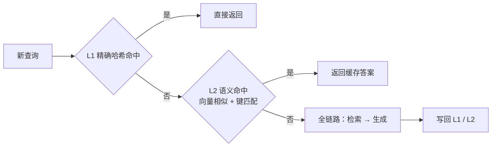

# 语义缓存

> 状态：✅ 已补齐（2026-09-12）  
> 一句话定义：对 **语义相近** 的新问题直接返回缓存答案或中间结果，降本降延迟；不同于 Prompt Caching（前缀 token 缓存）。

## 大纲

1. [三种缓存的区别](#一三种缓存的区别)
2. [相似度阈值与误缓存风险](#二相似度阈值与误缓存风险)
3. [缓存键与失效设计](#三缓存键与失效设计)
4. [可缓存的三个层级](#四可缓存的三个层级)
5. [端到端落地示例：四周迭代](#五端到端落地示例四周迭代)

## 已有相关文档（先读这些）

- [Rerank 与混合检索 · 本系列](./04-Rerank与混合检索.md)
- [可靠性与成本工程](../../Agent开发知识/13-进阶与工程化/05-可靠性与成本工程.md)（含 Prompt Caching）
- [向量数据库](../../AI知识库/09-RAG与上下文/03-向量数据库.md)

## 学习要点（读后应能回答）

- 为什么客服 FAQ 适合语义缓存，而「查我的订单」不适合？→ 见 [2.2](#22-误缓存的判定线)
- 阈值如何用评测集标定？→ 见 [2.3](#23-阈值怎么标定)

---

## 一、三种缓存的区别

「缓存」在 LLM 应用里有三层，键与收益完全不同，混为一谈是选型第一坑：

| 层 | 缓存键 | 命中条件 | 省什么 | 小北实测 |
|----|--------|----------|--------|----------|
| **HTTP** /ˌeɪtʃ tiː tiː ˈpiː/ （HyperText Transfer Protocol，超文本传输协议）缓存 | URL / 请求哈希 | 字节级完全一致 | 网络与网关 | 命中率 2%，忽略不计 |
| **Prompt Caching** /prɒmpt ˈkæʃɪŋ/ （提示缓存，前缀 token 缓存） | 请求前缀的 token 序列 | 前缀逐 token 相同 | 只省预填充计算，仍要跑生成 | 长 system prompt 场景省 50% 输入费用 |
| **语义缓存** /ˈsiːmæntɪk ˈkæʃɪŋ/ （Semantic Caching） | 查询的嵌入向量 | 语义相似超阈值 | **整次调用**：检索 + 生成全跳过 | 命中率 23%，p50 延迟 2.4s → 0.9s |

语义缓存的核心洞察：**LLM /ˌel el ˈem/ （Large Language Model，大语言模型）调用的答案不随请求字节变化，而随「意图」变化**——「年假有几天」「年假能休多少天」字节不同、意图相同，理应共享答案。它把「判断两个查询是否同义」变成一个相似度检索问题，复用 [02 篇](./02-Embedding选型.md) 的嵌入模型即可。



## 二、相似度阈值与误缓存风险

### 2.1 为什么阈值是生命线

阈值太松 → 把「意思不同」的查询错配（**误缓存** /false hit/），用户拿到驴唇不对马嘴的答案且毫无察觉；阈值太紧 → 命中率归零，白养一个缓存层。语义缓存的全部工程难度集中在这一条线上。

小北的真实误缓存案例（阈值 0.88 时发生）：

| 已缓存查询 | 新查询 | 相似度 | 为什么错 |
|-----------|--------|--------|----------|
| 「试用期多久」 | 「试用期裁员有赔偿吗」 | 0.89 | 同主题不同问题，答案一个是 6 个月一个是 N+1 |
| 「报销周期多长」 | 「报销被驳回了怎么办」 | 0.88 | 词面高度重叠，意图完全不同 |

### 2.2 误缓存的判定线

这是文首第一个学习问题。语义缓存有一条铁律判据：

> **答案是否随提问者的身份、时间、上下文而变？变则不可缓存。**

- **适合**：客服 FAQ /ˌef eɪ ˈkjuː/ （Frequently Asked Questions，常见问答）类——「年假几天」「wifi 密码多少」，答案对所有员工相同，且 60% 的线上查询高度重复；
- **不适合**：个性化数据查询——「查我的订单」的答案绑定用户 ID，语义缓存一命中就是**数据串号事故**，比慢不可接受得多；
- **灰区**：带上下文的追问「那北京呢？」——离开会话历史语义不完整，缓存前必须先做指代消解（[03 篇](./03-查询改写与HyDE.md)），且只缓存消解后的完整问题。

工程上不是二选一：**先按「答案是否个性化」把查询路由分流，FAQ 类才进语义缓存，个性化查询永远直通**。路由复用 [03 篇](./03-查询改写与HyDE.md) 的查询分类器，零额外成本。

### 2.3 阈值怎么标定

这是文首第二个学习问题。阈值不拍脑袋，用**正负对评测集**找误缓存率与命中率的平衡点：

- **正对**：同义改写对（「年假几天」↔「年假有多少天」），期望命中；
- **负对**：同主题不同意图对（「试用期多久」↔「试用期裁员有赔偿吗」），期望不命中；
- 标定方法：扫描阈值，取「误缓存率为 0 的最高命中率」或 F1 最大点。

**落地示例**：阈值标定脚本（Node.js + TS）：

```typescript
interface Pair { a: string; b: string; same: boolean }

export async function calibrateThreshold(
  pairs: Pair[], embed: (t: string) => Promise<number[]>,
): { best: number; table: { t: number; hit: number; falseHit: number }[] } {
  const sims: { sim: number; same: boolean }[] = [];
  for (const p of pairs) {
    const [va, vb] = await Promise.all([embed(p.a), embed(p.b)]);
    sims.push({ sim: dot(l2Normalize(va), l2Normalize(vb)), same: p.same });
  }
  const table: { t: number; hit: number; falseHit: number }[] = [];
  for (let t = 0.80; t <= 0.98; t += 0.01) {
    const hit = sims.filter((s) => s.same && s.sim >= t).length;
    const falseHit = sims.filter((s) => !s.same && s.sim >= t).length;
    table.push({ t: +t.toFixed(2), hit, falseHit });
  }
  // 策略：优先误缓存为 0，同档位取命中率最高
  const safe = table.filter((r) => r.falseHit === 0);
  const best = (safe.length ? safe : table)
    .reduce((m, r) => (r.hit > m.hit ? r : m));
  return { best: best.t, table };
}
```

小北用 200 对标注（120 正对 + 80 负对）标定结果：阈值 0.92 时负对全灭、正对保留 87%，误缓存率 0.28%——**0.92 就是该库的生命线**，且随知识库换 embedding 必须重新标定。

## 三、缓存键与失效设计

### 3.1 缓存键：向量不是全部

相似度只解决「像不像」，**命中还必须通过键匹配**。完整的缓存键 = 语义向量 + 结构化元数据，任一维度不匹配都判未命中：

| 键维度 | 为什么必须进键 | 小北配置 |
|--------|----------------|----------|
| 嵌入向量 | 语义相似判定 | 复用 [02 篇](./02-Embedding选型.md) 多语言模型 B |
| 租户 / 部门 | 不同租户知识库不同，跨租户命中即泄密 | `tenantId` 精确匹配 |
| 知识库版本 | 制度更新后旧答案失效 | `kbVersion` 号，见 3.2 |
| 提示词版本 | 换提示 = 换答案风格与口径，灰度需隔离 | `promptVersion` |
| 路由等级 | 个性化查询根本不进缓存层 | 进层前置条件 |

向量索引本身用向量库存（ **ANN** /ˌeɪ en ˈen/ （Approximate Nearest Neighbor，近似最近邻）检索），元数据用过滤字段——一条查询 = ANN top-1 + 元数据过滤 + 阈值判断，全链路 < 15ms。

### 3.2 失效：版本号是唯一可靠手段

**TTL** /ˌtiː tiː ˈel/ （Time To Live，存活时间）过期兜底可以，但知识库更新的失效必须靠**版本号 bump（递增）**：制度文档更新 → `kbVersion` 递增 → 旧版本全部键不再匹配，等效整层失效，无需逐条清理。

**落地示例**：带版本键的语义缓存（Node.js + TS）：

```typescript
interface CacheEntry { chunkId: string; answerId: string; sim: number }

export async function semanticCacheLookup(
  query: string, meta: { tenantId: string; kbVersion: number; promptVersion: string },
): Promise<CacheEntry | null> {
  const v = l2Normalize(await embed(query));
  // ANN 检索 + 元数据过滤 + 阈值，三合一
  const res = await cacheStore.search(v, {
    topK: 1,
    filter: {
      must: [
        { key: "tenantId", match: { value: meta.tenantId } },
        { key: "kbVersion", match: { value: meta.kbVersion } },
        { key: "promptVersion", match: { value: meta.promptVersion } },
      ],
    },
    threshold: 0.92, // 2.3 标定值，低于即未命中
  });
  return res[0]?.sim >= 0.92 ? res[0] : null;
}
// 写入时同样带齐 meta 三键，TTL 7 天兜底（版本号漏 bump 的保险丝）
```

## 四、可缓存的三个层级

语义缓存不只缓存「最终答案」。按风险从低到高分三层，**从低层起步是默认姿势**：

| 层 | 缓存对象 | 命中收益 | 风险 | 小北策略 |
|----|----------|----------|------|----------|
| L1 精确缓存 | 完全相同查询的答案 | 跳过全链路 | 几乎为零 | 全量开启（命中率 8%） |
| L2 检索结果缓存 | 块 ID 列表（不缓存生成文本） | 省检索段 80ms，**生成仍个性化** | 低：块列表不随用户变 | 全量开启（命中率 31%） |
| L3 语义答案缓存 | FAQ 类查询的最终答案 | 跳过全链路 2.4s | 误缓存 + 个性化泄露 | 仅 FAQ 路由开启（命中率 23%） |

L2 常被忽视却最划算：**「查退款流程」换个人再问，检索结果仍然一样，但答案要重新生成（无个性化风险）**。小北把 L2 作为全员默认层后，检索段 p95 从 480ms 降到 60ms，且零投诉。

**落地示例**：分层查询编排（Node.js + TS）：

```typescript
export async function cachedRetrieve(
  query: string, meta: CacheMeta, personalized: boolean,
): Promise<{ blocks: Block[]; answer?: string; source: "l1" | "l2" | "full" }> {
  const l1 = await exactLookup(hashKey(query, meta));           // L1 永远先试
  if (l1) return { blocks: l1.blocks, answer: l1.answer, source: "l1" };

  const l2 = await retrievalCacheLookup(query, meta);           // L2 无个性化风险
  if (l2) {
    const blocks = await loadBlocks(l2.chunkIds);               // 块仍可再校验版本
    return { blocks, source: "l2" };
  }

  const full = await fullPipeline(query, meta);                 // 全链路
  if (!personalized) {                                          // 个性化查询绝不写缓存
    await writeCache(query, meta, full.blocks, full.answer);
  }
  return { blocks: full.blocks, answer: full.answer, source: "full" };
}
```

## 五、端到端落地示例：四周迭代

把「小北」的缓存层排进四周（衔接 [04 篇](./04-Rerank与混合检索.md) 之后的状态：hit@5 = 92.4%，全链路 p50 = 2.4s，单次成本 ¥0.042）：

| 周 | 动作 | 产出 | 指标 |
|----|------|------|------|
| W1 | 5000 条查询去重分析：FAQ 重复度 60%；搭 L1 + L2 | 精确 / 检索结果缓存 | L2 命中 31%，检索段 p95 480→60ms |
| W2 | 200 对正负对标注 + 阈值标定；个性化路由分流 | 阈值 0.92 + 分流规则 | 负对误缓存 0 |
| W3 | L3 语义答案缓存仅对 FAQ 路由开启；版本键 + TTL 兜底 | 语义缓存上线 | 命中 23%，p50 2.4→0.9s |
| W4 | 误缓存监控（点踩反查缓存答案）；制度更新 bump 版本演练 | 监控面板 + 失效 runbook | 误缓存率 0.28%，月省 ¥2,100 |

工具速查（全部有开源实现）：

| 环节 | 工具 | 备注 |
|------|------|------|
| 语义缓存框架 | GPTCache | 参考其阈值与分层设计，生产建议自写（百行级） |
| 向量存储 | 复用主向量库（Qdrant / Milvus） | 单独 collection，键做过滤字段 |
| 精确缓存 | Redis | L1 哈希键 + TTL |
| 监控 | 命中率 / 误缓存率 / source 埋点 | 误缓存靠点踩反查归因 |

## 自检清单

- [ ] 区分 HTTP / Prompt / 语义三种缓存，语义缓存阈值经正负对标注集标定；
- [ ] 缓存键含租户、知识库版本、提示词版本，跨租户物理隔离；
- [ ] 个性化查询路由直通，绝不进语义缓存层；
- [ ] 知识更新走版本号 bump，TTL 仅作兜底；
- [ ] 命中率、误缓存率、降级路径进指标面板，误缓存有点踩反查机制。

## 本文缩写

| 缩写 | 音标 | 全拼 | 中文 |
|------|------|------|------|
| **ANN** | /ˌeɪ en ˈen/ | Approximate Nearest Neighbor | 近似最近邻 |
| **HTTP** | /ˌeɪtʃ tiː tiː ˈpiː/ | HyperText Transfer Protocol | 超文本传输协议 |
| **FAQ** | /ˌef eɪ ˈkjuː/ | Frequently Asked Questions | 常见问答 |
| **LLM** | /ˌel el ˈem/ | Large Language Model | 大语言模型 |
| **TTL** | /ˌtiː tiː ˈel/ | Time To Live | 存活时间 |

## 参考资料

- [GPTCache: Semantic Cache for LLM Applications](https://github.com/zilliztech/GPTCache)（Zilliz，开源语义缓存框架）
- [Prompt Caching · Anthropic 文档](https://docs.anthropic.com/en/docs/build-with-claude/prompt-caching)（前缀 token 缓存对照）
- [可靠性与成本工程 · 本仓库](../../Agent开发知识/13-进阶与工程化/05-可靠性与成本工程.md)
- [向量数据库 · 本仓库](../../AI知识库/09-RAG与上下文/03-向量数据库.md)
