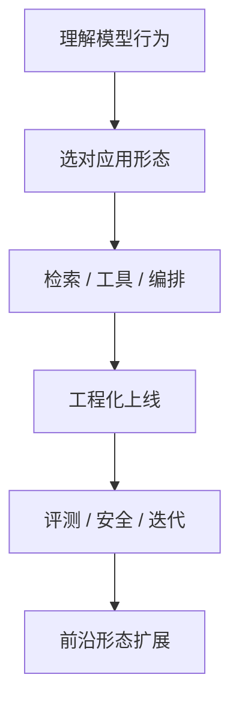

# AI 工程师学习路线

> 整理日期：2026-08-06  
> 定位：以 **AI 工程师（会用模型把系统做出来、上线、可观测、可迭代）** 为目标，对照本仓库已有文档，标出已覆盖与欠缺；欠缺部分已建 **占位文档** ，正文后续再补。  
> 配套清单：[学习清单-TODO.md](学习清单-TODO.md)

## 能力模型（学完应能做什么）

| 层级 | 目标 | 本仓库现状 |
|------|------|------------|
| L1 模型行为 | 懂 token、上下文、提示、采样、幻觉、位置偏见 | 基础有；若干「工程师必懂细节」仍缺专篇 |
| L2 应用形态 | 分清 Chatbot / RAG / Agent / WorkFlow / ChatFlow | 概念散落；缺统一决策与 Chatbot 专论 |
| L3 检索与知识 | Chunking、Embedding、改写、重排、缓存、引用 | RAG 深，但专论拆分不足 |
| L4 Agent 与编排 | 工具、记忆、规划、多 Agent、图编排 | **最强项** |
| L5 工程生产 | 选型、成本、延迟、网关、降级、版本、多租户 | 有提纲/进阶篇；缺若干专篇 |
| L6 安全评测 | 注入、护栏、红队、在线离线评测、产品指标 | 有基础+OWASP；产品化/红队/指标仍薄 |
| L7 前沿 | A2A、Computer Use、Voice、VLM、数据飞轮 | 有扫盲；缺可跟做深挖 |

---

## 学习顺序（建议）

1. **先走现有主干**（不必等占位补完）：[AI 知识库](../AI知识库/README.md) 06–09 → [Agent 开发](../Agent开发知识/README.md) 01–05 → [设计模式](../Agent设计模式/README.md) → [编程范式](../AI编程范式/README.md)
2. **再按本目录占位文补洞**：下方「缺口占位」按 01→07 学；每篇文首有「已有相关文档」可先读。
3. **最后对照清单勾选**：[学习清单-TODO.md](学习清单-TODO.md)

---

## 已有文档地图（强项，直接学）

### 理论主干 → [AI知识库](../AI知识库/README.md)
数学 / ML / DL / Transformer / LLM / 训练 / 提示 / RAG / 微调 / 推理部署 / Agent 入门 / 多模态 / 评估安全 / 前沿

### Agent 构建 → [Agent开发知识](../Agent开发知识/README.md)
组件、推理、工具与 MCP、记忆、规划（含 LangGraph）、多智能体、RAG、评估、安全、框架、工程实践、Skill、**13 工程化补遗**

### 架构范式 → [Agent设计模式](../Agent设计模式/README.md)
ReAct / Plan-Execute / Reflection / Multi-Agent / Tool Use / Memory / ToT / Self-Ask / Router

### 协作与应用范式 → [AI编程范式](../AI编程范式/README.md)
Vibe → Agentic → Pair → SDD → Context → Loop → OpenSpec → Superpowers → Harness → Graph；以及 RAG/Agent/MCP/微调/FC/Multi-Agent/API

### 产品编排入口 → [WorkFlow](../WorkFlow/README.md) · [ChatFlow](../ChatFlow/README.md)
概念 + 工具全景（工具深挖与案例仍缺，见占位）

### 实操笔记 → [AI实践](../AI实践/)
Ollama、MCP、向量/嵌入、Skills、Superpowers 等（非正式体系，可升格）

---

## 缺口占位（本目录 · 待你补正文）

### 01 LLM 核心行为
| 文档 | 一句话 | 典型「没覆盖清楚」的点 |
|------|--------|------------------------|
| [01-Lost-in-the-Middle与位置偏见](01-LLM核心行为/01-Lost-in-the-Middle与位置偏见.md) | 为何两头重要、中间次要 | 现有文仅一笔带过 |
| [02-消息角色与提示结构](01-LLM核心行为/02-消息角色与提示结构.md) | system/user/assistant/tool 如何分工 | 散落无专论 |
| [03-幻觉机理与缓解](01-LLM核心行为/03-幻觉机理与缓解.md) | 幻觉从哪来、工程上怎么压 | 多处提及，缺机理专篇 |
| [04-结构化输出](01-LLM核心行为/04-结构化输出.md) | JSON Schema / 约束解码 / 与 FC 边界 | 散落在 API 文 |
| [05-Few-shot示例排序与位置](01-LLM核心行为/05-Few-shot示例排序与位置.md) | 示例放哪、怎么排影响答案 | 几乎空白 |

### 02 应用形态
| 文档 | 一句话 |
|------|--------|
| [01-Chatbot概念与形态演进](02-应用形态/01-Chatbot概念与形态演进.md) | 传统 NLU Bot → LLM Chatbot → Assistant |
| [02-形态选型决策树](02-应用形态/02-形态选型决策树.md) | Chatbot / RAG / Agent / WorkFlow / ChatFlow 怎么选 |
| [03-会话状态管理](02-应用形态/03-会话状态管理.md) | Session、槽位、变量、多轮一致性 |
| [04-流式输出工程](02-应用形态/04-流式输出工程.md) | SSE/流式、首字延迟、打断、与工具调用并存 |

### 03 检索与知识
| 文档 | 一句话 |
|------|--------|
| [01-Chunking策略](03-检索与知识/01-Chunking策略.md) | 按什么切、切多大、重叠与结构感知 |
| [02-Embedding选型](03-检索与知识/02-Embedding选型.md) | 模型/维度/多语言/领域适配 |
| [03-查询改写与HyDE](03-检索与知识/03-查询改写与HyDE.md) | 改写、多查询、HyDE |
| [04-Rerank与混合检索](03-检索与知识/04-Rerank与混合检索.md) | 稀疏+稠密、重排模型 |
| [05-语义缓存](03-检索与知识/05-语义缓存.md) | 相似问题命中缓存（≠ Prompt Caching） |
| [06-引用与可溯源](03-检索与知识/06-引用与可溯源.md) | Citation、groundedness、拒答 |

### 04 Agent 与编排
| 文档 | 一句话 |
|------|--------|
| [01-人在环上HITL](04-Agent与编排/01-人在环上HITL.md) | 审批、澄清、可中断如何设计 |
| [02-工具设计原则](04-Agent与编排/02-工具设计原则.md) | 粒度、描述、幂等、错误返回 |
| [03-输出解析与修复](04-Agent与编排/03-输出解析与修复.md) | 解析失败、自动修复、重试预算 |

### 05 工程与生产
| 文档 | 一句话 |
|------|--------|
| [01-模型选型指南](05-工程与生产/01-模型选型指南.md) | 能力/价格/延迟/上下文/工具支持如何选 |
| [02-Token成本估算](05-工程与生产/02-Token成本估算.md) | 计费、估算、Prompt Caching 账本 |
| [03-延迟成本质量三角](05-工程与生产/03-延迟成本质量三角.md) | 三者如何取舍 |
| [04-LLM网关与路由](05-工程与生产/04-LLM网关与路由.md) | 统一入口、路由、fallback |
| [05-降级与Fallback](05-工程与生产/05-降级与Fallback.md) | 模型挂了/超时了怎么办 |
| [06-限流重试与幂等](05-工程与生产/06-限流重试与幂等.md) | 429、退避、幂等键 |
| [07-Prompt版本管理](05-工程与生产/07-Prompt版本管理.md) | 提示词也要版本、灰度、回滚 |
| [08-多租户与隔离](05-工程与生产/08-多租户与隔离.md) | 数据/工具/配额隔离 |

### 06 安全与评测
| 文档 | 一句话 |
|------|--------|
| [01-Prompt-Injection深挖](06-安全与评测/01-Prompt-Injection深挖.md) | 直接/间接注入、防御分层 |
| [02-护栏产品化](06-安全与评测/02-护栏产品化.md) | 输入输出过滤如何做成产品能力 |
| [03-红队测试](06-安全与评测/03-红队测试.md) | 怎么系统化找漏洞 |
| [04-在线与离线评测](06-安全与评测/04-在线与离线评测.md) | 上线门禁 vs 生产抽样 |
| [05-产品指标与AB](06-安全与评测/05-产品指标与AB.md) | 任务成功率、CSAT、实验设计 |
| [06-LLM 核心性能指标全景手册](06-安全与评测/06-LLM%20核心性能指标全景手册.md) | TTFT / TPOT / 吞吐 / SLA，生产看分位值 |

### 07 前沿与形态
| 文档 | 一句话 |
|------|--------|
| [01-A2A协议深挖](07-前沿与形态/01-A2A协议深挖.md) | Agent 互操作（相对 MCP） |
| [02-Computer-Use](07-前沿与形态/02-Computer-Use.md) | GUI/浏览器操作型 Agent |
| [03-Voice-Realtime](07-前沿与形态/03-Voice-Realtime.md) | 语音实时、打断、延迟预算 |
| [04-VLM与多模态应用](07-前沿与形态/04-VLM与多模态应用.md) | 视觉语言模型落地 |
| [05-数据飞轮与合成数据](07-前沿与形态/05-数据飞轮与合成数据.md) | 反馈→数据→再训练/评测 |
| [06-WorkFlow工具深挖索引](07-前沿与形态/06-WorkFlow工具深挖索引.md) | n8n/Dify 等成文计划 |
| [07-ChatFlow工具深挖索引](07-前沿与形态/07-ChatFlow工具深挖索引.md) | Dify/Coze 等成文计划 |

---

## 与旧「每日打卡」的关系

原 [知识盲点补齐-TODO.md](../知识盲点补齐-TODO.md) 的每日节奏已废弃；请改用本目录的 [学习清单-TODO.md](学习清单-TODO.md) 按链接逐篇学习/补齐。
