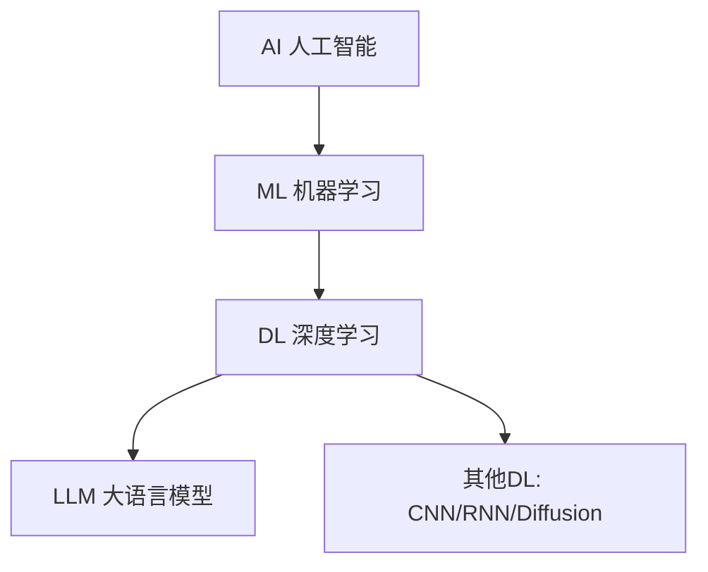

# AI / ML / DL 关系

> 一句话定义：AI ⊃ ML ⊃ DL ⊃ LLM，是层层嵌套的包含关系，越内层越"学习"而非"规则"。

## 1. 层级关系

## 2. 各层定义

### AI（Artificial Intelligence，人工智能）
- 最广义，让机器表现出智能的任何技术。
- 含符号主义（专家系统、规则引擎）与连接主义（神经网络）。
- 例：早期下棋程序、专家系统、现代 LLM 都算 AI。

### ML（Machine Learning，机器学习）
- AI 子集，**从数据中学习规律**而非人工编码规则。
- 范式：监督、无监督、强化学习。
- 算法：线性回归、SVM、决策树、随机森林、神经网络。

### DL（Deep Learning，深度学习）
- ML 子集，用**多层神经网络**学习层次化表示。
- "深度"指网络层数多。
- 架构：CNN（图像）、RNN/Transformer（序列）、Diffusion（生成）。

### LLM（Large Language Model，大语言模型）
- DL 子集，**超大规模 Transformer 语言模型**。
- 通过预训练 + 对齐获得通用语言能力。

## 3. 对比表

| 维度 | AI | ML | DL | LLM |
|------|----|----|----|----|
| 方法 | 规则+学习 | 统计学习 | 神经网络 | 大Transformer |
| 数据需求 | 低-中 | 中 | 大 | 极大 |
| 算力需求 | 低 | 中 | 高 | 极高 |
| 特征工程 | 人工 | 半人工 | 自动学习 | 自动 |
| 代表 | 专家系统 | SVM | ResNet | GPT |

## 4. 关键区别
- **传统 ML vs DL**：传统 ML 需人工设计特征；DL 自动学习表示。
- **DL vs LLM**：DL 是方法类；LLM 是 DL 在语言领域的规模化应用。
- **符号 vs 连接**：符号主义靠规则，连接主义靠学习，现代以连接主义为主。

## 5. 学习要点
- 别把 AI 等同于 LLM——LLM 只是 AI 的一个子集。
- 理解"特征工程"的演进：人工→自动，是 ML→DL 的核心跃迁。
- 不同任务用不同层：表格数据用传统 ML 仍有效，序列/图像用 DL。

## 6. 参考资料
- Goodfellow et al., "Deep Learning"（第一章）