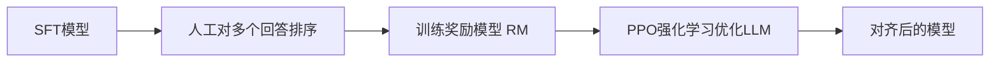

# RLHF 与对齐

> 一句话定义：用人类偏好训练奖励模型，再用强化学习优化 LLM 使其输出更符合人类喜好。

## 1. 定义
RLHF（Reinforcement Learning from Human Feedback，基于人类反馈的强化学习）通过三步让模型对齐人类偏好：
1. SFT 模型。
2. 训练奖励模型（Reward Model）。
3. 用 RL（PPO）优化模型最大化奖励。

是 ChatGPT 成功的关键技术。

## 2. 三阶段流程

### 阶段一：SFT
- 先有基础对话模型。

### 阶段二：训练奖励模型
- 让人对同一问题的多个回答排序。
- RM 学习给回答打分，分数与人类偏好一致。

### 阶段三：PPO 优化
- LLM 生成回答，RM 打分。
- 用 PPO 算法更新 LLM 最大化奖励。
- 加 KL 惩罚防止偏离 SFT 模型太远（避免"奖励黑客"）。

## 3. 解决的问题
- SFT 只学"怎么答"，难学"哪个更好"。
- 人类偏好难写成明确规则，但能比较（A 比 B 好）。
- RLHF 把"比较"转化为可优化信号。

## 4. 挑战
- **奖励黑客（Reward Hacking）**：模型钻 RM 漏洞得高分但实际差。
- **KL 约束**：防止模型为追奖励偏离过远。
- **成本高**：人工标注 + RL 训练复杂。
- **偏好不一致**：不同标注者标准不一。

## 5. 学习要点
- RLHF = RM + PPO，把人类偏好变成优化信号。
- 是 ChatGPT 对齐成功的关键。
- 奖励黑客是主要风险，需 KL 约束。

## 6. 参考资料
- "Training language models to follow instructions with human feedback"（InstructGPT）
- "Proximal Policy Optimization Algorithms"（PPO）