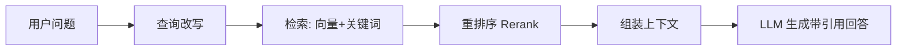

# RAG 检索增强生成

> 一句话定义：生成前先从外部知识库检索相关片段注入上下文，让模型基于"事实"作答，降幻觉、引最新/私有知识。

## 1. 为什么需要 RAG
- LLM 有幻觉、知识有截止日期、不知私有信息。
- RAG 把"记忆"外置到可更新检索库，用检索代替部分微调。

## 2. 工作流程

### 离线建库
1. 文档加载（PDF/HTML/代码）。
2. 切分（Chunking）：按语义切，保留元数据。
3. 嵌入（Embedding）：向量化每个 chunk。
4. 入库：向量数据库（Pinecone/Milvus/Qdrant/pgvector）。

### 在线查询
1. 查询改写/扩展。
2. 检索（向量 + BM25 混合）。
3. 重排序（cross-encoder 精排）。
4. 组装上下文送 LLM。
5. 生成带引用回答。

## 3. 关键设计
- **切分**：太大淹没重点，太小丢上下文；保留重叠。
- **混合检索**：向量 + 关键词通常优于单一。
- **重排序**：top-k 召回后精排，显著提升相关性。
- **引用校验**：核对引用真实存在，防伪造。

## 4. 进阶
- **Multi-hop RAG**：多跳检索综合多片段。
- **GraphRAG**：用知识图谱做关系检索。
- **Self-RAG**：模型自决定是否检索。

## 5. 学习要点
- 检索质量是 RAG 成败关键。
- 切分 + 混合检索 + 重排序是三大杠杆。
- RAG 与微调互补：RAG 供动态知识，微调定行为。

## 6. 参考资料
- Lewis et al., "Retrieval-Augmented Generation"（2020）
- "Lost in the Middle"