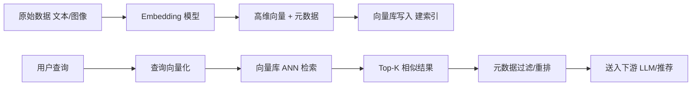

# 向量数据库（Vector Database）

> 一句话定义：专门存储、索引、检索高维向量的数据库，通过"相似度"而非"精确匹配"找数据，是 RAG、语义搜索、推荐、多模态检索的底层基础设施。

## 1. 为什么需要向量库

传统数据库（MySQL/PostgreSQL）擅长**精确匹配**：`WHERE id = 123`、`LIKE '%关键词%'`。
但现实世界大量查询是**语义相似**的：

- "如何提高模型准确率" ≈ "怎样提升模型精度"（关键词不同，语义相同）
- 一张猫的图片 ≈ "cat" 文本（跨模态语义对齐）
- 一段代码 ≈ 另一段功能相近的代码

LLM 时代，文本/图像/音频都被 Embedding 模型编码成**高维稠密向量**（如 768/1536/3072 维）。
向量库的职责就是：在海量向量（亿级）中，**毫秒级**找出与查询向量最相似的 Top-K。

### 与传统数据库对比

| 维度 | 关系型数据库 | 向量数据库 |
|------|------------|-----------|
| 存储单位 | 行/字段 | 向量 + 元数据 |
| 查询方式 | 精确匹配/范围 | 近邻相似度 |
| 索引结构 | B-Tree/Hash | HNSW/IVF/PQ |
| 返回结果 | 命中即返回 | Top-K 近似 |
| 相似度量 | = / > / < | 余弦/内积/L2 |
| 典型场景 | 交易/账务 | 语义搜索/推荐/RAG |

## 2. 核心概念

### 2.1 向量（Embedding）
由 Embedding 模型将文本/图像编码成的浮点数组：
```
"今天天气真好" → [0.12, -0.34, 0.56, ..., 0.78]  # 1536 维
```
语义相近的内容，向量在空间中距离也近。

### 2.2 相似度度量
- **余弦相似度（Cosine）**：最常用，衡量方向夹角，对向量长度不敏感。
- **内积（Inner Product / Dot Product）**：归一化后等价于余弦；用于最大内积搜索（MIPS）。
- **欧氏距离（L2）**：衡量绝对距离，对幅度敏感。

> 选型经验：文本 Embedding 多用 Cosine；归一化向量可用 IP；图像特征有时用 L2。

### 2.3 近似最近邻（ANN）
精确 KNN 在百万级以上数据不可行（O(n) 线性扫描）。ANN 用**空间换时间**，允许极小精度损失换取百倍速度：
- 牺牲少量召回率
- 换取亚秒级响应
- 是向量库"快"的根本原因

### 2.4 元数据（Metadata / Payload）
向量本身不够，还需附带来源、ID、时间、权限等结构化字段，用于**过滤检索**：
```
检索条件：top_k=10, filter={"source":"wiki", "year":">=2024"}
```

### 2.5 向量库与 Embedding 模型的绑定关系（重要）

这是向量库最容易被忽视、却最关键的一条规则：

> **向量库里的向量由某个 Embedding 模型生成，就只能在同一个 Embedding 模型的向量空间里被检索。**

原因在于，不同 Embedding 模型把文本映射到**不同的向量空间**：
- 维度不同：OpenAI `text-embedding-3-small` 是 1536 维，`text-embedding-3-large` 是 3072 维，BGE 是 1024 维。
- 空间语义不同：即使维度凑巧相同，"猫"在 A 模型里可能是 `[0.1, -0.2, ...]`，在 B 模型里却是 `[0.9, 0.1, ...]`，坐标含义完全不同。

因此：
- **写入和查询必须用同一个 Embedding 模型**，否则查询向量落进错误空间，检索结果全是噪声。
- **换模型 = 重建整个向量库**：升级 Embedding 模型后，旧向量全部失效，必须用新模型把全量数据重新向量化入库（re-embed）。
- **一个向量库实例通常绑定一个 Embedding 模型**；若要同时支持多个模型，需为每个模型建独立 collection，或在库中标注 `model` 字段隔离。

```mermaid
flowchart LR
    A[文档] -->|Embedding 模型 X| B[(向量库 collection_X)]
    A -->|Embedding 模型 Y| C[(向量库 collection_Y)]
    Q[查询] -->|必须用模型 X| B
    Q -.错误.->|用模型 Y 查 collection_X| B
    Q -->|必须用模型 Y| C
```

> 注意区分：这里绑定的是 **Embedding 模型**，不是 LLM 本身。Embedding 模型负责把文本变成向量，LLM 负责读检索结果生成回答——两者可以是不同模型。常见组合如：用 OpenAI `text-embedding-3` 建库，检索结果喂给 GPT-4 / Claude / 本地 Llama 生成回答，完全可行。绑定的只是"建库向量"与"查询向量"必须同源。

### 2.6 Embedding 模型的标准与开放协议

既然向量库绑定 Embedding 模型，那 Embedding 模型本身有没有统一标准、能否跨厂商互通？答案是：**有事实标准，也有开放协议，但尚未完全统一**。

#### 2.6.1 评测标准（衡量"好不好"）

Embedding 模型没有强制规范，但业界有公认的**评测基准**来横向比较：

| 基准 | 说明 |
|------|------|
| **MTEB**（Massive Text Embedding Benchmark） | HuggingFace 主导，覆盖检索/分类/聚类/STS 等 50+ 任务，是目前最权威的综合榜单 |
| **BEIR** | 零样本检索评测集，专注 RAG/搜索场景的召回质量 |
| **C-MTEB** | MTEB 的中文版，评估中文 Embedding（BGE/m3e/GTE 等） |
| **LongEmbed / Jina Long-Context** | 评估长文本嵌入能力 |
| **MMTEB** | 多语言/多模态扩展版 |

> 选型时优先看 MTEB/C-MTEB 榜单，再结合自身语种、领域、上下文长度验证。

#### 2.6.2 开放协议与接口标准（衡量"怎么调"）

Embedding 模型的**调用接口**正在走向开放统一，主要有三条线：

**1. OpenAI 兼容 API（事实标准）**
OpenAI 的 `/v1/embeddings` 接口格式被广泛模仿，已成为事实标准：
```http
POST /v1/embeddings
{
  "model": "text-embedding-3-small",
  "input": "要向量化的文本"
}
```
大量厂商（Azure、智谱、通义、本地 vLLM/Ollama/LM Studio）都提供 OpenAI 兼容端点，客户端只需改 `base_url` 即可切换模型，**但向量空间不互通**（见 2.5 节）。

**2. Ollama / vLLM 本地推理协议**
- **Ollama**：`ollama pull nomic-embed-text` + REST API，本地一键起 Embedding 服务。
- **vLLM**：支持 OpenAI 兼容的 Embedding 端点，可托管开源 Embedding 模型。

**3. HuggingFace Sentence-Transformers / Transformers**
开源 Embedding 模型的事实接口标准：
```python
from sentence_transformers import SentenceTransformer
model = SentenceTransformer("BAAI/bge-large-zh-v1.5")
vec = model.encode("文本")  # 返回 numpy 向量
```
几乎所有开源 Embedding（BGE/GTE/m3e/E5/jina-embed）都遵循此接口，可本地加载、私有部署。

#### 2.6.3 模型格式标准

| 标准 | 说明 |
|------|------|
| **ONNX** | 跨框架推理格式，Embedding 模型可导出 ONNX 在各运行时部署 |
| **GGUF** | llama.cpp/Ollama 使用的量化格式，支持 Embedding 模型量化本地跑 |
| **Safetensors** | HuggingFace 默认权重格式，安全且加载快 |
| **OpenAI 兼容 schema** | 输入 `input` 字段、输出 `embedding` 数组的事实结构 |

#### 2.6.4 关键澄清

- **接口可互通 ≠ 向量可互通**：OpenAI 兼容 API 让你用同一套代码调不同模型，但 A 模型生成的向量库**绝不能**用 B 模型查询——这是 2.5 节强调的硬约束。
- **没有"通用向量空间"标准**：目前不存在让不同 Embedding 模型向量互通的协议，每个模型各自独立空间。
- **评测标准 ≠ 接口标准**：MTEB 评的是质量，OpenAI 兼容 API 定的是调用方式，两者正交。
- **选型三看**：一看 MTEB/C-MTEB 榜单质量，二看接口是否 OpenAI 兼容/Sentence-Transformers，三看部署形态（云 API / 本地 / 私有）。

## 3. 主流索引算法

向量库的"心脏"是索引结构，决定速度与召回的平衡。

### 3.1 HNSW（Hierarchical Navigable Small World）
- **原理**：多层跳表式图结构，上层稀疏快速导航，下层稠密精确定位。
- **优点**：召回高、查询快、支持动态插入。
- **缺点**：内存占用大（要存图）。
- **适用**：百万~千万级，对召回要求高，是当前最主流的索引（Milvus/Qdrant/pgvector 默认）。

### 3.2 IVF（Inverted File）
- **原理**：用 K-means 把向量空间切成 N 个聚类（cell），查询时只扫描最近的 nprobe 个聚类。
- **优点**：内存友好、可结合 PQ 压缩。
- **缺点**：需训练聚类中心，召回受 nprobe 影响。
- **适用**：千万~亿级，配合 PQ 走"IVF-PQ"组合拳。

### 3.3 PQ（Product Quantization）
- **原理**：把高维向量切成多段，每段独立聚类编码，用短码代替浮点，大幅压缩内存。
- **优点**：内存可降 10~100 倍。
- **缺点**：有精度损失，常作为 IVF 的精排阶段。
- **适用**：超大规模、内存受限场景。

### 3.4 其他
- **Flat**：暴力扫描，召回 100%，仅适合小数据或做基准。
- **DiskANN / ScaNN / NGT**：面向磁盘存储或 GPU 加速的进阶方案。

## 4. 工作流程



### 写入侧（离线建库）
1. 文档加载与切分（Chunking）。
2. Embedding 模型向量化每个 chunk。
3. 连同元数据写入向量库，构建 ANN 索引。

### 查询侧（在线检索）
1. 查询文本同样过 Embedding 模型得查询向量。
2. 向量库做 ANN 检索 + 元数据过滤。
3. 返回 Top-K，可叠加 Rerank 精排。

## 5. 典型使用方式

### 5.1 Python（以 Qdrant 为例）
```python
from qdrant_client import QdrantClient
from qdrant_client.models import Distance, VectorParams, PointStruct

client = QdrantClient(host="localhost", port=6333)

# 1. 建集合
client.recreate_collection(
    collection_name="docs",
    vectors_config=VectorParams(size=1536, distance=Distance.COSINE),
)

# 2. 写入
client.upsert(
    collection_name="docs",
    points=[
        PointStruct(id=1, vector=[0.1, ...], payload={"source": "wiki", "text": "..."}),
        PointStruct(id=2, vector=[0.2, ...], payload={"source": "blog", "text": "..."}),
    ],
)

# 3. 检索（带元数据过滤）
results = client.search(
    collection_name="docs",
    query_vector=[0.15, ...],
    query_filter={"must": [{"key": "source", "match": {"value": "wiki"}}]},
    limit=5,
)
```

### 5.2 LangChain 集成
```python
from langchain_community.vectorstores import Qdrant
from langchain_openai import OpenAIEmbeddings

vs = Qdrant.from_documents(
    docs, OpenAIEmbeddings(),
    url="http://localhost:6333", collection_name="docs",
)
# 相似度检索
vs.similarity_search("如何训练大模型", k=4)
# 转为检索器供 RAG 链使用
vs.as_retriever(search_kwargs={"k": 4})
```

## 6. 主流向量库概览

| 向量库 | 类型 | 特点 | 适用场景 |
|--------|------|------|---------|
| **Milvus** | 开源分布式 | 国产、生态全、支持多种索引、亿级横向扩展 | 大规模生产、企业级 |
| **Qdrant** | 开源（Rust） | 轻量高性能、过滤强、API 友好 | 中小项目、RAG、推荐 |
| **Pinecone** | 云托管 SaaS | 全托管、零运维、按量计费 | 快速上线、不想自运维 |
| **Weaviate** | 开源 | 内置混合检索、模块化向量化 | 语义搜索、混合检索 |
| **Chroma** | 开源（Python） | 极简、本地优先、开发体验好 | 原型、本地 RAG |
| **pgvector** | PostgreSQL 插件 | 复用 PG 生态、SQL 查询、事务一致 | 已有 PG、中小规模 |
| **FAISS** | Meta 开源库 | 纯索引库、性能极致、无服务化 | 离线批量、研究、自建底层 |
| **LanceDB** | 开源（Rust） | 嵌入式、列存、多模态友好 | 边缘、本地分析 |
| **Elasticsearch** | 搜索引擎 | 8.x 起原生支持 kNN、混合检索成熟 | 已有 ES 栈、全文+向量 |
| **Redis** | 内存库 | RediSearch 支持向量、低延迟 | 缓存型检索、实时 |

### 选型建议
- **快速原型 / 本地 RAG**：Chroma、LanceDB。
- **中小生产、注重过滤与易用**：Qdrant。
- **大规模、需要分布式**：Milvus。
- **不想自运维、按量付费**：Pinecone。
- **已有 PostgreSQL**：pgvector，复用事务与 SQL。
- **已有 Elasticsearch**：直接用 ES 8.x 的 kNN。
- **离线研究/极致性能**：FAISS（需自建服务层）。

## 7. 关键设计要点

- **Embedding 一致性（最重要）**：写入与查询必须用**同一个 Embedding 模型**，否则向量空间不匹配、检索全噪声；详见 [2.5 节](#25-向量库与-embedding-模型的绑定关系重要)。换模型必须全量 re-embed 重建。
- **维度匹配**：集合的 `size` 必须等于 Embedding 输出维度，不同模型维度不同不可混用。
- **归一化**：用 Cosine 时建议预先 L2 归一化，可改用更快的内积检索。
- **元数据过滤前置**：先过滤再 ANN，比先 ANN 再过滤召回更稳（部分库支持 pre-filter）。
- **索引参数调优**：HNSW 的 `M`、`ef_construction`、`ef_search`；IVF 的 `nlist`、`nprobe`，需在召回/速度/内存间权衡。
- **更新与一致性**：向量库一般弱事务，重要业务需配合主库做双写或 CDC 同步。
- **多租户**：用 collection 隔离或 payload 字段过滤，按安全等级选择。
- **成本**：托管服务按维度×条数×副本计费，大向量×大数据成本敏感，必要时用 PQ 降维。

## 8. 与 RAG 的关系

向量库是 RAG 的"长期记忆外存"：
- 离线把知识库向量化入库；
- 在线把用户问题向量化检索 Top-K 片段；
- 片段拼进 Prompt 供 LLM 生成带引用回答。

但向量库 ≠ RAG：RAG 还涉及切分、查询改写、混合检索、重排序、引用校验等环节，向量库只承担其中"存储 + 检索"一环。详见 [01-RAG检索增强生成.md](01-RAG检索增强生成.md)。

## 9. 常见误区

- **"向量库 = RAG"**：错，向量库只是 RAG 的存储检索组件。
- **"维度越高越好"**：高维更精细但更耗内存/算力，需匹配模型与场景。
- **"ANN 一定不准"**：现代 HNSW 在合理参数下召回可达 95%+，速度远超暴力扫描。
- **"只能存文本向量"**：图像、音频、代码、分子结构皆可向量化入库。
- **"向量库可替代关系库"**：错，事务、关联、聚合仍需关系/文档库，向量库擅长的是相似检索。

## 10. 小结

向量数据库把"语义相似"变成可工程化的查询能力，是 LLM 应用从"聊天"走向"基于知识作答"的关键基础设施。选型上没有银弹：规模、运维、生态、成本、已有技术栈共同决定最佳选择，理解索引原理与相似度量才能调出又快又准的检索系统。