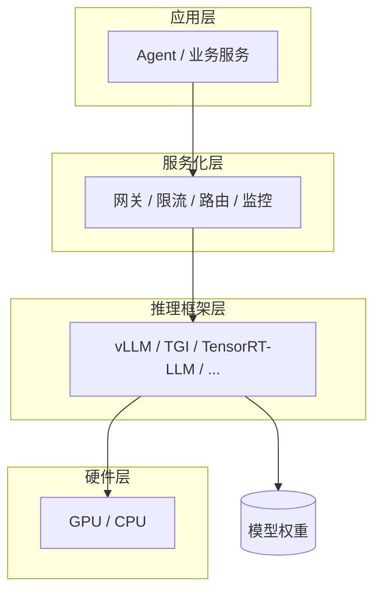

# 推理框架（Inference Framework）

> 一句话定义：推理框架是大语言模型的宿主与运行时——负责加载模型权重、调度硬件算力、管理显存与并发，并把「一次生成」包装成可调用的服务接口。它对接的是 **模型 + 硬件** ，不是业务编排。

相关篇目：

- 优化技术细节 → [01-推理优化.md](01-推理优化.md)
- 部署形态与服务化要点 → [02-模型服务化.md](02-模型服务化.md)
- **vLLM** 专篇 → [04-vLLM.md](04-vLLM.md)
- 权重专篇（权重是什么、格式与量化）→ [../06-大语言模型LLM/07-模型权重.md](../06-大语言模型LLM/07-模型权重.md)

---

## 1. 它是什么

**Inference Framework** /ˈɪnfərəns ˈfreɪmwɜːk/ （推理框架）可以理解为模型的 **Host** /həʊst/ （宿主）或 **Runtime** /ˈrʌntaɪm/ （运行时）：

| 它管什么 | 它不管什么 |
|----------|------------|
| 权重怎么加载到显存/内存 | 业务该不该查库、调工具 |
| 显卡/CPU 怎么算、怎么并行 | 智能体多步规划与决策 |
| 多请求如何排队、拼 batch | 提示词业务逻辑与产品体验 |
| 如何暴露兼容的 HTTP 服务接口 | 「整合多个模型变成智能体」 |

一句话： **有模型文件 ≠ 能给很多人稳定、高效地用** ；推理框架补的就是中间这层工程能力。

---

## 2. 和 LLM、Agent 的分层关系

容易混的三层：

| 层 | 英文 | 本质 | 类比 |
|----|------|------|------|
| 模型 | **LLM** /ˌel el ˈem/ （ **Large Language Model** /lɑːdʒ ˈlæŋɡwɪdʒ ˈmɒdl/ ，大语言模型） | 权重与能力：会不会答、答得好不好 | 厨师的厨艺与菜谱记忆 |
| 推理框架 | Inference Framework | 宿主与运行时：跑得快不快、扛不扛并发 | 后厨设备 + 出餐窗口 |
| 应用编排 | **Agent** /ˈeɪdʒənt/ （智能体） | 何时调模型、调工具、如何完成任务 | 点菜、上菜、协调后厨的服务员/经理 |

调用链：

```text
用户 → Agent / 应用（编排）→ 模型调用接口 → 推理框架（执行）→ 模型权重（计算下一个 token）
```

### 2.1 前置概念：权重是什么

**权重** /weɪts/ （weights）就是模型在训练中学到的 **那几十亿个数字** ——模型的所有「知识」都存在这些数字里。训练前它们是随机的；训练（读海量文本、不断调整）就是把它们一点点调到合适的值，训练完模型「会不会写代码、懂不懂唐诗」全部体现在这些数字的取值上。（权重专篇见 [../06-大语言模型LLM/07-模型权重.md](../06-大语言模型LLM/07-模型权重.md)）

最小示例——一个神经元的权重（Node.js + TS）：

```typescript
// w1、w2 与 b 就是权重：训练前随机，训练后是「学出来的数字」
function neuron(x1: number, x2: number): number {
  const w1 = 0.73;
  const w2 = -0.21;
  const b = 0.05;
  return w1 * x1 + w2 * x2 + b;
}
```

规模感：**Llama-3-8B** 有 80 亿个这样的数字（术语叫 **参数** /pəˈræmɪtəz/ （parameters），权重是参数的主体）；按半精度存储每个数字占 2 字节，合计约 16 GB——这就是模型文件动辄几个 GB 的原因。从 Hugging Face 下载的 safetensors / GGUF 文件，本质就是 **一袋打包好的权重数字** ，不含任何代码逻辑。

### 2.2 前置概念：架构 → 权重 → 框架

权重不属于推理框架——它属于「模型」本身，框架只是权重的「读取者和执行者」。三层关系：

| 概念 | 它是什么 | 决定什么 | 类比 |
|------|----------|----------|------|
| 架构（如 **Transformer** /trænsˈfɔːmər/ ） | 网络结构的「图纸」：几层、注意力怎么算 | 权重的 **形状** （矩阵维度） | 发动机设计图纸 |
| 权重 | 按这个架构训练出来的具体数字 | 模型的 **能力** | 调校好的零件参数 |
| 推理框架 | 认识架构、加载权重的执行引擎 | 跑得 **快不快、稳不稳** | 司机 + 车库设备 |

```text
Transformer 架构（图纸）──决定──> 权重的形状（几层、矩阵多大）
训练（读海量文本调参数）──决定──> 权重的数值（那 80 亿个数字）
    ↓
 模型文件（Llama-3-8B 的 safetensors）
    ↓
推理框架（vLLM / TGI / llama.cpp）──各按架构实现计算，加载同一份权重去执行
```

注意别混淆两个「Transformer」：一个是**架构**（所有主流开源 LLM——Llama、Qwen、Mistral——都是它，同一张图纸、不同训练 → 不同权重）；另一个是 Hugging Face 的 Python 库 `transformers`（一个「认识这个架构、能加载权重跑一跑」的工具，偏训练与实验，生产 serving 能力弱——这正是第 3 节「裸用训练库硬跑可以，但生产不够」的原因）。库与架构重名，容易误以为「权重是跟着库走的」。

检验这层关系没搞反的三件事：

1. **同一份权重可换框架**：Qwen2.5-7B 的权重文件，今天用 vLLM 跑、明天换 TGI，权重一个字节没变——如果权重相对框架，就不可能这样随便换。
2. **换框架不改变能力**：vLLM 与 TGI 跑同一份权重的输出几乎一致（数值误差内），变的只是速度与并发——框架管「怎么跑」，不管「会什么」。
3. **是框架迁就权重**：llama.cpp 不认识 safetensors，要先转成 GGUF；新架构出来，框架要等更新才能加载。 **框架适配模型，不是模型适配框架。**

一句话： **架构定义权重的形状，训练填入权重的数值，两者合起来才是模型；推理框架只是「认识这个架构、能高效执行这袋数字」的宿主。**

### 常见误区

- **「推理框架 = 整合各种各样 LLM」** ：它能加载多种兼容的开源权重，本质是「同一引擎换模型」，不是模型超市，更不是把多模型拼成 Agent。
- **「推理框架 = Agent」** ：错。调 vLLM 的 chat 接口只是「问一句、答一句」；Agent 还可能查库、调接口、记上下文、失败重试。
- **「闭源云接口就不需要推理框架」** ：对你而言不需要自建；框架仍在厂商侧，只是被封装成远程调用。

---

## 3. 为什么有 LLM 还要推理框架

自回归生成每出一个 token 都要算一遍注意力；线上还有并发、长上下文、成本约束。裸用训练库（如 Transformers）硬跑可以，但生产上通常不够：

1. **显存**： **KV Cache** /ˌkeɪ ˈviː kæʃ/ （ **Key-Value Cache** /kiː ˈvæljuː kæʃ/ ，键值缓存）随序列与并发暴涨，需要精细管理（如 **PagedAttention** /peɪdʒd əˈtenʃn/ ）。
2. **吞吐**：多人同时请求时，需要 **continuous batching** /kənˈtɪnjuəs ˈbætʃɪŋ/ （连续批处理）把空闲算力吃满。
3. **延迟**：首字慢、生成慢，要量化、内核优化、 **speculative decoding** /spekˈjʊlətɪv dɪˈkəʊdɪŋ/ （投机解码）等（详见 [01-推理优化.md](01-推理优化.md)）。
4. **服务形态**：限流、路由、监控、OpenAI 兼容端点——这些都不是权重文件自带的。

所以： **LLM 回答「能说什么」；推理框架回答「怎么稳定、便宜、够快地说出来」。**

---

## 4. 核心职责（和模型、硬件打交道）

### 4.1 模型侧

- 加载权重（safetensors、 **GGUF** /ˌdʒiː dʒiː juː ˈef/ 等格式，视框架而定）
- 支持量化加载（INT8 / INT4 等），在精度与显存间权衡
- 适配常见架构（Llama、Qwen、Mistral 等 Transformer 类开源模型）
- 实现采样与生成循环（temperature、top_p、stop 等）

### 4.2 硬件侧

- 调度 **GPU** /ˌdʒiː piː ˈjuː/ （ **Graphics Processing Unit** /ˈɡræfɪks prəˈsesɪŋ ˈjuːnɪt/ ，图形处理器）或 CPU
- 张量并行 / 流水线并行：大模型拆到多卡
- 管理显存碎片与 KV 分页，避免 **OOM** /ˌəʊ əʊ ˈem/ （ **Out Of Memory** /aʊt əv ˈmeməri/ ，显存/内存耗尽）
- 尽量吃满算力：批处理、算子融合、专用内核（如 **FlashAttention** /flæʃ əˈtenʃn/ 系优化）

### 4.3 服务侧

- 暴露 **API** /ˌeɪ piː ˈaɪ/ （ **Application Programming Interface** /ˌæplɪˈkeɪʃn ˈprəʊɡræmɪŋ ˈɪntəfeɪs/ ，应用程序接口），常见为 OpenAI 兼容 `/v1/chat/completions`
- 请求排队、超时、取消、流式输出（ **SSE** /ˌes es ˈiː/ ， **Server-Sent Events** /ˈsɜːvə sent ɪˈvents/ ）
- 指标：**TTFT** /ˌtiː tiː ef ˈtiː/ （ **Time To First Token** /taɪm tə ˈfɜːst ˈtəʊkən/ ，首 token 延迟）、 **TPS** /ˌtiː piː ˈes/ （ **Tokens Per Second** /ˈtəʊkənz pɜː ˈsekənd/ ，每秒 token 数）、吞吐、GPU 利用率

---

## 5. 主流推理框架一览

> 「能跑多种模型」有边界：一般是兼容某类开源权重/架构；闭源云模型的宿主在厂商侧，你只调远程 API。

| 框架 | 定位 | 典型场景 | 备注 |
|------|------|----------|------|
| **vLLM** | 高吞吐 LLM Serving 主流 | 私有化、多并发线上服务 | **PagedAttention** 、连续批处理；默认 OpenAI 兼容 |
| **TGI** /ˌtiː dʒiː ˈaɪ/ （ **Text Generation Inference** /tekst ˌdʒenəˈreɪʃn ɪnˈfɜːrəns/ ） | **Hugging Face** /ˈhʌɡɪŋ feɪs/ 出品的生成服务 | Hub 生态、易用部署 | 与 Transformers 衔接紧 |
| **TensorRT-LLM** | **NVIDIA** /enˈvɪdiə/ 极致性能栈 | 同卡追延迟/吞吐上限 | 编译与工程成本更高 |
| **llama.cpp** | CPU / 边缘友好 | 量化本地跑、资源受限 | GGUF 生态；偏本地与嵌入式 |
| **Ollama** | 本地一键运行体验 | 开发机试用、本地 demo | 偏产品化封装，底下常接 llama.cpp 等 |
| **SGLang** | 结构化生成与高吞吐 | 复杂解码、radix 缓存等场景 | 近年增长快，适合进阶选型 |
| **LMDeploy** | 国产开源部署套件 | 国内模型与集群场景 | 含服务与量化工具链 |
| **Xinference** | 多模型推理平台 | 统一托管 LLM / Embedding 等 | 偏「平台」，内置多种引擎后端 |

### 5.1 怎么记（选型直觉）

- **快速验证**：闭源 API，或本机 Ollama。
- **生产私有化、要吞吐**：优先 vLLM（多数团队默认起点）。
- **吃满 NVIDIA、肯投入调优**：TensorRT-LLM。
- **CPU / 边缘 / 强量化**：llama.cpp（及 Ollama 等封装）。
- **要统一托管多种模型类型**：Xinference 一类平台（仍可能底层用 vLLM 等引擎）。

更完整的部署形态与成本点见 [02-模型服务化.md](02-模型服务化.md)。

---

## 6. 框架内部常见能力地图

不必在每个框架里都亲手实现，但选型时要知道这些词在解决什么问题：

| 能力 | 解决什么 |
|------|----------|
| KV Cache | 避免生成时重复计算历史 Key/Value |
| PagedAttention | 像虚拟内存一样分页管理 KV，提高并发下显存利用率 |
| Continuous batching | 请求动态进 batch，提升 GPU 利用率与吞吐 |
| 量化加载 | 降显存、提速，精度略损 |
| Speculative decoding | 小模型起草、大模型验证，降延迟 |
| 张量/流水线并行 | 单卡放不下时拆多卡 |
| OpenAI 兼容 Server | 应用层改 `base_url` 即可切换自建模型 |

原理级展开见 [01-推理优化.md](01-推理优化.md)。

---

## 7. 和「模型服务化」的关系

- **推理框架**：偏引擎——怎么高效执行一次（或一批）推理。
- **模型服务化**：偏工程体系——路由、缓存、限流、监控、弹性扩缩容、多模型网关。

实践中常叠在一起：用 vLLM 当引擎，前面再加网关、容器编排与观测。学习时可先吃透「框架当宿主」，再补「服务化当产品」。



---

## 8. 实践要点

1. **先定约束再选型**：数据是否必须私有化、每秒多少请求、上下文长度、预算卡型，比「跟风用某个框架」更重要。
2. **接口尽量 OpenAI 兼容**：应用代码与 Agent 框架迁移成本最低。
3. **监控四件套**：TTFT、TPS、队列长度、GPU 利用率——没有指标就无法谈优化。
4. **量化与批处理往往比换框架更赚**：同一框架内调精度与并发策略，常可降本数倍。
5. **不要用推理框架承担 Agent 职责**：工具调用、多步对话状态、权限与审计应在应用层；框架只保证「模型服务可靠」。

---

## 9. 学习要点（收束）

- 推理框架 = **模型宿主 + 硬件调度 + 推理服务** 。
- 权重相对的是「模型」（架构定义形状、训练填入数值），推理框架只是权重的消费者，同一份权重可随时换引擎。
- 与 LLM 分工：LLM 是能力，框架是把能力跑成服务。
- 与 Agent 分工：Agent 编排任务，框架只执行模型调用。
- 私有部署主流入口：vLLM；边缘/本地：llama.cpp / Ollama；极致 NVIDIA：TensorRT-LLM。
- 优化关键词：KV Cache、PagedAttention、连续批处理、量化——详见推理优化专篇。

---

## 10. 参考资料

- vLLM / PagedAttention 论文与文档：*Efficient Memory Management for LLM Serving with PagedAttention*
- Hugging Face TGI 文档
- NVIDIA TensorRT-LLM 文档
- llama.cpp / GGUF 生态说明
- 本库：[01-推理优化.md](01-推理优化.md)、[02-模型服务化.md](02-模型服务化.md)

---

## 本文缩写

| 缩写 | 音标 | 全拼 | 中文 |
|------|------|------|------|
| **LLM** | /ˌel el ˈem/ | Large Language Model | 大语言模型 |
| **TGI** | /ˌtiː dʒiː ˈaɪ/ | Text Generation Inference | 文本生成推理服务 |
| **KV Cache** | /ˌkeɪ ˈviː kæʃ/ | Key-Value Cache | 键值缓存 |
| **TTFT** | /ˌtiː tiː ef ˈtiː/ | Time To First Token | 首 token 延迟 |
| **TPS** | /ˌtiː piː ˈes/ | Tokens Per Second | 每秒生成 token 数 |
| **GPU** | /ˌdʒiː piː ˈjuː/ | Graphics Processing Unit | 图形处理器 |
| **API** | /ˌeɪ piː ˈaɪ/ | Application Programming Interface | 应用程序接口 |
| **SSE** | /ˌes es ˈiː/ | Server-Sent Events | 服务器推送事件 |
| **OOM** | /ˌəʊ əʊ ˈem/ | Out Of Memory | 内存/显存耗尽 |
| **GGUF** | /ˌdʒiː dʒiː juː ˈef/ | （llama.cpp 常用量化权重格式名） | 量化模型文件格式 |
