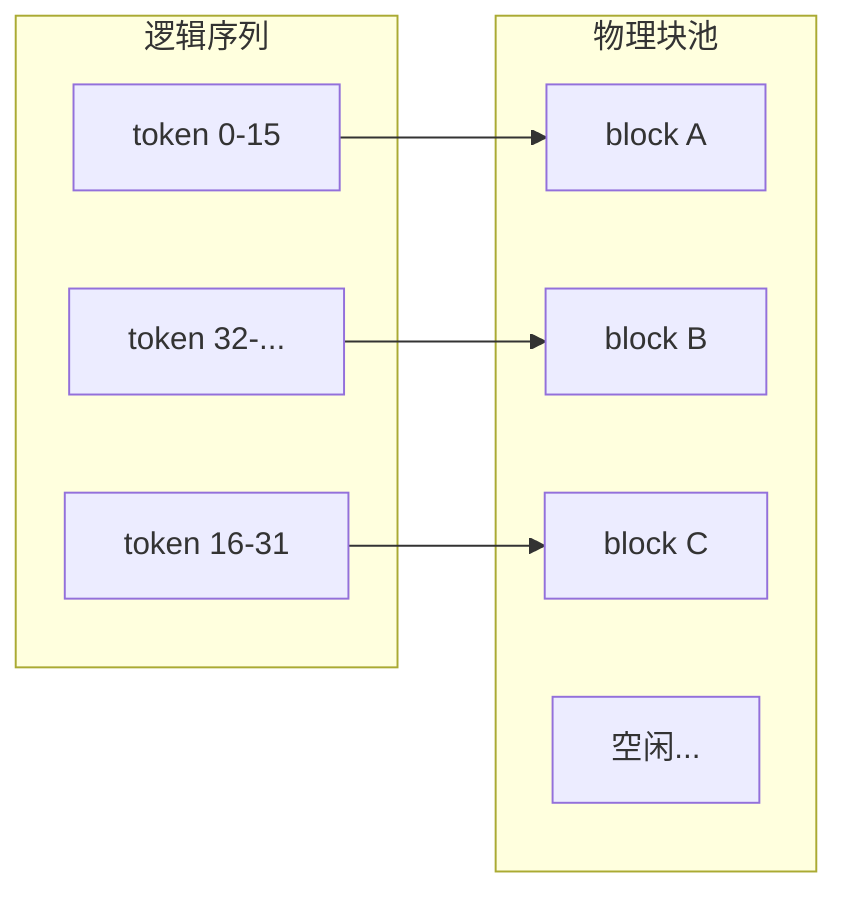

# vLLM

> 一句话定义： **vLLM** /ˌviː el el ˈem/ 是面向高吞吐生产场景的开源大语言模型推理与服务引擎；用 **PagedAttention** /peɪdʒd əˈtenʃn/ 管显存、用连续批处理吃满显卡，并默认提供 OpenAI 兼容接口，便于私有化替换云端模型调用。

相关篇目：

- 推理框架总览 → [03-推理框架.md](03-推理框架.md)
- KV Cache / 量化 / 投机解码原理 → [01-推理优化.md](01-推理优化.md)
- 部署形态与成本 → [02-模型服务化.md](02-模型服务化.md)

---

## 1. 它是什么、解决什么

**vLLM** 起源于加州大学伯克利（UC Berkeley）相关工作，2023 年随 PagedAttention 论文走红，现已成为开源 **LLM** /ˌel el ˈem/ （ **Large Language Model** /lɑːdʒ ˈlæŋɡwɪdʒ ˈmɒdl/ ，大语言模型）私有部署的默认选项之一。

它解决的核心矛盾是：

| 痛点 | 没有高效引擎时 | vLLM 的做法 |
|------|----------------|-------------|
| 显存浪费 | 为每条请求预留「最长可能」的连续键值缓存 | 按块分页分配，按需增长 |
| **GPU** /ˌdʒiː piː ˈjuː/ （ **Graphics Processing Unit** /ˈɡræfɪks prəˈsesɪŋ ˈjuːnɪt/ ，图形处理器）空转 | 静态 batch：短请求被长请求拖死 | **continuous batching** /kənˈtɪnjuəs ˈbætʃɪŋ/ （连续批处理）：每步可进可出 |
| 接入成本 | 自写服务、自对协议 | 内置 OpenAI 兼容服务端 |

定位一句话： **vLLM 是模型宿主里偏「高并发线上 Serving」的那一款** ，不是 **Agent** /ˈeɪdʒənt/ （智能体）框架，也不替代训练框架。

---

## 2. 在技术栈里的位置

```text
应用 / Agent
    ↓  OpenAI SDK（改 base_url）
vLLM OpenAI Server（:8000/v1）
    ↓
Scheduler + PagedAttention + 模型前向
    ↓
GPU（单卡或多卡张量并行）
```

和相邻概念的边界：

| 概念 | 关系 |
|------|------|
| **LLM 权重** | vLLM **加载并执行** 权重；能力好坏取决于模型本身 |
| **推理框架** （见 [03](03-推理框架.md)） | vLLM 是其中最常用的生产引擎之一 |
| **Ollama** | 偏本地一键体验；vLLM 偏多用户吞吐与线上服务 |
| **TensorRT-LLM** | 可追更极致延迟/吞吐，工程与编译成本通常更高 |
| **Agent** | Agent 调 vLLM 的接口；编排、工具、记忆不在 vLLM 内 |

---

## 3. 核心机制一：PagedAttention

### 3.1 背景：KV Cache 为何难管

自回归生成时，历史 token 的 Key/Value 要缓存（ **KV Cache** /ˌkeɪ ˈviː kæʃ/ ， **Key-Value Cache** /kiː ˈvæljuː kæʃ/ ），否则每步重算历史。

朴素做法常按「最大长度」预留一块 **连续** 显存：

- 实际对话往往远短于上限 → **大量预留浪费**
- 不同请求长度不一 → **碎片化** ，明明总量够却拼不出连续块 → 并发上不去

### 3.2 做法：像操作系统管虚拟内存

**PagedAttention** 把每条请求的 KV 切成固定大小的 **block** /blɒk/ （块，常见如 16 tokens），从全局块池按需分配；用类似页表的映射，把逻辑序列对应到物理块。

收益直观理解：

1. **按需分配**：写到哪分到哪，少预留空洞  
2. **少碎片**：固定块大小，池化复用  
3. **更高并发**：同样显存能同时服务更多序列  
4. **便于抢占/换出**：必要时可配合 swap，而不是整段连续区搬迁失败

> 细节与注意力实现仍要高效内核配合；PagedAttention 解决的是 **KV 布局与调度** ，不是「注意力数学公式变了」。



---

## 4. 核心机制二：Continuous Batching

### 4.1 静态 batch 的问题

传统静态批处理：凑齐 N 条 → 一起跑到全部结束 → 再接下一批。

问题：

- 短回答必须等长回答结束  
- 新请求即使显存有空，也要等当前 batch 收工  
- GPU 利用率被「最慢那条」拖垮

### 4.2 迭代级调度（iteration-level）

vLLM 的 continuous batching（连续批处理，也称 in-flight batching）在 **每个解码步** （每次前向）重新组 batch：

- 已结束的请求立刻离开，释放 KV 块  
- 等待中的请求立刻填入空位  
- 批大小随负载动态变化，目标是 **尽量不让 GPU 闲着**

这对「长短请求混杂」的真实线上流量特别关键：聊天里有人只要一句话，有人要长文，连续批处理才能同时照顾吞吐与短请求延迟。

---

## 5. 其他重要能力

| 能力 | 作用 | 使用直觉 |
|------|------|----------|
| OpenAI 兼容 Server | `/v1/chat/completions` 等 | 应用只改 `base_url` |
| **Prefix caching** /ˈpriːfɪks ˈkæʃɪŋ/ （前缀缓存） | 共享 system prompt 等前缀时复用 KV | 聊天/Agent 系统提示重复高时很赚 |
| 量化加载 | AWQ / GPTQ / FP8 等（随版本演进） | 显存紧或要提吞吐时开启 |
| 投机解码 | 小模型起草、大模型验证 | 追单请求延迟时可试 |
| **Tensor Parallelism** /ˈtensə ˈpærəlelɪzəm/ （张量并行） | 大模型拆多卡 | `--tensor-parallel-size` 对齐卡数 |
| Chunked prefill | 长 prompt 分块预填充 | 改善长输入时的尾延迟与调度公平性 |
| 多模态 / Embedding 等 | 视版本与后端支持 | 以官方模型兼容列表为准 |

> 能力随版本快速迭代；上线前以 [vLLM 文档](https://docs.vllm.ai/) 当前版为准，本文抓的是稳定主线概念。

---

## 6. 安装与加载模型

> 先分清： **装 vLLM = 装引擎** ； **「装 LLM」= 准备权重** （启动时指定模型 ID 自动下载，或指向本地目录）。二者不是再装两套无关软件。

### 6.1 环境前提

| 项 | 说明 |
|----|------|
| 系统 | 官方主路径是 **Linux** ；Windows 建议 **WSL** /ˌdʌbəljuː es ˈel/ （ **Windows Subsystem for Linux** /ˈwɪndəʊz ˈsʌbsɪstəm fə ˈlɪnəks/ ）或 Docker |
| Python | 约 3.10～3.13（以当前文档为准） |
| 硬件 | NVIDIA GPU + 驱动为主路径；普通办公本通常不适合 |
| 网络 | 首次拉权重需访问 Hugging Face（或镜像 / ModelScope） |

### 6.2 安装 vLLM（引擎）

用 **uv** （推荐，可按本机 CUDA 选 PyTorch 后端）：

```bash
# 创建 Python 3.12 虚拟环境并植入基础包
uv venv --python 3.12 --seed
# 激活虚拟环境（Windows 下请在 WSL / Linux 中执行）
source .venv/bin/activate
# 安装 vLLM，并自动匹配本机 CUDA 对应的 torch
uv pip install vllm --torch-backend=auto
```

或 conda + uv：

```bash
# 新建名为 vllm 的 conda 环境（Python 3.12）
conda create -n vllm python=3.12 -y
# 进入该环境
conda activate vllm
# 在环境内安装 / 升级 uv
pip install --upgrade uv
# 用 uv 安装 vLLM 与匹配的 torch
uv pip install vllm --torch-backend=auto
```

不想本地抠依赖时，用官方 OpenAI 兼容镜像（需已装 NVIDIA Container Toolkit）：

```bash
# 使用官方镜像启动：把 GPU 交给容器，映射 8000 端口，并加载指定模型（首次会下载权重）
docker run --gpus all -p 8000:8000 \
  vllm/vllm-openai \
  --model Qwen/Qwen2.5-1.5B-Instruct
```

> 命令与镜像标签随版本会变，以 [官方 Quickstart](https://docs.vllm.ai/en/latest/getting_started/quickstart.html) 为准。

### 6.3 「安装」LLM：加载权重，不是再装一个软件

指定模型后，vLLM 会从 Hugging Face 下载到本地缓存（常见 `~/.cache/huggingface/`），或直接读你给的本地路径。

**方式 A：启动服务时自动下载（最常见）**

```bash
# 启动 OpenAI 兼容服务；模型名为 Hugging Face 仓库 ID，首次自动下载权重
vllm serve Qwen/Qwen2.5-1.5B-Instruct
```

显存紧张可先用更小模型（如上面的 1.5B）验证通路，再换 7B 等。

国内拉取困难时可改用 ModelScope（在启动前设置）：

```bash
# 让 vLLM 从 ModelScope 拉模型，而不是默认 Hugging Face
export VLLM_USE_MODELSCOPE=True
# 启动服务并加载模型（需在 ModelScope 侧可解析该 ID）
vllm serve Qwen/Qwen2.5-1.5B-Instruct
```

**方式 B：先下载到本地目录，再指定路径**

```bash
# 用 Hugging Face CLI 下载模型文件到本地目录
huggingface-cli download Qwen/Qwen2.5-7B-Instruct \
  --local-dir ./models/qwen2.5-7b
# 用本地路径启动服务，不再依赖在线下载
vllm serve ./models/qwen2.5-7b
```

**方式 C：Python 离线批推理（不启 HTTP）**

```python
from vllm import LLM, SamplingParams  # LLM：离线引擎入口；SamplingParams：采样参数

llm = LLM(model="Qwen/Qwen2.5-1.5B-Instruct")  # 加载模型（无缓存则下载）；权重进 GPU
params = SamplingParams(temperature=0.7, max_tokens=64)  # 温度与最大生成长度
outputs = llm.generate(["你好，用一句话介绍 vLLM。"], params)  # 把提示送入引擎并生成
print(outputs[0].outputs[0].text)  # 打印第一条结果的文本
```

### 6.4 启动 OpenAI 兼容服务（常用参数版）

等价于较完整的 api_server 启动方式（命令随版本可能微调）：

```bash
# 以模块方式启动 OpenAI 兼容 HTTP 服务
# --model：模型 ID 或本地路径
# --host / --port：监听地址与端口
# --max-model-len：单序列最大长度（过大挤占 KV 池）
# --gpu-memory-utilization：预留显存比例（过高易 OOM）
python -m vllm.entrypoints.openai.api_server \
  --model Qwen/Qwen2.5-7B-Instruct \
  --host 0.0.0.0 \
  --port 8000 \
  --max-model-len 8192 \
  --gpu-memory-utilization 0.90
```

多卡张量并行示例：

```bash
# 大模型多卡：张量并行拆到 4 张 GPU，并限制上下文长度
python -m vllm.entrypoints.openai.api_server \
  --model meta-llama/Llama-3.1-70B-Instruct \
  --tensor-parallel-size 4 \
  --max-model-len 8192
```

卡数、互联（如 NVLink）与模型体积共同决定并行策略；盲目加大并行不一定更快。

### 6.5 用 OpenAI SDK 调用

服务起来后（默认 `http://localhost:8000`），应用只需改 `base_url`：

```python
from openai import OpenAI  # 官方 OpenAI Python 客户端

client = OpenAI(
    base_url="http://localhost:8000/v1",  # 指向本机 vLLM，而不是 api.openai.com
    api_key="EMPTY",  # vLLM 默认不校验；生产务必加网关鉴权
)

resp = client.chat.completions.create(
    model="Qwen/Qwen2.5-7B-Instruct",  # 必须与启动时的模型名 / 路径一致
    messages=[
        {"role": "system", "content": "你是简洁的技术助手。"},  # 系统提示
        {"role": "user", "content": "用三句话解释 PagedAttention。"},  # 用户问题
    ],
    temperature=0.7,  # 采样温度：越高越多样
    max_tokens=256,  # 本次最多生成多少 token
)
print(resp.choices[0].message.content)  # 取出助手回复文本
```

也可用 curl 探活：

```bash
# 列出当前服务加载的模型，确认服务已就绪
curl http://localhost:8000/v1/models
```

这正是 vLLM 在工程上「好用」的原因： **LangChain / 自研 Agent / 现有 OpenAI 客户端** 往往只需换地址，不必重写协议层。

服务侧暴露的是 **API** /ˌeɪ piː ˈaɪ/ （ **Application Programming Interface** /ˌæplɪˈkeɪʃn ˈprəʊɡræmɪŋ ˈɪntəfeɪs/ ，应用程序接口）；生产环境请在其前加鉴权与限流，不要直接对公网裸奔。

---

## 7. 常用参数（调优入口）

| 参数　　　　　　　　　　　 | 大致含义　　　　　　　　　　　　　　　　　　　　　| 调优直觉　　　　　　　　　　　　　　　　　　　　　　　　　　　　　　　　　　　　　　　　　　　 |
| ----------------------------| ---------------------------------------------------| ------------------------------------------------------------------------------------------------|
| `--gpu-memory-utilization` | 预留给引擎（含 KV 池）的显存比例，常见默认约 0.90 | 略提高可增并发；过高易 **OOM** /ˌəʊ əʊ ˈem/ （ **Out Of Memory** /aʊt əv ˈmeməri/ ，显存耗尽） |
| `--max-model-len`　　　　　| 单序列最大长度　　　　　　　　　　　　　　　　　　| 按业务上下文设；过大浪费 KV 池　　　　　　　　　　　　　　　　　　　　　　　　　　　　　　　　 |
| `--max-num-seqs`　　　　　 | 同时调度的序列上限　　　　　　　　　　　　　　　　| 控并发与显存；不是越大越好　　　　　　　　　　　　　　　　　　　　　　　　　　　　　　　　　　 |
| `--max-num-batched-tokens` | 每步可批的 token 预算　　　　　　　　　　　　　　 | 影响吞吐与 **TTFT** 平衡　　　　　　　　　　　　　　　　　　　　　　　　　　　　　　　　　　　 |
| `--tensor-parallel-size`　 | 张量并行卡数　　　　　　　　　　　　　　　　　　　| 与可用 GPU 数匹配　　　　　　　　　　　　　　　　　　　　　　　　　　　　　　　　　　　　　　　|
| `--enable-prefix-caching`　| 开启前缀缓存　　　　　　　　　　　　　　　　　　　| 共享长 system prompt 时优先开　　　　　　　　　　　　　　　　　　　　　　　　　　　　　　　　　|
| `--quantization`　　　　　 | 量化后端　　　　　　　　　　　　　　　　　　　　　| 显存不够或要提速时考虑　　　　　　　　　　　　　　　　　　　　　　　　　　　　　　　　　　　　 |

监控优先看：

- **TTFT** /ˌtiː tiː ef ˈtiː/ （ **Time To First Token** /taɪm tə ˈfɜːst ˈtəʊkən/ ，首 token 延迟）
- **TPS** /ˌtiː piː ˈes/ （ **Tokens Per Second** /ˈtəʊkənz pɜː ˈsekənd/ ，每秒 token 数）——可分「单请求」与「集群总吞吐」
- 队列长度、GPU 利用率、因显存导致的抢占/拒绝次数

没有这几项，谈「再换一个框架」往往是盲目的。

---

## 8. 选型：什么时候用 vLLM

### 适合

- 开源模型私有化，多用户、要吞吐  
- 已有 OpenAI 兼容客户端，希望改 URL 即切换  
- 7B～70B 量级（视卡型）的线上聊天、 **RAG** /ræɡ/ （ **Retrieval-Augmented Generation** /rɪˈtriːvl ˈɔːɡmentɪd ˌdʒenəˈreɪʃn/ ，检索增强生成）生成、Agent 后端  
- 团队默认「先跑通再抠极致」的工程路径  

### 不太适合或需谨慎

- 纯本机试用、零运维：Ollama 更轻  
- 无 GPU / 强边缘 CPU：llama.cpp 更贴切  
- 要压榨某张 NVIDIA 卡到极限且接受高工程成本：评估 TensorRT-LLM  
- 把业务编排、工具调用塞进推理引擎：应放应用 / Agent 层  

场景与硬件怎么配，见下一节总表。

---

## 9. 开源 LLM 场景与硬件对照

> 下表是 **工程经验量级** ，不是厂商承诺：同一参数量还受精度（FP16 / INT8 / INT4）、上下文长度、并发数影响。显存不够就 **量化、降 `--max-model-len`、换小模型或加卡** 。

### 9.1 按使用场景

| 场景 | 典型开源模型规模 | 推荐引擎 | 硬件怎么配（经验） | 备注 |
|------|------------------|----------|-------------------|------|
| 本机学习 / 个人聊天 | 1.5B～8B（常量化） | **Ollama** / llama.cpp | 笔记本 16GB+ 内存；或消费级 NVIDIA 8GB 显存起 | 要 HTTP 也行，不必上 vLLM |
| 开发联调 Agent / 改 `base_url` | 3B～14B | Ollama 或单卡 vLLM | NVIDIA **12～24GB** 显存较舒服 | 先保证「能调通」，再抠吞吐 |
| 小团队私有化（十人级并发） | 7B～32B | **vLLM** | 一张 **24GB+** （如 4090 / L40S 等）或云上 A10 | 盯 TTFT / 队列；上下文别盲目拉满 |
| 生产高吞吐 Serving | 7B～70B | **vLLM** （或 TensorRT-LLM） | 数据中心卡：**A100 / H100** 等；70B 常需 **多卡张量并行** | 要监控、限流、多副本 |
| 自建「多模型提供商」 | 多个 7B～32B 常驻，或 1 个大模型 + 若干小模型 | 每模型一个 vLLM 容器 + 网关 | **多卡实体机/服务器**：一卡（或一组卡）绑一个容器 | 瓶颈是显存总和，不是 Docker 个数 |
| Mac 小集群（多台 Mac mini） | 视统一内存，常 7B～70B 量化档 | Ollama / **MLX** /ˌem el ˈeks/ （Apple 机器学习框架）/ llama.cpp / Exo 等 | **Apple Silicon** /ˈæpl ˈsɪlɪkən/ ，高统一内存型号；多机组网 | **不是**经典 CUDA vLLM 路线；偏本地/能效 |
| 边缘 / 离线 / 无独显 | 1B～7B 强量化 | llama.cpp（或 Ollama CPU） | CPU + 大内存；或 NPU/端侧芯片 | 慢但能跑；别用 vLLM 硬扛 |
| 极致单卡延迟 | 视模型 | TensorRT-LLM | 同级 NVIDIA，接受编译与调参成本 | 与 vLLM 二选或分层 |

### 9.2 按模型规模看显存（粗算）

| 模型参数量（量级） | FP16 权重粗算 | INT4 量化后粗算 | 单卡常见做法 |
|--------------------|---------------|-----------------|--------------|
| ～1.5B～3B | 约 3～6GB | 约 1～2GB | 消费级也能轻松跑；适合验证通路 |
| ～7B～8B | 约 14～16GB | 约 4～6GB | 8～12GB 卡靠量化；24GB 卡更从容（还可留 KV） |
| ～13B～14B | 约 26～28GB | 约 7～10GB | 优先 24GB+；或量化 + 控制并发 |
| ～32B～34B | 约 60GB+ | 约 16～20GB | 单卡 24GB 偏紧；48GB / 多卡更稳 |
| ～70B～72B | 约 140GB | 约 35～40GB | 多卡 **TP** /ˌtiː ˈpiː/ （ **Tensor Parallelism** /ˈtensə ˈpærəlelɪzəm/ ，张量并行），或大显存卡；Mac 路线靠超大统一内存 + 量化 |

> **权重显存 ≠ 可服务**：线上还要给 **KV Cache** 、CUDA 上下文、碎片留余量。并发越高、上下文越长，越要往上加显存或降 `--max-model-len` / 并发上限。

### 9.3 选路口诀

1. **自己用、要简单** → Ollama + 够用的内存/小显卡。  
2. **要多人、要吞吐、要 OpenAI 兼容网关** → NVIDIA + vLLM。  
3. **一台机挂很多模型** → 多卡，**一卡一（组）容器** ；别幻想单卡无限叠 Docker。  
4. **一堆 Mac mini** → Apple 本地集群路线，与 vLLM/CUDA 机房方案分开选型。  

---

## 10. 常见误区

1. **「上了 vLLM 模型就更聪明」** ：错。吞吐与延迟变好，智力仍取决于权重与提示。  
2. **「vLLM = Agent」** ：错。它只提供模型服务；Agent 在上层。  
3. **「max-model-len 越大越好」** ：错。上下文上限抬高会挤占 KV 池，并发反而下降。  
4. **「默认端口裸奔即可上生产」** ：危险。默认常无鉴权，前面要网关、 **TLS** /ˌtiː el ˈes/ （ **Transport Layer Security** /trænsˈpɔːt ˈleɪə sɪˈkjʊərəti/ ，传输层安全）、限流与审计。  
5. **「显存利用率拉到 0.99 一定更快」** ：易 OOM 或抖动；留余量给碎片与峰值。  
6. **「和云 API 完全行为一致」** ：协议兼容 ≠ 采样、工具调用、结构化输出细节一致；要回归测试。  
7. **「装完 vLLM 还要再装一个 LLM 软件」** ：错。LLM 是权重；用模型 ID / 本地路径让 vLLM 加载即可。  
8. **「Docker 开得越多就能同时跑越多模型」** ：错。同时常驻受 **GPU 显存总和** 限制。  

---

## 11. 学习要点（收束）

- vLLM = **PagedAttention（显存） + continuous batching（调度） + OpenAI 兼容 Serving（接入）** 。  
- **安装引擎 ≠ 安装智力**：pip/uv/Docker 装 vLLM；权重用 `vllm serve <模型>` 或本地路径加载。  
- 私有化高并发场景的常见默认引擎；本地玩具场景不必强行上。  
- 场景先定引擎与硬件：个人 Ollama，生产 NVIDIA + vLLM，Mac 集群走 Apple 生态。  
- 调优先盯 TTFT / TPS / 队列 / GPU 利用率，再动量化、前缀缓存与并行度。  
- 原理层补 [01-推理优化.md](01-推理优化.md)；选型层回 [03-推理框架.md](03-推理框架.md)。  

---

## 12. 参考资料

- vLLM 官方文档：https://docs.vllm.ai/  
- Quickstart（安装与最小示例）：https://docs.vllm.ai/en/latest/getting_started/quickstart.html  
- OpenAI 兼容 Server：https://docs.vllm.ai/en/latest/serving/openai_compatible_server.html  
- 论文：Kwon et al., *Efficient Memory Management for LLM Serving with PagedAttention*（SOSP 2023）  
- 本库：[01-推理优化.md](01-推理优化.md)、[02-模型服务化.md](02-模型服务化.md)、[03-推理框架.md](03-推理框架.md)  

---

## 本文缩写

| 缩写 | 音标 | 全拼 | 中文 |
|------|------|------|------|
| **LLM** | /ˌel el ˈem/ | Large Language Model | 大语言模型 |
| **KV Cache** | /ˌkeɪ ˈviː kæʃ/ | Key-Value Cache | 键值缓存 |
| **GPU** | /ˌdʒiː piː ˈjuː/ | Graphics Processing Unit | 图形处理器 |
| **API** | /ˌeɪ piː ˈaɪ/ | Application Programming Interface | 应用程序接口 |
| **TTFT** | /ˌtiː tiː ef ˈtiː/ | Time To First Token | 首 token 延迟 |
| **TPS** | /ˌtiː piː ˈes/ | Tokens Per Second | 每秒生成 token 数 |
| **OOM** | /ˌəʊ əʊ ˈem/ | Out Of Memory | 内存/显存耗尽 |
| **RAG** | /ræɡ/ | Retrieval-Augmented Generation | 检索增强生成 |
| **TLS** | /ˌtiː el ˈes/ | Transport Layer Security | 传输层安全 |
| **WSL** | /ˌdʌbəljuː es ˈel/ | Windows Subsystem for Linux | Windows 的 Linux 子系统 |
| **MLX** | /ˌem el ˈeks/ | （Apple 机器学习框架名） | Apple Silicon 上常用的 ML 框架 |
| **TP** | /ˌtiː ˈpiː/ | Tensor Parallelism | 张量并行 |
