# AI 知识库（大而全）

> 整理日期：2026-06-26
> 目标：系统化梳理 AI / 机器学习 / 深度学习 / 大语言模型 全栈知识，分门别类归档，供学习参考
> 风格：中文为主，术语保留英文原文；每篇含定义、要点、原理、示例、注意事项

本知识库按主题分为 15 个模块，从数学基础到前沿趋势，循序渐进。

## 学习路线

```mermaid
flowchart LR
    A[01 AI基础] --> B[02 数学基础]
    B --> C[03 机器学习]
    C --> D[04 深度学习]
    D --> E[05 Transformer]
    E --> F[06 LLM]
    F --> G[07 训练范式]
    G --> H[08 提示工程]
    H --> I[09 RAG上下文]
    I --> J[10 微调适配]
    J --> K[11 推理部署]
    K --> L[12 Agent工具]
    L --> M[13 多模态]
    M --> N[14 评估安全]
    N --> O[15 前沿趋势]
```

## 目录

### 01 AI 基础概念
| 文件 | 主题 |
|------|------|
| [01-AI发展简史.md](01-AI基础概念/01-AI发展简史.md) | 从符号主义到深度学习到 LLM 的演进 |
| [02-AI-ML-DL关系.md](01-AI基础概念/02-AI-ML-DL关系.md) | 人工智能/机器学习/深度学习层级关系 |
| [03-AGI与超级智能.md](01-AI基础概念/03-AGI与超级智能.md) | 通用人工智能、对齐、超级智能 |

### 02 数学基础
| 文件 | 主题 |
|------|------|
| [01-线性代数.md](02-数学基础/01-线性代数.md) | 向量、矩阵、特征值、张量 |
| [02-概率与统计.md](02-数学基础/02-概率与统计.md) | 分布、贝叶斯、期望、方差 |
| [03-微积分与优化.md](02-数学基础/03-微积分与优化.md) | 梯度、偏导、梯度下降、凸优化 |

### 03 机器学习基础
| 文件 | 主题 |
|------|------|
| [01-监督学习.md](03-机器学习基础/01-监督学习.md) | 分类、回归、损失函数 |
| [02-无监督学习.md](03-机器学习基础/02-无监督学习.md) | 聚类、降维、生成模型 |
| [03-模型评估与过拟合.md](03-机器学习基础/03-模型评估与过拟合.md) | 训练/验证/测试、指标、正则化 |

### 04 深度学习基础
| 文件 | 主题 |
|------|------|
| [01-神经网络基础.md](04-深度学习基础/01-神经网络基础.md) | 神经元、前向传播、反向传播 |
| [02-激活与损失函数.md](04-深度学习基础/02-激活与损失函数.md) | ReLU/Sigmoid/Softmax、交叉熵、MSE |
| [03-优化器与训练技巧.md](04-深度学习基础/03-优化器与训练技巧.md) | SGD/Adam、学习率、BatchNorm、Dropout |

### 05 Transformer 与注意力
| 文件 | 主题 |
|------|------|
| [01-注意力机制.md](05-Transformer与注意力/01-注意力机制.md) | Self-Attention、Multi-Head、QKV |
| [02-Transformer架构.md](05-Transformer与注意力/02-Transformer架构.md) | Encoder-Decoder、位置编码、FFN |
| [03-从Transformer到LLM.md](05-Transformer与注意力/03-从Transformer到LLM.md) | Decoder-only、GPT演化 |

### 06 大语言模型 LLM
| 文件 | 主题 |
|------|------|
| [01-什么是LLM.md](06-大语言模型LLM/01-什么是LLM.md) | LLM 定义、能力、涌现、规模 |
| [02-Token与分词.md](06-大语言模型LLM/02-Token与分词.md) | Token、BPE、分词、词表 |
| [03-Embedding与表示.md](06-大语言模型LLM/03-Embedding与表示.md) | 词向量、嵌入空间、语义相似 |
| [04-上下文窗口.md](06-大语言模型LLM/04-上下文窗口.md) | 上下文长度、长上下文、Lost in Middle |
| [05-Scaling-Laws.md](06-大语言模型LLM/05-Scaling-Laws.md) | 缩放定律、Chinchilla、计算最优 |
| [06-模型参数规模.md](06-大语言模型LLM/06-模型参数规模.md) | 7B 是什么、参数怎么算、稠密 vs MoE、各家区别 |

### 07 训练范式
| 文件 | 主题 |
|------|------|
| [01-预训练.md](07-训练范式/01-预训练.md) | 自监督、MLM/CLM、数据配比 |
| [02-SFT监督微调.md](07-训练范式/02-SFT监督微调.md) | 指令微调、数据格式 |
| [03-RLHF与对齐.md](07-训练范式/03-RLHF与对齐.md) | RLHF、PPO、奖励模型 |
| [04-DPO与偏好优化.md](07-训练范式/04-DPO与偏好优化.md) | DPO、RLAIF、直接偏好优化 |

### 08 提示工程
| 文件 | 主题 |
|------|------|
| [01-提示工程基础.md](08-提示工程/01-提示工程基础.md) | 角色、Few-shot、格式约束 |
| [02-高级提示技术.md](08-提示工程/02-高级提示技术.md) | CoT、Self-Consistency、Prompt Chaining |
| [03-生成参数.md](08-提示工程/03-生成参数.md) | temperature、top_p、top_k、max_tokens、stop、seed |

### 09 RAG 与上下文
| 文件 | 主题 |
|------|------|
| [01-RAG检索增强生成.md](09-RAG与上下文/01-RAG检索增强生成.md) | 检索-生成、向量库、切分、重排 |
| [02-上下文工程.md](09-RAG与上下文/02-上下文工程.md) | 上下文选材、压缩、记忆管理 |
| [03-向量数据库.md](09-RAG与上下文/03-向量数据库.md) | 向量库概念、ANN 索引、主流选型、RAG 集成 |

### 10 微调与适配
| 文件 | 主题 |
|------|------|
| [01-微调方法对比.md](10-微调与适配/01-微调方法对比.md) | 全参/PEFT/LoRA/QLoRA |
| [02-LoRA原理.md](10-微调与适配/02-LoRA原理.md) | 低秩适配、参数高效微调 |

### 11 推理与部署
| 文件 | 主题 |
|------|------|
| [01-推理优化.md](11-推理与部署/01-推理优化.md) | KV Cache、量化、投机解码 |
| [02-模型服务化.md](11-推理与部署/02-模型服务化.md) | vLLM、TGI、推理框架、部署 |

### 12 Agent 与工具
| 文件 | 主题 |
|------|------|
| [01-Agent基础.md](12-Agent与工具/01-Agent基础.md) | Agent 定义、组件、循环 |
| [02-Function-Calling.md](12-Agent与工具/02-Function-Calling.md) | 函数调用、工具设计 |
| [03-MCP协议.md](12-Agent与工具/03-MCP协议.md) | 模型上下文协议 |
| [04-多智能体.md](12-Agent与工具/04-多智能体.md) | 多 Agent 协作 |

### 13 多模态
| 文件 | 主题 |
|------|------|
| [01-多模态基础.md](13-多模态/01-多模态基础.md) | 图文、CLIP、对齐 |
| [02-扩散模型.md](13-多模态/02-扩散模型.md) | Diffusion、DDPM、Stable Diffusion |

### 14 评估与安全
| 文件 | 主题 |
|------|------|
| [01-模型评估.md](14-评估与安全/01-模型评估.md) | 基准、MMLU、HumanEval、幻觉 |
| [02-对齐与安全.md](14-评估与安全/02-对齐与安全.md) | 对齐、红队、Prompt Injection、护栏 |

### 15 前沿与趋势
| 文件 | 主题 |
|------|------|
| [01-推理模型.md](15-前沿与趋势/01-推理模型.md) | o1/R1、Test-time 计算、思维链训练 |
| [02-AGI路径与未来.md](15-前沿与趋势/02-AGI路径与未来.md) | AGI、超级对齐、未来展望 |

## 使用建议
- **入门**：按 01→15 顺序通读。
- **速查**：直接跳到对应模块，每篇开头有"一句话定义"。
- **实践**：重点 06/07/08/09/11，配合动手。
- **进阶**：05/10/14/15 涉及更深原理与趋势。