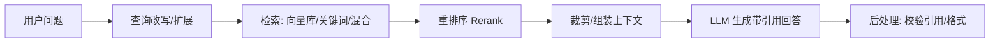

# RAG（检索增强生成，Retrieval-Augmented Generation）

## 定义

RAG（Retrieval-Augmented Generation，检索增强生成）指在 LLM 生成回答**之前，先从外部知识库检索相关片段，并把片段注入提示上下文**，让模型基于检索到的"事实"作答，从而缓解幻觉、引入最新/私有知识、提供可追溯引用。由 Lewis et al.（Facebook AI，2020）系统提出，现已成为企业级 LLM 应用的主流架构。

核心思想：**把"记忆"从模型参数外移到可更新的检索库**，用检索代替（部分）微调。

## 核心特点

1. **知识外置**：知识存于向量库/索引，更新无需重训模型。
2. **可追溯**：每条回答可标注来源片段，便于核验。
3. **降幻觉**：模型基于检索片段生成，而非纯参数记忆。
4. **私有/最新知识**：可接入企业文档、实时数据等模型未学过的内容。
5. **检索-生成解耦**：检索与生成可独立优化。
6. **多模态扩展**：可检索图片、表格、代码等结构化/非结构化数据。

## 工作流程

离线建库阶段：

1. **文档加载**：PDF/Word/HTML/代码等。
2. **切分（Chunking）**：按语义/固定长度切分，保留元数据。
3. **嵌入（Embedding）**：用嵌入模型向量化每个 chunk。
4. **入库**：存入向量数据库（Pinecone、Milvus、Qdrant、pgvector 等）。

在线查询阶段：

1. **查询处理**：改写、扩展、HyDE 生成假设答案再检索。
2. **检索**：向量相似度 + 关键词（BM25）混合检索。
3. **重排序**：用 cross-encoder 对 top-k 精排。
4. **组装**：把最相关片段 + 问题送入 LLM。
5. **生成**：LLM 基于片段作答，标注引用。

## 优缺点

### 优点

- **知识可更新**：改库即生效，无需重训。
- **降幻觉**：基于检索内容生成，事实性提升。
- **可追溯**：引用来源便于人工核验。
- **私有知识友好**：企业文档不入模型参数，合规与安全更可控。
- **成本低于微调**：建库成本远低于训练。

### 缺点

- **检索质量瓶颈**：召回不准/不全会直接拖垮回答。
- **切分敏感**：chunk 太大淹没重点，太小丢失上下文。
- **上下文消耗**：注入片段占窗口，长问答成本高。
- **复杂推理弱**：需跨多片段综合时，单次检索可能不够。
- **引用可能伪造**：模型可能"编造"对检索片段的引用，需后处理校验。

## 实战示例

**场景**：企业内部"产品手册问答"。

1. **建库**：把 200 份产品手册按章节切分（每 chunk 500 字 + 50 字重叠），嵌入入库，元数据含产品线、版本、章节号。
2. **查询**：用户问"X 产品 v3 的故障码 E07 怎么处理？"
3. **检索**：向量检索 top-20，按产品线 + 版本过滤，BM25 补关键词召回。
4. **重排**：cross-encoder 精排取 top-5。
5. **生成**：LLM 基于片段回答，标注"见 X 产品 v3 手册 §4.2"。
6. **校验**：后处理核对引用章节确实存在，否则标注"未找到可靠来源"。

## 注意事项

1. **检索是成败关键**：投入评估召回/相关性，别只调生成提示。
2. **切分策略**：按语义单元（章节、函数、段落）切，保留重叠与元数据。
3. **混合检索**：向量 + 关键词混合通常优于单一方式。
4. **重排序**：top-k 召回后用 cross-encoder 精排，显著提升相关性。
5. **引用校验**：生成后核对引用是否真实存在，防伪造。
6. **评估闭环**：建评测集（问题-答案-相关文档），定期回归。
7. **安全**：检索结果可能含敏感信息，注意权限过滤与脱敏。
8. **进阶**：Multi-hop RAG、GraphRAG、Self-RAG 等应对复杂推理。

## 对比与选型建议

| 维度 | RAG | Fine-tuning | Prompt Engineering |
|------|-----|-------------|--------------------|
| 知识来源 | 外部库 | 模型参数 | 模型预训练 |
| 更新成本 | 低（改库） | 高（重训） | 低（改提示） |
| 适合 | 动态/私有/最新知识 | 稳定领域行为/风格 | 轻量格式/推理 |
| 可追溯 | 强 | 弱 | 无 |

**选型建议**：知识需动态/私有/可追溯首选 RAG；行为/风格需稳定特化用微调；轻量格式用提示工程。三者常组合：RAG 供知识、微调定风格、提示控格式。

## 参考资料

- Lewis et al., "Retrieval-Augmented Generation for Knowledge-Intensive NLP Tasks"（2020）
- "Lost in the Middle: How Language Models Use Long Contexts"
- GraphRAG（Microsoft）、Self-RAG、HyDE 等进阶方法
- 框架：LangChain、LlamaIndex、Haystack