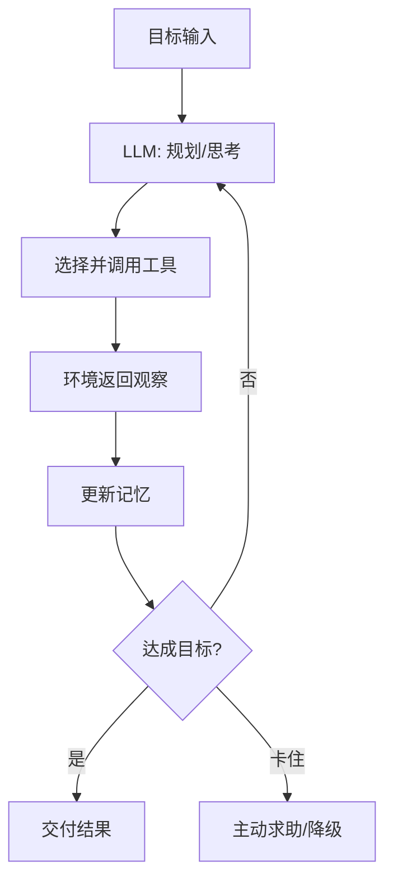

# Agent（智能体工作流）

## 定义

Agent（智能体）指以 LLM 为"大脑"，结合**规划、工具调用、记忆与环境交互**，在循环中自主完成多步任务的系统。与单轮问答不同，Agent 能感知环境（读文件、跑命令、调 API）、根据反馈调整行动，直到达成目标或主动求助。它是 Agentic Coding（辅助编程侧）在应用开发侧的对应范式。

核心公式（常见表述）：**Agent = LLM + 工具 + 记忆 + 循环**。

## 核心特点

1. **自主循环**：在"思考→行动→观察"中反复迭代，而非单轮生成。
2. **工具使用**：调用外部工具/API 扩展能力边界（搜索、计算、代码执行、数据库）。
3. **规划能力**：把目标拆解为子任务序列，必要时重规划。
4. **记忆机制**：短期（本次会话）+ 长期（跨会话/向量库）记忆。
5. **环境感知**：读取真实环境状态，行动接地。
6. **可中断/可审批**：成熟框架支持人在环上审批关键动作。

## 工作流程

关键组件：

1. **Planner**：LLM 把目标拆为子任务（todo list / DAG）。
2. **Actor**：执行子任务，调用工具。
3. **Memory**：
   - 短期：本次会话进展、中间结果。
   - 长期：向量库/知识图谱/数据库，跨会话复用。
4. **Tools**：函数/API 集合，含描述供模型选择。
5. **Controller**：循环控制、终止判断、异常处理、人在环上审批。

## 优缺点

### 优点

- **处理复杂任务**：多步、跨工具、需反馈的任务单轮 LLM 难以胜任。
- **接地反馈**：基于真实环境结果自纠，比纯推理更可靠。
- **可扩展**：新增工具即扩展能力，无需重训模型。
- **可监督**：日志/审批机制让人保持控制权。
- **复用性**：同一 Agent 框架可承载多种任务。

### 缺点

- **失控风险**：错误工具调用可能造成实际影响（删数据、发邮件）。
- **成本与延迟**：长循环消耗大量 token 与时间。
- **循环陷阱**：可能陷入死循环或反复试错不收敛。
- **规划质量瓶颈**：LLM 规划能力不足时拆解错误，全盘皆错。
- **调试难**：行为由模型动态决定，复现与定位困难。
- **安全**：工具权限、prompt injection、数据泄露等风险需护栏。

## 实战示例

**场景**：客服 Agent 处理"查订单 + 申请退款"。

1. **目标**：用户说"我昨天下的单想退"。
2. **规划**：① 查用户最近订单 → ② 确认订单状态 → ③ 判断是否符合退款规则 → ④ 若符合则发起退款并通知。
3. **行动**：
   - 调 `getRecentOrders(userId)` → 拿到订单 #123。
   - 调 `getOrderStatus(#123)` → 已发货但未签收。
   - 查退款规则（RAG）→ 未签收可退。
   - 调 `createRefund(#123, reason)` → 退款单生成。
   - 调 `sendNotification(userId, ...)` → 通知用户。
4. **记忆**：记录本次处理，便于后续追问。
5. **交付**：回复用户"已为您发起退款，预计 3-5 工作日到账"。

## 注意事项

1. **工具护栏**：危险操作（退款、转账、删除）需人工审批或二次确认。
2. **终止条件**：设最大步数/超时/成本上限，防死循环。
3. **工具描述清晰**：模型按描述选工具，描述不清会误选。
4. **记忆治理**：长期记忆需过期、纠错、隐私策略。
5. **安全**：防 prompt injection 经工具输入污染模型决策。
6. **可观测**：记录每步思考、工具调用、观察，便于复盘。
7. **评估**：用端到端任务基准（如 AgentBench）评估，而非单步指标。
8. **人在环上**：关键/不可逆操作必须人确认。

## 对比与选型建议

| 维度 | Agent | RAG | 单轮 LLM |
|------|-------|-----|----------|
| 自主性 | 高 | 低 | 无 |
| 步数 | 多步 | 单步检索 | 单步 |
| 工具 | 必需 | 可选 | 无 |
| 适合 | 复杂多步任务 | 知识问答 | 简单问答/生成 |
| 风险 | 高 | 低 | 低 |

**选型建议**：单轮能解决别上 Agent；需多步/工具/反馈才用 Agent。Agent 常内嵌 RAG 作为"知识工具"。

## 参考资料

- Lilian Weng, "LLM Powered Autonomous Agents"
- ReAct（Yao et al.）、Reflexion、Toolformer 等基础论文
- 框架：LangGraph、AutoGen、CrewAI、LlamaIndex Agents
- 评估：AgentBench、SWE-bench、τ-bench