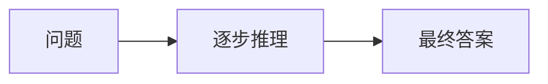
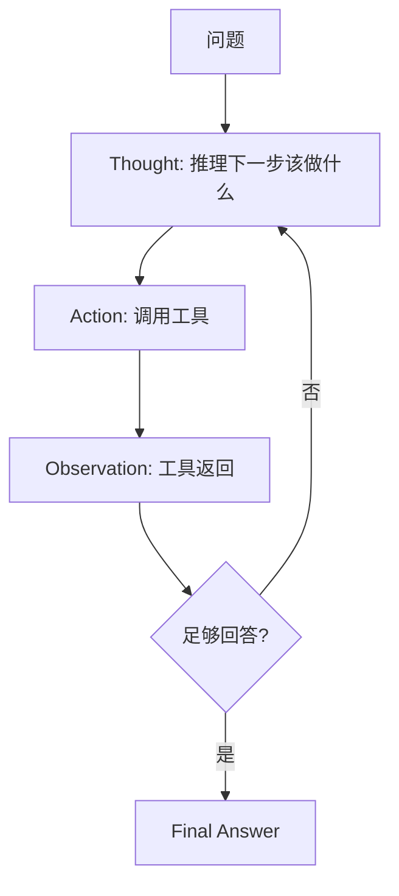

# CoT / ReAct（思维链 / 推理-行动）

## 定义

**CoT（Chain-of-Thought，思维链）** 指让 LLM 在给出最终答案前，**显式输出中间推理步骤**，把"直接答"变为"分步想再答"，从而显著提升数学、逻辑、多步推理任务的准确率。由 Wei et al.（Google，2022）在 few-shot 场景下系统验证。

**ReAct（Reasoning + Acting）** 由 Yao et al.（2022）提出，把 CoT 的纯推理与**外部行动（工具调用）交错**：模型在每一步先"思考（Thought）"再"行动（Action）"，然后"观察（Observation）"工具返回，循环直至得出答案。ReAct 是现代 Agent 的推理骨架。

## 核心特点

### CoT

1. **显式中间步骤**：输出"因为…所以…"的推理链。
2. **零样本触发**：一句"Let's think step by step"即可触发。
3. **少样本对齐**：给带推理的示例效果更佳。
4. **提升复杂推理**：对多步/数学/逻辑任务增益显著，简单任务增益小。

### ReAct

1. **推理-行动交错**：Thought → Action → Observation 循环。
2. **接地外部信息**：通过行动（搜索、查询）获取真实信息，缓解幻觉。
3. **可追溯**：每步思考与行动可见，便于调试。
4. **Agent 骨架**：是多数 Agent 框架的推理范式基础。

## 工作流程

### CoT



### ReAct



ReAct 单轮结构示例：

```
Question: 科罗拉多造山运动延伸到的地区的海拔范围是多少？
Thought 1: 我需要先查科罗拉多造山运动延伸到哪里。
Action 1: Search[科罗拉多造山运动]
Observation 1: 延伸至高平原地区。
Thought 2: 我需要查高平原的海拔范围。
Action 2: Search[高平原 海拔]
Observation 2: 约 1800-2400 米。
Thought 3: 已得到所需信息。
Action 3: Finish[1800-2400 米]
```

## 优缺点

### CoT

- **优点**：实现极简（一句提示）；复杂推理提升显著；可解释性增强。
- **缺点**：增加 token 消耗；简单任务无增益甚至劣化；推理链可能"看似合理实则错误"。

### ReAct

- **优点**：接地外部信息降幻觉；可追溯；是 Agent 通用骨架。
- **缺点**：循环消耗大；工具描述/选择错误会带偏推理；长链路易丢失目标。

## 实战示例

**场景**：计算"某公司 2023 年营收同比增长率"。

- **CoT 风格**（已知数据在上下文）：
  > 2023 营收 = 120 亿，2022 = 100 亿。
  > Thought: 增长率 = (120-100)/100 = 20%。
  > Answer: 20%。

- **ReAct 风格**（数据需查询）：
  > Thought 1: 需先查 2023 与 2022 营收。
  > Action 1: QueryDB[revenue, year in (2022,2023)]
  > Observation 1: {2022:100, 2023:120}
  > Thought 2: (120-100)/100 = 0.2
  > Action 2: Finish[20%]

## 注意事项

1. **CoT 触发**：复杂任务加"一步步思考"；简单任务可省，避免冗余。
2. **Self-Consistency**：对 CoT 多次采样取多数，提升稳定性。
3. **ReAct 工具描述**：清晰描述工具用途与参数，否则模型误选。
4. **终止条件**：设最大步数，防 ReAct 死循环。
5. **观察裁剪**：工具返回过长时裁剪，避免上下文膨胀。
6. **推理 vs 行动平衡**：纯 CoT 易幻觉，纯行动缺规划，ReAct 平衡两者。
7. ** newer 变体**：Reflexion（自我反思）、Plan-and-Solve、Tree-of-Thoughts 等是 CoT/ReAct 的演进。

## 对比与选型建议

| 维度 | CoT | ReAct | 直接问答 |
|------|-----|-------|----------|
| 推理 | 显式链 | 推理+行动 | 隐式 |
| 工具 | 无 | 有 | 无 |
| 适合 | 复杂推理（数据已知） | 需外部信息/工具 | 简单事实 |
| 成本 | 中 | 高 | 低 |

**选型建议**：数据已在上下文用 CoT；需查外部信息用 ReAct；简单事实直接答。ReAct 是构建 Agent 的推理骨架，CoT 是其推理子能力。

## 参考资料

- Wei et al., "Chain-of-Thought Prompting Elicits Reasoning"（2022）
- Yao et al., "ReAct: Synergizing Reasoning and Acting in Language Models"（2022）
- "Self-Consistency Improves Chain of Thought Reasoning"
- "Tree of Thoughts"、"Reflexion"、"Plan-and-Solve" 等演进