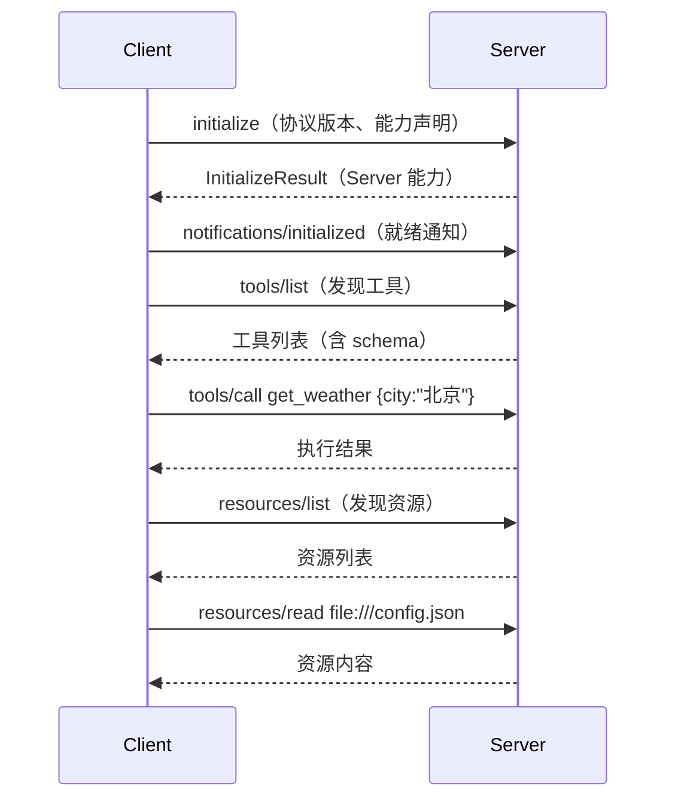
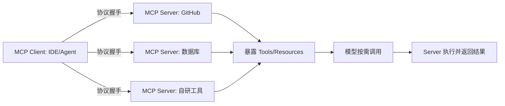

# MCP（Model Context Protocol，模型上下文协议）

## 定义

MCP（Model Context Protocol，模型上下文协议）是由 Anthropic 于 2024 年底开源的**开放标准协议**，旨在标准化 LLM 应用与外部数据源、工具之间的连接方式——被类比为"AI 应用的 USB-C"。通过统一协议，让任意 MCP 客户端（IDE、Agent 框架、聊天应用）能以一致方式接入任意 MCP 服务器（封装了特定数据源/工具），打破"M 个客户端 × N 个工具"的集成碎片化。

核心目标：**一次封装，处处可用**——工具/数据源封装为 MCP Server 后，任何支持 MCP 的客户端都能直接消费。

## 核心特点

1. **开放标准**：协议公开、跨厂商，避免锁定。
2. **客户端-服务器架构**：Client（宿主）连接 Server（能力提供方）。
3. **三大能力**：
   - **Resources**：可读数据源（文件、数据库记录、API 结果）。
   - **Tools**：可执行函数（带 schema，供模型调用）。
   - **Prompts**：可复用提示模板。
4. **传输解耦**：支持 stdio（本地）与 HTTP+SSE/Streamable HTTP（远程）。
5. **生态复用**：一个 Server 可被多个客户端共用（Claude Desktop、Cursor、VS Code、自研 Agent）。
6. **安全分层**：客户端控制权限、审批敏感操作。

## 技术架构

### 通信协议：JSON-RPC 2.0

MCP 底层基于 **JSON-RPC 2.0** 消息格式，所有 Client-Server 通信都是 JSON-RPC 消息：

```json
// 请求（带 id，需响应）
{"jsonrpc": "2.0", "id": 1, "method": "tools/call", "params": {"name": "get_weather", "arguments": {"city": "北京"}}}

// 响应
{"jsonrpc": "2.0", "id": 1, "result": {"content": [{"type": "text", "text": "晴 25°C"}]}}

// 通知（无 id，不需响应）
{"jsonrpc": "2.0", "method": "notifications/initialized"}

// 错误
{"jsonrpc": "2.0", "id": 1, "error": {"code": -32601, "message": "Method not found"}}
```

消息分三类：
- **Request**：带 `id`，需对方返回 Response。
- **Response**：对 Request 的回复，含 `result` 或 `error`。
- **Notification**：无 `id`，单向通知，不需回复。

### 传输层（Transport）

MCP 把"消息格式"与"消息传输"解耦，支持两种传输方式：

| 传输方式 | 场景 | 原理 | 特点 |
|----------|------|------|------|
| **stdio** | 本地 | Client 启动 Server 子进程，通过 stdin/stdout 读写 JSON-RPC | 简单、安全、数据不出域；适合本地工具 |
| **Streamable HTTP** | 远程 | Client 通过 HTTP POST 发请求，Server 可选 SSE 返回流 | 支持远程、可扩展；需鉴权与加密 |

> 早期规范有 "HTTP+SSE" 双端点模式，2025-03 版本简化为 **Streamable HTTP**（单端点，可选 SSE 升级），降低部署复杂度。

### 连接生命周期



关键阶段：
1. **Initialize**：Client 发 `initialize`，声明支持的协议版本与能力；Server 回复自己的能力。
2. **Initialized**：Client 发 `notifications/initialized`，握手完成。
3. **能力发现**：Client 调 `tools/list`、`resources/list`、`prompts/list` 拉取 Server 暴露的能力。
4. **调用**：Client 按需调 `tools/call`、`resources/read`、`prompts/get`。
5. **关闭**：stdio 传输关闭子进程；HTTP 传输关闭连接。

### 三大能力详解

| 能力 | 方法 | 作用 | 典型场景 |
|------|------|------|----------|
| **Tools** | `tools/list` `tools/call` | 可执行函数，带 JSON Schema 参数 | 查数据库、调 API、执行命令 |
| **Resources** | `resources/list` `resources/read` | 可读数据源，用 URI 标识 | 读文件、查文档、获取配置 |
| **Prompts** | `prompts/list` `prompts/get` | 可复用提示模板 | 代码审查模板、SQL 生成模板 |

> Tools 是模型主动调用的（类似 Function Calling）；Resources 与 Prompts 是用户/应用主动选择的。

## MCP SDK

官方提供两类 SDK，覆盖主流语言：

| SDK | 语言 | 安装 | 仓库 |
|-----|------|------|------|
| Python SDK | Python | `pip install mcp` | `modelcontextprotocol/python-sdk` |
| TypeScript SDK | TypeScript/JS | `npm install @modelcontextprotocol/sdk` | `modelcontextprotocol/typescript-sdk` |

SDK 封装了 JSON-RPC 消息处理、传输层、生命周期握手，开发者只需关注"定义工具/资源/提示"的业务逻辑。

## 工作流程



关键环节：

1. **Server 封装**：把数据源/工具按 MCP 规范实现，声明 Tools（含 JSON Schema 参数）、Resources、Prompts。
2. **Client 连接**：宿主应用作为 Client 连接一个或多个 Server。
3. **能力发现**：Client 拉取 Server 暴露的 Tools/Resources/Prompts。
4. **模型调用**：LLM 根据任务选择 Tool，Client 转发给对应 Server 执行。
5. **结果回传**：Server 执行后返回结果，注入模型上下文继续推理。
6. **权限审批**：敏感操作由 Client 侧人工/策略审批。

## 实现 MCP Server

### 方式一：Python SDK

**安装**：`pip install mcp`

**最小 Server 示例**（stdio 传输，暴露一个天气工具）：

```python
from mcp.server.fastmcp import FastMCP

mcp = FastMCP("weather-server")

@mcp.tool()
def get_weather(city: str) -> str:
    """获取指定城市的天气"""
    # 实际场景调用天气 API
    return f"{city}: 晴 25°C"

@mcp.tool()
def get_forecast(city: str, days: int = 3) -> str:
    """获取未来几天的天气预报"""
    return f"{city} 未来 {days} 天: 多云转晴"

if __name__ == "__main__":
    mcp.run()  # 默认 stdio 传输
```

**暴露 Resource**：
```python
@mcp.resource("config://app")
def get_config() -> str:
    """返回应用配置"""
    return '{"theme": "dark", "lang": "zh"}'
```

**暴露 Prompt 模板**：
```python
@mcp.prompt()
def code_review(code: str) -> str:
    """代码审查提示模板"""
    return f"请审查以下代码，按严重程度分级指出问题:\n\n{code}"
```

**运行**：`python server.py`（以 stdio 模式启动，等待 Client 连接）

### 方式二：TypeScript SDK

**安装**：`npm install @modelcontextprotocol/sdk`

**最小 Server 示例**（stdio 传输）：

```typescript
import { McpServer } from "@modelcontextprotocol/sdk/server/mcp.js";
import { StdioServerTransport } from "@modelcontextprotocol/sdk/server/stdio.js";
import { z } from "zod";

const server = new McpServer({ name: "weather-server", version: "1.0.0" });

server.tool(
  "get_weather",
  { city: z.string().describe("城市名") },
  async ({ city }) => ({
    content: [{ type: "text", text: `${city}: 晴 25°C` }],
  })
);

const transport = new StdioServerTransport();
await server.connect(transport);
```

**Streamable HTTP 传输**（远程部署）：
```typescript
import { StreamableHTTPServerTransport } from "@modelcontextprotocol/sdk/server/streamableHttp.js";
import express from "express";

const app = express();
app.post("/mcp", async (req, res) => {
  const transport = new StreamableHTTPServerTransport({ sessionIdGenerator: undefined });
  await server.connect(transport);
  await transport.handleRequest(req, res);
});
app.listen(3000);
```

### 工具返回格式

工具调用结果统一用 `content` 数组返回，支持多种类型：

```python
# 文本结果
return {"content": [{"type": "text", "text": "结果文本"}]}

# 图片结果
return {"content": [{"type": "image", "data": "<base64>", "mimeType": "image/png"}]}

# 错误（isError=true，不抛异常）
return {"content": [{"type": "text", "text": "城市不存在"}], "isError": True}
```

## 安装与配置 MCP Server

MCP Server 需在 Client 侧注册后才能使用。各 Client 配置方式略有不同：

### Claude Desktop

编辑配置文件（macOS: `~/Library/Application Support/Claude/claude_desktop_config.json`，Windows: `%APPDATA%\Claude\claude_desktop_config.json`）：

```json
{
  "mcpServers": {
    "weather": {
      "command": "python",
      "args": ["C:/path/to/server.py"]
    },
    "github": {
      "command": "npx",
      "args": ["-y", "@modelcontextprotocol/server-github"],
      "env": { "GITHUB_PERSONAL_ACCESS_TOKEN": "ghp_xxx" }
    },
    "remote-db": {
      "url": "https://my-server.example.com/mcp",
      "headers": { "Authorization": "Bearer token123" }
    }
  }
}
```

- `command` + `args`：stdio 模式，Client 启动子进程。
- `url` + `headers`：HTTP 模式，连接远程 Server。
- `env`：传给子进程的环境变量（如 API Token）。

配置后重启 Claude Desktop，工具图标中即可看到已注册的 Server 及其工具。

### Cursor

在设置中编辑 `~/.cursor/mcp.json`（或项目级 `.cursor/mcp.json`）：

```json
{
  "mcpServers": {
    "weather": {
      "command": "python",
      "args": ["./server.py"]
    }
  }
}
```

### VS Code（Copilot）

通过 `.vscode/mcp.json` 或设置界面配置：

```json
{
  "servers": {
    "weather": {
      "type": "stdio",
      "command": "python",
      "args": ["./server.py"]
    }
  }
}
```

### 使用社区 Server

社区已有大量现成 Server，无需自己写：

| Server | 安装 | 能力 |
|--------|------|------|
| `@modelcontextprotocol/server-filesystem` | `npx` | 文件系统读写 |
| `@modelcontextprotocol/server-github` | `npx` | GitHub Issue/PR/Repo 操作 |
| `@modelcontextprotocol/server-postgres` | `npx` | PostgreSQL 查询（只读） |
| `@modelcontextprotocol/server-slack` | `npx` | Slack 消息读写 |
| `@modelcontextprotocol/server-puppeteer` | `npx` | 浏览器自动化 |
| `mcp-server-fetch`（Python） | `pip` | 网页抓取 |

示例（Claude Desktop 配置文件系统 Server）：
```json
{
  "mcpServers": {
    "filesystem": {
      "command": "npx",
      "args": ["-y", "@modelcontextprotocol/server-filesystem", "C:/Users/me/Documents"]
    }
  }
}
```

## 实现 MCP Client

若自研 Agent 需接入 MCP Server，可用 SDK 实现 Client：

### Python Client 示例

```python
import asyncio
from mcp import ClientSession, StdioServerParameters
from mcp.client.stdio import stdio_client

async def main():
    params = StdioServerParameters(
        command="python",
        args=["server.py"],
    )
    async with stdio_client(params) as (read, write):
        async with ClientSession(read, write) as session:
            await session.initialize()           # 握手
            tools = await session.list_tools()   # 发现工具
            print([t.name for t in tools.tools])
            # 调用工具
            result = await session.call_tool("get_weather", {"city": "北京"})
            print(result.content[0].text)

asyncio.run(main())
```

### TypeScript Client 示例

```typescript
import { Client } from "@modelcontextprotocol/sdk/client/index.js";
import { StdioClientTransport } from "@modelcontextprotocol/sdk/client/stdio.js";

const transport = new StdioClientTransport({ command: "python", args: ["server.py"] });
const client = new Client({ name: "my-client", version: "1.0.0" });
await client.connect(transport);

const tools = await client.listTools();
console.log(tools.tools.map((t) => t.name));

const result = await client.callTool({ name: "get_weather", arguments: { city: "北京" } });
console.log(result.content[0].text);
```

## 调试与测试

### MCP Inspector

官方提供 **MCP Inspector**（`@modelcontextprotocol/inspector`）——一个交互式 Web UI，用于调试 Server：

```bash
npx @modelcontextprotocol/inspector python server.py
```

打开浏览器后可：
- 查看 Server 暴露的 Tools/Resources/Prompts
- 手动调用工具测试
- 查看请求/响应原始 JSON-RPC 消息
- 定位 schema 与参数问题

### 日志与排错

- **stdio 模式**：Server 的 `print` 会干扰 JSON-RPC，日志应写 `stderr` 或文件。
- **Python SDK**：用 `logging` 输出到 stderr：`logging.basicConfig(stream=sys.stderr)`。
- **常见问题**：
  - Server 启动失败 → 检查 `command`/`args` 路径与依赖。
  - 工具不显示 → 检查 `initialize` 握手是否成功、`tools/list` 是否返回。
  - 调用报错 → 用 Inspector 查看原始消息与错误码。

## 优缺点

### 优点

- **解耦集成**：工具与客户端独立演进，消除 M×N 集成地狱。
- **生态复用**：社区 Server 一次封装，处处可用。
- **标准化**：统一 schema 与协议，降低学习与维护成本。
- **安全可控**：权限与审批集中在客户端，便于治理。
- **本地优先**：stdio 传输支持本地运行，数据不出域。

### 缺点

- **生态早期**：Server 数量与质量仍在建设中。
- **性能开销**：协议层引入额外开销，高频调用需评估。
- **安全风险**：恶意 Server 可能泄露数据或诱导危险操作，需可信来源。
- **标准化折中**：统一协议可能限制某些工具的特殊能力表达。
- **调试复杂**：跨进程/跨网络问题定位需新工具。

## 实战示例

**场景**：让 Cursor 同时能查 GitHub Issue、查本地数据库、调内部 API。

1. **封装 Server**：
   - `github-mcp-server`：暴露 `list_issues`、`create_comment` 等 Tools。
   - `db-mcp-server`：暴露 `query(sql)` Tool（带白名单）。
   - `internal-api-mcp-server`：暴露业务 API。
2. **Client 配置**：在 Cursor 的 MCP 配置中注册三个 Server。
3. **使用**：开发者对 Cursor 说"看看我仓库里未关闭的 issue 并按标签分类"。
4. **调用**：模型选 `list_issues`，Client 转发给 github-mcp-server，结果回传，模型分类后输出。
5. **审批**：若模型要 `create_comment`，Client 弹审批确认。

## 注意事项

1. **可信 Server**：只用来源可信的 Server，防 prompt injection 与数据泄露。
2. **最小权限**：Server 工具按需暴露，危险操作加白名单/审批。
3. **传输选择**：本地用 stdio 更安全；远程用 HTTP 注意鉴权与加密。
4. **schema 清晰**：Tool 参数 schema 越清晰，模型误用越少。
5. **日志与审计**：记录工具调用，便于事后追溯。
6. **版本管理**：Server 协议版本与 Client 兼容性需关注。
7. **别滥用**：简单一次性集成不必上 MCP；多客户端复用才显价值。
8. **stdio 日志**：stdio 模式下 Server 日志写 stderr，勿用 stdout（会污染 JSON-RPC）。
9. **密钥用 env**：API Token 通过 `env` 传入，不硬编码到 Server 代码。
10. **用 Inspector 调试**：开发阶段用 MCP Inspector 验证工具与 schema，再接入 Client。

## 对比与选型建议

| 维度 | MCP | 自研工具集成 | Function Calling（原生） |
|------|-----|-------------|------------------------|
| 标准化 | 开放协议 | 各家私有 | 模型厂商私有 |
| 复用性 | 高（跨客户端） | 低 | 中 |
| 集成成本 | 中（封装一次） | 低（直接写） | 低 |
| 生态 | 成长中 | 无 | 厂商绑定 |

**选型建议**：单客户端、单工具直接用 Function Calling/自研即可；需跨多个客户端复用、构建工具生态时上 MCP。MCP 是 Function Calling 的"协议化、可移植"升级。

## 参考资料

- MCP 官方规范与 SDK：https://modelcontextprotocol.io
- MCP Python SDK：https://github.com/modelcontextprotocol/python-sdk
- MCP TypeScript SDK：https://github.com/modelcontextprotocol/typescript-sdk
- MCP Inspector：https://github.com/modelcontextprotocol/inspector
- 社区 Server 集合：https://github.com/modelcontextprotocol/servers
- Anthropic, "Introducing the Model Context Protocol"（2024-11）
- Cursor、Claude Desktop、VS Code 对 MCP 的支持文档