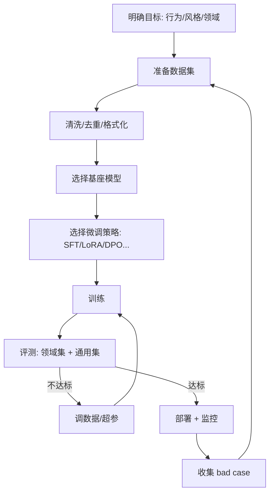

# Fine-tuning（微调）

## 定义

Fine-tuning（微调）指在一个**预训练基座模型（base model）** 之上，用领域/任务专属数据继续训练，调整模型权重，使其在目标任务上的行为、风格、准确率更贴合需求。与 Prompt Engineering/RAG"不改权重"不同，微调**改变模型参数**，把知识/行为"内化"进模型。

常见层级：

- **SFT（Supervised Fine-Tuning，监督微调）**：用"输入-输出"对教模型行为。
- **RLHF / DPO / RLAIF**：用人类/AI 偏好做强化学习对齐。
- **Continual Pre-training（继续预训练）**：用领域语料继续无监督训练，注入领域知识。
- **PEFT（参数高效微调，如 LoRA/QLoRA）**：只调少量参数，降低成本。

## 核心特点

1. **改权重**：行为/知识内化，不依赖提示即可稳定表现。
2. **数据驱动**：质量 > 数量，脏数据会"教坏"模型。
3. **成本分级**：全参微调昂贵，LoRA 等让中小团队可负担。
4. **风格/格式稳定**：对输出风格、结构化格式的一致性提升显著。
5. **与 RAG/提示互补**：微调定行为，RAG 供动态知识，提示控单次格式。
6. **需评估**：需建领域评测集，防止"训完反而变差"。

## 工作流程

关键步骤：

1. **目标界定**：是改风格、学领域术语、还是注入知识？不同目标策略不同。
2. **数据准备**：收集、清洗、去重、脱敏，格式化为训练样本（chat 格式/指令对）。
3. **基座选择**：按预算/许可/能力选开源（Llama、Qwen、Mistral）或闭源 API 微调。
4. **策略选择**：
   - 行为/风格 → SFT 或 DPO。
   - 领域知识 → 继续预训练 + SFT。
   - 资源紧 → LoRA/QLoRA。
5. **训练**：注意学习率、epoch、过拟合监控。
6. **评测**：领域集看提升，通用集看是否"灾难性遗忘"。
7. **部署与监控**：上线后收集 bad case，定期重训。

## 优缺点

### 优点

- **行为稳定**：风格/格式一致性远超提示工程。
- **降低推理成本**：行为内化后无需长提示，省 token。
- **领域特化**：对领域术语、任务模式更精准。
- **隐私可控**：开源模型本地微调，数据不出域。
- **与 RAG 协同**：微调定行为 + RAG 供知识，分工互补。

### 缺点

- **成本高**：数据、算力、工程投入远超提示/RAG。
- **数据门槛**：高质量数据难获取，脏数据反噬。
- **知识更新难**：知识内化后更新需重训，不如 RAG 灵活。
- **灾难性遗忘**：领域微调可能损害通用能力。
- **评估复杂**：需领域评测集，开放式输出难自动评。
- **技术门槛**：训练超参、数据配比、对齐方法需经验。

## 实战示例

**场景**：让模型以公司客服口吻回复，并严格按工单分类输出。

1. **数据**：收集 5000 条历史工单 + 优质客服回复，格式化为 `{"input": 工单, "output": 回复}`。
2. **策略**：SFT（LoRA）+ 少量 DPO 做偏好对齐（优质回复 > 普通回复）。
3. **基座**：Qwen-7B-Instruct。
4. **训练**：3 epoch，学习率 1e-4，监控 loss 与评测集。
5. **评测**：领域集（工单分类准确率 + 回复风格评分）提升；通用集（MMLU）基本持平。
6. **部署**：上线后收集"分类错误"bad case，每月重训一次。
7. **协同**：知识类问题（产品手册）仍走 RAG，微调只管风格与分类。

## 注意事项

1. **先试提示/RAG**：能用提示/RAG 解决别上微调，成本与复杂度量级不同。
2. **数据质量优先**：1000 条高质量 > 10000 条噪声。
3. **防遗忘**：混合通用数据，或用 PEFT 降低遗忘。
4. **建评测集**：领域 + 通用双轨评测，防止"专了但废了"。
5. **合规与许可**：注意基座模型许可（商用、衍生品限制）与数据合规。
6. **版本管理**：数据、代码、权重版本化，可复现。
7. **监控漂移**：上线后业务变化可能导致模型表现下降，需定期评估。
8. **成本核算**：训练 + 推理 + 维护全周期成本，别只看训练一次。

## 对比与选型建议

| 维度 | Fine-tuning | RAG | Prompt Engineering |
|------|-------------|-----|--------------------|
| 改动 | 权重 | 检索库 | 提示 |
| 知识更新 | 难（重训） | 易（改库） | 易 |
| 适合 | 稳定行为/风格/领域 | 动态/最新/私有知识 | 轻量格式/推理 |
| 成本 | 高 | 中 | 极低 |
| 可追溯 | 弱 | 强 | 无 |

**选型建议**：先 Prompt Engineering → 知识问题加 RAG → 行为/风格需稳定特化才微调。三者常组合：微调定行为、RAG 供知识、提示控单次格式。

## 参考资料

- "LoRA: Low-Rank Adaptation of Large Language Models"（Hu et al.）
- "QLoRA" —— 量化微调降显存
- InstructGPT / RLHF / DPO 对齐方法
- OpenAI、Anthropic 微调 API 文档；开源框架：LLaMA-Factory、Axolotl、TRL