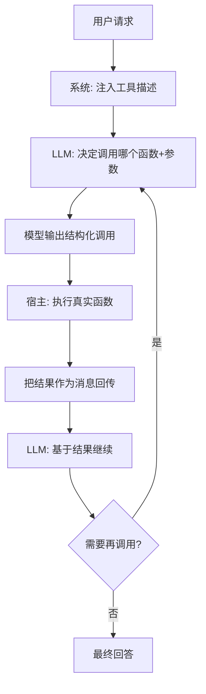

# Function Calling（函数调用 / 工具调用）

## 定义

Function Calling（函数调用，又称 Tool Calling）指 LLM 根据用户意图与可用工具描述，**输出结构化的函数调用请求（含函数名与参数 JSON）**，由外部代码执行该函数并把结果回传模型，从而让模型能"动手"调用外部 API、查询数据库、执行计算。它由 OpenAI 于 2023 年 6 月正式推出，现已成为主流模型（Anthropic、Google、Qwen 等）的通用能力。

它是 Agent 的最小执行单元：Agent 的"行动"本质上就是一次或多次 Function Calling。

## 核心特点

1. **结构化输出**：模型输出 `{"name": "...", "arguments": {...}}`，而非自然语言。
2. **工具描述驱动**：模型按 JSON Schema 描述选择工具与填参。
3. **执行在外部**：模型不直接执行，由宿主代码运行真实函数。
4. **结果回传**：函数返回值作为新消息注入对话，模型继续推理。
5. **可并行/多调用**：现代模型支持一次输出多个调用并行执行。
6. **与 Agent 互补**：Function Calling 是"单次行动"，Agent 是"多步循环"。

## 工作流程



关键环节：

1. **工具注册**：宿主把可用函数及其 schema（名称、描述、参数、返回）注入系统提示或专用 `tools` 字段。
2. **模型决策**：模型判断是否需要调用、调哪个、参数填什么。
3. **结构化输出**：模型返回 tool call（含 id、name、arguments）。
4. **宿主执行**：宿主代码解析并调用真实函数（含鉴权、限流、审批）。
5. **结果回传**：把函数返回作为 `tool` 角色消息追加到对话。
6. **循环或收尾**：模型基于结果继续，或给出最终回答。

## 优缺点

### 优点

- **结构可靠**：JSON 输出比解析自然语言更稳定。
- **能力扩展**：让模型访问实时数据、执行计算、操作外部系统。
- **解耦**：模型只决策，执行由宿主控制，安全与权限可控。
- **生态成熟**：主流模型原生支持，框架（LangChain、LlamaIndex）深度集成。
- **Agent 基石**：是构建 Agent/ReAct 的执行原语。

### 缺点

- **描述敏感**：工具描述不清，模型会误选或填错参数。
- **幻觉参数**：模型可能编造不存在的参数值或枚举。
- **安全风险**：危险函数若未审批，模型可能误调用造成实际影响。
- **依赖模型能力**：小模型/弱模型工具选择与填参能力差。
- **成本与延迟**：多轮调用增加 token 与往返延迟。
- **结果处理**：函数返回过长需裁剪，错误需转译给模型。

## 实战示例

**场景**：天气查询助手。下面给出从"工具定义放哪里"到"完整可运行"的全流程，分别用**原生 OpenAI SDK**和 **LangChain**两种方式演示。

### 0. 工具定义放在哪里（关键澄清）

工具在 Function Calling 里有**两个独立的部分**，初学者最常混淆：

| 部分 | 内容 | 放在哪里 | 谁看 |
|------|------|---------|------|
| **① 工具描述（schema）** | 名称、描述、参数 JSON Schema | 随请求传给模型的 `tools` 字段 | 模型看，用来决策调哪个、填什么参数 |
| **② 工具实现（函数体）** | 真正执行逻辑的 Python/JS 函数 | 宿主代码里，模型**看不到** | 宿主看，模型输出调用后由宿主执行 |

> 模型只看到 schema，不知道函数体怎么写；宿主只执行，不替模型决策。两者用**函数名**对应起来：模型输出 `name="get_weather"`，宿主按这个名字找到本地函数去跑。

```
┌─────────────── 请求 ───────────────┐
│ messages + tools=[get_weather schema] │ ──→ LLM
└────────────────────────────────────┘
                                       │
┌─────────────── 响应 ───────────────┐│
│ tool_calls=[{name:get_weather, args}]│←─┘
└────────────────────────────────────┘
       │ 宿主按 name 找本地函数执行
       ▼
┌─────────────── 回传 ───────────────┐
│ messages += [tool 结果消息]          │ ──→ LLM → 最终回答
└────────────────────────────────────┘
```

### 1. 原生 OpenAI SDK（最底层，看清全貌）

```python
import json
from openai import OpenAI

client = OpenAI()  # 默认读 OPENAI_API_KEY

# ── ① 工具实现（宿主侧，模型看不到）────────────────────
def get_weather(city: str, unit: str = "C") -> dict:
    """真实天气 API 调用，这里用 mock 演示。"""
    # 实际应 requests.get(f"https://api.weather?q={city}")
    return {"city": city, "temp": 28, "condition": "多云", "unit": unit}

# 本地函数注册表：name → callable，供宿主按名分发
TOOL_REGISTRY = {"get_weather": get_weather}

# ── ② 工具描述（传给模型的 schema）──────────────────────
tools_schema = [{
    "type": "function",
    "function": {
        "name": "get_weather",
        "description": "查询指定城市的当前天气",
        "parameters": {
            "type": "object",
            "properties": {
                "city": {"type": "string", "description": "城市名，如 '北京'"},
                "unit": {"type": "string", "enum": ["C", "F"], "default": "C"},
            },
            "required": ["city"],
        },
    },
}]

# ── ③ 对话循环 ────────────────────────────────────────
messages = [{"role": "user", "content": "上海现在多少度？"}]

while True:
    resp = client.chat.completions.create(
        model="gpt-4o-mini",
        messages=messages,
        tools=tools_schema,        # ← schema 传这里
        tool_choice="auto",        # auto/none/required/指定函数
    )
    msg = resp.choices[0].message
    messages.append(msg)

    # 没有工具调用 → 收尾
    if not msg.tool_calls:
        print("回答:", msg.content)
        break

    # 有工具调用 → 逐个执行并回传
    for call in msg.tool_calls:
        name = call.function.name
        args = json.loads(call.function.arguments)
        print(f"模型要调: {name}({args})")

        # 宿主按 name 找本地函数执行
        fn = TOOL_REGISTRY[name]
        result = fn(**args)

        # 把结果作为 tool 角色消息回传（必须带 tool_call_id）
        messages.append({
            "role": "tool",
            "tool_call_id": call.id,
            "content": json.dumps(result, ensure_ascii=False),
        })
    # 循环回去让模型基于结果继续
```

**运行过程**：
```
模型要调: get_weather({'city': '上海', 'unit': 'C'})
回答: 上海现在 28°C，多云。
```

关键点：
- `tools` 字段放 schema，`tool_choice` 控制是否强制调用。
- 模型返回的 `tool_calls` 含 `id`、`name`、`arguments`（JSON 字符串）。
- 回传时 `role="tool"` 且必须带 `tool_call_id` 对应上，否则报错。
- 宿主用 `TOOL_REGISTRY` 按 name 分发，模型从不接触函数体。

### 2. LangChain（框架封装，省样板代码）

LangChain 把"schema + 函数体"绑成一个 `@tool`，自动从函数签名和 docstring 生成 schema，省去手写 JSON Schema：

```python
from langchain_core.tools import tool
from langchain_openai import ChatOpenAI
from langchain_core.messages import HumanMessage

# ── @tool 一行搞定：函数体 + 自动 schema ──────────────
@tool
def get_weather(city: str, unit: str = "C") -> dict:
    """查询指定城市的当前天气。
    Args:
        city: 城市名，如 '北京'
        unit: 温度单位，C 或 F
    """
    return {"city": city, "temp": 28, "condition": "多云", "unit": unit}

llm = ChatOpenAI(model="gpt-4o-mini").bind_tools([get_weather])

# ── 对话 ──────────────────────────────────────────────
messages = [HumanMessage("上海现在多少度？")]
ai_msg = llm.invoke(messages)
messages.append(ai_msg)

if ai_msg.tool_calls:
    for tc in ai_msg.tool_calls:
        # LangChain 自动按 name 找到 tool 并执行
        result = get_weather.invoke(tc["args"])
        from langchain_core.messages import ToolMessage
        messages.append(ToolMessage(content=str(result), tool_call_id=tc["id"]))

final = llm.invoke(messages)
print(final.content)  # 上海现在 28°C，多云。
```

`@tool` 的好处：docstring 即描述，类型注解即 schema，改函数就同步改 schema，不会出现"schema 与实现不一致"。

### 3. 多工具与并行调用

现代模型一次可输出多个 `tool_calls`，宿主应**并行执行**再统一回传：

```python
import concurrent.futures

# 注册多个工具
TOOL_REGISTRY = {"get_weather": get_weather, "search_news": search_news, "calc": calc}

with concurrent.futures.ThreadPoolExecutor() as pool:
    futures = {
        pool.submit(TOOL_REGISTRY[call.function.name],
                    **json.loads(call.function.arguments)): call
        for call in msg.tool_calls
    }
    for fut, call in [(f, c) for f, c in futures.items()]:
        result = fut.result()
        messages.append({"role": "tool", "tool_call_id": call.id,
                         "content": json.dumps(result, ensure_ascii=False)})
```

### 4. 错误处理范式

函数失败时**不要抛异常打断**，而是返回结构化错误让模型自行降级：

```python
def safe_call(fn, **args):
    try:
        return fn(**args)
    except Exception as e:
        return {"error": True, "message": str(e), "retryable": True}
# 模型看到 {"error":true,...} 会选择重试、换参数或告知用户
```

## 工具描述（schema）怎么写好

模型选工具、填参数**完全依赖 schema 文本**，写得好坏直接决定调用准确率。

### 1. description 要回答三问
- **做什么**：`查询指定城市的当前天气`
- **什么时候用**：`当用户询问某地天气、温度、是否下雨时调用`
- **什么时候不用**：`不用于预报未来天气，预报用 get_forecast`

### 2. 参数 description 要给"例子 + 边界"
```json
"city": {
  "type": "string",
  "description": "城市中文名，如 '北京'、'上海'；不要传拼音或英文"
}
```
比单纯写 `"城市名"` 召回率高得多。

### 3. 用 enum 约束枚举值
```json
"unit": {"type": "string", "enum": ["C", "F"], "default": "C"}
```
避免模型输出 `"摄氏度"`、`"celsius"` 等程序无法识别的值。

### 4. required 严格标注
可省略的参数放 `required` 之外并给 `default`，必填的放进去，减少模型乱填。

### 5. 工具多了用命名空间
`weather_get`、`news_search`、`db_query` 加前缀分组，模型选择更稳，也便于宿主按前缀路由。

## 注意事项

1. **描述要清晰**：写明用途、参数含义、取值范围、边界条件（见上节）。
2. **schema 严格**：用 JSON Schema 约束类型/枚举/必填，降低幻觉参数。
3. **权限与审批**：危险/不可逆操作必须人工确认。
4. **错误处理**：函数失败时返回结构化错误，让模型能据此重试或降级。
5. **结果裁剪**：长返回只留关键字段，避免上下文膨胀。
6. **防注入**：工具返回内容可能含恶意指令，做隔离与过滤。
7. **多工具管理**：工具多时按场景分组，避免模型选择困难。
8. **评估**：建工具选择/填参评测集，防止"看起来能调其实乱调"。

## 对比与选型建议

| 维度 | Function Calling | MCP | 自研解析 |
|------|-----------------|-----|----------|
| 标准化 | 模型厂商规范 | 开放协议 | 各家私有 |
| 复用性 | 中（厂商绑定） | 高（跨客户端） | 低 |
| 集成成本 | 低 | 中 | 低 |
| 适合 | 单应用工具集成 | 跨应用工具生态 | 一次性集成 |

**选型建议**：单应用内集成工具用 Function Calling 足矣；需跨多个客户端复用工具生态上 MCP。Function Calling 是 MCP 的底层执行原语之一。

## 参考资料

- OpenAI Function Calling 官方文档（2023-06 推出）
- Anthropic Tool Use、Google Gemini Function Calling 文档
- "Toolformer: Language Models Can Teach Themselves to Use Tools"
- 框架集成：LangChain Tools、LlamaIndex Tools、Pydantic AI