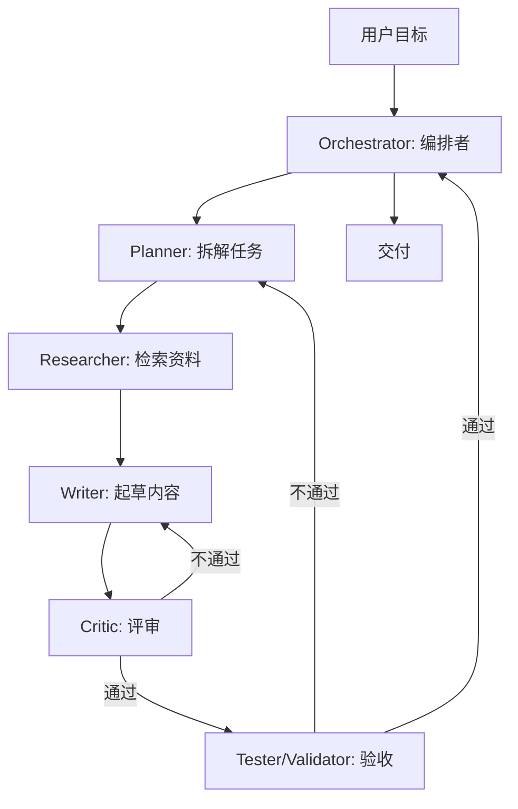

# Multi-Agent（多智能体）

## 定义

Multi-Agent（多智能体）指由**多个分工不同的 Agent 协作完成一个复杂任务**的系统架构。每个 Agent 扮演特定角色（规划者、研究员、编码者、评审者、测试者……），通过消息传递/共享黑板/任务分发等机制协同，由编排者（Orchestrator）协调流程。它是对单 Agent 在复杂、长链路、多技能任务上能力上限的扩展。

典型代表：AutoGen（微软）、CrewAI、MetaGPT、LangGraph 的多 Agent 编排、ChatDev 等。

## 核心特点

1. **角色分工**：每个 Agent 有明确职责与系统提示，专精一面。
2. **协作机制**：消息传递、共享状态、任务队列、对话轮次。
3. **编排模式**：
   - **Hub-and-Spoke**：中心编排者分发任务、汇总结果。
   - **Pipeline/Sequential**：流水线式串行（研究→写作→评审）。
   - **Hierarchical**：分层委派（经理→组长→组员）。
   - **Debate/Voting**：多 Agent 辩论/投票提升答案质量。
4. **可组合**：单 Agent 可作为 Multi-Agent 的子单元。
5. **可观测**：Agent 间消息可记录，便于复盘与调试。
6. **人在环上**：关键节点由人审批或参与某角色。

## 工作流程

关键组件：

1. **Orchestrator**：决定流程、分配任务、汇总结果、处理失败。
2. **Role Agents**：各司其职，系统提示定义角色与边界。
3. **通信层**：消息总线/共享状态/任务队列。
4. **记忆**：共享黑板（共享上下文）+ 各 Agent 私有记忆。
5. **终止与验收**：明确完成条件与验收 Agent。

## 优缺点

### 优点

- **处理复杂任务**：单 Agent 上下文/能力有限，多 Agent 分工突破上限。
- **专精提升质量**：每个 Agent 聚焦单一职责，输出更专业。
- **可并行**：独立子任务可并行执行，缩短总时长。
- **可辩论/自纠**：评审/辩论 Agent 发现错误，提升可靠性。
- **可扩展**：新增角色即扩展能力，无需重训模型。
- **模拟社会**：可模拟多角色协作（如软件团队、科研小组）。

### 缺点

- **成本与延迟高**：多 Agent 多轮调用，token 与时间成本数倍于单 Agent。
- **协调复杂**：消息路由、状态同步、死锁/活锁需工程化处理。
- **失控风险叠加**：任一 Agent 出错可能级联影响整体。
- **调试困难**：行为由多 Agent 动态交互决定，复现与定位难。
- **过度工程**：简单任务上 Multi-Agent 严重不划算。
- **通信噪声**：Agent 间消息冗余可能淹没关键信息。

## 实战示例

**场景**：自动完成"调研某技术并产出技术报告"。

1. **Orchestrator**：拆为 调研 → 起草 → 评审 → 定稿。
2. **Researcher**：用搜索 + RAG 收集资料，产出要点清单。
3. **Writer**：基于要点起草报告初稿。
4. **Critic**：评审逻辑、事实、结构，给出修改意见。
5. **Writer**：按意见修订。
6. **Validator**：核对引用真实性、数据准确性。
7. **Orchestrator**：汇总定稿交付。

人在环上：定稿前由人 review 关键结论。

## 注意事项

1. **先单 Agent**：能用单 Agent 解决别上 Multi-Agent，成本量级不同。
2. **角色边界清晰**：每个 Agent 职责不重叠，避免互相"抢活"。
3. **明确终止条件**：防 Agent 间无限辩论/修订。
4. **成本与超时**：设总 token/步数/时间上限。
5. **共享状态治理**：共享黑板需防污染、防膨胀，关键信息显式标注。
6. **可观测**：记录 Agent 间消息，便于复盘。
7. **人在环上**：关键/不可逆节点人工确认。
8. **评估**：用端到端任务基准评估整体效果，而非单 Agent 指标。
9. **编排模式选择**：流水线适合线性任务，辩论适合需深思的判断，分层适合大任务委派。

## 对比与选型建议

| 维度 | Multi-Agent | 单 Agent | 单轮 LLM |
|------|-------------|----------|----------|
| 复杂度 | 高 | 中 | 低 |
| 适合 | 复杂/多技能/长链路 | 中等复杂多步 | 简单问答/生成 |
| 成本 | 高 | 中 | 低 |
| 可控性 | 低 | 中 | 高 |
| 调试 | 难 | 中 | 易 |

**选型建议**：单轮能解决别上 Agent；单 Agent 能解决别上 Multi-Agent；任务确需多角色协作且预算允许才用 Multi-Agent。Multi-Agent 是 Agent 范式的"规模化协作"扩展。

## 参考资料

- AutoGen（Microsoft）、CrewAI、MetaGPT、ChatDev 项目
- LangGraph 的多 Agent 编排文档
- "MetaGPT: Meta Programming for Multi-Agent Collaborative Framework"
- "Improving Factuality and Reasoning in Language Models through Multiagent Debate"
- Lilian Weng, "LLM Powered Autonomous Agents"（多 Agent 章节）