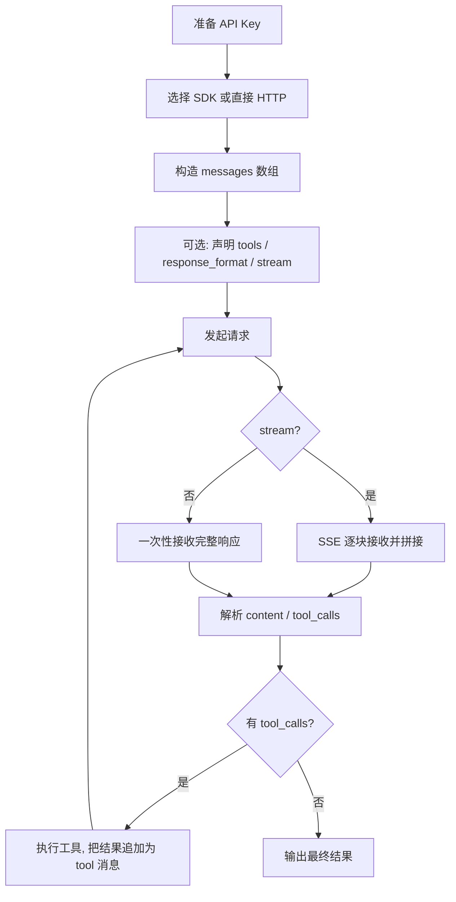

# LLM API 接口与调用实例

## 定义

LLM API 是大语言模型厂商对外提供的** HTTP/SDK 编程接口**，让开发者把模型能力集成到自己的应用中。当前主流厂商普遍采用"OpenAI 兼容"的 REST 风格（`/v1/chat/completions`），并以官方 SDK（Python/Node.js）封装鉴权、流式、工具调用等能力，降低集成门槛。

本篇聚焦**当前主流厂商的 API 形态与最小可运行调用实例**，覆盖 OpenAI、Anthropic、Google Gemini、以及 OpenAI 兼容的国产/开源模型（DeepSeek、通义、Kimi 等），并给出 Node.js 与 Python 双语言示例。

## 核心特点

1. **REST + SDK 双形态**：底层是 HTTP REST，上层提供 Python/Node.js/Go 等 SDK 封装。
2. **OpenAI 兼容成事实标准**：多数厂商提供与 OpenAI `/v1/chat/completions` 兼容的端点，可复用 OpenAI SDK 切换 `base_url`。
3. **流式响应**：SSE（Server-Sent Events）逐 token 返回，支持打字机效果与长文本。
4. **工具调用**：通过 `tools` 参数声明函数 schema，模型决定是否调用。
5. **多模态**：支持文本 + 图像（vision）+ 音频输入，部分支持图像/音频输出。
6. **结构化输出**：`response_format: { type: "json_schema" }` 强制模型输出符合 JSON Schema 的结构。
7. **鉴权统一**：Bearer Token（API Key）放在 `Authorization` 头。

## 主流厂商 API 速览

| 厂商 | 基座模型 | 端点风格 | SDK | 备注 |
|------|----------|----------|-----|------|
| OpenAI | GPT-4o / o系列 | `/v1/chat/completions` | openai（Py/JS） | 事实标准 |
| Anthropic | Claude Opus/Sonnet | `/v1/messages` | anthropic（Py/JS） | 自有协议，非完全兼容 |
| Google | Gemini 2.x | `/v1beta/models/generateContent` | google-genai | 自有协议 |
| DeepSeek | DeepSeek-V3/R1 | OpenAI 兼容 | openai（改 base_url） | 国产高性价比 |
| 阿里通义 | Qwen 系列 | OpenAI 兼容（DashScope） | openai / dashscope | 兼容模式 |
| 月之暗面 | Kimi K2 | OpenAI 兼容 | openai（改 base_url） | 长上下文 |
| 智谱 | GLM-4.6 | OpenAI 兼容 | openai / zhipuai | 兼容模式 |
| 开源自部署 | Llama/Qwen via vLLM | OpenAI 兼容 | openai（改 base_url） | 私有化 |

> 关键洞察：除 Anthropic 与 Google 外，多数厂商提供 OpenAI 兼容端点，**用 OpenAI SDK 改 `base_url` + `api_key` 即可切换模型**，无需改业务代码。

## 工作流程



## 一、OpenAI API

### 1.1 端点与参数

```
POST https://api.openai.com/v1/chat/completions
Authorization: Bearer $OPENAI_API_KEY
Content-Type: application/json
```

核心请求体：
```json
{
  "model": "gpt-4o",
  "messages": [
    {"role": "system", "content": "你是助手"},
    {"role": "user", "content": "用一句话解释 RAG"}
  ],
  "temperature": 0.7,
  "stream": false,
  "tools": [],
  "response_format": {"type": "json_schema", "json_schema": {}}
}
```

### 1.2 Python 调用实例

**安装**：`pip install openai`

**基本调用**：
```python
from openai import OpenAI

client = OpenAI()  # 默认读环境变量 OPENAI_API_KEY

resp = client.chat.completions.create(
    model="gpt-4o",
    messages=[
        {"role": "system", "content": "你是简洁的技术助手"},
        {"role": "user", "content": "用一句话解释 RAG"},
    ],
    temperature=0.7,
)
print(resp.choices[0].message.content)
```

**流式调用**：
```python
stream = client.chat.completions.create(
    model="gpt-4o",
    messages=[{"role": "user", "content": "写一首关于秋天的诗"}],
    stream=True,
)
for chunk in stream:
    delta = chunk.choices[0].delta.content
    if delta:
        print(delta, end="", flush=True)
```

**结构化输出（JSON Schema）**：
```python
from pydantic import BaseModel

class City(BaseModel):
    name: str
    population: int

resp = client.beta.chat.completions.parse(
    model="gpt-4o",
    messages=[{"role": "user", "content": "提取北京的城市名与人口"}],
    response_format=City,
)
city = resp.choices[0].message.parsed  # City 实例
print(city.name, city.population)
```

### 1.3 Node.js 调用实例

**安装**：`npm install openai`

**基本调用**：
```javascript
import OpenAI from "openai";

const client = new OpenAI(); // 默认读环境变量 OPENAI_API_KEY

const resp = await client.chat.completions.create({
  model: "gpt-4o",
  messages: [
    { role: "system", content: "你是简洁的技术助手" },
    { role: "user", content: "用一句话解释 RAG" },
  ],
  temperature: 0.7,
});
console.log(resp.choices[0].message.content);
```

**流式调用**：
```javascript
const stream = await client.chat.completions.create({
  model: "gpt-4o",
  messages: [{ role: "user", content: "写一首关于秋天的诗" }],
  stream: true,
});
for await (const chunk of stream) {
  const delta = chunk.choices[0]?.delta?.content;
  if (delta) process.stdout.write(delta);
}
```

## 二、Anthropic Claude API

### 2.1 端点与参数

```
POST https://api.anthropic.com/v1/messages
x-api-key: $ANTHROPIC_API_KEY
anthropic-version: 2023-06-01
Content-Type: application/json
```

核心请求体：
```json
{
  "model": "claude-opus-4-5",
  "max_tokens": 1024,
  "system": "你是助手",
  "messages": [
    {"role": "user", "content": "用一句话解释 RAG"}
  ]
}
```

> 注意：Claude 的 `system` 是顶层字段而非 messages 内的一条；`max_tokens` 必填。

### 2.2 Python 调用实例

**安装**：`pip install anthropic`

```python
from anthropic import Anthropic

client = Anthropic()  # 默认读环境变量 ANTHROPIC_API_KEY

resp = client.messages.create(
    model="claude-opus-4-5",
    max_tokens=1024,
    system="你是简洁的技术助手",
    messages=[{"role": "user", "content": "用一句话解释 RAG"}],
)
print(resp.content[0].text)
```

**流式调用**：
```python
with client.messages.stream(
    model="claude-opus-4-5",
    max_tokens=1024,
    messages=[{"role": "user", "content": "写一首关于秋天的诗"}],
) as stream:
    for text in stream.text_stream:
        print(text, end="", flush=True)
```

### 2.3 Node.js 调用实例

**安装**：`npm install @anthropic-ai/sdk`

```javascript
import Anthropic from "@anthropic-ai/sdk";

const client = new Anthropic(); // 默认读环境变量 ANTHROPIC_API_KEY

const resp = await client.messages.create({
  model: "claude-opus-4-5",
  max_tokens: 1024,
  system: "你是简洁的技术助手",
  messages: [{ role: "user", content: "用一句话解释 RAG" }],
});
console.log(resp.content[0].text);
```

## 三、Google Gemini API

### 3.1 端点与参数

```
POST https://generativelanguage.googleapis.com/v1beta/models/gemini-2.0-flash:generateContent?key=$GEMINI_API_KEY
```

核心请求体：
```json
{
  "contents": [
    {"parts": [{"text": "用一句话解释 RAG"}]}
  ]
}
```

> 注意：Gemini 用 `contents` 而非 `messages`，文本放在 `parts[].text`。

### 3.2 Python 调用实例

**安装**：`pip install google-genai`

```python
from google import genai

client = genai.Client()  # 默认读环境变量 GEMINI_API_KEY

resp = client.models.generate_content(
    model="gemini-2.0-flash",
    contents="用一句话解释 RAG",
)
print(resp.text)
```

### 3.3 Node.js 调用实例

**安装**：`npm install @google/genai`

```javascript
import { GoogleGenAI } from "@google/genai";

const client = new GoogleGenAI({}); // 默认读环境变量 GEMINI_API_KEY

const resp = await client.models.generateContent({
  model: "gemini-2.0-flash",
  contents: "用一句话解释 RAG",
});
console.log(resp.text);
```

## 四、OpenAI 兼容端点（DeepSeek / 通义 / Kimi / GLM / vLLM）

这是**最实用的模式**：用 OpenAI SDK，只改 `base_url` 与 `api_key`，即可切换到任意兼容厂商。

### 4.1 各厂商兼容端点

| 厂商 | base_url | 模型名示例 |
|------|----------|-----------|
| DeepSeek | `https://api.deepseek.com/v1` | `deepseek-chat` / `deepseek-reasoner` |
| 通义（兼容模式） | `https://dashscope.aliyuncs.com/compatible-mode/v1` | `qwen-plus` |
| Kimi | `https://api.moonshot.cn/v1` | `moonshot-v1-32k` / `kimi-k2` |
| 智谱 GLM | `https://open.bigmodel.cn/api/paas/v4` | `glm-4.6` |
| vLLM 自部署 | `http://localhost:8000/v1` | 任意本地模型名 |

### 4.2 Python 调用实例（以 DeepSeek 为例）

```python
from openai import OpenAI

client = OpenAI(
    api_key="your-deepseek-key",
    base_url="https://api.deepseek.com/v1",
)

resp = client.chat.completions.create(
    model="deepseek-chat",
    messages=[{"role": "user", "content": "用一句话解释 RAG"}],
)
print(resp.choices[0].message.content)
```

### 4.3 Node.js 调用实例（以 Kimi 为例）

```javascript
import OpenAI from "openai";

const client = new OpenAI({
  apiKey: process.env.MOONSHOT_API_KEY,
  baseURL: "https://api.moonshot.cn/v1",
});

const resp = await client.chat.completions.create({
  model: "kimi-k2",
  messages: [{ role: "user", content: "用一句话解释 RAG" }],
});
console.log(resp.choices[0].message.content);
```

### 4.4 vLLM 自部署调用

vLLM 启动后默认暴露 OpenAI 兼容端点：
```bash
vllm serve Qwen/Qwen2.5-7B-Instruct --port 8000
```

调用（Python）：
```python
from openai import OpenAI

client = OpenAI(
    api_key="EMPTY",                      # vLLM 默认不校验
    base_url="http://localhost:8000/v1",
)
resp = client.chat.completions.create(
    model="Qwen/Qwen2.5-7B-Instruct",    # 与启动时模型名一致
    messages=[{"role": "user", "content": "你好"}],
)
print(resp.choices[0].message.content)
```

## 五、工具调用（Function Calling）实例

以 OpenAI 为例，声明工具让模型决定调用：

### 5.1 Python

```python
import json

tools = [{
    "type": "function",
    "function": {
        "name": "get_weather",
        "description": "获取指定城市的天气",
        "parameters": {
            "type": "object",
            "properties": {
                "city": {"type": "string", "description": "城市名"}
            },
            "required": ["city"],
        },
    },
}]

resp = client.chat.completions.create(
    model="gpt-4o",
    messages=[{"role": "user", "content": "北京今天天气怎么样？"}],
    tools=tools,
)

msg = resp.choices[0].message
if msg.tool_calls:
    call = msg.tool_calls[0]
    args = json.loads(call.function.arguments)  # {"city": "北京"}
    # 执行真实工具，拿到结果
    result = get_weather(args["city"])
    # 把结果回传给模型
    resp2 = client.chat.completions.create(
        model="gpt-4o",
        messages=[
            {"role": "user", "content": "北京今天天气怎么样？"},
            msg,
            {"role": "tool", "tool_call_id": call.id, "content": str(result)},
        ],
        tools=tools,
    )
    print(resp2.choices[0].message.content)
```

### 5.2 Node.js

```javascript
const tools = [{
  type: "function",
  function: {
    name: "get_weather",
    description: "获取指定城市的天气",
    parameters: {
      type: "object",
      properties: { city: { type: "string", description: "城市名" } },
      required: ["city"],
    },
  },
}];

const resp = await client.chat.completions.create({
  model: "gpt-4o",
  messages: [{ role: "user", content: "北京今天天气怎么样？" }],
  tools,
});

const msg = resp.choices[0].message;
if (msg.tool_calls?.length) {
  const call = msg.tool_calls[0];
  const args = JSON.parse(call.function.arguments);
  const result = await getWeather(args.city);
  const resp2 = await client.chat.completions.create({
    model: "gpt-4o",
    messages: [
      { role: "user", content: "北京今天天气怎么样？" },
      msg,
      { role: "tool", tool_call_id: call.id, content: String(result) },
    ],
    tools,
  });
  console.log(resp2.choices[0].message.content);
}
```

## 六、多模态（Vision）调用实例

以 OpenAI GPT-4o 为例，传入图像（base64 或 URL）：

### 6.1 Python

```python
resp = client.chat.completions.create(
    model="gpt-4o",
    messages=[{
        "role": "user",
        "content": [
            {"type": "text", "text": "这张图里有什么？"},
            {"type": "image_url", "image_url": {"url": "https://example.com/cat.jpg"}},
        ],
    }],
)
print(resp.choices[0].message.content)
```

### 6.2 Node.js

```javascript
const resp = await client.chat.completions.create({
  model: "gpt-4o",
  messages: [{
    role: "user",
    content: [
      { type: "text", text: "这张图里有什么？" },
      { type: "image_url", image_url: { url: "https://example.com/cat.jpg" } },
    ],
  }],
});
console.log(resp.choices[0].message.content);
```

## 优缺点

### 优点

- **低门槛集成**：SDK 封装鉴权与流式，几行代码即可调用。
- **OpenAI 兼容生态**：一次封装，多厂商复用，切换模型只改 `base_url`。
- **能力丰富**：流式、工具调用、结构化输出、多模态开箱即用。
- **按量付费**：无需自建 GPU，按 token 计费，弹性伸缩。

### 缺点

- **延迟与限流**：网络往返与厂商限流影响实时性。
- **成本不可控**：高频调用成本累积，需做缓存与预算控制。
- **数据合规**：敏感数据出域风险，需评估合规与私有化部署。
- **厂商差异**：Anthropic/Google 协议不兼容，跨厂商迁移需改代码。
- **版本漂移**：模型版本迭代快，行为可能变化，需锁定版本做回归。

## 注意事项

1. **密钥管理**：API Key 用环境变量/密钥管理服务，绝不硬编码或提交到仓库。
2. **锁定模型版本**：生产环境显式指定模型版本（如 `gpt-4o-2024-11-20`），避免静默升级导致行为漂移。
3. **错误与重试**：处理 429（限流）/5xx，做指数退避重试，避免雪崩。
4. **流式拼接**：流式响应需自行拼接 `delta.content`，注意空块与结束信号。
5. **token 预算**：监控 prompt + completion token，设上限防止成本失控。
6. **缓存层**：对相同请求做缓存（如 Redis），降低重复调用成本与延迟。
7. **超时设置**：SDK 与 HTTP 层都设超时，避免长请求挂死。
8. **私有化评估**：敏感场景考虑 vLLM 自部署 + OpenAI 兼容端点，数据不出域。
9. **结构化输出校验**：即使声明 `response_format`，仍需校验返回 JSON，模型偶有不合规。
10. **工具调用循环**：工具调用可能多轮，需循环处理 `tool_calls` 直到模型给出最终文本。

## 与相邻范式的关系

| 范式 | 关系 |
|------|------|
| Function Calling | LLM API 的 `tools` 参数是其实现基础 |
| RAG | 检索结果通过 LLM API 的 messages 注入 |
| Agent | Agent 循环每步调用 LLM API 决策 |
| MCP | MCP Server 暴露的工具最终经 LLM API 的 tools 调用 |
| Fine-tuning | 微调后的模型仍通过相同 API 调用 |

## 参考资料

- OpenAI API 文档：https://platform.openai.com/docs/api-reference
- Anthropic API 文档：https://docs.anthropic.com/en/api
- Google Gemini API：https://ai.google.dev/gemini-api/docs
- DeepSeek API 文档：https://api-docs.deepseek.com/
- 通义 DashScope 兼容模式：https://help.aliyun.com/zh/model-studio/developer-reference
- Kimi（Moonshot）API：https://platform.moonshot.cn/docs
- 智谱 GLM API：https://open.bigmodel.cn/dev/api
- vLLM OpenAI 兼容服务：https://docs.vllm.ai/en/latest/serving/openai_compatible_server.html