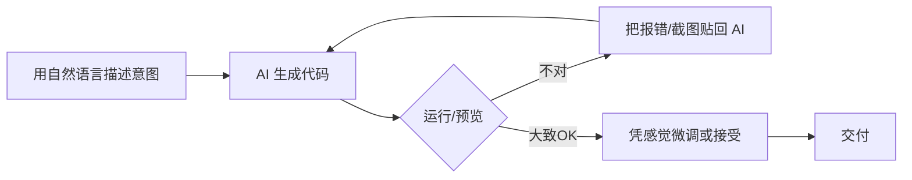

# Vibe Coding（氛围编程）

## 定义

Vibe Coding（氛围编程，直译"凭感觉编程"）由 OpenAI 联合创始人、特斯拉前 AI 总监 **Andrej Karpathy** 于 2025 年 2 月在社交媒体上正式提出。其核心理念是：**开发者用自然语言向 AI 描述意图，AI 生成代码，开发者基于"感觉/直觉"（vibe）接受或微调结果，而不逐行审查代码本身**。

Karpathy 的原话大意是："我大部分时间只是对着模型说话，它写出代码，我运行一下，如果不对就把报错贴回去，让它改。我几乎不看它写了什么——这就是 vibe coding。"

这是一种把 LLM 当作"黑盒代码生成器"、把人从"代码作者"转变为"意图表达者 + 结果验收者"的极端协作姿态。

## 核心特点

1. **自然语言优先**：主要交互媒介是自然语言（中英文皆可），而非伪代码或详细设计文档。
2. **弱审查 / 不审查**：开发者不逐行阅读生成代码，而是通过运行结果、UI 表现、测试通过与否来判断。
3. **试错驱动**：靠"运行→报错→贴回模型→再运行"的快速循环收敛，而非静态推理。
4. **意图模糊可接受**：允许"做个看起来不错的登录页"这类模糊需求，由模型自由发挥。
5. **工具链轻量**：通常只需一个支持长上下文的对话式编码助手（如 Cursor、Claude Code、Copilot Chat、ChatGPT/Claude 原生界面）。
6. **产出即弃**：代码常被视为"一次性产物"，重构、可维护性让位于"先跑起来"。

## 工作流程

典型步骤：

1. **描述意图**：用一两句话或一段语音说明想要什么（"帮我写一个能拖拽排序的待办列表，用 React + Tailwind"）。
2. **AI 生成**：模型一次性或分步产出完整文件。
3. **快速验证**：直接运行 / 预览 / 跑测试，不细读实现。
4. **反馈循环**：把报错信息、控制台日志、甚至截图丢回模型，让它自纠。
5. **接受或微调**：当"感觉对了"即收工，必要时让模型做小调整。

## 优缺点

### 优点

- **门槛极低**：非专业开发者（产品、设计、运营）也能快速做出可运行的原型。
- **速度极快**：从想法到 MVP 可能只需几十分钟，适合探索期。
- **降低认知负荷**：不必在脑中维护语法与 API 细节，专注意图与体验。
- **激发创意**：模糊需求反而让模型给出意想不到的实现路径。

### 缺点

- **质量不可控**：不审查意味着安全漏洞、性能问题、坏味道可能被静默引入。
- **可维护性差**：代码常缺乏结构、命名随意、重复堆砌，后续接手困难。
- **调试黑盒化**：出问题时，因为没读过代码，定位成本反而更高。
- **知识不沉淀**：开发者学不到底层原理，长期依赖会削弱工程能力。
- **不适合严肃生产**：在合规、安全、长生命周期项目上风险显著。

## 实战示例

**场景**：一个运营同学想做一个"上传图片自动生成九宫格朋友圈配图"的小工具。

Vibe Coding 风格的对话可能是：

> 我：帮我做一个网页，用户上传一张图，自动切成 3×3 九宫格，可以一键下载全部。用 HTML+JS 单文件，不要框架，要好看一点，配色用莫兰迪。
>
> AI：（生成一个 self-contained HTML，含 canvas 切图、下载逻辑、莫兰迪配色 CSS）
>
> 我：（浏览器打开，发现下载是逐个弹窗）→ 把下载是逐个弹窗的，改成打包成一个 zip 下载。
>
> AI：（引入 JSZip CDN，改写下载逻辑）
>
> 我：（再跑，OK）→ 收工。

整个过程运营同学没有读一行 JS，只看效果与报错。

## 注意事项

1. **明确适用边界**：原型、Demo、个人项目、一次性脚本适合；金融、医疗、核心业务系统慎用。
2. **至少跑测试**：即便不读代码，也要有自动化测试或冒烟用例兜底，避免"看起来对其实错"。
3. **保留可回退**：用 Git 频繁提交，方便在"感觉不对"时回滚。
4. **关键路径仍需人审**：涉及鉴权、支付、数据迁移的代码，务必人工 review。
5. **警惕"幻觉 API"**：模型可能调用不存在的函数或过时 API，运行报错是唯一可靠信号。
6. **隐私与合规**：不要把敏感数据/密钥贴进对话，注意所用模型的训练数据政策。

## 对比与选型建议

| 维度 | Vibe Coding | Agentic Coding | 传统手写 |
|------|-------------|----------------|----------|
| 人的角色 | 意图表达 + 结果验收 | 监督者 / 审批者 | 代码作者 |
| 代码审查 | 弱 / 不审查 | 中等（看 Agent 日志） | 强（逐行） |
| 自主性 | 低（人主导循环） | 高（Agent 自循环） | 无 |
| 适合场景 | 原型/玩具/一次性 | 中等复杂任务 | 严肃生产 |
| 质量风险 | 高 | 中 | 低 |

**选型建议**：当你追求"快出原型、不在乎长期维护"时用 Vibe Coding；当任务有明确目标但步骤复杂时升级到 Agentic Coding；当代码要长期演进、多人协作时回归传统 + AI 辅助（Pair Programming）。

## 参考资料

- Andrej Karpathy, "Vibe Coding" 原始推文（2025-02）
- Simon Willison 对 Vibe Coding 的系列评论
- "There's no speed limit" —— 关于 vibe coding 的争议与反思
- 实践工具：Cursor、Claude Code、GitHub Copilot Chat、ChatGPT/Claude 原生界面