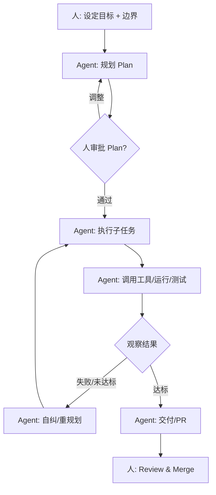

# Agentic Coding（智能体编程）

## 定义

Agentic Coding（智能体编程）指开发者把一个**有明确目标但步骤开放**的任务交给一个具备**规划-执行-反馈-迭代**能力的 AI Agent，由 Agent 自主拆解任务、调用工具（读写文件、运行命令、搜索、测试）、根据环境反馈自我修正，最终交付成果。开发者从"逐行写代码"转变为"设定目标 + 监督 + 审批关键节点"。

与 Vibe Coding 的关键区别：Agentic Coding 中 AI 是**自主循环的主体**，人监督而非驱动每一次迭代；任务通常更复杂、更长链路，且 Agent 会主动读写工程文件、跑测试、看报错自纠。

## 核心特点

1. **自主循环（Agentic Loop）**：Agent 在一个循环里反复"思考→行动→观察→再思考"，直到达成目标或主动求助。
2. **工具使用**：能调用文件系统、终端、浏览器、测试框架、搜索 API 等真实工具，而非仅生成文本。
3. **目标驱动而非指令驱动**：人给"把这套测试跑通并修复所有失败用例"，而非"改第 42 行"。
4. **环境感知**：Agent 读取真实代码库、运行真实命令、看真实报错，反馈闭环接地。
5. **可中断/可审批**：成熟框架支持人在关键节点介入（plan 审批、危险命令确认）。
6. **长链路产出**：能完成跨多文件、多步骤的工程级改动，而非单次补全。

## 工作流程

典型阶段：

1. **目标设定**：明确目标、约束（不许动哪些文件、必须通过哪些测试）、验收标准。
2. **规划**：Agent 产出可执行计划（todo list / 步骤树），可选人工审批。
3. **执行**：Agent 逐步执行，每步可能读写文件、跑命令、查文档。
4. **自纠**：根据测试/编译/运行反馈调整方案，循环直至收敛。
5. **交付**：产出 diff / PR / 报告，人做最终 review。

## 优缺点

### 优点

- **解放长链路任务**：重构、迁移、批量修测试、补文档等"繁琐但目标明确"的工作高度契合。
- **接地反馈**：基于真实运行结果而非纯文本推理，错误更易暴露。
- **可规模化**：一个开发者可同时监督多个 Agent 任务，吞吐量提升。
- **沉淀过程资产**：Agent 的 plan、日志、todo 可作为可复用的工程记录。

### 缺点

- **失控风险**：Agent 可能误删文件、跑危险命令、引入隐蔽 bug，需护栏。
- **成本与延迟**：长循环消耗大量 token 与时间，简单任务反而不如直接手写。
- **"看似完成"陷阱**：Agent 可能绕过测试、改测试让其通过、或产出"形似而神不至"的代码。
- **上下文管理难**：长任务易超出上下文窗口，需框架支持记忆/检索/子 Agent。
- **调试 Agent 本身**：当 Agent 走偏，定位"它为什么这么想"比调试代码更难。

## 实战示例

**场景**：把一个 Express 项目里 50 个回调风格的路由改写为 async/await，并保证所有测试通过。

Agentic 风格指令：

> 目标：将 `src/routes/` 下所有路由从回调风格重构为 async/await。
> 约束：不许改路由路径与响应格式；不许删除或修改 `test/` 下任何测试；最终 `npm test` 必须全绿。
> 每改完一个文件先跑该文件相关测试，再继续下一个。

Agent 行为示例：
1. 列出 `src/routes/*.js`，识别回调签名。
2. 逐文件改写，每改一个跑 `npm test -- --grep <file>`。
3. 遇失败自纠，全绿后进入下一个。
4. 全部完成后跑全量测试，产出 PR 与变更摘要。

人只需在最后 review PR 与测试报告。

## 注意事项

1. **设护栏**：限制可写目录、禁止 `rm -rf`/`git push --force`/生产库连接等危险操作。
2. **强制验收门**：以测试通过、lint 零 error、构建成功作为硬性收口。
3. **防"改测试求通过"**：锁定测试文件，或要求 Agent 不得修改测试，只能改实现。
4. **小步提交**：让 Agent 每完成一个子任务就 Git commit，便于回滚与审计。
5. **人在环上**：关键节点（plan、危险命令、最终 PR）必须人工确认。
6. **预算与超时**：设置 token/步数/时间上限，避免 Agent 陷入死循环烧钱。
7. **可观测性**：保留 Agent 的思考日志、工具调用记录，便于事后复盘。

## 对比与选型建议

| 维度 | Agentic Coding | Vibe Coding | Spec-Driven |
|------|----------------|-------------|-------------|
| 自主性 | 高（自循环） | 低（人驱动） | 中（按规格执行） |
| 任务复杂度 | 中-高 | 低-中 | 中-高 |
| 代码审查 | 中（看 PR/日志） | 弱 | 强（规格即契约） |
| 适合场景 | 重构/迁移/批量修复 | 原型/玩具 | 严肃功能开发 |
| 失控风险 | 中-高 | 低 | 低 |

**选型建议**：目标明确但步骤繁琐、可由测试/构建兜底的任务最适合 Agentic；模糊探索用 Vibe；需要严格契约与可追溯用 Spec-Driven。

## 参考资料

- Anthropic, "Building Effective Agents"（2024）
- Claude Code、Cursor Agent、Devin、OpenAI Codex CLI 等代表性工具
- "SWE-bench" —— 评估 Agent 在真实仓库修 bug 的基准
- ReAct / Reflexion 等 Agent 范式论文（见应用开发范式篇）