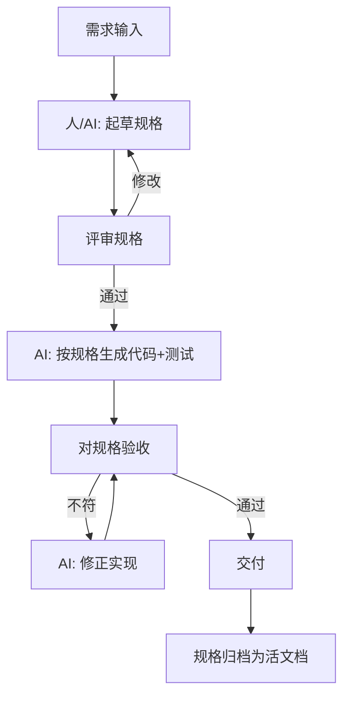

# Spec-Driven Development（规格驱动开发）

## 定义

Spec-Driven Development（规格驱动开发，SDD）指在让 AI 写代码之前，**先以结构化"规格（Spec）"明确需求、约束、验收标准**，再由 AI（或人 + AI）按规格实现，并以规格作为验收契约与可追溯依据。规格可以是需求文档、API 契约（OpenAPI/GraphQL Schema）、设计稿、ADR、测试用例，甚至是可执行的规约语言（如 TLA+/Alloy/形式化规约）。

与 Vibe Coding 的区别：SDD 强调**先写清楚再动手**，把模糊意图固化为可验证的契约；与 Agentic 的区别：SDD 的核心是"规格即护栏"，Agent 仍可自主执行，但必须对齐规格而非自由发挥。

## 核心特点

1. **规格先行**：实现前产出可读、可评审、可变更的规格文档。
2. **规格即契约**：实现与验收都以规格为准，偏离规格即缺陷。
3. **可追溯**：每条需求/验收点可追溯到代码与测试。
4. **多形态规格**：自然语言需求、API Schema、UI 设计稿、测试用例、形式化规约皆可。
5. **AI 按规格生成**：把规格作为上下文喂给 AI，产出对齐规格的代码与测试。
6. **规格可演进**：需求变化先改规格，再让 AI 重新对齐，避免"代码先行、文档腐烂"。

## 工作流程

典型阶段：

1. **起草规格**：人（可借助 AI）写需求、用户故事、API 契约、验收标准。
2. **评审**：团队/利益相关方评审规格，澄清歧义。
3. **生成**：把规格作为上下文，让 AI 生成实现与测试，确保覆盖验收点。
4. **验收**：以规格逐条核对实现与测试，不符则让 AI 修正。
5. **归档与演进**：规格随需求演进，保持与代码同步，成为活文档。

## 优缺点

### 优点

- **质量可控**：契约清晰，AI 产出有据可依，减少"形似而神不至"。
- **可追溯**：需求→规格→代码→测试全链路可追，便于审计与回归。
- **协作友好**：规格是非工程人员也能评审的接口，降低沟通成本。
- **降低返工**：先对齐再实现，避免"写完发现理解错了"。
- **适配 Agent**：规格是 Agent 的最佳"目标 + 验收"，降低失控风险。

### 缺点

- **前期成本高**：写规格本身是工程，原型期可能过重。
- **规格腐烂风险**：若不维护，规格与代码会脱节，反而误导。
- **过度形式化陷阱**：追求完美规约可能陷入"分析瘫痪"。
- **模糊需求难规格化**：探索性产品/创意类需求，规格化反而扼杀迭代。
- **依赖 AI 对齐能力**：AI 若不严格遵循规格，SDD 退化为"文档 + 自由发挥"。

## 实战示例

**场景**：为一个订单服务新增"优惠券叠加规则"。

SDD 风格：

1. **规格**（节选）：
   - 规则 R1：满减券与折扣券不可叠加。
   - 规则 R2：品类券可与满减券叠加，但总优惠不超过订单金额 50%。
   - 验收 A1：给定满减券 + 折扣券，系统应拒绝叠加并返回错误码 `COUPON_CONFLICT`。
   - 验收 A2：给定品类券 + 满减券，优惠超 50% 时应截断至 50% 并记录截断日志。
2. **生成**：把规格喂给 AI，产出 `applyCoupons(order, coupons)` 实现与对应单测。
3. **验收**：跑测试，A1 通过；A2 发现未记日志，让 AI 补日志逻辑，再跑全绿。
4. **归档**：规格与代码同库，后续规则变更先改规格再重新生成。

## 注意事项

1. **规格粒度适中**：太细则退化为伪代码，太粗则失去约束力；聚焦"行为契约 + 验收点"。
2. **验收可执行**：尽量让验收点对应可运行测试，避免"文档验收"流于主观。
3. **保持活文档**：规格与代码同仓库、同评审、同变更，防止腐烂。
4. **区分阶段**：探索期可轻规格（用户故事卡），稳定期再升格为正式契约。
5. **形式化慎用**：形式化规约（TLA+/Alloy）适合关键系统，普通业务用自然语言 + 测试即可。
6. **AI 对齐校验**：生成后用"规格 vs 实现"的对照检查（如让 AI 自查是否覆盖每条验收）。

## 对比与选型建议

| 维度 | Spec-Driven | Vibe Coding | Agentic |
|------|-------------|-------------|---------|
| 前期投入 | 高 | 极低 | 中 |
| 质量可控 | 高 | 低 | 中 |
| 可追溯 | 强 | 无 | 中 |
| 适合阶段 | 稳定/生产 | 探索/原型 | 重构/迁移 |
| 模糊需求适配 | 差 | 好 | 中 |

**选型建议**：严肃功能开发、合规/审计要求高、多人协作场景用 SDD；早期探索用 Vibe；繁琐长链路任务用 Agentic + SDD（规格作 Agent 护栏）。

## 参考资料

- "Spec-Driven Development with AI" 系列文章（Herb Caudill 等）
- OpenAPI / GraphQL Schema 作为 API 契约的实践
- TLA+ / Alloy 形式化规约在关键系统中的应用
- BDD（Behavior-Driven Development）与 SDD 的渊源：Cucumber/Gherkin