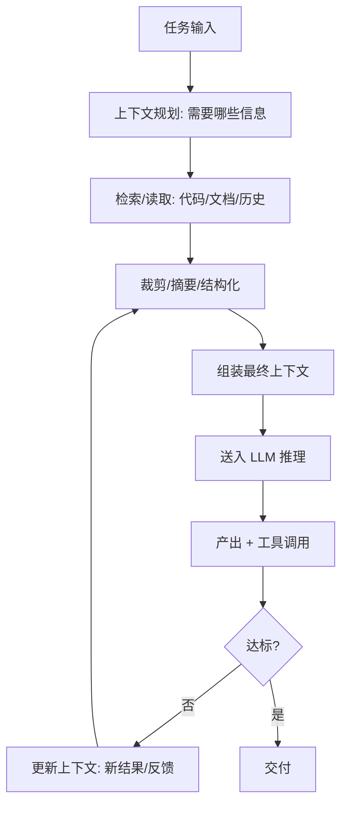

# Context Engineering（上下文工程）

## 定义

Context Engineering（上下文工程）指**系统化地设计、组织、检索、压缩与维护送给 LLM 的上下文**，使模型在"正确的时间、以正确的形式、获得正确的信息"，从而显著提升输出质量与稳定性。它被视为 Prompt Engineering 的升级与超集：Prompt Engineering 关注"怎么说"，Context Engineering 关注"给模型看什么"。

在 Agentic Coding / 长任务场景下，上下文工程尤为关键——上下文窗口有限、信息易淹没、长程记忆易丢失，工程化地管理上下文成为决定 Agent 成败的核心能力。

## 核心特点

1. **信息选材**：决定哪些文件、文档、报错、历史进入上下文，哪些被排除。
2. **检索注入**：用 RAG / 代码库检索 / 符号搜索动态拉取相关片段，而非全量塞入。
3. **压缩与摘要**：长对话/长日志做摘要、去冗余，保留关键决策与约束。
4. **分层与分窗**：系统提示、长期记忆、短期会话、当前任务分层组织。
5. **工具结果治理**：对工具输出（命令日志、搜索结果）做裁剪/结构化，避免噪声淹没。
6. **可观测与迭代**：记录实际送入的上下文，事后分析"模型为何这么想"，持续优化。

## 工作流程



关键实践：

1. **上下文清单**：为每类任务定义"必备上下文"（如修 bug 需：报错栈、相关文件、相关测试、复现步骤）。
2. **动态检索**：基于当前任务语义检索代码库片段，而非把整个仓库塞进去。
3. **结构化封装**：用 XML/Markdown 标签把不同来源信息分区（`<file>...</file>`、`<error>...</error>`），便于模型定位。
4. **记忆机制**：长期记忆（项目规范、已做决策）+ 短期记忆（本次会话进展），必要时落盘。
5. **噪声治理**：命令输出只保留关键行，搜索结果只留 top-k，避免上下文膨胀。
6. **回放与归因**：保存每次推理的实际上下文，便于复盘"模型为何走偏"。

## 优缺点

### 优点

- **质量提升显著**：在正确信息下推理，幻觉与"形似而神不至"大幅减少。
- **长任务可控**：摘要与分层记忆让 Agent 在长链路中保持目标不漂移。
- **成本优化**：精准选材减少无效 token，降低费用与延迟。
- **可复现**：上下文可记录可回放，便于调试与团队协作。
- **适配大仓库**：配合检索，让 Agent 在超大规模代码库中也能聚焦相关部分。

### 缺点

- **工程量大**：需要设计检索、记忆、压缩管线，初期投入高。
- **检索质量瓶颈**：RAG 召回不准会引入错误信息，反而误导模型。
- **摘要损失**：压缩可能丢掉关键细节，需平衡保真与省 token。
- **调试复杂**：问题可能出在上下文组装而非模型，定位需新工具与方法。
- **过度工程风险**：简单任务上重型上下文工程得不偿失。

## 实战示例

**场景**：Agent 修复一个跨 5 个微服务的报错。

上下文工程做法：

1. **清单**：报错栈、涉及服务的入口文件、相关接口契约、最近一次相关变更的 commit、相关测试。
2. **检索**：用报错栈中的函数名做符号搜索，拉取定义与调用方；用接口名查 OpenAPI 文档片段。
3. **裁剪**：命令日志只保留 `Error:` 起 20 行；搜索结果每项只留签名 + 前 30 行。
4. **结构化**：
   ```
   <error>...</error>
   <service-A entry>...</service-A entry>
   <contract>...</contract>
   <recent-change>...</recent-change>
   <task>定位根因并给出最小修复</task>
   ```
5. **记忆**：把"已确认服务 B 无问题"写入短期记忆，避免重复排查。
6. **回放**：保存本次上下文，事后复盘 Agent 是否被某条噪声误导。

## 注意事项

1. **先清单后检索**：明确"这次推理需要什么"再去拉，避免无脑全量。
2. **检索要可评估**：建立召回/相关性评估，否则 RAG 是黑盒。
3. **分区与标签**：用明确标签分隔信息来源，帮助模型区分事实与假设。
4. **保留关键约束**：摘要时务必保留"不许做什么"类硬约束，最易被压缩丢失。
5. **版本化上下文模板**：不同任务类型用不同模板，纳入 Git 管理，持续迭代。
6. **警惕"上下文污染"**：错误信息一旦进入上下文会被模型当真，检索结果需可信度过滤。
7. **别忽视系统提示**：角色、风格、安全约束放在系统提示，稳定且权重高。

## 对比与选型建议

| 维度 | Context Engineering | Prompt Engineering |
|------|---------------------|--------------------|
| 关注点 | 给模型看什么 | 怎么对模型说 |
| 范围 | 信息选材/检索/记忆/压缩 | 措辞/格式/示例 |
| 适用 | 长任务/Agent/大仓库 | 单轮/短任务 |
| 工程量 | 高 | 低-中 |

**选型建议**：短任务/单轮用 Prompt Engineering 足矣；长任务/Agent/大仓库必须升级到 Context Engineering。两者是叠加而非替代关系。

## 参考资料

- "Context Engineering" 概念在 2025 年随 Agent 兴起被广泛讨论
- Anthropic / OpenAI 关于长上下文与 Agent 记忆的最佳实践
- RAG、代码库检索（如 Cursor 的 codebase indexing）相关实践
- "Lost in the Middle" —— 长上下文中信息位置对召回的影响