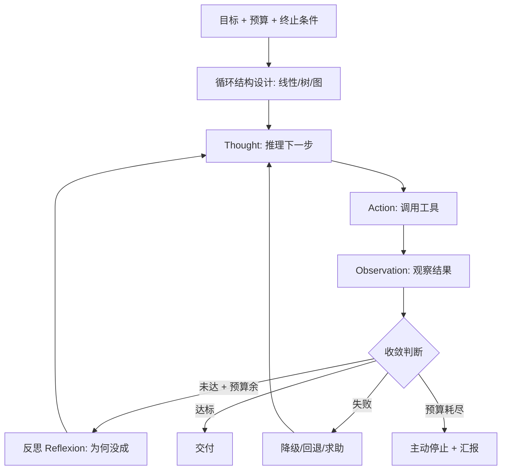

# Loop Engineering（循环工程）

## 定义

Loop Engineering（循环工程）指**把 AI Agent 的"思考-行动-观察"循环本身作为一等工程对象来设计、调优与治理**——不再只关注"对模型说什么"（Prompt Engineering）或"给模型看什么"（Context Engineering），而是把**循环的结构、步数、终止条件、反思机制、收敛策略、失败恢复**当作可设计、可观测、可迭代的系统组件。

它是 Agentic Coding / Agent 工作流在 2025-2026 走向成熟后浮现的范式：当 Agent 从"单轮生成"升级为"长链路自循环"，决定成败的不再是单次提示的好坏，而是**循环本身是否被工程化**——会不会死循环、能否收敛、何时求助、如何从失败恢复、怎样把人接入关键节点。

一句话：**Prompt Engineering 调措辞，Context Engineering 调信息，Loop Engineering 调"迭代过程本身"。**

## 核心特点

1. **循环即组件**：循环结构（线性/树/图、单线/并行/回溯）是可设计的架构决策，而非模型自由发挥。
2. **终止工程化**：明确收敛条件（目标达成、测试通过、预算耗尽、置信度阈值），而非"模型自己决定停"。
3. **反思与自纠**：在循环中插入反思步骤（Reflexion），让 Agent 复盘失败原因再重试，而非盲目重试。
4. **失败恢复**：对工具失败、上下文丢失、死循环设计降级与回退路径。
5. **人在环上节点**：把人工审批/纠偏作为循环中的显式节点，而非事后补救。
6. **可观测与可回放**：每一步思考、行动、观察可记录可回放，循环本身可调试。
7. **预算与护栏**：token/步数/时间/成本上限作为循环的一等约束。

## 与相邻范式的关系

| 范式 | 工程对象 | 一句话 |
|------|----------|--------|
| Prompt Engineering | 措辞 | 怎么对模型说 |
| Context Engineering | 信息 | 给模型看什么 |
| **Loop Engineering** | **迭代过程** | **模型怎么一圈圈转下去** |
| Spec-Driven | 契约 | 模型按什么标准收敛 |

三者叠加而非替代：好的 Agent 系统同时做提示、上下文、循环三层工程。Loop Engineering 是 Agentic Coding 从"能用"到"可靠"的关键跃迁。

## 工作流程

Loop Engineering 的设计要点：

1. **循环拓扑**：
   - **线性循环**：单 Agent 单线推进，最简单。
   - **树/回溯**：失败时回退到分叉点换策略。
   - **图/状态机**：用 LangGraph 等把流程显式建模为状态图，节点间转移可控。
2. **终止设计**：
   - 硬终止：最大步数、token 上限、超时。
   - 软终止：目标验收通过、置信度阈值、连续 N 步无进展即停。
3. **反思机制**：每隔 K 步或失败时插入"反思节点"，让 Agent 总结"哪里错了、下一步换什么策略"。
4. **收敛策略**：换工具、换检索、降级到更简单方案、求助人。
5. **人在环上**：在"规划审批""危险操作""最终交付"等节点插入人工门。
6. **可观测**：记录每步 thought/action/observation，支持回放与归因。

## 优缺点

### 优点

- **可靠性跃升**：工程化循环让 Agent 从"偶尔惊艳常翻车"变为"稳定收敛"。
- **可控成本**：预算与终止设计避免烧钱死循环。
- **可调试**：循环可记录可回放，"Agent 为何走偏"可归因。
- **适配复杂任务**：长链路、需回溯、需反思的任务靠裸循环难以收敛。
- **人在环上自然嵌入**：把人审批作为循环节点，而非打断流程。

### 缺点

- **工程量大**：设计状态图、终止条件、反思逻辑是实打实的系统工程。
- **过度工程风险**：简单任务上重型循环设计得不偿失。
- **调试新维度**：问题可能出在循环结构而非模型，需新工具与方法。
- **反思可能误导**：Agent 的自我反思本身可能错误，反而带偏后续。
- **状态管理复杂**：图/状态机的状态与转移需维护，易出 bug。

## 实战示例

**场景**：Agent 修复一个 flaky 测试，需多轮排查。

**裸循环（无 Loop Engineering）**：Agent 反复改代码、跑测试、再改……可能陷入"改了又坏、坏了又改"的死循环，烧光预算。

**Loop Engineering 风格**：

1. **循环拓扑**：状态图——`排查 → 假设 → 修复 → 验证 → (失败)反思 → 排查`。
2. **终止条件**：最多 10 步；连续 3 步无进展即停；测试连续 2 次全绿即收敛。
3. **反思节点**：每次验证失败后插入反思："上一假设错在哪？换什么策略？"——例如从"改代码"切换到"查并发时序"。
4. **降级**：3 次修复失败后降级为"把复现步骤与日志整理成报告，求助人"。
5. **人在环上**：涉及改测试或改公共配置时暂停等人审批。
6. **可观测**：全程记录，事后回放发现"第 4 步反思把方向带偏"，据此优化反思提示。

结果：Agent 在第 7 步收敛，而非死循环到预算耗尽。

## 注意事项

1. **先有裸循环再工程化**：先用最简循环跑通，再针对实际失败模式加工程，避免过早抽象。
2. **终止条件必设**：没有硬终止的循环迟早烧光预算，这是底线。
3. **反思要接地**：反思应基于具体观察（报错、测试输出），而非空泛"我再想想"。
4. **防反思误导**：反思本身是模型输出，可能错；可加"反思后换策略"的多样性约束。
5. **状态图优先于自由循环**：复杂任务用 LangGraph 等显式状态图，比让模型自由循环更可控。
6. **人在环上要轻**：审批节点过多会打断流，只设在不可逆/关键决策处。
7. **可观测是前提**：没有日志与回放，Loop Engineering 无从调试与迭代。
8. **别忽视上下文**：循环每步都会累积上下文，需与 Context Engineering 配合做压缩与记忆。

## 对比与选型建议

| 维度 | Loop Engineering | Context Engineering | Prompt Engineering |
|------|------------------|---------------------|--------------------|
| 工程对象 | 迭代过程 | 信息选材 | 措辞 |
| 适用 | 长链路 Agent | 长任务/大仓库 | 单轮/短任务 |
| 工程量 | 高 | 中-高 | 低 |
| 收益 | 可靠性/收敛 | 质量/降幻觉 | 格式/轻推理 |

**选型建议**：单轮任务只需 Prompt Engineering；长任务先做 Context Engineering 保证信息正确；当 Agent 需要多步自循环且要稳定收敛时，必须叠加 Loop Engineering。三者是 Agentic Coding 可靠性的三层基石。

## 参考资料

- "Building Effective Agents"（Anthropic，2024）—— 对 Agent 循环模式的分类
- "Reflexion: Language Agents with Verbal Reinforcement Learning"
- LangGraph 关于状态图、循环控制、人在环上的文档
- "Cognitive Architectures for Language Agents"（CoALA）
- Lilian Weng, "LLM Powered Autonomous Agents"（规划/反思/记忆章节）