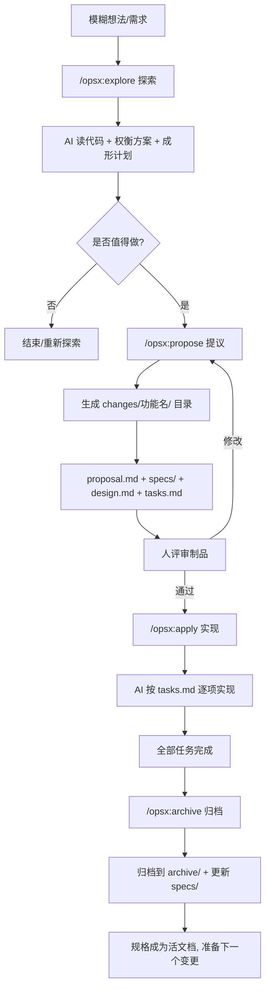

# OpenSpec（开放规格驱动开发）

## 定义

OpenSpec 是一套面向 AI 编程助手的**轻量级规格驱动开发（SDD）框架**——在让 AI 写代码之前，先用结构化的"变更（Change）"制品对齐需求与设计，再由 AI 按规格实现，最后归档变更、更新规格，形成"探索→提议→实现→归档"的闭环工作流。

它由 Fission-AI 开源（`@fission-ai/openspec`），核心理念是：**fluid not rigid（流畅而非僵化）、iterative not waterfall（迭代而非瀑布）、easy not complex（简单而非复杂）、built for brownfield（面向存量代码而非仅绿地）、scalable（从个人项目到企业可扩展）**。

与 Spec-Driven Development 的关系：OpenSpec 是 SDD 的一种**具体落地工具与工作流**，把"先写规格再实现"固化为可执行的 slash 命令与目录约定，降低 SDD 的上手门槛。与 Spec Kit（GitHub）相比更轻量、无刚性阶段门；与 Kiro（AWS）相比不锁定 IDE 与模型。

## 核心特点

1. **变更即制品**：每个功能/改动对应一个独立目录，含 `proposal.md`（为什么做）、`specs/`（需求与场景）、`design.md`（技术方案）、`tasks.md`（实现清单），人机共同维护。
2. **探索先行**：`/opsx:explore` 作为"无 stakes 思考伙伴"，先读代码、权衡方案、成形计划，再决定是否提议，避免"上来就写"。
3. **制品引导工作流**：`explore → propose → apply → archive` 四步闭环，每步产出可评审的制品，而非自由对话。
4. **流畅可迭代**：任何制品随时可改，无刚性阶段门（phase gate），适配敏捷与探索式开发。
5. **工具无关**：通过 slash 命令集成 25+ AI 助手（Claude Code、Cursor、Codex、Gemini CLI、Copilot 等），不锁定单一工具。
6. **棕地友好**：专为存量代码库设计，支持在已有项目上渐进式引入规格层。
7. **规格即活文档**：归档时更新 `specs/`，规格随代码演进，避免文档腐烂。

## 工作流程



### 命令参考

OpenSpec 有两类命令：**终端命令**（在 shell 中执行 `openspec ...`）与 **slash 命令**（在 AI 助手聊天中输入 `/opsx:...`）。两者混淆是最常见的入门坑——`openspec init` 在终端跑，`/opsx:propose` 在聊天框输入。

#### 终端命令（CLI）

| 命令 | 作用 | 何时用 |
|------|------|--------|
| `openspec init` | 在项目里装好 slash 命令文件、初始化 `openspec/` 目录 | 新项目第一次接入 |
| `openspec list` | 列出当前进行中的变更 | 查看活跃 changes |
| `openspec view` | 打开交互式仪表板浏览 specs 与 changes | 浏览/审阅（只读） |
| `openspec update` | 重新生成 slash 命令文件 | 切换 profile 后、命令消失时修复 |
| `openspec config profile` | 在 core / expanded 命令集之间切换 | 需要扩展命令时 |

#### Slash 命令 — 核心集（core profile，默认装）

| 命令 | 作用 | 产出 |
|------|------|------|
| `/opsx:explore` | 无 stakes 思考伙伴，读代码、权衡、成形计划 | 探索结论（不产生变更目录） |
| `/opsx:propose <name>` | 一步创建变更目录并生成四件套制品 | `changes/<name>/` 含 proposal/specs/design/tasks |
| `/opsx:apply` | 按 tasks.md 逐项实现 | 代码 + 测试 |
| `/opsx:sync [name]` | 把变更的 delta specs 合并进主 `specs/`（归档时自动调用） | 更新后的 `openspec/specs/`，变更保持活跃 |
| `/opsx:archive` | 归档变更、合并 specs | `changes/archive/<日期>-<name>/` + 更新后的 `specs/` |

> 推荐节奏：`explore` → `propose` → `apply` → `archive`。`/opsx:sync` 多数情况由 archive 自动处理，不必手动跑。

#### Slash 命令 — 扩展集（expanded profile，需 `openspec config profile` 切换后 `openspec update`）

| 命令 | 作用 | 何时用 |
|------|------|--------|
| `/opsx:new [name] [--schema <模板>]` | 仅创建变更目录骨架与 `.openspec.yaml`，不生成制品 | 想逐个手动创建 artifact |
| `/opsx:continue [name]` | 按依赖图创建**下一个** artifact | 复杂变更，每步要评审 |
| `/opsx:ff [name]` | 一次性按依赖顺序生成全部规划 artifact | 中小功能、思路清晰时 |
| `/opsx:verify [name]` | 三维度验证实现与 artifacts 是否吻合（完整性/正确性/一致性），分 CRITICAL/WARNING/SUGGESTION | 归档前自检 AI 产出 |
| `/opsx:bulk-archive [names...]` | 批量归档多个变更，自动检测并解决跨变更 spec 冲突 | 并行工作流，多个变更同时完成 |
| `/opsx:onboard` | 11 阶段引导式完整教程，在真实代码上跑一个完整变更 | 新用户上手最佳入口 |

#### 不同 Agent 的语法差异

| 工具 | 语法 |
|------|------|
| Claude Code | `/opsx:propose`（冒号） |
| Cursor / Windsurf / Copilot IDE | `/opsx-propose`（短横线） |
| Kimi CLI | `/skill:openspec-propose` |
| Trae | `/openspec-propose` |

> 不确定时，在 AI 聊天里输入 `/` 看自动补全。

### 变更目录结构

```
openspec/
  changes/
    add-dark-mode/          # 进行中的变更
      proposal.md           # 为什么做、改什么
      specs/                # 需求与场景（验收依据）
      design.md             # 技术方案
      tasks.md              # 实现清单（AI 按此执行）
    archive/
      2025-01-23-add-dark-mode/   # 已归档的变更
  specs/                    # 当前规格（活文档，随归档更新）
```

### 新项目从零接入

OpenSpec 是"CLI 在终端、slash 在聊天"的双层架构。新项目接入只需两步终端命令 + 一次 AI 对话验证：

```bash
# 1. 全局安装 CLI（任选其一）
npm install -g @fission-ai/openspec@latest
# 或: pnpm add -g @fission-ai/openspec@latest
# 或: yarn global add @fission-ai/openspec
# 或: bun add -g @fission-ai/openspec

# 2. 进入项目目录初始化
cd your-project
openspec init
```

`openspec init` 会做三件事：

1. 创建 `openspec/` 目录骨架（`changes/`、`specs/`、`archive/`、`config.yaml`）。
2. 检测你用的 AI 助手（Claude Code / Cursor / Windsurf / Copilot 等），把对应语法的 slash 命令文件写进各自的配置目录。
3. 询问是否启用 `expanded` profile（含 `/opsx:new`、`/opsx:continue`、`/opsx:ff`、`/opsx:verify` 等），默认 `core`。

初始化完成后**重启 AI 助手**，在聊天框输入 `/` 应能看到 `/opsx:explore`、`/opsx:propose` 等补全——这就是装好了。验证最稳的方式是跑一次 `/opsx:onboard`（需 expanded profile），它会在你的真实代码上走完一个完整变更并逐步解说。

> 命令文件丢失、或切换 profile 后跑 `openspec update` 重新生成；想换命令集跑 `openspec config profile` 再 `openspec update`。

存量项目（棕地）也用同一流程，无需重构——OpenSpec 是"为已有代码库加规格层"，不是"为规格层重写代码"。

## 优缺点

### 优点

- **可预测性**：人机在写代码前对齐规格，减少"形似而神不至"的 AI 产出。
- **轻量上手**：相比 Spec Kit 的重型阶段门，OpenSpec 流畅可迭代，无 Python 环境负担。
- **工具无关**：25+ AI 助手通用，不锁定 IDE/模型，团队可异构工具协作。
- **棕地友好**：专为存量代码设计，可渐进式引入，无需重构整个项目。
- **活文档**：归档即更新 specs，规格与代码同步，避免文档腐烂。
- **可追溯**：每个变更独立目录，需求→规格→设计→任务→代码全链路可追。

### 缺点

- **仍需纪律**：制品若不维护会腐烂，依赖团队坚持 explore→propose→apply→archive 闭环。
- **探索期可能过重**：极小改动走完整流程略显仪式感，需判断何时跳过 explore。
- **依赖高推理模型**：官方推荐 Codex 5.5 / Opus 4.7 等高推理模型，弱模型产出质量不稳定。
- **上下文卫生要求**：实现前需清理上下文窗口，上下文混乱会影响规格对齐质量。
- **学习曲线**：制品结构与命令体系需团队统一培训。

## 实战示例

**场景**：为现有项目加暗色模式。

```
You: /opsx:explore
AI:  让我看看你的样式方案……
     最干净路径：CSS 变量 + 小型 theme context + 系统偏好检测，
     无需新依赖。要限定范围吗？
You: 是，就这么做。

You: /opsx:propose add-dark-mode
AI:  已创建 openspec/changes/add-dark-mode/
     ✓ proposal.md — 为什么做、改什么
     ✓ specs/       — 需求与场景
     ✓ design.md    — 技术方案
     ✓ tasks.md     — 实现清单
     可以实现了！

You: /opsx:apply
AI:  正在实现任务……
     ✓ 1.1 添加 theme context provider
     ✓ 1.2 创建切换组件
     ✓ 2.1 添加 CSS 变量
     ✓ 2.2 接入 localStorage
     全部任务完成！

You: /opsx:archive
AI:  已归档到 openspec/changes/archive/2025-01-23-add-dark-mode/
     规格已更新。准备下一个变更。
```

## 完整接单流程：从一个需求到归档

下面以"客户要求给一个已有 Vue 项目加导出 PDF 功能"为例，把从接单到归档的完整操作列出来。**前提**：项目已 `openspec init` 完成（见上文「新项目从零接入」）。

| 步骤 | 在哪 | 操作 | 产出 |
|------|------|------|------|
| 1. 接需求 | 终端/笔记 | 把客户原话记下，提炼出"加 PDF 导出"这一模糊想法 | 一句话需求 |
| 2. 探索 | AI 聊天 | `/opsx:explore`，让 AI 读 `src/views/`、`src/api/`，权衡"前端 jsPDF vs 后端 Puppeteer" | 探索结论（无目录产出） |
| 3. 决策 | AI 聊天 | 与 AI 对齐：用 Puppeteer 后端方案，限定 A4 单页 | 计划雏形 |
| 4. 提议 | AI 聊天 | `/opsx:propose add-pdf-export` | `openspec/changes/add-pdf-export/` 含 proposal/specs/design/tasks |
| 5. 评审 | IDE | 打开四件套逐个看：proposal 是否覆盖客户原话、specs 场景是否可验收、design 是否落地、tasks 是否可执行 | 评审意见 |
| 6. 改制品 | AI 聊天 | 若 specs 漏了"中文字体嵌入"，让 AI 改 `specs/export/spec.md` 后重新生成或手动修订 | 修订后的制品 |
| 7. 实现 | AI 聊天 | **清理上下文窗口后** `/opsx:apply`，AI 按 tasks.md 逐项编码 + 写测试 | 代码 + 测试 |
| 8. 自检 | AI 聊天 | （expanded profile）`/opsx:verify add-pdf-export`，看 CRITICAL/WARNING | 验证报告 |
| 9. 修问题 | IDE/AI 聊天 | 修 CRITICAL（如"未处理大表格分页"），WARNING 酌情 | 修复提交 |
| 10. 归档 | AI 聊天 | `/opsx:archive`，AI 把 `changes/add-pdf-export/` 移到 `changes/archive/2026-07-07-add-pdf-export/`，并把 delta specs 合并进 `openspec/specs/` | 归档目录 + 更新后的活文档 |
| 11. 交付 | 终端 | `git commit`、`git push`、发版；把 `proposal.md` 作为变更说明发给客户 | 交付物 |

**几个关键纪律**：

- **步骤 5 是质量门**：propose 之后一定要人工评审，别直接 apply——AI 起草的 specs 经常漏边界场景。
- **步骤 7 前清上下文**：apply 前新开会话或清理历史，避免探索期的对话污染规格对齐。
- **步骤 8 可选但推荐**：`/opsx:verify` 不阻塞归档，但能提前抓到"AI 声称完成实则没实现"的问题。
- **步骤 10 别忘合并 specs**：archive 不只是移动文件夹，关键是把 delta 合并进主 `specs/`——否则活文档会脱节，下一个变更就没了基础。
- **判断粒度**：客户要改个按钮颜色，不必走完整 11 步，直接改 + 跑测试即可；中等以上改动才启用完整流程。

接下一个单子时，从步骤 1 重新开始——`openspec/specs/` 已经积累上一次的活文档，下一次的 explore 会基于更准确的现状。

## 注意事项

1. **判断流程粒度**：小修小补可直接改，不必走完整 explore→propose；中等以上改动才启用完整流程。
2. **探索是低成本的**：`explore` 不产生变更目录，是"无 stakes"的思考伙伴，多用探索降低后期返工。
3. **制品要评审**：propose 后务必人工评审 proposal/specs/design/tasks，不要直接 apply——评审是质量门。
4. **保持上下文卫生**：实现前清理上下文窗口，避免历史对话污染规格对齐。
5. **选对模型**：规划与实现都用高推理模型（Codex 5.5 / Opus 4.7），弱模型易偏离规格。
6. **归档即更新 specs**：archive 时务必让 AI 更新 `specs/`，否则活文档会脱节。
7. **棕地渐进引入**：存量项目可先对核心模块引入 OpenSpec，不必一次性覆盖全库。
8. **profile 选择**：默认 profile 含 explore/propose/apply/archive；需要 new/continue/verify 等扩展命令时用 `openspec config profile` 切换。

## 与相邻范式的关系

| 范式 | 定位 | 与 OpenSpec 关系 |
|------|------|------------------|
| Spec-Driven Development | 方法论 | OpenSpec 是 SDD 的具体落地工具 |
| Spec Kit（GitHub） | 重型 SDD 框架 | OpenSpec 更轻量、无刚性阶段门 |
| Kiro（AWS） | IDE 锁定的 SDD | OpenSpec 工具/模型无关 |
| Vibe Coding | 无规格自由发挥 | OpenSpec 用规格层补其不可预测性 |
| Agentic Coding | Agent 自主执行 | OpenSpec 给 Agent 提供"规格即护栏" |

## 参考资料

- OpenSpec 官方仓库：https://github.com/Fission-AI/OpenSpec
- OpenSpec 文档首页：https://github.com/Fission-AI/OpenSpec/blob/main/docs/README.md
- Explore First 指南：https://github.com/Fission-AI/OpenSpec/blob/main/docs/explore.md
- 命令工作原理：https://github.com/Fission-AI/OpenSpec/blob/main/docs/how-commands-work.md
- 官网：https://openspec.dev/