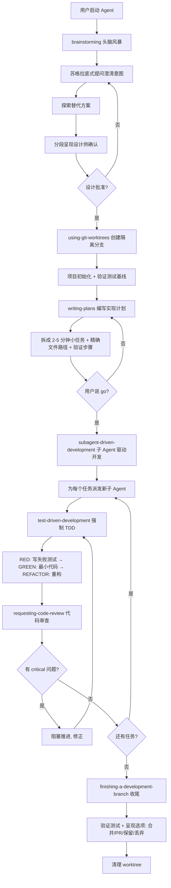

# Superpowers（超能力技能驱动开发）

## 定义

Superpowers 是一套面向 AI 编程助手的**完整软件开发方法论**——以一组可组合的"技能（Skills）"和初始指令为基础，让编码 Agent 在启动时自动触发结构化工作流：先头脑风暴澄清意图，再设计、规划，然后用子 Agent 驱动的 TDD 流程逐任务实现，期间自动审查，最后收尾合并。

它由 Jesse Vincent（Prime Radiant）开源（`obra/superpowers`），核心理念是：**Test-Driven Development（测试先行）、Systematic over ad-hoc（系统化而非临时起意）、Complexity reduction（以简单为首要目标）、Evidence over claims（验证而非声称）**。

与 OpenSpec 的区别：OpenSpec 聚焦"规格制品"（proposal/specs/design/tasks 文件），Superpowers 聚焦"技能驱动的开发流程"（brainstorming→planning→TDD→review→finish），两者可互补——Superpowers 的 brainstorming/writing-plans 技能可产出 OpenSpec 风格的制品。

## 核心特点

1. **技能即方法论**：把开发最佳实践（TDD、系统化调试、代码审查、git worktree 等）封装为可复用技能，Agent 自动加载与触发。
2. **自动触发**：技能在 Agent 识别到对应场景时自动激活，是"强制工作流而非建议"——用户无需手动调用。
3. **头脑风暴先行**：写代码前先通过苏格拉底式提问澄清真实意图，探索替代方案，分段呈现设计供人确认。
4. **子 Agent 驱动开发**：把实现拆成 2-5 分钟的小任务，为每个任务派发全新子 Agent 执行，配两阶段审查（规格合规 + 代码质量）。
5. **严格 TDD**：强制 RED-GREEN-REFACTOR——先写失败测试、看它失败、写最小代码、看它通过、提交；先于测试写的代码会被删除。
6. **git worktree 隔离**：设计批准后自动创建隔离工作分支，跑项目初始化，验证测试基线干净，再开始实现。
7. **工具无关**：通过插件机制支持 Claude Code、Cursor、Codex、Gemini CLI、Copilot CLI、Kimi Code、OpenCode、Pi 等 10+ 编码 Agent。

## 安装

> 安装因 Agent 而异。若同时使用多个 Agent，需**分别安装**——Superpowers 在每个 Agent 中独立配置。

### Claude Code

Superpowers 已上架 Anthropic 官方插件市场。

**方式一：官方市场（推荐）**
```
/plugin install superpowers@claude-plugins-official
```

**方式二：Superpowers 自有市场**
```
/plugin marketplace add obra/superpowers-marketplace
/plugin install superpowers@superpowers-marketplace
```

安装后重启 Claude Code，技能在会话开始自动激活。

### Cursor

在 Cursor Agent 聊天中安装：
```
/add-plugin superpowers
```
或在插件市场搜索 "superpowers" 安装。

### Codex App（桌面版）

1. 打开 Codex 应用，点击侧边栏 **Plugins**
2. 在 **Coding** 分类找到 `Superpowers`
3. 点击 `+` 并按提示完成安装

### Codex CLI

```
/plugins
```
搜索 `superpowers`，选择 `Install Plugin`。

### Gemini CLI

```
gemini extensions install https://github.com/obra/superpowers
```
更新：
```
gemini extensions update superpowers
```

### GitHub Copilot CLI

```
copilot plugin marketplace add obra/superpowers-marketplace
copilot plugin install superpowers@superpowers-marketplace
```

### Kimi Code

```
/plugins
```
进入 `Marketplace` > `Superpowers` 安装；或直接从仓库安装：
```
/plugins install https://github.com/obra/superpowers
```
详见 [docs/README.kimi.md](https://github.com/obra/superpowers/blob/main/docs/README.kimi.md)。

### OpenCode

OpenCode 有独立插件安装机制，即使已在其他 Agent 装过也需单独安装。在 OpenCode 中输入：
```
Fetch and follow instructions from https://raw.githubusercontent.com/obra/superpowers/refs/heads/main/.opencode/INSTALL.md
```
详见 [docs/README.opencode.md](https://github.com/obra/superpowers/blob/main/docs/README.opencode.md)。

### Antigravity

```
agy plugin install https://github.com/obra/superpowers
```
Antigravity 会运行插件的 session-start hook，Superpowers 从第一条消息起即激活。用相同命令重装即可更新。

### Factory Droid

```
droid plugin marketplace add https://github.com/obra/superpowers
droid plugin install superpowers@superpowers
```

### Pi

```
pi install git:github.com/obra/superpowers
```
本地开发可用临时加载：
```
pi -e /path/to/superpowers
```

### 安装速查表

| Agent | 安装命令/方式 | 更新方式 |
|-------|--------------|----------|
| Claude Code | `/plugin install superpowers@claude-plugins-official` | 重装 |
| Cursor | `/add-plugin superpowers` | 重装 |
| Codex App | Plugins 面板点击 `+` | 面板更新 |
| Codex CLI | `/plugins` 搜索安装 | 重装 |
| Gemini CLI | `gemini extensions install <url>` | `gemini extensions update` |
| Copilot CLI | `copilot plugin install superpowers@superpowers-marketplace` | 重装 |
| Kimi Code | `/plugins` 市场安装 | 重装 |
| OpenCode | 按 INSTALL.md 指引 | 重装 |
| Antigravity | `agy plugin install <url>` | 同命令重装 |
| Factory Droid | `droid plugin install superpowers@superpowers` | 重装 |
| Pi | `pi install git:github.com/obra/superpowers` | 重装 |

### 验证安装

安装后在 Agent 中发起一次会话，描述一个要构建的功能。若 Superpowers 生效，Agent 会**先提问澄清意图**（brainstorming）而非直接写代码——这是技能已激活的标志。

### 遥测（可选关闭）

默认会加载 brainstorming 的可视化伴侣图标（仅含版本号，不含项目/提示信息）。如需关闭：
```
SUPERPOWERS_DISABLE_TELEMETRY=1
```
也尊重 Claude Code 的 `DISABLE_TELEMETRY` 与 `CLAUDE_CODE_DISABLE_NONESSENTIAL_TRAFFIC` 选项。

## 工作流程



### 基本工作流（七步）

| 步骤 | 技能 | 作用 |
|------|------|------|
| 1 | brainstorming | 写代码前激活，通过提问细化想法、探索替代、分段呈现设计，保存设计文档 |
| 2 | using-git-worktrees | 设计批准后激活，创建隔离分支、跑项目初始化、验证测试基线 |
| 3 | writing-plans | 用批准的设计，把工作拆成 2-5 分钟小任务，每个任务有精确文件路径、完整代码、验证步骤 |
| 4 | subagent-driven-development / executing-plans | 用计划派发子 Agent 逐任务执行，配两阶段审查（规格合规 + 代码质量），或带人工检查点的批量执行 |
| 5 | test-driven-development | 实现期间激活，强制 RED-GREEN-REFACTOR，先于测试写的代码会被删除 |
| 6 | requesting-code-review | 任务间激活，按计划审查、按严重程度报告问题，critical 问题阻塞推进 |
| 7 | finishing-a-development-branch | 任务完成时激活，验证测试、呈现选项（合并/PR/保留/丢弃）、清理 worktree |

### 技能库分类

| 类别 | 技能 | 作用 |
|------|------|------|
| 测试 | test-driven-development | RED-GREEN-REFACTOR 循环（含测试反模式参考） |
| 调试 | systematic-debugging | 4 阶段根因定位流程（含根因追踪、纵深防御、条件等待） |
| 调试 | verification-before-completion | 确保真正修复而非声称修复 |
| 协作 | brainstorming | 苏格拉底式设计细化 |
| 协作 | writing-plans | 详细实现计划 |
| 协作 | executing-plans | 带检查点的批量执行 |
| 协作 | dispatching-parallel-agents | 并发子 Agent 工作流 |
| 协作 | requesting-code-review | 审查前检查清单 |
| 协作 | receiving-code-review | 响应反馈 |
| 协作 | using-git-worktrees | 并行开发分支 |
| 协作 | finishing-a-development-branch | 合并/PR 决策工作流 |
| 协作 | subagent-driven-development | 快速迭代 + 两阶段审查 |
| 元 | writing-skills | 按最佳实践创建新技能（含测试方法） |
| 元 | using-superpowers | 技能系统入门 |

## 优缺点

### 优点

- **方法论内置**：TDD、系统化调试、代码审查等最佳实践被固化进技能，Agent 自动遵循，无需人反复提醒。
- **自动触发**：技能按场景自动激活，是强制工作流，降低"Agent 自由发挥"风险。
- **子 Agent 隔离**：每任务派发新子 Agent，上下文干净，避免长会话漂移；可自主工作数小时不偏离计划。
- **严格 TDD**：先测试后实现，代码质量与可回归性有保障。
- **工具无关**：10+ 编码 Agent 通用，团队可异构工具。
- **可组合**：技能可串联（brainstorming→planning→TDD→review），也可按需扩展。

### 缺点

- **仪式感重**：小改动也走 brainstorming→worktree→plan→TDD→review→finish 全流程，可能过重。
- **依赖强模型**：子 Agent 驱动 + 严格 TDD 需要高推理能力模型，弱模型易在多步流程中失稳。
- **学习曲线**：技能体系与工作流需团队理解与认同，否则会绕过技能手动操作。
- **TDD 强制性**：对探索性/原型代码，强制 TDD 可能拖慢迭代；需判断何时降级。
- **worktree 依赖**：需要 git worktree 支持，部分场景（无 git/单文件脚本）不适用。
- **技能维护**：技能更新需跨所有支持的 Agent 验证，社区贡献新技能受限。

## 实战示例

**场景**：用 Superpowers 给一个 Web 应用加"导出 CSV"功能。

1. **brainstorming**：Agent 不直接写代码，而是问"导出哪些字段？大数据量要分页吗？权限如何控制？"，探索"流式导出 vs 一次性生成"等方案，分段呈现设计供确认。
2. **using-git-worktrees**：设计批准后，Agent 创建 `feature/export-csv` 分支，跑 `npm install`，确认 `npm test` 全绿作为基线。
3. **writing-plans**：拆成小任务——
   - 1.1 在 `services/export.ts` 加 `exportToCsv(rows, fields)` 函数（含完整代码）
   - 1.2 验证：单测覆盖空数据/大数据/字段过滤
   - 2.1 在 `routes/export.ts` 加 `/api/export.csv` 端点
   - 2.2 验证：集成测试覆盖权限与流式响应
4. **subagent-driven-development**：用户说"go"，Agent 派发子 Agent 逐任务执行。
5. **test-driven-development**：子 Agent 先写 `exportToCsv` 的失败测试 → 看它失败 → 写最小实现 → 看它通过 → 提交。
6. **requesting-code-review**：任务间审查，发现"未处理 CSV 注入风险"标为 critical，阻塞推进，修正后继续。
7. **finishing-a-development-branch**：全部任务完成，验证测试全绿，呈现"合并到 main / 提 PR / 保留分支 / 丢弃"选项，用户选 PR，清理 worktree。

## 注意事项

1. **判断流程粒度**：小修小补可降级（跳过 brainstorming，直接改 + 跑测试）；中等以上功能才走完整七步。
2. **brainstorming 是核心**：不要跳过头脑风暴直接写代码——它澄清意图、探索替代，是后续计划质量的根基。
3. **计划要细**：writing-plans 的任务粒度是 2-5 分钟，每个任务有精确文件路径与验证步骤，太粗会让子 Agent 失控。
4. **信任子 Agent 但设审查**：子 Agent 可自主工作数小时，但两阶段审查（规格合规 + 代码质量）是质量门，critical 问题必须阻塞。
5. **TDD 不可妥协**：先于测试写的代码会被删除——这是 Superpowers 的硬约束，若需原型探索可显式声明跳过。
6. **worktree 卫生**：每个功能用独立 worktree，避免污染主分支；收尾时务必清理。
7. **选对模型**：子 Agent 驱动 + 严格 TDD 需高推理模型（Opus/Sonnet 等），弱模型在多步流程中易失稳。
8. **技能可扩展**：用 `writing-skills` 按最佳实践创建团队专属技能，但需跨 Agent 验证。

## 与相邻范式的关系

| 范式 | 定位 | 与 Superpowers 关系 |
|------|------|---------------------|
| Spec-Driven Development | 规格契约 | Superpowers 的 brainstorming/planning 可产出规格制品 |
| OpenSpec | 规格制品工具 | 互补：Superpowers 管流程，OpenSpec 管制品 |
| Agentic Coding | Agent 自主执行 | Superpowers 给 Agent 装上"方法论技能包" |
| Loop Engineering | 循环工程 | Superpowers 的子 Agent 驱动是循环工程的具体实践 |
| Vibe Coding | 自由发挥 | Superpowers 用强制工作流补其不可控性 |

## 参考资料

- Superpowers 官方仓库：https://github.com/obra/superpowers
- 原始发布公告：https://blog.fsck.com/2025/10/09/superpowers/
- Prime Radiant（背后团队）：https://primeradiant.com/
- 技能库（skills/ 目录）：https://github.com/obra/superpowers/tree/main/skills
- Superpowers Discord 社区：https://discord.gg/35wsABTejz