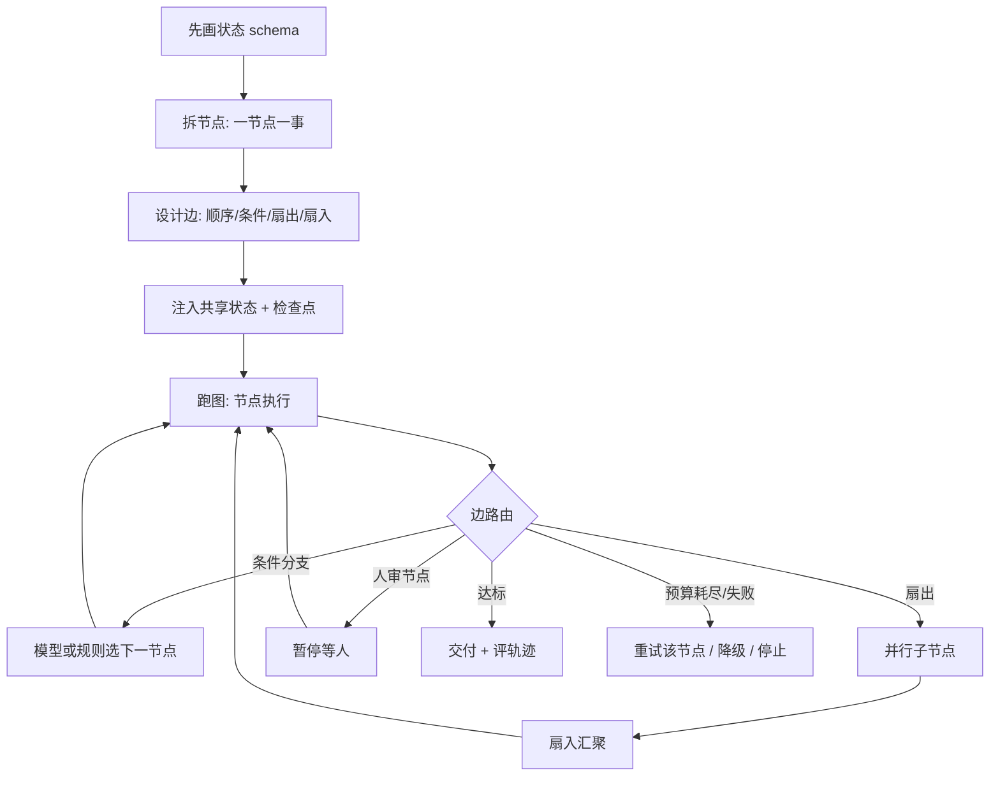

# Graph Engineering（图工程）

> 最后修改时间：2026-08-04

## 定义

Graph Engineering（图工程）指 **把多智能体 / 多步骤系统显式建模为有向图来设计、编排与治理** ——节点（node）做具体工作，边（edge）决定下一步走哪，共享状态（shared state）沿边流转。它不再把整个任务塞进 **一个** Agent 的 while 循环里，而是把"谁做什么、何时交接、如何分支/并行/回退"提升为一等工程对象。

它是 Loop Engineering 之上的下一层抽象（约 2026 年中被广泛命名）：当单 Agent 循环已经可靠，瓶颈从"这一步能不能做对"转移到"一千步如何协调"。循环工程管的是 **一个上下文窗口里** 怎么转；图工程管的是 **多个循环之间** 怎么连。

一句话： **Prompt Engineering 调措辞，Context Engineering 调信息，Loop Engineering 调单 Agent 迭代，Harness Engineering 调运行外壳，Graph Engineering 调"多个节点如何编排成一个系统"。**

重要澄清（三者常被混淆）：

| 易混概念 | 实际在说什么 | 与 Graph Engineering |
|----------|--------------|----------------------|
| 知识图谱 / GraphRAG | 把 **数据** 建成实体-关系图，用于检索 | 无关——那是数据建模，这是 **执行编排** |
| 单纯 Multi-Agent 聊天 | 多个 Agent 自由对话 | 偏弱——图工程要求 **显式边、共享状态、可检查点** |
| LangGraph 等框架 | 图编排的落地实现 | 技术上高度重合；图工程是对这些设计决策的 **命名与技能化** |

循环并未消亡：图里的每个节点内部，模型仍在跑熟悉的 think-act-observe 循环。 **循环被降级为节点内部的实现细节，图才是系统级拓扑。** 单节点 + 自环边，其实就是最小的图——所以图工程是循环工程的上层，而非替代。

## 核心特点

1. **节点即能力单元** ：一个节点只做一件事——可以是完整 Agent 循环、确定性函数、检索步骤，或真人审批。可单测、可替换、可重试。
2. **边即路由决策** ：边声明合法路径。有的边确定性（测试通过 → 部署），有的边由模型判定（工单去计费还是风控）。默认能确定性就别交给模型。
3. **状态是有 schema 的对象** ：跨边流转的是结构化状态，而非"当前上下文窗口里碰巧还剩什么"。每次过边可检查点（checkpoint）。
4. **扇出 / 扇入一等公民** ：并行派发与汇聚是图操作；单循环没有对应动词。
5. **人是节点** ：审批、澄清与人在环上，与其他能力节点同等设计——有入边、出边，而不是事后打补丁。
6. **预算进状态** ：token / 费用 / 墙钟时间写在状态里，在边处强制执行，而不是跑完才发现账单爆炸。
7. **评轨迹不只评输出** ：看最终结果之外，还要看路径是否合理、成本是否可控——下一处失败往往藏在轨迹里。

## 与相邻范式的关系

| 范式 | 工程对象 | 一句话 |
|------|----------|--------|
| Prompt Engineering | 措辞 | 怎么对模型说 |
| Context Engineering | 信息 | 给模型看什么 |
| Harness Engineering | 运行外壳 | 模型外面那层软件怎么造 |
| Loop Engineering | 单 Agent 迭代 | 模型怎么一圈圈转下去 |
| **Graph Engineering** | **多节点编排** | **多个循环/步骤如何连成系统** |
| Spec-Driven | 契约 | 模型按什么标准收敛 |

五层叠加而非替代（由内向外）：好的图由好的节点组成；好的节点是工程化的循环；好的循环需要 harness（工具、记忆、沙箱）；循环里每一步仍要靠上下文与提示。跳过下层，上层只会以更复杂的方式失败——把弱 Agent 画成组织架构图，得到的只是弱组织。

工程阶梯常见表述：

```
Prompt → Context → Harness → Loop → Graph
（越往外越少"跟模型说话"，越多"做系统架构"）
```

## 工作流程



Graph Engineering 的设计要点：

1. **先画状态，再写提示** ：状态 schema 就是架构。写不出"系统在每一步知道什么"，就还只是 demo。
2. **节点保持无聊** ：一节点一事才能测试、缓存、重试、替换；一个节点干五件事 = 套了壳的循环。
3. **判断力放在边上** ：图系统的智能往往在路由；模型决策的边是失败高发区，要像关键路径一样可观测。
4. **每过一条边做检查点** ：失败从"整次重跑"变成"重试该节点"；人也才能周四审批、周五从检查点续跑。
5. **把人设计成节点** ：审批有入边、出边、超时与降级，而不是外挂异常处理。
6. **预算与护栏进状态** ：在边处强制执行花费上限。
7. **评轨迹** ：输出对了但绕了远路、烧了预算，仍算工程失败。

## 优缺点

### 优点

- **可协调复杂任务** ：研究 + 写作 + 审查、多模块并行编码等，单循环天然串行且易失焦。
- **可审计 / 可恢复** ：检查点图几乎免费带来审计轨迹、断点续跑、审批门——这些是结构属性，不是事后补丁。
- **并行是便宜杠杆** ：短期内难让单循环"更聪明"，却能把十二个循环对着拆开的子问题同时跑。
- **失败域隔离** ：坏节点可单独重试，不必污染整条轨迹或整窗上下文。
- **路径可控可解释** ：合法路径由你声明，利于合规、花费上限与生产验收。

### 缺点

- **多数任务根本不需要** ：一件事 + 一个验收器 = 循环够了；过早上图是给自己买分布式系统问题。
- **工程量大** ：状态 schema、边语义、检查点、并发汇聚，都是实打实的系统工程。
- **调试维度升级** ：问题可能出在路由边、状态契约或扇入冲突，而不只是某个节点的提示。
- **框架幻觉** ：把图工程等同于"必须上 LangGraph"会过度承诺；形状稳定，框架会换。
- **弱节点放大失败** ：图不能拯救差循环——只会让失败更壮观。

## 实战示例

### 示例一：不该上图的场景

**场景** ：总结一份 PDF。

**过度图化** ：fetcher → chunker → summarizer → reviewer → formatter，再加条件边与共享状态……能跑，但比"一个循环读文件写摘要"更慢、更贵、更难调。

**结论** ：能塌回单循环且不丢能力，就不要上图。

### 示例二：图真正赚回成本的场景

**场景** ：每天产出一份经过事实核查的行业简报。

**Graph Engineering 风格** ：

1. **节点** ：研究员（可扇出多源）→ 综合器 → 写手 → 怀疑派审查员（可换更强/只读模型）→ 发布。
2. **边** ：审查不通过则条件边打回写手；预算或连续失败则停并告警。
3. **状态** ：资料笔记、草稿、审查意见、花费计数——有 schema、可检查点。
4. **人审节点** （可选）：涉及对外发布时暂停等人签字，检查点保留，人不在线也不占死上下文窗口。

对比：把这一切塞进一个 Agent 的超长循环，后半程易漂移，且难以并行检索、难以单独重试"审查"这一段。

### 示例三：编码 Agent 作为图中的节点

**场景** ：大仓库改造——规划、多模块并行改、集成测试、人工合并审批。

**做法** ：

1. 规划节点产出任务图（改哪些模块、依赖顺序）。
2. 扇出多个 **编码 Agent 节点** （每个节点内部仍是完整 Loop + Harness：读改跑测）。
3. 扇入后跑集成测试节点；失败则只重试相关模块节点。
4. 合并 / 推送走人工审批节点。

要点：节点里可以是"整段 Agent 运行"，而不只是单次 LLM 调用——模型变强之后，图编排的是 Agent，而不只是提示词步骤。

## 注意事项

1. **默认不上图** ：先把单循环做稳（终止条件、验收器、反思）；工作形态逼你拆角色/并行/可审计交接时，再拆图。
2. **先状态后提示** ：写不清状态 schema，就不要堆节点。
3. **节点保持单一职责** ：可测、可换、可单独重试。
4. **边能确定就确定** ：模型路由用在真正需要判断的地方，并重点观测。
5. **检查点是生产底线** ：无检查点就谈不上断点续跑与人在环上的真实可用性。
6. **人是一等节点** ：审批要有超时、降级与出边，否则"有监督"只是名义。
7. **预算写进状态** ：在边处截断，而不是事后看账单。
8. **评轨迹** ：路径与成本是下一处失败的藏身地。
9. **别与 GraphRAG 混谈** ：执行图 ≠ 知识图谱。
10. **下层没做好别堆图** ：Prompt / Context / Harness / Loop 薄弱时，上图只是复杂化失败。

## 对比与选型建议

| 维度 | Graph Engineering | Loop Engineering | Harness Engineering | Context Engineering |
|------|-------------------|------------------|---------------------|---------------------|
| 工程对象 | 多节点拓扑与状态流转 | 单 Agent 迭代过程 | 运行外壳 / 工具 / 环境 | 信息选材 |
| 适用 | 多角色交接、并行、可审计长链路 | 长链路但单线自循环 | 生产级 Agent 产品 | 长任务 / 大仓库 |
| 工程量 | 极高 | 高 | 极高 | 中-高 |
| 收益 | 协调 / 并行 / 可恢复 / 可审计 | 可靠性 / 收敛 | 能力上限 / 安全 / 可生产 | 质量 / 降幻觉 |

**选型信号** ：

| 工作信号 | 循环够用 | 该上图 |
|----------|----------|--------|
| 任务形状 | 一件事、终点清晰 | 拆成多专长并交接 |
| 并行 | 步骤基本串行 | 需要扇出再汇聚 |
| 工具 / 模型 | 全程同一套 | 不同步骤要不同模型或工具集 |
| 控制流 | Agent 自由探索可接受 | 需要显式、可审计的路径 |
| 失败隔离 | 坏了整段重试即可 | 希望坏节点不毒化全局 |
| 谁验收 | Agent 自检输出 | 需要独立审查节点卡另一节点 |

**选型建议** ：单轮靠 Prompt；长任务先 Context；要能行动靠 Harness；多步自循环靠 Loop； **只有当多个循环必须交接、并行或强制路径时，再上 Graph** 。图是最外层，也通常是最后才该够到的一层。

## 参考资料

- Josh C. Simmons, "We Are Entering the Graph Engineering Phase"（2026）—— 图工程命名与三承诺（节点 / 边 / 状态）
- LangChain, "3 Years of Graph Engineering with LangGraph" —— 图编排实践与"节点内可嵌完整 Agent"
- LangGraph 1.0 文档 —— StateGraph、检查点、人在环上
- Microsoft Agent Framework / AutoGen GraphFlow —— 结构化工作流与多智能体图编排
- Google ADK —— sequential / parallel / loop 工作流原语
- Anthropic, "Building Effective Agents"（2024）—— 链式、路由、并行、编排-工人、评估-优化（画出来即图）
- arXiv:2604.11378 "From Agent Loops to Structured Graphs" —— 单活跃单元调度视角与开源项目调研
- 持久执行：Temporal、Prefect —— 崩溃恢复与跨天人工审批的底层支撑
- 互通协议：A2A、ACP —— 跨团队图与图之间的边
