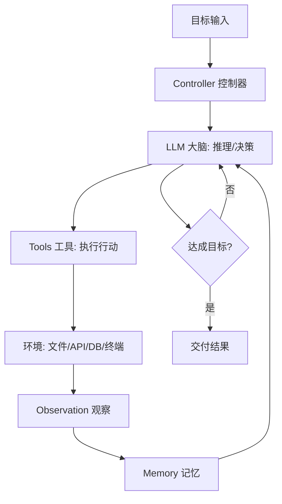

# Agent 核心组件

> 一句话定义：Agent 由 LLM（大脑）、Tools（手脚）、Memory（记忆）、Loop（循环）四大组件构成，外加 Controller 协调。

## 1. 组件全景

## 2. LLM（大脑）

**职责**：推理、规划、决策、生成自然语言输出。

**要点**：
- 是 Agent 的"认知核心"，决定上限。
- 选择考量：推理能力、工具调用支持、上下文长度、成本、许可。
- 主流：GPT-4o、Claude 3.5/4、Gemini、Qwen、Llama、DeepSeek。
- 弱模型也能做 Agent，但需更强工具与护栏补偿。

**LLM 关键能力维度**：

| 能力维度 | 说明 | Agent 中的重要性 |
|---|---|---|
| **推理 (Reasoning)** | 逻辑推演、多步规划、因果分析、反思纠错 | ⭐⭐⭐⭐⭐ 核心，决定任务拆解与决策质量 |
| **工具调用 (Tool Use / Function Calling)** | 结构化输出函数调用，连接外部 API | ⭐⭐⭐⭐⭐ Agent 的"动手"基础 |
| **指令遵循 (Instruction Following)** | 准确理解复杂、多层指令并执行 | ⭐⭐⭐⭐ 决定复杂任务可靠性 |
| **长上下文 (Long Context)** | 处理长文档、多轮对话历史不丢失信息 | ⭐⭐⭐⭐ 减少记忆压缩损耗 |
| **代码生成 (Code Generation)** | 生成、调试、解释代码 | ⭐⭐⭐ 数据分析/自动化类 Agent 必备 |
| **结构化输出 (Structured Output)** | JSON Mode 等，严格遵守输出 Schema | ⭐⭐⭐ 便于程序化解析与流水线串联 |
| **多模态 (Multimodal)** | 图文理解、视觉推理、音视频处理 | ⭐⭐⭐ 扩展感知维度（看图、读截图等） |
| **多语言 (Multilingual)** | 跨语言理解与生成 | ⭐⭐ 国际化场景需要 |

**当前主流模型能力配置（2026 Q2）**：

| 模型 | 上下文窗口 | 核心能力亮点 | 推荐 Agent 场景 |
|---|---|---|---|
| **Claude 4 (Sonnet/Opus)** | 200K / 256K | 最强 Tool Use、推理精准、指令遵循极好 | 复杂 Agent、代码 Agent、长任务 |
| **GPT-4o / GPT-4.1** | 128K / 1M | 原生多模态、快速推理、生态成熟 | 多模态 Agent、通用 Agent |
| **GPT-5** | 128K+ | 最强综合推理与多模态、Agent 原生能力 | 高复杂度、对可靠性要求极高的 Agent |
| **Gemini 2.5 Pro** | 1M | 超长上下文、原生视频/音频多模态、推理强 | 长文档分析、音视频理解 Agent |
| **o1 / o3 (推理模型)** | 200K | 深度慢思考、复杂数学/逻辑/编程推理 | 需深度推理的分析型任务 |
| **Qwen3-235B (开源)** | 128K | 推理+多模态+工具调用一体化，开源标杆 | 私有化部署、定制化 Agent |
| **Llama 4 / DeepSeek-V3** | 128K / 128K | 开源高性能、成本可控 | 大规模部署、成本敏感场景 |
| **DeepSeek-R1** | 128K | 开源推理模型，链式思考 + 极低成本 | 私有化推理任务、预算有限的复杂分析 |

> **选型建议**：一般 Agent 推荐 Claude 系列（Tool Use 最强）；多模态需求优先 GPT-5 或 Gemini 2.5；私有化部署选 Qwen3 或 Llama 4；深度推理任务用 o系列 或 DeepSeek-R1。

## 3. Tools（手脚）

**职责**：扩展 LLM 的能力边界，让它能"动手"。

**常见类型**：
- 信息获取：搜索、RAG 检索、数据库查询、网页抓取。
- 计算/执行：代码解释器、Shell、计算器。
- 操作外部：发邮件、改文件、调 API、订票。
- 感知：读文件、看截图、听音频。

**设计要点**：
- 每个工具有清晰名称、描述、参数 schema。
- 危险操作需审批或白名单。
- 工具返回需裁剪，避免上下文膨胀。
- 详见 03 模块。

## 4. Memory（记忆）

**职责**：让 Agent 跨步骤、跨会话保持信息。

**分层**：
- **短期记忆**：本次会话的上下文与中间结果，常放对话历史。
- **长期记忆**：跨会话复用，常用向量库/知识图谱/数据库。
- **工作记忆**：当前任务的 scratchpad（草稿本）。

**管理挑战**：
- 上下文窗口有限，需摘要/压缩。
- 记忆可能过期或错误，需纠错机制。
- 详见 04 模块。

## 5. Loop（循环）

**职责**：让 Agent 在"思考→行动→观察"中迭代直至达成目标。

**核心模式**：
- **ReAct 循环**：Thought → Action → Observation 重复。
- **状态机/图**：用 LangGraph 把流程显式建模为状态图。
- **回溯**：失败时退回分叉点换策略。

**工程要点**：
- 必设终止条件（步数/预算/目标达成）。
- 插入反思节点防盲目重试。
- 详见 02 模块与 Loop Engineering。

## 6. Controller（控制器）

**职责**：协调四大组件，管理循环流程。

**功能**：
- 循环控制：何时进入下一步、何时终止。
- 异常处理：工具失败、超时、上下文溢出的降级。
- 人在环上：关键节点触发人工审批。
- 权限与护栏：拦截危险操作。
- 可观测：记录每步日志。

**实现**：可以是框架（LangGraph 的图）、自研编排代码、或模型自身的循环能力。

## 7. 组件协作示例

**任务**："查我上周订单并退款最贵的一单"

1. **Controller** 启动循环，把目标交给 **LLM**。
2. **LLM** 规划：①查订单 ②排序找最贵 ③发起退款 ④通知。
3. **LLM** 调 **Tool** `getOrders(userId, lastWeek)`。
4. **Tool** 返回订单列表 → 写入 **Memory**（短期）。
5. **LLM** 找到最贵订单 #99，调 `createRefund(#99)`。
6. **Controller** 检测退款为危险操作 → 触发人工审批。
7. 人批准 → **Tool** 执行 → 返回退款单号。
8. **LLM** 调 `sendNotification` → 完成。
9. **Controller** 判定目标达成，交付结果。

## 8. 学习要点
- 四大组件缺一不可：无工具则不能动手，无记忆则易失忆，无循环则只能单步。
- Controller 是"胶水"，工程化程度决定可靠性。
- 组件解耦设计：便于独立优化与替换（如换模型不影响工具）。
- 理解每个组件的失败模式，才能对症下药。

## 9. 参考资料
- "Cognitive Architectures for Language Agents"（CoALA）
- LangGraph 关于 State/Nodes/Edges 的文档
- "The Rise and Potential of Large Language Model Based Agents"