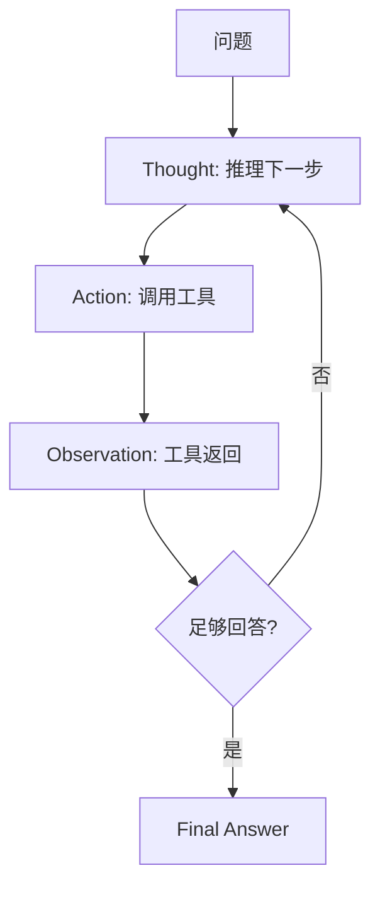

# CoT 与 ReAct

> 一句话定义：CoT 让模型"分步想再答"，ReAct 让模型"想一步、做一步、看结果再想下一步"——后者是 Agent 的推理骨架。

## 1. CoT（Chain-of-Thought，思维链）

### 定义
让 LLM 在给出最终答案前**显式输出中间推理步骤**，把"直接答"变为"分步想再答"。由 Wei et al.（2022）系统验证。

### 触发方式
- **Zero-shot CoT**：加一句"Let's think step by step"。
- **Few-shot CoT**：给带推理过程的示例。

### 示例
```
问题：一个篮子有 12 个苹果，拿出 3 个又放回 1 个，剩几个？
普通：10 个
CoT：原有 12，拿出 3 剩 9，放回 1 剩 10。答案：10 个
```

### 要点
- 对数学/逻辑/多步推理增益显著，简单任务增益小。
- 推理链可能"看似合理实则错误"，需校验。
- **Self-Consistency**：多次采样取多数，提升稳定性。

## 2. ReAct（Reasoning + Acting）

### 定义
把 CoT 的纯推理与**外部行动（工具调用）交错**：每步先 Thought（思考）再 Action（行动），然后 Observation（观察）工具返回，循环直至答案。由 Yao et al.（2022）提出，是现代 Agent 的推理骨架。

### 循环结构


### 示例
```
Question: 科罗拉多造山运动延伸地区的海拔范围？
Thought 1: 需先查科罗拉多造山运动延伸到哪里。
Action 1: Search[科罗拉多造山运动]
Observation 1: 延伸至高平原。
Thought 2: 需查高平原海拔。
Action 2: Search[高平原 海拔]
Observation 2: 约 1800-2400 米。
Thought 3: 信息已足够。
Action 3: Finish[1800-2400 米]
```

### 要点
- 接地外部信息，缓解幻觉。
- 每步思考与行动可见，可追溯可调试。
- 工具描述不清会带偏推理。
- 需设最大步数防死循环。

## 3. CoT vs ReAct

| 维度 | CoT | ReAct |
|------|-----|-------|
| 推理 | 显式链 | 推理+行动交错 |
| 工具 | 无 | 有 |
| 适合 | 数据已知的复杂推理 | 需外部信息/工具的任务 |
| 成本 | 中 | 高 |

**关系**：ReAct 内含 CoT——它的 Thought 步骤就是思维链。CoT 是 ReAct 的推理子能力。

## 4. 实战要点
- 数据已在上下文用 CoT；需查外部用 ReAct。
- ReAct 工具描述要清晰，否则模型误选。
- 长循环需裁剪 Observation，避免上下文膨胀。
- 终止条件必设，防 ReAct 死循环。

## 5. 参考资料
- Wei et al., "Chain-of-Thought Prompting Elicits Reasoning"（2022）
- Yao et al., "ReAct: Synergizing Reasoning and Acting"（2022）
- "Self-Consistency Improves Chain of Thought Reasoning"