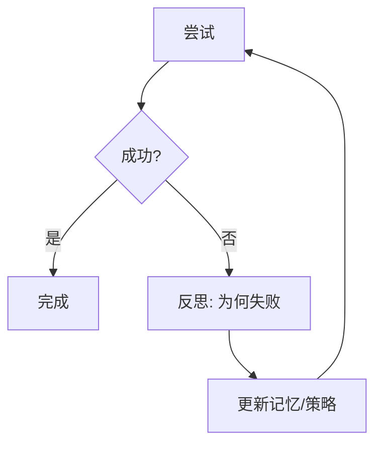

# 反思与进阶推理

> 一句话定义：让 Agent 在失败后"复盘原因再重试"，而非盲目重试——Reflexion、Plan-and-Solve、Tree-of-Thoughts 等是 ReAct 之上的推理增强。

## 1. 为什么需要进阶推理
- 裸 ReAct 循环易"改了又坏、坏了又改"，盲目重试不收敛。
- 复杂任务需更结构化的规划、回溯与自我纠错。
- 进阶推理范式在"思考"环节做文章，提升收敛性。

## 2. Reflexion（反思）

### 核心思想
- 每次失败后插入"反思节点"，让 Agent 总结"哪里错了、下一步换什么策略"。
- 把反思写入记忆，后续尝试避免重复错误。

### 流程

### 要点
- 反思应基于具体观察（报错、测试输出），而非空泛"再想想"。
- 反思本身是模型输出，可能错，需多样性约束。
- 显著提升多步任务的收敛率。

## 3. Plan-and-Solve
- 先让模型制定完整计划，再逐步执行。
- 改善 CoT/ReAct 在复杂任务中"走一步看一步"的规划不足。
- 适合步骤多、依赖复杂的任务。

## 4. Tree-of-Thoughts（ToT）
- 把推理建为搜索树，每个节点是一个推理状态。
- 可评估、回溯、剪枝，像下棋搜索。
- 适合规划、博弈、创意等需探索的任务。
- 代价：成本高，复杂任务才用。

## 5. Self-Consistency
- 对同一问题多次采样推理路径，取多数答案。
- 用多样性换稳定性。
- 代价：多次推理成本高。

## 6. 选择建议

| 任务 | 推荐 |
|------|------|
| 简单多步 | ReAct |
| 易失败需纠错 | Reflexion |
| 步骤多依赖复杂 | Plan-and-Solve |
| 需探索/回溯 | ToT |
| 答案不稳定 | Self-Consistency |

## 7. 学习要点
- 反思让 Agent 从失败学习，而非盲目重试。
- 规划先行（Plan-and-Solve）改善长任务收敛。
- ToT 用搜索替代线性推理，适合需探索的任务。

## 8. 参考资料
- "Reflexion: Language Agents with Verbal Reinforcement Learning"
- "Tree of Thoughts: Deliberate Problem Solving with LLMs"
- "Plan-and-Solve Prompting"