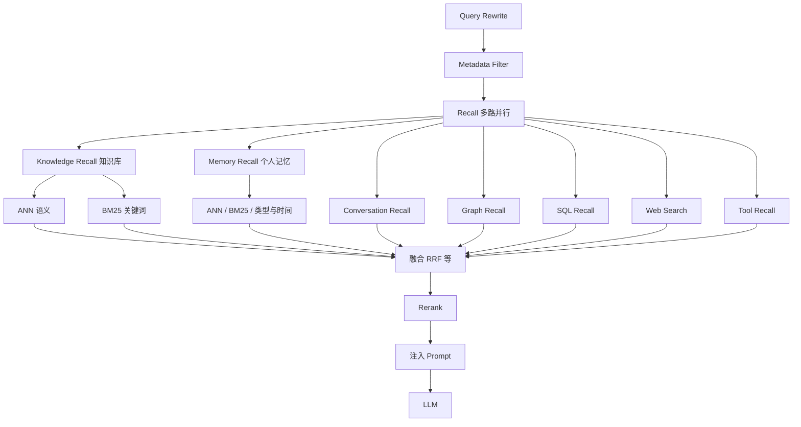
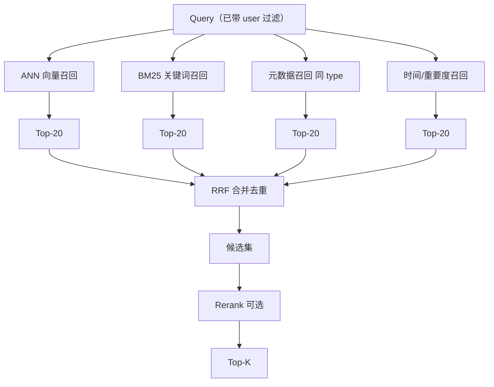
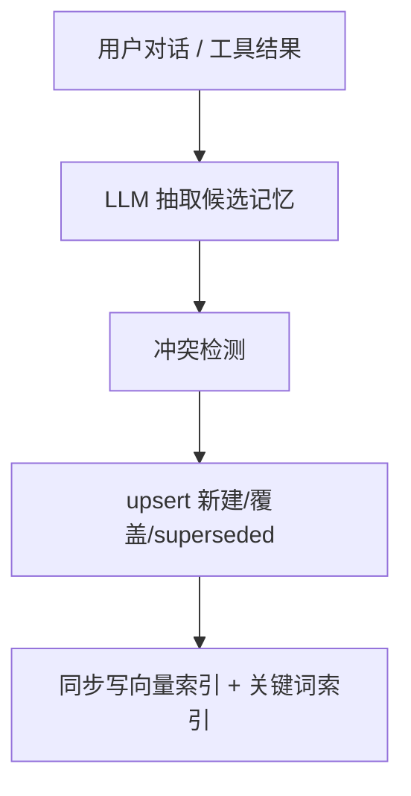
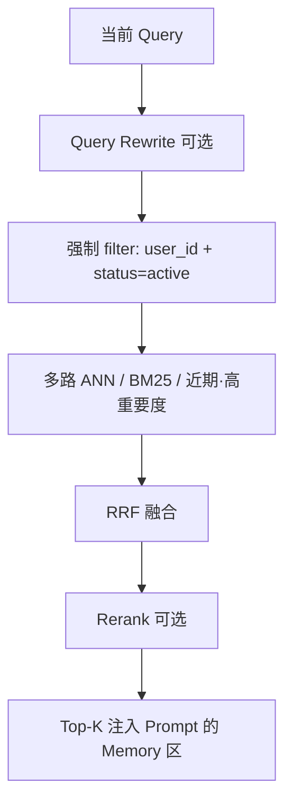
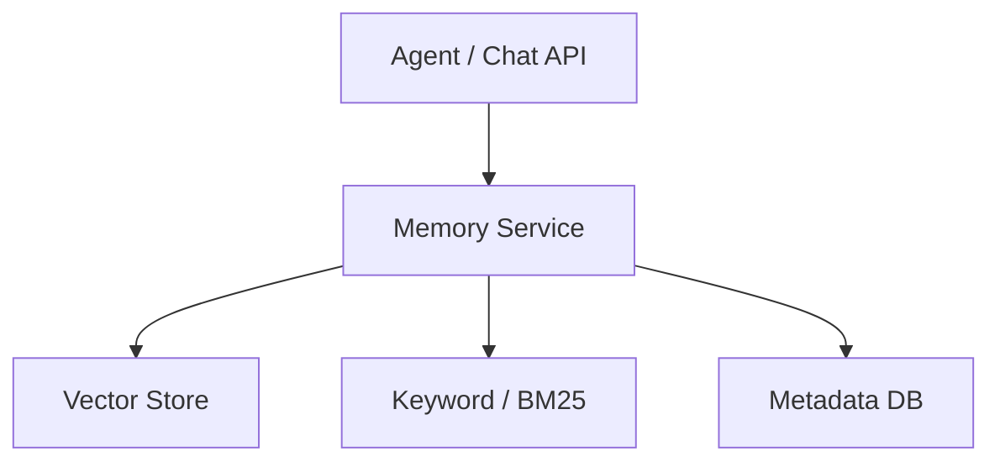
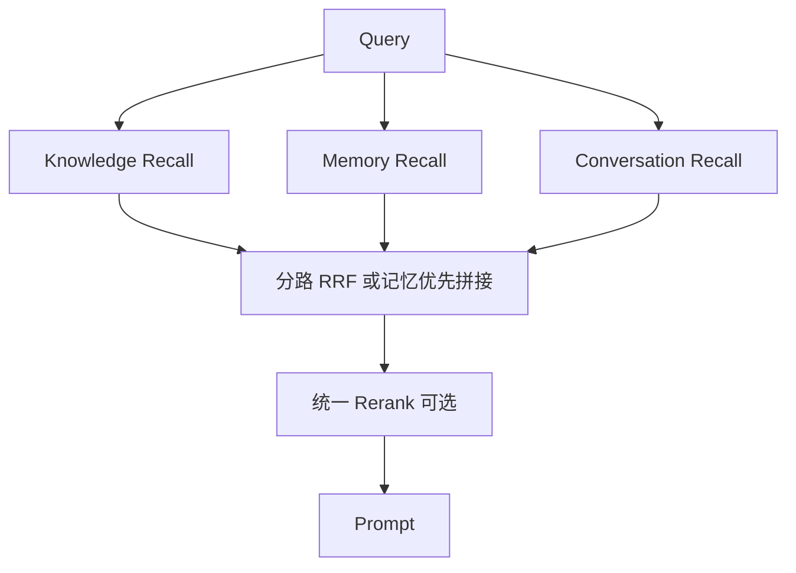

# Memory Recall：个人记忆召回是什么、如何实现

> 一句话定义：Memory Recall 是多路召回中专门检索「用户个人动态记忆」的那一路——按用户隔离、按语义/关键词匹配偏好与历史事实，再与知识库召回结果融合后注入 LLM。

> 前置阅读：[01-记忆系统](01-记忆系统.md)（三层记忆与通用召回）、[RAG 核心概念与原理](../07-RAG与知识集成/02-RAG%20核心概念与原理：Chunking、Embedding、相似度、HNSW%20与多路召回.md)（多路召回框架）。

---

## 1. Memory Recall 是什么

在完整检索链路里，召回层往往不止「搜知识库」一条路——这就是 **多路召回** （详见 [§2](#2-多路召回有哪些路)）。Memory Recall 是其中一路，专门回答这类问题：

| 用户说法 | 答案实际在哪 |
|----------|--------------|
| 「按我上次说的风格写个接口」 | 张三偏好 Go+Gin，李四偏好 Java+Spring |
| 「我上次提到的那个项目怎么部署？」 | 用户历史会话里抽出的项目事实 |
| 「推荐个午餐」 | 「对花生过敏」这类个人健康偏好 |

知识库里可能有《部署手册》《过敏原科普》，但 **「这个用户」的偏好与经历不在共享文档里** 。Memory Recall 从「按用户隔离的记忆库」里捞这些内容。

### 1.1 和相近概念的区别

| 概念　　　　　　　　　　| 检索对象　　　　　　　　| 是否按用户隔离　　　　　　| 典型生命周期　　　　　 |
| -------------------------| -------------------------| ---------------------------| ------------------------|
| **Knowledge Recall**　　| 企业文档、手册、Wiki　　| 否（租户/权限过滤）　　　 | 文档更新时变更　　　　 |
| **Memory Recall**　　　 | 偏好、事实、经历、决策　| **是** （user_id 强隔离） | 可纠错、可过期、可冲突 |
| **Conversation Recall** | 当前会话窗口 / 近期对话 | 是（session 级）　　　　　| 会话结束或摘要后衰减　 |
| **Working Memory**　　　| 本任务 scratchpad　　　 | 是（task 级）　　　　　　 | 任务结束即丢　　　　　 |

一句话： **Knowledge 答「世界上/公司里有什么」；Memory 答「这个人怎么样、经历过什么」。**

### 1.2 为什么不能直接复用知识库 RAG

两边都用 Embedding + ANN + BM25，但记忆多出三类工程难题（见 RAG 文 1.1.2）：

1. **主体归属** ：每条记忆必须挂 `user_id`（及可选 `org_id` / `agent_id`），检索时强制过滤，防止串号。
2. **冲突判定** ：用户说「我现在可以吃花生了」，旧记忆「花生过敏」不能继续高分召回。
3. **生命周期** ：长期偏好 vs「最近在学 Rust」这类短期状态，需要过期、衰减或显式失效。

不做这三点，向量召回再准，也会「记错人、记旧账」。

---

## 2. 多路召回：有哪些路

### 2.1 为什么要多路

单路召回各有盲区：只靠向量会漏专有名词；只靠关键词不懂同义改写；只搜知识库答不出「我上次说的那个」。多路的价值是 **互补** —— 各路并行粗筛，再融合去重，交给 Rerank / Prompt。

「路」其实有两层含义，别混：

| 层级 | 问的是 | 例子 |
|------|--------|------|
| **数据源层** | 答案在哪个库/系统里？ | 知识库、个人记忆、对话、SQL、图谱、Web… |
| **检索算法层** | 同一个库里怎么搜？ | ANN、BM25、元数据过滤、时间排序… |

Agent 生产系统通常两层都做：先选对数据源，每个源内部再多算法召回。

### 2.2 数据源层：常见召回路一览



> Memory Recall 为本文主角；Knowledge 内部常见 ANN + BM25 两路。

| 召回路　　　　　　　　　| 搜什么　　　　　　　　　 | 典型问题　　　　　　　　　 | 擅长　　　　　　　　 | 弱点　　　　　　　　　　　　　　　　　　　　　　　　　　　　　　　　　　　　　　|
| -------------------------| --------------------------| ----------------------------| ----------------------| ---------------------------------------------------------------------------------|
| **Knowledge / ANN**　　 | 共享文档的语义近邻　　　 | 「退款规则是什么」　　　　 | 同义改写、意思相近　 | ID、编号、冷门专名　　　　　　　　　　　　　　　　　　　　　　　　　　　　　　　|
| **Knowledge / BM25**　　| 文档关键词命中　　　　　 | 「错误码 E-2049」　　　　　| 精确词、编号　　　　 | 换词就漏　　　　　　　　　　　　　　　　　　　　　　　　　　　　　　　　　　　　|
| **Memory Recall**　　　 | 该用户的偏好/事实/经历　 | 「按我的习惯写接口」　　　 | 千人千面、跨会话　　 | 需隔离、冲突、遗忘　　　　　　　　　　　　　　　　　　　　　　　　　　　　　　　|
| **Conversation Recall** | 当前或近期对话回合　　　 | 「还是卡」「上面那个」　　 | 指代消解、短时上下文 | 会话外无效　　　　　　　　　　　　　　　　　　　　　　　　　　　　　　　　　　　|
| **Graph Recall**　　　　| 实体与边（人-项目-服务） | 「支付服务依赖哪些中间件」 | 多跳关联　　　　　　 | 图谱建设成本高（专文见 [Graph Recall](../07-RAG与知识集成/04-Graph-Recall.md)） |
| **SQL Recall**　　　　　| 表字段精确条件　　　　　 | 「我名下未完成的工单」　　 | 精确、可审计　　　　 | 自然语言→SQL 易错　　　　　　　　　　　　　　　　　　　　　　　　　　　　　　　 |
| **Web Search**　　　　　| 公开网页/新闻　　　　　　| 「今天某某 API 挂了吗」　　| 实时性　　　　　　　 | 噪音大、需摘录　　　　　　　　　　　　　　　　　　　　　　　　　　　　　　　　　|
| **Tool Recall**　　　　 | 任意工具返回值　　　　　 | 「查一下当前库存」　　　　 | 活数据、业务系统　　 | 延迟与权限　　　　　　　　　　　　　　　　　　　　　　　　　　　　　　　　　　　|

> 没有固定「必须开全套」。客服助手常开 Knowledge + Memory + Conversation；数据分析 Agent 加重 SQL；运维排障常加 Graph / 日志 Tool。

### 2.3 检索算法层：同一库里怎么多路

即便只做一个 Memory Store / 向量库，内部也常多路：



| 算法路 | 擅长抓什么 | 弱点 |
|--------|-----------|------|
| **ANN（向量）** | 「忌口」≈「过敏」这类语义关联 | 订单号、trace ID、冷门专名 |
| **BM25** | 「花生」「payment-svc」字面命中 | 不懂同义改写 |
| **元数据** | 按 `type=preference` 收窄 | 无语义，依赖打标质量 |
| **时间/重要度** | 「上次」「最近」类指代 | 与语义无关，需与别路融合 |

Memory Recall 实现里， **至少 ANN + BM25** ；再加时间路，对「上次那个」类问题很管用。细节与代码见 [§5.2](#52-召回实现核心代码骨架)。

### 2.4 怎么选路、怎么融合

**选型口诀** ：问题答案在哪一类数据里，就开哪一路；单路明显漏再补互补路。

| 场景 | 建议组合 |
|------|----------|
| 企业知识问答 | Knowledge：ANN + BM25 |
| 个人助理 / 千人千面 | Memory（ANN+BM25+时间）+ Conversation |
| 「我的订单/余额」 | SQL（主）+ Memory（辅，记偏好） |
| 「A 服务依赖谁」 | Graph + Knowledge |
| 「今天外面是否故障」 | Web / 状态页 Tool + Knowledge |

各路分数尺度不同（余弦 0~1 vs BM25 动辄十几）， **不要直接加分** 。常见做法：

1. 各路取 Top-N → **RRF（倒数排名融合）** 合并（原理见 RAG 专文 §6.5）
2. 或 **分槽注入** ：`[Memory]` / `[Knowledge]` / `[History]` 分区写进 Prompt，个人约束不与通用文档抢同一排名
3. 候选集再可选 **Rerank** 精排

### 2.5 和 Memory Recall 的关系

- **对外** ：Memory Recall 是数据源层的一路，与 Knowledge、Conversation 等并列。
- **对内** ：Memory Recall 自己再用 ANN ∥ BM25 ∥ 时间等多算法路。
- 用户问「我上次提到的那个 Go 项目怎么部署？」——知识库可能有通用部署文档，但「哪个项目、什么偏好」往往要靠 **Memory + Conversation** ；部署步骤再靠 Knowledge。三路一起，才答得完整。

---

## 3. 记什么：记忆类型与数据结构

### 3.1 常见记忆类型

| 类型 | 例子 | 召回触发 |
|------|------|----------|
| **偏好 Preference** | 代码风格、口味、沟通语气 | 「帮我写…」「推荐…」 |
| **事实 Fact** | 过敏、职级、常用项目名 | 涉及约束/身份的问题 |
| **经历 Episode** | 「上周那个支付接口故障」 | 「上次那个…」指代消解 |
| **决策 Decision** | 「已决定用 Redis 做缓存」 | 后续方案讨论 |
| **指令 Instruction** | 「以后回复用中文、少废话」 | 几乎每轮（可常驻注入） |

### 3.2 建议的记忆条目结构

```json
{
  "id": "mem_01hxyz",
  "user_id": "u_123",
  "text": "用户对花生过敏",
  "embedding": [0.12, -0.34, "..."],
  "type": "preference",
  "status": "active",
  "confidence": 0.95,
  "importance": 0.9,
  "source": "user_utterance",
  "created_at": "2026-06-28T10:00:00Z",
  "updated_at": "2026-06-28T10:00:00Z",
  "expires_at": null,
  "supersedes": null,
  "keywords": ["花生", "过敏", "忌口"]
}
```

| 字段 | 作用 |
|------|------|
| `user_id` | **强制过滤** ，Memory Recall 的第一道闸 |
| `status` | `active` / `superseded` / `expired`，冲突与遗忘 |
| `importance` + 时间 | 排序时做衰减：`score' = score × decay(age) × importance` |
| `supersedes` | 指向被替代的旧记忆 id，便于审计 |
| `keywords` | 供 BM25 / 精确词匹配，补向量盲区 |

---

## 4. 端到端流程：写入 → 召回 → 注入 → 更新

**写入路径**



**召回路径（Memory Recall）**



与知识库 RAG 的对称关系：

| 环节 | 知识库 | Memory Recall |
|------|--------|---------------|
| 离线/写入 | 文档切块 Embedding | 对话中抽取事实 Embedding |
| 过滤 | tenant / 权限 / 文档类型 | **user_id** / status / type |
| 召回 | ANN + BM25 | 同左，再加时间/重要度路 |
| 融合 | RRF | RRF（可与知识库结果再融一层） |
| 特有 | Chunk 策略 | **冲突仲裁、遗忘、主体隔离** |

向量相似度、HNSW、RRF、Rerank 的原理见 [01-记忆系统 §6.6–6.7](01-记忆系统.md) 与 RAG 专文，本文不重复展开。

---

## 5. 如何实现

### 5.1 最小可用架构



Memory Service 负责 extract / recall / resolve / forget；Vector Store 按 user 分区或硬过滤；Metadata DB 管 status / 冲突 / expires。

选型参考：

- 向量：pgvector / Milvus / Qdrant / Chroma（ **查询必须带 user_id filter** ）
- 关键词：同一库的全文检索，或 ES / meilisearch
- 元数据与冲突状态：Postgres 即可；小规模可全放向量库 payload

### 5.2 召回实现（核心代码骨架）

```python
from dataclasses import dataclass
from typing import List, Optional
import time

@dataclass
class MemoryHit:
    id: str
    text: str
    score: float
    type: str
    meta: dict

class MemoryRecall:
    def __init__(self, embedder, vector_db, bm25_index, reranker=None):
        self.embedder = embedder
        self.vector_db = vector_db
        self.bm25 = bm25_index
        self.reranker = reranker

    def recall(
        self,
        user_id: str,
        query: str,
        *,
        top_k: int = 5,
        candidate_k: int = 20,
        types: Optional[List[str]] = None,
    ) -> List[MemoryHit]:
        # 1) 可选：Query Rewrite，把「那个项目」扩成可检索表述
        queries = rewrite_queries(query)  # 至少含原 query

        base_filter = {
            "user_id": user_id,
            "status": "active",
        }
        if types:
            base_filter["type"] = {"$in": types}

        # 2) 多路召回
        ann_hits, bm25_hits, recent_hits = [], [], []
        for q in queries:
            q_vec = self.embedder.encode(q)
            ann_hits.extend(
                self.vector_db.search(
                    q_vec, top_k=candidate_k, filter=base_filter
                )
            )
            bm25_hits.extend(
                self.bm25.search(q, top_k=candidate_k, filter=base_filter)
            )

        # 近期 / 高重要度兜底（指代「上次」「最近」时很有用）
        recent_hits = self.vector_db.search(
            filter={**base_filter},
            order_by="updated_at",
            limit=candidate_k // 2,
        )

        # 3) RRF 融合（不拼原始分数，拼排名）
        fused = reciprocal_rank_fusion(
            [ann_hits, bm25_hits, recent_hits], k=60
        )

        # 4) 时间 × 重要度衰减
        now = time.time()
        for h in fused:
            age_days = max(0, (now - h.meta["updated_at"]) / 86400)
            decay = 0.5 ** (age_days / h.meta.get("half_life_days", 90))
            h.score *= decay * h.meta.get("importance", 0.5)

        fused.sort(key=lambda x: x.score, reverse=True)

        # 5) 可选精排
        candidates = fused[:candidate_k]
        if self.reranker:
            candidates = self.reranker.rank(query, candidates)

        return candidates[:top_k]
```

**硬约束** ：任何搜索 API 都默认带上 `user_id`；漏过滤等于记忆串号，属安全事故。

### 5.3 写入与冲突判定

```python
def ingest_memory(user_id: str, utterance: str, reply: str, store, llm):
    # 1. 抽取：是否值得记、类型、规范化文本
    candidates = llm.extract_memories(utterance, reply)
    # → [{"text": "用户对花生过敏", "type": "preference", "conf": 0.95}]

    for c in candidates:
        if c["conf"] < 0.7:
            continue

        # 2. 在同用户 active 记忆里找语义近邻，判断冲突/重复
        near = store.recall(user_id, c["text"], top_k=5)
        decision = llm.resolve_conflict(c, near)
        # decision.action: ignore | create | update | supersede

        if decision.action == "ignore":
            continue
        if decision.action == "supersede":
            store.mark_superseded(decision.old_id, reason=c["text"])
        if decision.action in ("create", "update", "supersede"):
            store.upsert(
                user_id=user_id,
                text=c["text"],
                type=c["type"],
                confidence=c["conf"],
                importance=c.get("importance", 0.5),
                keywords=c.get("keywords", []),
            )
```

冲突仲裁示例：

| 旧记忆 | 新信息 | 策略 |
|--------|--------|------|
| 花生过敏 | 「我现在可以吃花生了」 | `supersede` 旧条，写新条 |
| 喜欢川菜 | 「今天想吃粤菜」 | 不覆盖长期偏好；短期意图放会话/工作记忆 |
| 用 Go 写接口 | 「这个需求用 Python」 | 范围限定：全局偏好 vs 单次任务，写入时带 scope |

### 5.4 注入 Prompt

```text
[System] 你是个人助理……
[Memory]  （仅当前用户、已召回的 Top-K）
- [preference] 用户对花生过敏 (2026-06-28, conf=0.95)
- [fact] 当前主力项目为 payment-svc (2026-07-01)
[History] 最近 N 轮对话
[User] 推荐个午餐
```

实践建议：

- Memory 放在 System 之后、History 之前，当作「背景约束」。
- 条数严格控制（常见 3–8 条）；指令型记忆可常驻，事实型按需召回。
- 展示时带类型与时间，方便模型判断是否仍适用。

### 5.5 与知识库多路融合

当 Agent 同时查文档和个人记忆时：



简单稳妥的策略： **记忆与知识分区分注入** （`[Memory]` / `[Knowledge]`），不强行混排分数——个人约束（过敏、偏好）通常应压过通用文档里的「推荐菜谱」。

---

## 6. Query Rewrite：Memory Recall 的胜负手

用户原话常常不是好检索词：

| 原问题 | 直接检索 | 改写后 |
|--------|----------|--------|
| 「按我的习惯写」 | 太空 | 「用户代码风格 偏好 语言 框架」 |
| 「上次那个还卡吗」 | 缺指代 | 「用户反馈过的页面加载慢问题」 |
| 「推荐个午餐」 | 难命中过敏 | 「用户饮食偏好 过敏 忌口」 |

实现要点：

1. 改写时 **带上少量近期对话** 做指代消解。
2. 可生成多 query 并行召回，再 RRF（与知识库 RAG 相同套路）。
3. HyDE（先假设一条「记忆长什么样」再检索）对偏好类记忆往往有效。

---

## 7. 遗忘、隐私与评测

### 7.1 遗忘策略

| 策略 | 做法 |
|------|------|
| 显式删除 | 用户说「忘掉我的过敏信息」→ status=expired |
| 过期时间 | `expires_at`；短期状态默认 30 天 |
| 重要度衰减 | 长期未命中则降低 importance，召回自然靠后 |
| 容量上限 | 每用户 Top-N by importance，溢出归档或摘要合并 |

### 7.2 隐私

- 默认按 `user_id` 隔离；管理端查询需审计。
- 敏感类（健康、证件）可单独 type + 更短 TTL / 加密字段。
- 提供「导出 / 清空我的记忆」接口，满足合规。

### 7.3 怎么评 Memory Recall 好不好

| 指标 | 含义 | 经验目标 |
|------|------|----------|
| Recall@K | 该召回的个人记忆有没有进候选 | Recall@20 ≥ 0.9 |
| 串号率 | 召回结果是否混入其他用户 | **必须为 0** |
| 冲突正确率 | 过时记忆是否被正确 superseded | 人工抽检 ≥ 0.95 |
| 端到端 | 注入后回答是否遵守偏好 | 场景用例回归 |

构造评测集时，每条样例至少包含：`user_id`、query、应命中的 memory_id、（可选）不应命中的过时 id。

---

## 8. 落地清单（按优先级）

1. **先做对隔离** ：所有读写带 `user_id`，加集成测试防串号。
2. **再做抽取 + 向量召回** ：能跨会话记住「过敏 / 偏好」即闭环。
3. **补 BM25 + RRF** ：专有名词、项目名、订单号不再靠语义碰运气。
4. **上冲突与遗忘** ：否则记忆越多越害人。
5. **Query Rewrite +（可选）Rerank** ：抬「上次那个」类指代与排序精度。
6. **与知识库分槽注入** ：个人约束和共享文档不要混成一锅分数。

---

## 9. 和本目录其他文的关系

| 文档 | 分工 |
|------|------|
| [01-记忆系统](01-记忆系统.md) | 三层记忆、通用匹配/召回/跨 Embedding |
| **本文** | Memory Recall + 多路召回有哪些路、差异与实现 |
| [Memory.md 规范](../12-补充概念/02-Agent.md与Memory.md规范.md) | 用 Markdown 持久化记忆的轻量实践 |
| RAG 多路召回专文 | 知识库主线；Memory 作为并列召回路出现 |

---

## 10. 学习要点

- 多路召回分两层： **数据源** （Knowledge / Memory / Conversation / SQL / Graph / Web / Tool）与 **检索算法** （ANN / BM25 / 元数据 / 时间）。
- Memory Recall = **按用户隔离的个人记忆粗筛** ，是数据源层一路；对内再跑 ANN∥BM25∥时间。
- 实现三件套： **强制 user 过滤 +（ANN∥BM25）召回 + 冲突/遗忘** 。
- 写入质量（抽取、去重、supersede）往往比调 HNSW 参数更能提升体验。
- 与知识库结果 **分槽注入** 或 RRF 融合，避免个人约束被通用文档淹没。

## 11. 参考

- [01-记忆系统](01-记忆系统.md) §6.6–6.8（召回原理与多算法路）
- RAG 专文 §6.3–6.5（多路框架与 RRF）
- Mem0、LangChain / LangGraph Memory、Letta (MemGPT) 设计
- Generative Agents（记忆检索与反思）
- CoALA：Cognitive Architectures for Language Agents（记忆章节）
