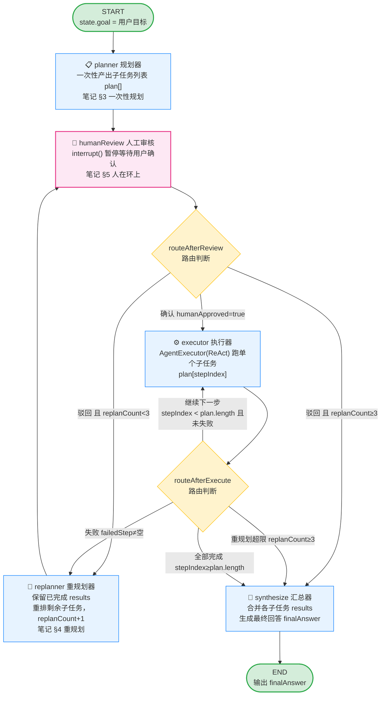
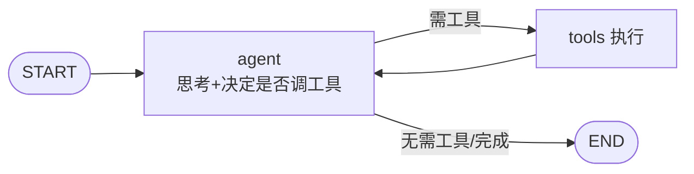
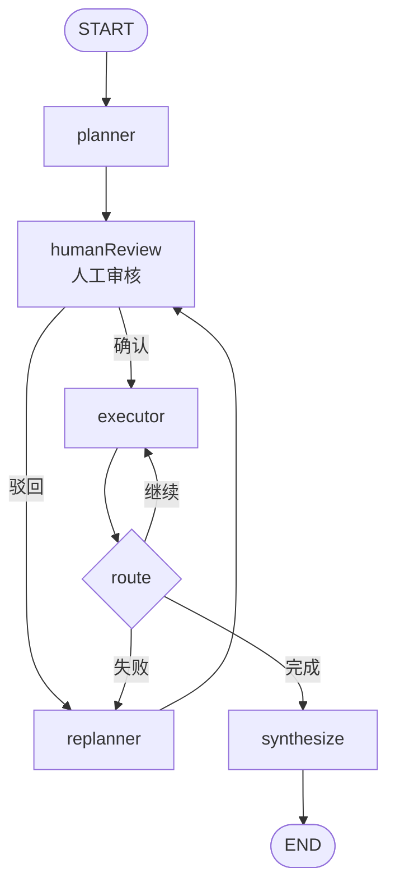
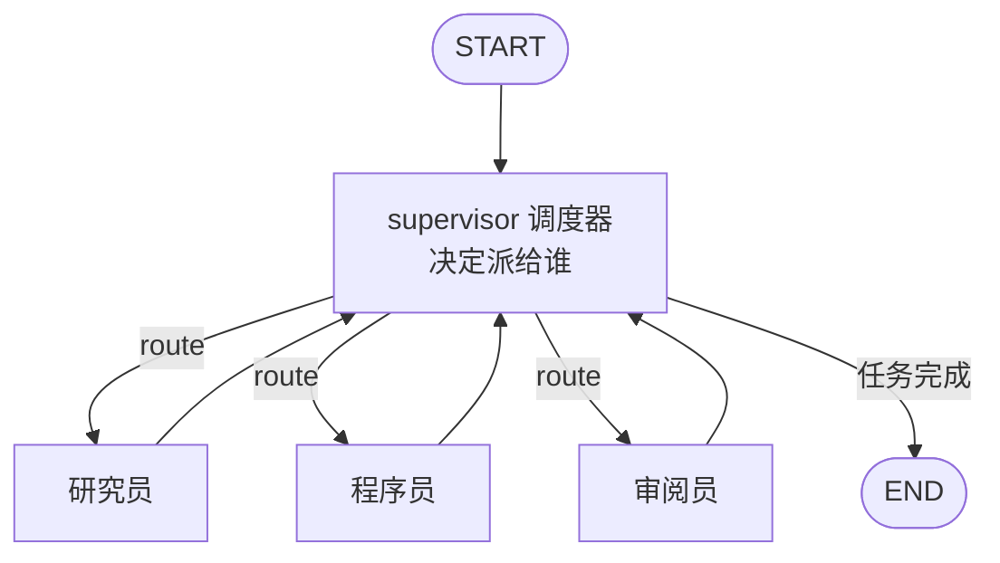
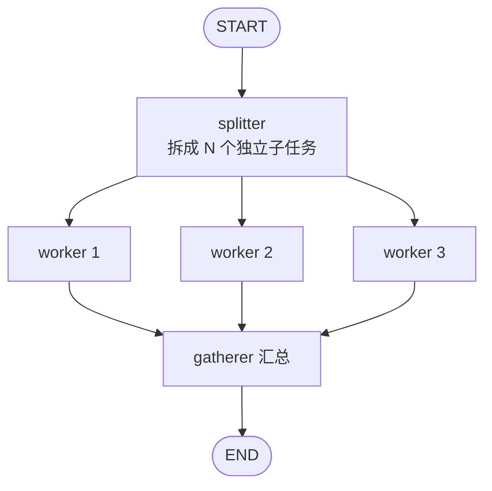

# 规划与任务分解

> 一句话定义：把复杂目标拆成可执行子任务序列/DAG，是 Agent 处理长链路任务的核心能力。

## 1. 为什么需要规划
- 复杂目标无法一步完成，需拆解。
- 好的规划让 Agent 有路线图，避免"走一步看一步"迷失。
- 子任务可并行/可验证，提升效率与可靠性。

## 2. 规划形态

| 形态 | 结构 | 特点 |
|------|------|------|
| 线性 todo | 列表 | 简单，顺序执行 |
| 树 | 层级 | 可回溯换策略 |
| DAG | 有向无环图 | 表达依赖，可并行 |
| 状态机 | 状态+转移 | 显式流程控制 |

## 3. 规划方法

### 一次性规划
- 开头让 LLM 产出完整计划，再逐步执行。
- 适合步骤明确、变化少的任务。
- 风险：计划可能脱离实际，执行中发现不可行。

### 增量规划
- 边执行边规划，每步根据观察调整后续。
- 适合不确定、需反馈的任务。
- ReAct 即增量规划的代表。

### 混合
- 先粗规划，执行中细化和重规划。
- 兼顾方向感与灵活性，是主流做法。

## 4. 重规划（Replanning）
- 当子任务失败或环境变化时，重新调整计划。
- 触发：工具失败、测试不通过、新信息出现。
- 需保留已完成部分，只调整未完成部分。

## 5. 设计要点
- **子任务粒度**：太粗难执行，太细规划成本高。
- **可验证**：每个子任务有明确完成标准（测试通过、输出存在）。
- **依赖建模**：用 DAG 表达依赖，可并行处并行。
- **失败处理**：定义重试/降级/求助策略。
- **人在环上**：关键规划节点人工审批。

## 6. 实战示例
**任务**："把项目从 JS 迁移到 TS 并保证测试通过"。
1. 规划：①装 TS 依赖 ②逐文件改 .js→.ts ③修类型错误 ④跑测试 ⑤清理。
2. DAG：②可按文件并行；④依赖②③完成。
3. 执行中某文件类型难修 → 重规划：该文件先 `// @ts-nocheck`，后续单独处理。
4. 全部测试通过 → 完成。

### 流程图（对应 demo 中 @langchain/langgraph 实现）
下图是 `planningAgent.ts` 中 `StateGraph` 的实际拓扑，直观展示"规划 → 人工审核 → 分步执行 → 失败重规划 → 汇总"的闭环：



节点与代码对应关系：

| 节点 | 代码位置 | 职责 |
|------|---------|------|
| `planner` | `planner()` | `model.withStructuredOutput` 产出 `plan[]` |
| `humanReview` | `humanReview()` | `interrupt()` 暂停等待人工确认，返回 `humanApproved` |
| `executor` | `executor()` | `agentExecutor.invoke(task)` 跑单步，失败记 `failedStep` |
| `replanner` | `replanner()` | 根据已完成 + 失败原因重排剩余，`replanCount+1` |
| `synthesize` | `synthesize()` | 合并 `results` 生成 `finalAnswer` |
| `routeAfterReview` | `routeAfterReview()` | 条件边：通过→执行 / 驳回→重规划 / 超限→汇总 |
| `routeAfterExecute` | `routeAfterExecute()` | 条件边：继续/重规划/汇总 |

> `MAX_REPLAN=3` 防止重规划死循环；`results` 用 reducer 累加，重规划后已完成结果不丢失。`replanner → humanReview` 确保重规划后的方案也需人工确认。

### LangGraph 需人为编码的 API 速查
上图的「自动循环」由以下 LangGraph API 拼装而成——**这些都必须你手写，prompt 无法替代**。按职责分四类：

#### 1. 状态定义（决定数据怎么流）
| API | 作用 | 代码位置 |
|-----|------|---------|
| `Annotation.Root({...})` | 声明整个图的 State schema | `planningAgent.ts:83` |
| `Annotation<T>({ reducer, default })` | 定义单个字段 + reducer（多步结果如何合并） | `planningAgent.ts:84-95` |

> 例：`results` 用 `reducer: (a, b) => [...a, ...b]` 累加，重规划后已完成结果不丢；其余字段用 `(_, b) => b` 即「后者覆盖」。

#### 2. 节点定义（决定每步「做什么」）
| API | 作用 | 代码位置 |
|-----|------|---------|
| `new StateGraph(stateSchema)` | 创建状态图实例 | `planningAgent.ts:253` |
| `.addNode(name, fn)` | 注册节点：`name` 是图里标识，`fn` 是业务函数 | `planningAgent.ts:254-258` |

> 节点函数签名固定为 `async (state) => 部分state`，返回值经 reducer 合并进 State。节点内部「怎么想」靠 prompt，但「被调用」是图驱动的。

#### 3. 边与路由（决定「怎么走」）
| API | 作用 | 代码位置 |
|-----|------|---------|
| `.addEdge(from, to)` | 固定边：`from` 执行完必去 `to` | `planningAgent.ts:259-260,266,272` |
| `.addConditionalEdges(from, router, mapping)` | 条件边：`router(state)` 返回字符串 key，`mapping` 决定去哪个节点 | `planningAgent.ts:261-265,267-271` |
| `START` / `END` | 特殊节点：图入口 / 图出口常量 | `planningAgent.ts:259,272` |

> `routeAfterExecute` 就是普通 `if/else` 函数，返回 `"executor"` / `"replanner"` / `"synthesize"`，不是 LLM 自由发挥——这是确定性逻辑。

#### 4. 编译与运行（让图「转起来」）
| API | 作用 | 代码位置 |
|-----|------|---------|
| `.compile()` | 把图定义编译成可执行应用（之后不可改） | `planningAgent.ts:273` |
| `.invoke(input)` | 阻塞式运行整条图，返回最终 state | `planningAgent.ts:307` |

> `.compile()` 之前是「设计期」，之后是「运行期」。可选参数如 `interrupt_before` / `interrupt_after` 可插入人工审批节点（Human-in-the-Loop）。本 demo 采用更细粒度的 `interrupt()` 函数（见下方专节），在 `humanReview` 节点内暂停等待人工确认，需配合 `checkpointer: new MemorySaver()` 持久化状态。

#### 编码量直觉
> 「图的拓扑 + 路由逻辑 + 状态 schema」≈ 20 行声明式代码（`253-273`），换来的却是一个可自愈、可循环、可兜底、可人工审核的完整 Agent 流程。**这部分是 LangGraph 的核心价值：把流程控制从你手里接管过来声明式编排，而每个节点内的智能仍交给 LLM + prompt。**

### 人在环上（Human-in-the-Loop）
笔记 §5 提到「关键规划节点人工审批」。本 demo 在 `planner` 和 `executor` 之间插入 `humanReview` 节点，规划产出后**暂停图执行**，把方案交给用户确认后才继续——这就是「人在环上」。

#### 核心三件套：`interrupt()` + `Command` + `checkpointer`

| API | 作用 | 代码位置 |
|-----|------|---------|
| `interrupt(value)` | 在节点内暂停图执行，`value` 传给调用方；用 `Command({ resume })` 恢复后返回 resume 值 | `planningAgent.ts` `humanReview()` |
| `new Command({ resume })` | 恢复被 `interrupt()` 暂停的图，`resume` 值会作为 `interrupt()` 的返回值 | `planningAgent.ts` `main()` |
| `MemorySaver` | 内存级 checkpointer，持久化图状态使暂停/恢复成为可能；需配合 `thread_id` 使用 | `.compile({ checkpointer: new MemorySaver() })` |
| `isInterrupted(values)` / `INTERRUPT` | 判断 `.invoke()` 返回值是否处于中断状态，`values[INTERRUPT][0].value` 取中断时传入的值 | `planningAgent.ts` `main()` |

> `interrupt_before` / `interrupt_after` 是编译期参数，在节点**之前/之后**整体暂停；`interrupt()` 是节点**内部**按需暂停，粒度更细——可以在节点逻辑中间暂停、拿回返回值后再决定后续。本 demo 选择后者。

#### 运行时交互流程

```
用户输入目标
    │
    ▼
graph.invoke({ goal }) ──→ planner 产出 plan[]
    │                        │
    │                  humanReview 调用 interrupt({ plan })
    │                        │  ← 图暂停，invoke 返回中断状态
    ▼                        │
main() 检测到 isInterrupted(res)
    │
    ├─ 展示 plan[] 给用户
    ├─ ask("确认执行？(y/n)")
    │
    ├─ 用户输入 y ──→ Command({ resume: { approved: true } })
    │                      │ → interrupt() 返回 decision
    │                      │ → humanReview 返回 { humanApproved: true }
    │                      │ → routeAfterReview → executor（继续执行）
    │
    └─ 用户输入 n ──→ Command({ resume: { approved: false, feedback: "..." } })
                           │ → interrupt() 返回 decision
                           │ → humanReview 返回 { humanApproved: false, failedStep: "plan_rejected" }
                           │ → routeAfterReview → replanner（重新规划）
                           │ → replanner → humanReview（再次暂停，审核修订方案）
                           │   ↳ 循环直到通过或 replanCount ≥ MAX_REPLAN
```

#### 关键代码

**节点内暂停**——`interrupt()` 把规划方案抛给调用方，恢复后拿到用户决策：

```ts
async function humanReview(state: any) {
  // interrupt() 暂停图执行，value 传给调用方
  // 用 Command({ resume: decision }) 恢复后，interrupt() 返回 decision
  const decision = interrupt<{ plan: string[] }, { approved: boolean; feedback: string }>({
    plan: state.plan,
    goal: state.goal,
  });

  if (decision.approved) {
    return { humanApproved: true, failedStep: "", failedReason: "" };
  }
  return {
    humanApproved: false,
    failedStep: "plan_rejected",
    failedReason: `用户驳回规划：${decision.feedback}`,
  };
}
```

**调用方恢复**——`main()` 循环检测中断、收集用户输入、用 `Command` 恢复：

```ts
let res = await planningGraph.invoke({ goal: input }, config);  // 会在 interrupt() 处暂停

while (isInterrupted(res)) {
  const iv = res[INTERRUPT][0].value;  // 取出 interrupt 传入的 plan
  // ... 展示 plan，收集用户确认 ...
  const decision = { approved: true, feedback: "" };  // 或 false + 驳回原因
  res = await planningGraph.invoke(new Command({ resume: decision }), config);  // 恢复
}
console.log(res.finalAnswer);  // 图正常结束后拿到最终答案
```

> **注意**：`interrupt()` 通过抛出特殊的 `GraphInterrupt` 错误来暂停，不要在它周围用 `try/catch`（除非你重新 throw）。`checkpointer` 必须配置，否则图无法保存暂停点的状态，`Command({ resume })` 也无从恢复。

#### 人在环上的设计要点
- **审核时机**：放在 `planner` 之后、`executor` 之前——规划是关键决策点，执行成本高/不可逆时尤其重要。
- **驳回→重规划**：用户驳回不是终止，而是触发 `replanner` 重新规划，修订方案再次进入 `humanReview` 审核。
- **防死循环**：`routeAfterReview` 检查 `replanCount >= MAX_REPLAN`，超过阈值直接兜底汇总，避免用户无限驳回。
- **状态持久化**：`MemorySaver` + `thread_id` 让每次 `.invoke()` 在同一线程上接续，暂停点不丢失。

### 同样的 API，能拼出完全不同的 Agent
上面这套 `addNode` / `addEdge` / `addConditionalEdges` / `compile` 看似「千篇一律」，但 LangGraph 提供的是**积木（API），不是图纸**——差异体现在 4 个层次，按「骨架到血肉」排：

| 层次 | 体现 | planningGraph 的选择 | 可换成什么 |
|------|------|---------------------|-----------|
| **① 图拓扑** | 节点怎么连、有没有环、几条分支 | Plan-and-Execute 单线 + 人工审核环 + 重规划环 | ReAct 单循环 / 多 Agent 协作 / Map-Reduce 并行… |
| **② State 字段 + reducer** | 数据怎么流、怎么累积 | `plan/results/stepIndex/replanCount/humanApproved` + `results` 累加 | 完全不同的字段集和合并规则 |
| **③ 路由条件** | `routeXxx()` 里的 `if/else` | 失败→重规划、超限→兜底、完成→汇总 | 任何业务判断：置信度阈值、人工评分、成本预算… |
| **④ 节点内部实现** | 每个 `fn` 里调什么 | 4 处 `model.invoke` + 工具集 + 失败启发式正则 | 换模型/换 prompt/换工具/换记忆/接外部 API |

> **① 是「形状」，②③④ 是「内容」。** planningGraph 恰好在 ① 上选了结构相对完整的 Plan-and-Execute 模板，所以显得「典型」；但换一种拓扑，整个 agent 就面目全非。

下面 4 张图用的全是同一套 API，但拓扑天差地别：

#### A. ReAct 单循环（最简，无规划）

- 没有 planner、没有 synthesize，agent 节点自循环
- 适合：短任务、单步可完成

```ts
// ReAct：agent 自循环，工具结果回流
const graph = new StateGraph(AgentState)
  .addNode("agent", callModel)                    // LLM 决策：调工具 or 直接答
  .addNode("tools", callTools)                    // 执行工具
  .addEdge(START, "agent")
  .addConditionalEdges("agent", shouldContinue, { // 路由：还要继续调工具吗
    tools: "tools",
    END: END,
  })
  .addEdge("tools", "agent")                      // 工具结果回 agent → 形成循环
  .compile();
```

#### B. Plan-and-Execute（本 demo）

- 先规划再人工审核，审核通过后分步执行，带自愈
- 适合：多步、可拆解、需容错、关键决策需人工把关
- 人在环上：`interrupt()` 暂停等待确认，`Command({ resume })` 恢复

```ts
// 即 planningAgent.ts，本 demo 实际代码
export const planningGraph = new StateGraph(PlanState)
  .addNode("planner", planner)
  .addNode("humanReview", humanReview)           // 人在环上：interrupt() 暂停等待确认
  .addNode("executor", executor)
  .addNode("replanner", replanner)
  .addNode("synthesize", synthesize)
  .addEdge(START, "planner")
  .addEdge("planner", "humanReview")              // 规划后先审核
  .addConditionalEdges("humanReview", routeAfterReview, {  // 审核：通过/驳回/超限
    executor: "executor",
    replanner: "replanner",
    synthesize: "synthesize",
  })
  .addEdge("replanner", "humanReview")            // 重规划后也需审核 → 形成审核循环
  .addConditionalEdges("executor", routeAfterExecute, {  // 三分支路由
    executor: "executor",
    replanner: "replanner",
    synthesize: "synthesize",
  })
  .addEdge("synthesize", END)
  .compile({ checkpointer: new MemorySaver() });  // checkpointer 使 interrupt() 可暂停/恢复
```

#### C. 多 Agent 协作（Supervisor 分派）

- 一个调度器 + N 个专家，按角色路由
- 适合：复杂任务需多角色分工（如论文写作：查资料→写→改）

```ts
// Supervisor 模式：调度器按角色分派，成员干完回调度器
const graph = new StateGraph(TeamState)
  .addNode("supervisor", supervisorFn)                     // 调度：决定下一个干活的成员
  .addNode("researcher", researchFn)
  .addNode("coder", codeFn)
  .addNode("reviewer", reviewFn)
  .addEdge(START, "supervisor")
  .addConditionalEdges("supervisor", routeToMember, {      // 按角色分派
    researcher: "researcher",
    coder: "coder",
    reviewer: "reviewer",
    FINISH: END,
  })
  .addEdge("researcher", "supervisor")                      // 干完回调度器 → 再分派
  .addEdge("coder", "supervisor")
  .addEdge("reviewer", "supervisor")
  .compile();
```

#### D. Map-Reduce 并行扇出

- 扇出并行 + 扇入汇总
- 适合：批量独立任务（如批量翻译、批量摘要）

```ts
import { Send } from "@langchain/langgraph";

// Map-Reduce：用 Send 实现并行扇出，同一 worker 节点并发跑多个子任务
const graph = new StateGraph(BatchState)
  .addNode("splitter", splitFn)               // 拆成 N 个独立子任务
  .addNode("worker", workerFn)                // 单个 worker（节点定义只一份）
  .addNode("gatherer", gatherFn)              // 汇总
  .addEdge(START, "splitter")
  // 扇出：把每个子任务「发」给同一个 worker，框架自动并发执行
  .addConditionalEdges("splitter", (state) =>
    state.tasks.map((t) => new Send("worker", { task: t }))
  )
  .addEdge("worker", "gatherer")             // 各 worker 完成后汇入 gatherer
  .addEdge("gatherer", END)
  .compile();
```

> **小结：API 大同小异是框架该有的样子。** 真正决定 agent 个性的是「怎么连 + 节点里放什么」。如果只盯着 API 看，确实都差不多；一旦对比拓扑图，差异一目了然。

### 图设计最佳实践
> **图本身不该随业务线性膨胀——会膨胀是因为把「业务能力」错放成了「图节点」。健康的做法是：能力用工具承载（加业务=加工具），编排用子图分层（加模块=加子图），图拓扑保持稳定。**

治理优先级与判断信号：

| 信号 | 手段 |
|------|------|
| 路由函数 `if/else` 过长 | ① 工具化：业务能力注册成工具，agent 自循环调用 |
| 单图节点 > 15 个 | ② 子图嵌套：把一坨流程封装成子图，父图只看到一个节点 |
| 一个 supervisor 管 > 7 个角色 | ③ 分层路由：树形分治，每层只管自己那几个 |
| 不同业务线 State 字段几乎不重合 | ④ 多图独立 + 外层选调（代价：丢状态共享/trace） |

> 一个维护良好的 agent，顶层图通常就几个节点；业务增长体现在工具表变长、子图变多，而不是顶层分支变多。如果发现自己在往一个图里塞第 20 个 `addNode`，大概率是该用工具或子图的时候没用。

## 7. 学习要点
- 规划是长任务的"导航"，无规划易迷失。
- 混合规划（粗规划 + 增量调整）最实用。
- 子任务可验证 + 依赖建模是工程化关键。

## 8. 参考资料
- "Plan-and-Solve Prompting"
- LangGraph 关于 DAG/状态机的文档
 > demo\langChain_ts_agent\src\planningAgent.ts
- "Cognitive Architectures for Language Agents"（规划章节）