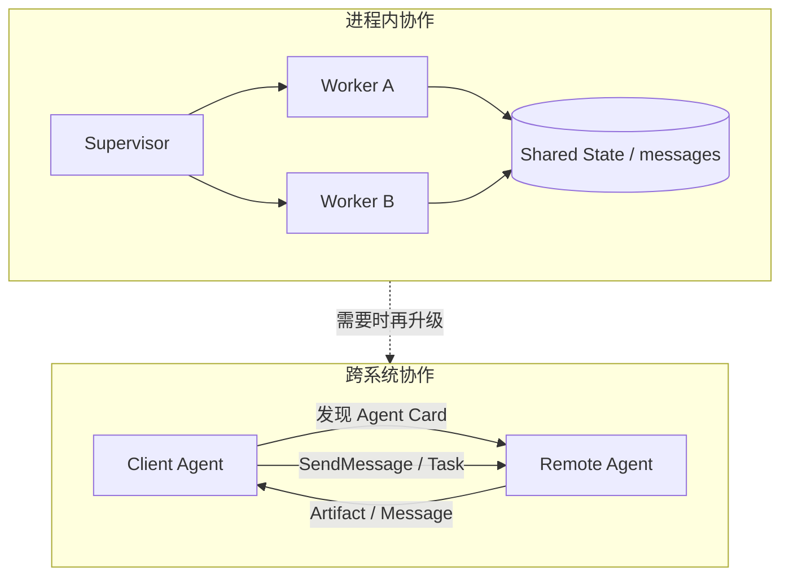
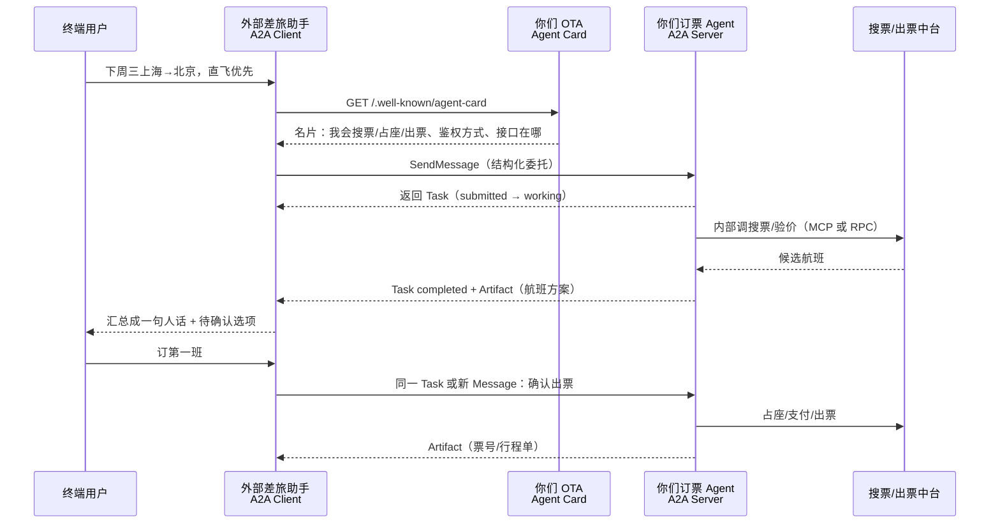

# 跨 Agent 通信：怎么说话、传什么、何时上协议

> 一句话定义：多 Agent 的难点不在「多开几个模型」，而在 **跨 Agent 通信** ——谁对谁说、说什么格式、同步还是异步、同进程还是跨系统、失败了怎么兜底。

> 前置阅读：[01-多智能体协作](01-多智能体协作.md)、[02-多智能体概念体系与学习要点](02-多智能体概念体系与学习要点.md)。  
> 配套：同目录 [03-LangGraph Supervisor 实战](03-多智能体实战示例-LangGraph-Supervisor.md)（进程内消息传递落地）；跨系统协议见 [13-进阶/10-Agent协议与形态前沿](../13-进阶与工程化/10-Agent协议与形态前沿.md)。

---

## 1. 为什么「通信」要单独成篇

`01` / `02` 已列出消息传递、黑板、跨系统协议等名词，但工程上真正卡住的是：

| 问题 | 若不解决会怎样 |
|------|----------------|
| 传自然语言还是结构化字段？ | 下游解析失败、字段丢失、难自动化 |
| 共享一整段对话，还是只交产物？ | 上下文膨胀、污染、成本爆炸 |
| 同步等回复，还是异步投递？ | 延迟不可控，或时序/竞态难排 |
| 同进程状态图，还是跨服务协议？ | 选型错位：要么过度工程，要么无法互通 |
| 消息可观测吗？ | 协作失败无法复盘 |

一句话： **拓扑决定「谁跟谁连」，通信决定「连上之后怎么协作」。** 后者决定可调试性与可扩展性。

```text
单 Agent：大脑内部「想」→ 调 Tool → 写回自己的上下文
多 Agent：大脑 A 「委托 / 交接 / 回报」→ 大脑 B 的上下文（或共享区）
```

下文的 **LLM** /ˌel el ˈem/ （ **Large Language Model** /lɑːdʒ ˈlæŋɡwɪdʒ ˈmɒdl/ ，大语言模型）指推理体；通信层应尽量少依赖「模型自觉遵守约定」，多依赖 schema / 协议校验。

---

## 2. 两层范围：进程内 vs 跨系统

先分清你在做哪一层，再选机制——混为一谈最容易过度设计。

| 范围 | 典型形态 | 通信载体 | 何时用 |
|------|----------|----------|--------|
| **进程内 / 同运行时** | 一张图里的多个节点、同一 `Crew` / `GroupChat` | 共享状态、内存消息、函数返回值 | 同一产品、同一团队、同一部署单元 |
| **跨进程 / 跨服务** | 独立服务、不同语言/框架、不同组织 | **HTTP** /ˌeɪtʃ tiː tiː ˈpiː/ （ **Hypertext Transfer Protocol** /ˈhaɪpəˌtekst ˈtrænsfɜː prəˈtəʊkɒl/ ）、队列、 **RPC** /ˌɑːr piː ˈsiː/ （ **Remote Procedure Call** /rɪˈməʊt prəˈsiːdʒə kɔːl/ ）、标准化 Agent 协议 | 能力分属不同系统、需独立扩缩/鉴权 |

本仓库 `03` 示例属于 **进程内消息传递** （共享 `messages` + Supervisor 路由）。跨厂商、跨仓库互通则落到 **A2A** /ˌeɪ tə ˈeɪ/ （ **Agent2Agent** /ˈeɪdʒənt tə ˈeɪdʒənt/ ，Agent 间通信协议；亦称 Agent-to-Agent）（见 §8）。



原则： **默认先把进程内通信做对（契约清晰、可观测、有终止）；** 只有出现「对方不在我进程里 / 不在我框架里」时，再上跨系统协议。

---

## 3. 四种通信载体（怎么「连」）

对应 `02` §2.2，这里补「怎么选、怎么落地」。

### 3.1 消息传递（ **message passing** /ˈmesɪdʒ ˈpɑːsɪŋ/ ）

Agent 之间显式发消息：自然语言回合，或带 schema 的结构化包。

- **优点** ：边界清晰、易审计（每条消息可落日志）、易做黑盒委托。
- **缺点** ：若无路由中枢，点对点易成网状；纯自然语言难解析。
- **落地** ：AutoGen 对话轮次；LangGraph 把节点输出写成 `AIMessage` 追加进共享列表（见 `03`）。

### 3.2 共享黑板（ **blackboard** /ˈblækbɔːd/ ）

公共区域挂「当前已知事实 / 中间产物」，各角色按规则读写。

- **优点** ：汇聚信息自然（研究笔记 → 写作素材）；解耦「谁写的」与「谁读的」。
- **缺点** ：写权限失控 → **状态污染** ；只增不减 → **状态膨胀** 。
- **落地** ：共享文档/对象仓库；MetaGPT 式「环境 + 产物文件」；研究流水线的 shared notes。

### 3.3 共享状态（ **shared state** /ʃeəd steɪt/ ）

图式编排里的全局可变状态（路由字段、计数器、产物指针等），比黑板更「程序化」。

- **优点** ：类型可约束、与图边条件天然配合；适合生产可控流。
- **缺点** ：多写者竞态；把整段对话塞进状态会迅速变贵。
- **落地** ：LangGraph `Annotation` / `StateGraph`；关键字段与「对话全文」分离设计。

### 3.4 任务队列（ **task queue** /tɑːsk kjuː/ ）

编排者投递任务，Worker 领取、执行、回写结果。

- **优点** ：天然并行、易扩容、失败可重试/进死信。
- **缺点** ：要处理幂等、顺序、超时；对「强对话感」协作不直观。
- **落地** ：Map-Reduce 式批量子任务；后台 Agent Worker 池。

| 载体 | 耦合度 | 可观测 | 并行 | 典型坑 |
|------|--------|--------|------|--------|
| 消息传递 | 中 | 高（逐条） | 视拓扑 | NL 难解析 |
| 黑板 | 低～中 | 中（看快照） | 高 | 污染 / 膨胀 |
| 共享状态 | 高 | 中（看 diff） | 中 | 竞态、塞太多 |
| 任务队列 | 低 | 高（任务生命周期） | 很高 | 幂等与乱序 |

---

## 4. 三条正交轴（怎么「说」）

载体解决「管道」，这三条轴解决「语义与时序」。可任意组合，选型时逐条拍板。

### 4.1 同步 vs 异步

| | **同步** | **异步** |
|--|----------|----------|
| 行为 | 发完等结果再继续 | 投递后继续干别的，结果回调/轮询 |
| 适合 | 强依赖链、要立刻决策下一步 | 长耗时工具、可并行子任务 |
| 风险 | 尾延迟叠加、易「全员空等」 | 时序乱、需关联 `taskId` / 相关 ID |

进程内 Supervisor 循环多是 **逻辑同步** （等 Worker 写回再路由）；跨服务常用 **异步 Task** （提交 → 轮询/订阅状态）。

### 4.2 黑盒 vs 白盒

| | **黑盒协作** | **白盒协作** |
|--|--------------|--------------|
| 可见内容 | 只看对方最终输出 / 约定字段 | 共享中间推理、工具轨迹、草稿 |
| 适合 | 权限隔离、降噪、跨信任域 | 调试、联合评审、需溯源 |
| 风险 | 难解释「为什么错」 | 上下文污染、泄密、token 暴涨 |

生产默认： **黑盒交接 + 结构化产物；** 调试期或同信任域评审可临时开白盒轨迹。

### 4.3 自然语言 vs 结构化

| | **自然语言通信** | **结构化通信** |
|--|------------------|----------------|
| 形态 | 对话回合、自由文本 | **JSON** /ˈdʒeɪsən/ （ **JavaScript Object Notation** /ˌdʒɑːvəskrɪpt ɒbˈdʒekt nəʊˈteɪʃn/ ）/ Schema / 协议 Part |
| 适合 | 探索性辩论、人对齐 | 生产编排、自动路由、校验与重试 |
| 风险 | 丢字段、歧义、难测 | 契约过刚、演进要版本化 |

口诀： **人对人用自然语言；Agent 对 Agent 的「合同」用结构化。** 自然语言可以包在某个文本字段里，但信封（谁、任务 ID、状态、产物类型）必须结构化。

---

## 5. 交接模式（ **handoff** /ˈhændɒf/ ）：谁发起、传什么

「通信」在运行时往往落成几种固定交接形状。

### 5.1 中枢转发（ **Hub relay** /hʌb rɪˈleɪ/ ）

Worker **不直接互聊** ；都写回共享通道，由 Supervisor 读全量（或摘要）再派下一个。

```text
User → Supervisor → WorkerA →（写回 messages）→ Supervisor → WorkerB → … → FINISH
```

- 本仓库 `03` 就是此模式。
- **优点** ：路由集中、终止好控、审计简单。
- **缺点** ：中枢成瓶颈；共享 `messages` 若不做摘要会膨胀。

### 5.2 直接对等（ **peer-to-peer** /ˌpɪə tə ˈpɪə/ ）

Agent 知道彼此地址/名字，点对点发消息（网状拓扑）。

- **优点** ：灵活协商、少一层转发。
- **缺点** ：路由与终止难；易死锁/无限互怼；生产少作为默认。

### 5.3 把 Agent 当 Tool（ **Agent-as-Tool** /ˈeɪdʒənt əz tuːl/ ）

上层把下游 Agent 封装成一次函数调用：`call_research_agent(query) → report`。

- **优点** ：心智模型简单；与单 Agent + Tools 平滑过渡（见 `01` §7）。
- **缺点** ：默认同步；下游若再拆多 Agent，延迟与成本要预算。

### 5.4 产物交接（ **artifact handoff** /ˈɑːtɪfækt ˈhændɒf/ ）

不传「整段思维链」，只传约定产物：文件路径、结构化报告、检索命中 ID 列表等。

- **优点** ：抗污染、易版本化、易给人在环审核。
- **缺点** ：要先定义产物 schema 与存储位置。

推荐默认组合：

> **Hub relay + 结构化信封 + 黑盒产物交接** ；辩论/探索阶段再局部放开自然语言白盒。

---

## 6. 消息契约：建议最小字段集

无论自研还是套框架，建议每条跨 Agent 消息（或任务）至少能回答：谁、为啥、传什么、怎么收尾。

```json
{
  "message_id": "uuid",
  "trace_id": "同一用户请求贯穿全程",
  "from": "supervisor",
  "to": "researcher",
  "intent": "research",
  "payload": {
    "goal": "……",
    "constraints": ["不超过 5 条来源", "中文输出"],
    "inputs": { "query": "……", "context_refs": ["doc:12"] }
  },
  "expect": {
    "schema": "ResearchReportV1",
    "deadline_ms": 30000
  },
  "reply_to": "supervisor",
  "correlation_id": "parent-task-id"
}
```

| 字段族 | 作用 |
|--------|------|
| `message_id` / `trace_id` | 去重、幂等、全链路追踪 |
| `from` / `to` / `reply_to` | 路由与回报 |
| `intent` | 接收方选策略 / 选工具，避免纯靠读长文猜意图 |
| `payload` | 任务输入；尽量引用 ID，少贴大段原文 |
| `expect.schema` | 产出合同；便于校验与自动重试 |
| `deadline` / 超时策略 | 防死等（见失败模式） |

**通信压缩** ：长历史先摘要或只传 `context_refs`，再让接收方按需拉取——这是防膨胀的第一刀。

---

## 7. 主流框架里「通信」分别长什么样

| 框架 | 通信长什么样 | 结构化程度 | 备注 |
|------|--------------|------------|------|
| **LangGraph** | 节点读写共享 State；边/条件边路由 | 高（状态 schema） | 生产可控；本仓库 `03` |
| **AutoGen** | `GroupChat` 轮流自然语言发言 | 低～中 | 原型快；生产常改显式路由 |
| **CrewAI** | Task 结果沿 Process 传递（sequential / hierarchical） | 中 | 角色流水线清晰 |
| **MetaGPT** | 消息总线 + 产物文件 + **SOP** /ˌes əʊ ˈpiː/ （ **Standard Operating Procedure** /ˈstændəd ˈɒpəreɪtɪŋ prəˈsiːdʒə/ ） | 中高 | 软件公司式协作 |

对照学习时抓住一句：

> 框架差异首先是 **通信与状态模型** 的差异，其次才是「有几个角色模板」。

---

## 8. 跨系统标准：A2A（Agent 连 Agent）

### 8.1 先回答：A2A 是不是「Agent 通信标准协议」？

**是。** A2A 是一套 **开放标准协议** ：约定不同厂商、不同框架写成的 Agent，如何互相 **发现能力、委托任务、交换结果** 。

把它想成：

| 层级 | 标准在管什么 | 类比 |
|------|--------------|------|
| **MCP** /ˌem siː ˈpiː/ （ **Model Context Protocol** /ˈmɒdl ˈkɒntekst ˈprəʊtəkɒl/ ） | Agent 怎么连 **工具 / 数据** | 电脑插外设的 USB-C |
| **A2A** | Agent 怎么连 **另一个 Agent** | 公司之间下工单的「统一工单格式」 |

注意边界：

- A2A 管的是 **跨系统 / 跨组织** 的互操作合同，不是 LangGraph 进程内两个节点怎么共享 `messages`（那是 §3–§5）。
- 它规定的是 **怎么发现、怎么发消息、任务状态怎么走** ，并不规定对方内部用不用 ReAct、用哪个模型。
- 生态仍在演进；落地前以 [a2a-protocol.org](https://a2a-protocol.org/latest/specification/) 为准。

当对方是 **另一个服务里的 Agent** 时，若每人私定一套 JSON，会重演「工具集成 M×N」——A2A 就是来消掉这种点对点定制的。

### 8.2 例子：你们是 OTA，对外暴露「卖机票」能力

更贴业务的站位：你们公司是 **OTA** /ˌəʊ tiː ˈeɪ/ （ **Online Travel Agency** /ˈɒnlaɪn ˈtrævl ˈeɪdʒənsi/ ，在线旅行社），自己有搜票、验价、占座、出票等能力。问题变成——

> **外部 Agent（企业差旅助手、银行 App 助手、别家超级助手……）怎么接到我们卖机票的能力？**

答案分两层：

| 调用方是什么 | 你们通常暴露什么 | 要不要 A2A |
|--------------|------------------|------------|
| 传统业务系统 / 移动 App / 开放平台合作方 | 已有 B2B/开放 **REST** /rest/ （ **Representational State Transfer** /ˌreprɪzenˈteɪʃənl steɪt ˈtrænsfɜː/ ，表述性状态转移）订票接口 | **不必** 为了 A2A 而 A2A |
| **另一个 Agent**（要发现能力、多轮澄清、异步长任务） | 在既有订票能力外包一层 **A2A Server** | **值得考虑** |

A2A 不是取代你们的订票中台，而是给「Agent 调用方」多开一扇 **标准工单门** ：门后面还是你们原来的运价、库存、支付与风控。

#### 角色怎么摆

| 角色 | 谁 | 协议身份 |
|------|----|----------|
| 外部助手 | 合作方的差旅/出行 Agent | **A2A Client** （来下工单的） |
| 你们的订票 Agent | 封装 OTA 卖机票能力的服务 | **A2A Server** （接工单的） |
| 你们内部系统 | 运价引擎、库存、支付、风控…… | **MCP 工具或既有 RPC** （不直接暴露给外部 Agent） |

```text
外部 Agent  ──A2A──►  你们「订票 Agent」  ──MCP/内部接口──►  搜票/验价/出票中台
（Client）              （Server + Agent Card）              （核心交易能力，黑盒）
```

#### 没有 A2A 时（每个 Agent 合作方一套私对接）

```text
差旅助手A ──私有字段/回调──► 你们开放平台
银行助手B ──另一套封装────► 你们开放平台
超级助手C ──第三套 SDK───► 你们开放平台
```

开放平台 API 仍有价值；痛点是：**每个「Agent 产品」都要重新理解你们的同步/异步、验价占座流程、错误码** ，集成成本随 Agent 合作方数量线性涨。

#### 有 A2A 时（Agent 合作方走同一套发现与委托）



分步对应到协议对象（站在 **OTA 服务方** 看）：

1. **发布名片（Agent Card）——你们要交付的第一件东西**  
   在约定地址挂出：「我是某某 OTA Flight Agent；skills 含 `search_flights` / `book_flight`；要带合作方 Token；接口 URL……」。  
   → 外部 Agent **先发现你会什么** ，再决定要不要委托，而不是先读一本私有对接文档硬编码。

2. **接工单（Message → Task）**  
   外部助手发来一条标准消息（示意，非完整报文）：

```json
{
  "role": "user",
  "parts": [
    {
      "type": "text",
      "text": "2026-08-12 上海虹桥→北京首都，直飞优先，经济舱，预算 1500 元内，返回 2 个方案供确认"
    }
  ]
}
```

   你们的订票 Agent 创建 **Task** （有 ID、状态：已提交 → 进行中 → 完成/失败/取消）。验价锁价、出票等长耗时可异步推进，Client 轮询或订阅即可。

3. **黑盒执行（核心交易不外泄）**  
   Agent **内部** 再调搜票、运价、支付、风控——可用 MCP 包一层工具，或直接打现有中台。  
   对外部助手不可见。A2A 坚持 **opaque execution** /əˈpeɪk ˌeksɪˈkjuːʃn/ （不透明执行）：对方只看约定 skills 与产物，看不到你们库存策略与私有工具。

4. **交回产物（Artifact）**  
   Task 完成时返回结构化结果（示意）：

```json
{
  "name": "flight_options",
  "parts": [
    {
      "type": "data",
      "data": {
        "options": [
          { "flight": "MU5137", "depart": "08:00", "price_cny": 1280 },
          { "flight": "CA1501", "depart": "12:30", "price_cny": 1410 }
        ]
      }
    }
  ]
}
```

   用户确认后，外部助手再发「订第一班」；你们走占座/出票，再回票号 Artifact。多轮澄清（改日期、要行李额）也落在同一套 Message/Task 模型里，而不是另开一套回调协议。

#### OTA 落地时常见选型（避免用错层）

| 场景 | 建议 |
|------|------|
| App/H5/开放平台合作方继续下单 | **保持现有 REST/开放平台** ，不必强行改成 A2A |
| 要让「别家的 Agent」稳定调用卖机票能力 | 在中台外包 **订票 A2A Server** + 发布 Agent Card |
| 你们自己 App 里的客服 Agent 调自家搜票 | **进程内编排或内部 RPC** 即可，不必绕一圈公网 A2A |
| 订票 Agent 内部接支付、风控、航班动态 | **MCP 或内部服务** ，不要把中台接口直接当 A2A 暴露 |

#### 和本仓库 `03` 示例的差别

| | `03` LangGraph Supervisor | 本例（OTA + A2A） |
|--|---------------------------|-------------------|
| 工人在哪 | 同一进程、同一张图里的节点 | **对外可发现的订票 Agent 服务** |
| 怎么说话 | 写共享 `messages` 状态 | 标准 Card + Message + Task + Artifact |
| 要不要 A2A | **不用** | 仅当调用方是 **外部 Agent** 时值得上 |

一句话： **你们已有的「卖机票中台」继续当发动机；A2A 是给外部 Agent 用的标准方向盘与工单格式。**

### 8.3 与 MCP 的分工

| | **MCP** | **A2A** |
|--|------|------|
| 连什么 | Agent ↔ 工具 / 数据源 | Agent ↔ Agent |
| 类比 | AI 应用的「USB-C」接外围能力 | Agent 之间的「统一工单 / 业务委托协议」 |
| 典型对象 | Tools / Resources / Prompts | Agent Card / Task / Message / Artifact |
| OTA 落点 | 订票 Agent **对内** 调搜票/支付/风控 | 外部助手 **对外** 委托你们订票 Agent |

二者互补，不是二选一：对外 A2A Server，对内 MCP（或原中台 RPC）。

### 8.4 核心对象（概念级）

以官方数据模型为准（细节随版本演进，实现前查 [规范](https://a2a-protocol.org/latest/specification/)）：

| 对象 | 作用 | 在 §8.2 OTA 例子里 |
|------|------|---------------------|
| **Agent Card** | 远端发布的能力名片：身份、skills、接口、鉴权 | 你们挂出的「我会搜票/出票」 |
| **Task** | 有生命周期的工作单元（可查询、可取消、可订阅） | 一笔「上海→北京出方案/出票」工单 |
| **Message** | 一轮交互：`role` + 多个 **Part** | 外部助手的委托、用户确认「订第一班」 |
| **Part** | 最小内容块：文本 / 文件引用 / 结构化数据等 | 一段说明，或一段航班 JSON |
| **Artifact** | 任务产出物（由 Parts 组成） | `flight_options` / 票号行程单 |

常见操作心智：发现 Card → `SendMessage` / 流式发送 → 用 Task 状态跟踪 → 取 Artifact。

### 8.5 何时上 A2A，何时别上

**值得上** ：

- 要把卖机票能力开放给 **外部 Agent** 生态（如 §8.2），需要标准发现与鉴权。
- 希望换框架不换协作合同。
- 任务长、需异步状态机（验价锁价 / 待支付 / 出票 / 取消）。

**先别上** ：

- 调用方不是 Agent，只是 App 或传统 B2B——继续开放平台 REST。
- 仍在同一进程、同一 LangGraph/Crew 里就能闭环（用 §3–§5 即可）。
- 只有两个内部服务且契约极稳——可先用内部 RPC + 自研 schema，待生态成熟再映射到 A2A。

`03` 文末 P3「跨进程 A2A」指的就是：Worker 不再是图内节点，而是可独立部署的 A2A Server；对 OTA 而言，常常是「对外的订票 Agent」这一层。

### 8.6 普通 Agent 怎么「加上」A2A？

核心心态： **A2A 是外壳（协议适配层），不是重写大脑。**  
你现有的 LangGraph / 自研 ReAct / 订票工作流 **原样保留** ；外面再包一层「会讲 A2A」的 HTTP 服务。

```text
┌─────────────────────────────────────────────┐
│  A2A 外壳（新增）                             │
│  · 发布 Agent Card                            │
│  · 实现 SendMessage / Task 状态机             │
│  · 鉴权、HTTPS、可选流式                      │
└─────────────────┬───────────────────────────┘
                  │ 把 Message.parts 转成你原来的输入
                  ▼
┌─────────────────────────────────────────────┐
│  原来的普通 Agent（不动或只加适配函数）         │
│  · 推理循环 / 图 / 业务工作流                   │
│  · 对内继续 MCP / 中台 RPC                    │
└─────────────────────────────────────────────┘
```

先分清你要加的是哪一侧：

| 目标 | 你变成 | 做什么 |
|------|--------|--------|
| 让别人来调你 | **A2A Server** | 挂 Card + 接 `SendMessage` + 跑原 Agent + 回 Artifact |
| 让你去调别人 | **A2A Client** | 拉对方 Card + `sendMessage` + 等 Task/Artifact |

OTA 卖机票对外：主要做 **Server** 。你们自己的超级助手还要调酒店/保险 Agent：再兼 **Client** 。

#### 做成 A2A Server 的五步（最常见）

1. **写清 Agent Card（名片）**  
   名称、描述、skills（如 `search_flights` / `book_flight`）、对外 URL、输入输出 MIME、鉴权方式。  
   约定路径常见为 `/.well-known/agent-card`（或以当前规范为准）。

2. **实现「执行器适配」**  
   官方 SDK 里通常叫 `AgentExecutor`（名随语言/SDK 而变）：  
   - 入：A2A 的 `RequestContext`（里面有用户 Message、taskId…）  
   - 做：抽出文本/结构化 Part → 调用 **你原来的** `runAgent(input)` / `graph.invoke(...)`  
   - 出：通过事件总线发布 Task 状态（`submitted` → `working` → `completed`/`failed`）和 Artifact

3. **挂上传输层**  
   A2A 跑在常见 Web 栈上（ **JSON-RPC** /ˌdʒeɪsən ˈɑːr piː ˈsiː/ 、HTTP+JSON、可选 gRPC）。  
   Node 侧可用官方 [`@a2a-js/sdk`](https://github.com/a2aproject/a2a-js)；Python 等亦有对应 SDK。用 Express/FastAPI 把 Card 与 `sendMessage` 路由挂出去即可。

4. **接鉴权与网络安全**  
   Card 里声明 `securitySchemes`；生产走 HTTPS + 合作方 Token / OIDC。  
   不要把未鉴权的订票 Agent 暴露到公网。

5. **发布与联调**  
   部署服务 → 用 A2A Client（或 Inspector）拉 Card → 发一条试探 Message → 核对 Task/Artifact。  
   联调通过后再给合作方 Agent 基址。

示意（TypeScript 骨架，突出「调用原 Agent」，非完整可运行工程）：

```ts
// 伪代码：外壳适配，大脑仍是你原来的 agent
class FlightAgentExecutor /* implements AgentExecutor */ {
  async execute(ctx, eventBus) {
    const text = extractText(ctx.userMessage); // 从 A2A Message.parts 取出
    eventBus.publish({ state: "working", taskId: ctx.taskId });

    // ★ 关键：调用已有普通 Agent / 工作流，而不是在这里重写业务
    const result = await myExistingFlightAgent.run(text);

    eventBus.publish({
      kind: "artifact",
      name: "flight_options",
      parts: [{ kind: "data", data: result }],
    });
    eventBus.publish({ state: "completed", taskId: ctx.taskId });
    eventBus.finished();
  }
}

// 另：挂 Agent Card + DefaultRequestHandler + Express 路由
// app.get('/.well-known/agent-card', ...)
// app.post('/a2a/...', sendMessageHandler)
```

#### 做成 A2A Client 的三步（去调别人）

1. 拿到对方基址 → `GET` Agent Card，确认 skills 与鉴权。  
2. 用 SDK 的 Client（如 `ClientFactory.createFromUrl`）发 `sendMessage`。  
3. 同步等结果，或按 Task 状态轮询/订阅流式事件，把 Artifact 接回你自己的编排。

```ts
// 伪代码：普通编排里多一步「标准委托」
const client = await factory.createFromUrl("https://partner.example/flight-agent");
const task = await client.sendMessage({
  message: {
    role: "user",
    parts: [{ kind: "text", text: "上海→北京 下周三 直飞 两方案" }],
  },
});
// 再根据 task / artifacts 继续你的 Supervisor 逻辑
```

#### 和「把 Agent 包成 Tool」有何不同？

| 做法 | 形态 | 局限 |
|------|------|------|
| Agent-as-Tool | 下游被压成一次函数调用 | 难做多轮澄清、长任务、标准发现 |
| **A2A 外壳** | 下游仍是完整 Agent（Task 生命周期） | 多一层服务运维，但互操作标准 |

官方也强调：别把 Agent 只当 Tool 封一层就完事；要协作就用 A2A 让它以 **Agent 身份** 被发现和委托。

#### 落地检查清单

- [ ] 原 Agent 已有稳定入参/出参（方便适配，不必对外暴露内部 trace）
- [ ] Card 上的 skills 与真实能力一致，示例问法写清楚
- [ ] Task 状态会推进，失败有 `failed` + 可读原因
- [ ] 出票等高风险动作有鉴权、审计、幂等（同一 `taskId`/`messageId` 不重复扣款）
- [ ] 对内中台仍走 MCP/RPC，没有把数据库连接串暴露进 Artifact

---

## 9. 通信失败模式与治理

| 失败 | 表现 | 通信侧对策 |
|------|------|------------|
| **死锁** | 互相等对方先回复 | 超时、`deadline`、打破循环等待；中枢统一调度 |
| **活锁 / 无限辩论** | 一直在说话但无进展 | `max_round`、无进展检测、仲裁者终裁 |
| **契约漂移** | 字段名/含义悄悄变 | schema 版本化、校验失败即拒收并重试/升级 |
| **幻觉当事实传播** | 上游胡编被下游当真 | 黑盒产物 + 校验点；关键字段要证据引用 |
| **上下文膨胀** | 共享历史滚雪球 | 摘要、refs、按角色裁剪可见窗口 |
| **越权读写黑板** | 工人改了不该改的全局字段 | 写权限最小化；分「私有状态 / 共享产物」 |
| **不可复现** | 发言顺序随机 | 生产用显式路由，少用「LLM 选下一个说话者」 |
| **跨系统半成功** | 远端完成了但本地没接到 | `trace_id` + 幂等 + 可重入的 GetTask |

可观测底线： **每条跨 Agent 消息可关联到同一 `trace_id`** ，并能回答「谁在何时对谁说了什么、对方回了什么」。接 [可观测性与 LLMOps](../13-进阶与工程化/04-可观测性与LLMOps.md)。

---

## 10. 设计决策清单（动手前）

- [ ] 范围是进程内还是跨系统？跨系统是否真的需要 A2A？
- [ ] 若上 A2A：做 Server、Client，还是两边都做？原 Agent 的适配入口清晰吗？（§8.6）
- [ ] 载体选消息 / 黑板 / 共享状态 / 队列中的哪一种（或组合）？
- [ ] 同步还是异步？超时与取消谁负责？
- [ ] 黑盒产物还是白盒轨迹？生产默认是前者吗？
- [ ] 信封是否结构化？`expect.schema` 写清了吗？
- [ ] 交接是 Hub relay、Peer、Agent-as-Tool，还是 Artifact handoff？
- [ ] 有没有 `max_round` / 终止条件 / 预算上限？
- [ ] 共享区写权限与膨胀对策有吗？
- [ ] 消息与决策能否按 `trace_id` 复盘？

---

## 11. 学习要点

1. 多 Agent 的工程核心是 **通信 + 状态 + 终止** ，不是角色昵称数量。
2. 先分清 **进程内** 与 **跨系统** ；前者用 State/消息/队列做对，后者再考虑 A2A。
3. 三条轴要显式选择：同步/异步、黑盒/白盒、自然语言/结构化。
4. 生产默认： **中枢转发 + 结构化信封 + 黑盒产物。**
5. **MCP 连工具，A2A 连 Agent** ；OTA 对外暴露卖机票给外部 Agent = A2A Server，对内调中台 = MCP/RPC（见 §8.2）。
6. 给普通 Agent「加 A2A」= 外包协议壳（Card + Executor + 传输），不是重写大脑（见 §8.6）。
7. 没有契约与可观测的「多 Agent 聊天」，通常只是更贵的单线程糊涂账。

---

## 12. 参考资料

- 本目录 `01` / `02` / `03`；`13-进阶与工程化/06-多智能体进阶.md`、`10-Agent协议与形态前沿.md`
- Anthropic, "Building Effective Agents"（多 Agent 审慎使用）
- AutoGen / CrewAI / MetaGPT / LangGraph 官方多 Agent 文档
- [A2A Protocol Specification](https://a2a-protocol.org/latest/specification/)
- [a2a-js SDK](https://github.com/a2aproject/a2a-js)（把现有 Agent 挂成 A2A Server/Client）
- Anthropic MCP 文档（与 A2A 对照：[02-MCP协议](../03-工具调用/02-MCP协议.md)）

---

## 本文缩写

| 缩写 | 音标 | 全拼 | 中文 |
|------|------|------|------|
| **A2A** | /ˌeɪ tə ˈeɪ/ | Agent2Agent | Agent 间通信协议 |
| **MCP** | /ˌem siː ˈpiː/ | Model Context Protocol | 模型上下文协议 |
| **LLM** | /ˌel el ˈem/ | Large Language Model | 大语言模型 |
| **JSON** | /ˈdʒeɪsən/ | JavaScript Object Notation | JS 对象表示法 |
| **HTTP** | /ˌeɪtʃ tiː tiː ˈpiː/ | Hypertext Transfer Protocol | 超文本传输协议 |
| **RPC** | /ˌɑːr piː ˈsiː/ | Remote Procedure Call | 远程过程调用 |
| **SOP** | /ˌes əʊ ˈpiː/ | Standard Operating Procedure | 标准作业程序 |
| **OTA** | /ˌəʊ tiː ˈeɪ/ | Online Travel Agency | 在线旅行社 |
| **REST** | /rest/ | Representational State Transfer | 表述性状态转移 |
| **JSON-RPC** | /ˈdʒeɪsən ˈɑːr piː ˈsiː/ | JSON Remote Procedure Call | JSON 远程过程调用 |
