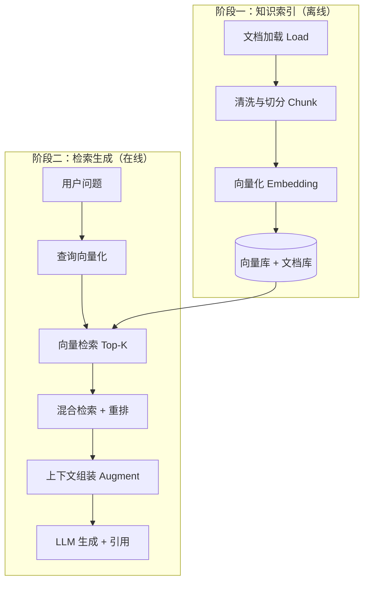
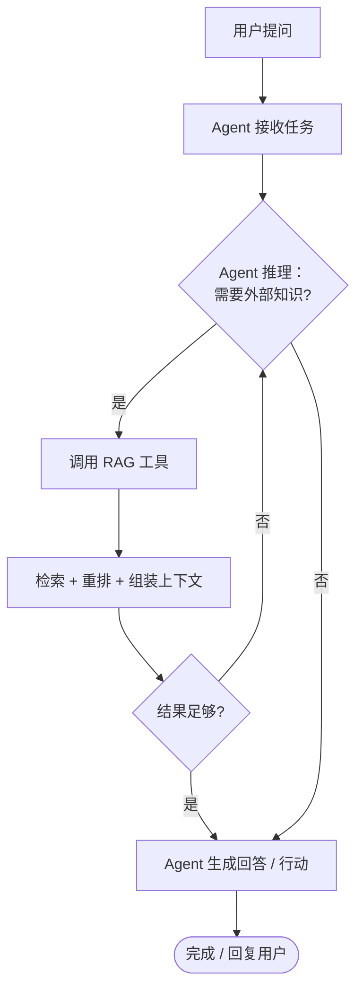

# RAG 与知识集成

> 一句话定义：把 RAG （Retrieval-Augmented Generation，检索增强生成）作为 Agent 的"知识工具"，让 Agent 在需要时检索外部知识，而非全靠参数记忆。

## 1. Agent 为什么需要 RAG
- LLM 知识有截止日期，不知最新/私有信息。
- Agent 执行任务常需查文档、查数据库、查实时数据。
- RAG 让 Agent 按需检索，把"记忆"外置可更新。

## 2. RAG 作为 Agent 工具
- 把"检索知识库"封装为一个 Tool。
- Agent 在推理中判断需要时调用该 Tool。
- 与其他工具（搜索、API）并列，由 Agent 选择。

## 3. RAG 的工作流程

RAG 整体分为「离线索引」与「在线检索生成」两个阶段：离线阶段把知识变成可被检索的向量；在线阶段在用户提问时实时召回并增强生成。

### 阶段一：知识索引（离线 / 准备）
1. **文档加载（Load）**：从知识源导入原始文档（PDF、Markdown、网页、数据库记录等）。
2. **清洗与切分（Chunk）**：去除噪声，按语义粒度切块——固定长度、递归字符、按标题层级等切分策略。
3. **向量化（Embed）**：用 Embedding 模型把每个文本块编码为高维向量。
4. **入库（Store）**：向量写入向量数据库，原文与元数据写入文档库，建立可检索索引。

### 阶段二：检索生成（在线 / 运行时）
5. **查询向量化**：把用户问题用同一套 Embedding 模型编码为向量。
6. **向量检索（Retrieve）**：在向量库做近似最近邻搜索（ANN），召回 Top-K 相似文本块。
7. **混合检索 + 重排（Rerank，可选）**：关键词（BM25）与向量结果融合，再用重排模型精排，保留最相关片段。
8. **上下文组装（Augment）**：把 Top-N 片段拼进 Prompt 模板，注入模型上下文。
9. **生成（Generate）**：LLM 基于「问题 + 检索片段」生成回答，并附引用来源。

### RAG 流水线流程图

### Agent 如何使用 RAG（推理循环）

Agent 把 RAG 当成普通工具：在推理时自行判断「是否需要外部知识」，需要就调用检索工具，拿到结果后评估是否足够，不足则继续多跳检索，足够才生成最终回答。

## 4. 集成模式

### 单次检索
- Agent 一次检索后基于结果作答/行动。
- 适合简单知识问答。

### 多跳检索（Multi-hop）
- 复杂问题需多次检索，逐步综合。
- 例：先查"X 公司 CEO"再查"该 CEO 学历"。
- 需 Agent 规划检索路径。

### 主动检索（Agentic RAG）
- Agent 自决定是否检索、检索什么、何时停止。
- 比固定 RAG pipeline 更灵活。

## 5. 知识源类型
- 文档库：产品手册、Wiki、论文。
- 结构化数据：数据库、知识图谱。
- 实时数据：搜索 API、新闻。
- 代码库：符号检索（Agent 编程场景）。

## 6. 设计要点
- **检索质量是关键**：召回不准会误导 Agent。
- **切分与重排**：见 RAG 基础（切分、混合检索、rerank）。
- **结果裁剪**：只注入最相关片段，避免上下文膨胀。
- **引用校验**：Agent 引用需核对真实存在。
- **与记忆区分**：RAG 是外部知识，记忆是历史经验，别混用。

## 7. 实战示例
**场景**：客服 Agent 处理产品问题。
1. 用户问"X 型号故障码 E07 怎么办？"
2. Agent 判断需查手册 → 调 `searchManual("X E07")` 工具。
3. RAG 检索返回相关章节 → Agent 基于片段回答并标注引用。
4. 若片段不足 → Agent 二次检索（多跳）或转人工。

## 8. 学习要点
- RAG 是 Agent 的"知识工具"，按需调用。
- Agentic RAG 比固定 pipeline 更灵活。
- 检索质量决定 Agent 知识类任务的上限。

## 9. 参考资料
- "Self-RAG: Learning to Retrieve, Generate, and Critique through Self-Reflection"
- GraphRAG（Microsoft）
- LlamaIndex / LangChain RAG + Agent 文档
