# RAG 核心概念与原理：Chunking、Embedding、相似度、HNSW 与多路召回

> 来源：[RAG 核心概念与原理：Chunking、Embedding、相似度、HNSW 与多路召回｜得物技术](https://mp.weixin.qq.com/s/gfFlUUNbKZ23G7NgWHU3YQ)（得物技术）


## 一、为什么需要 RAG —— LLM 的先天局限

向 ChatGPT 询问企业内部系统相关问题，常会出现这样的情况：它给出一段看似逻辑通顺、实则完全错误的回答，不少人都遇到过类似状况。

写代码时若提问 “这个框架的 v2.3 版本 API 怎么用”，它提供的却是早已淘汰的 v1.x 写法；若询问「公司内部优惠券系统的退款流程是什么」，它会凭空编造一套流程。

LLM 的核心缺陷可归纳为三点：

* **训练数据存在时间截止日期：** GPT-4 的知识停留在训练完成的那一刻，无法知晓之后发生的新内容。

* **遇到知识盲区会产生 “幻觉”：** 不会如实回复 “我不知道”，而是强行编造一段看似合理的回答。

* **无法识别企业私有知识：** 内部文档、代码库、业务规则、团队约定，这类内容不会出现在公开训练数据中。

**RAG（Retrieval-Augmented Generation，检索增强生成）** 正是用来解决以上问题的，思路十分朴素：让 LLM 先检索资料，再结合检索内容给出回答。

```
用户提问 → 检索相关的外部信息 → 把信息塞进 prompt → LLM 基于信息回答
```

这就把 LLM 从 "闭卷考试" 变成了 "开卷考试"—— 给出题范围，照着答就行。

注意上面的标注，我写的是「检索相关的外部信息」，没写「从知识库里检索」。因为 RAG 本质上做的是**扩充 LLM 的推理上下文**，检索的内容可以是任何来源：一份 PDF 文件、一段聊天记录、一条搜索结果、一个网页链接。

RAG 是那根吸管，检索源是杯子里的水。杯子可以是知识库（文档集合），可以是搜索引擎（互联网），也可以是单个文件。吸管和杯内的内容相互独立。

**很多人将 RAG 等同于「搭建知识库问答系统」，这是一种片面的狭义理解。** 不过在实际落地场景中，最常见、价值最高的组合确实是 RAG + 知识库，因此下文我们将围绕这条主线展开说明。

### 1.1、知识从哪来

RAG 要检索知识库，那知识库里装的到底是什么？换个问法 —— 一个组织里的「知识」到底存在哪？其实可以分为两类：静态共享知识和动态个人记忆。

#### 1.1.1、静态共享知识

静态共享知识是一个团队共享的、相对稳定的信息。

* **企业文档：** 飞书文档、Confluence、Notion、Google Docs 里的产品文档、技术方案、会议纪要、复盘报告。这些是结构最完整、最容易检索的知识。

* **代码仓库：** Git 仓库里的源码、README、API 文档、变更日志。比如问「这个微服务怎么接入统一鉴权」，答案可能在某个仓库的 README 里。

* **聊天记录：** Slack、飞书群聊、钉钉里的技术讨论。比如「上次那个 NPE 是谁修的？怎么修的？」—— 答案可能在三个月前的群聊记录里。

* **规章制度：** HR 系统里的考勤规则、报销流程、假期政策。这些内容调性固定，提问方式也明确。

#### 1.1.2、动态个人记忆

还有一种内容，RAG 的传统定义里很少提及，但它对使用体验影响巨大 —— 用户个人的偏好、习惯、历史行为。举个例子：张三每次问「帮我写个接口」，表述都一致，但他想要的是 Go + Gin 风格的接口，而李四需要的是 Java + Spring Boot。这并非文档中写明的规范，而是张三自身的技术偏好。再比如客服场景：用户上次反馈过「页面加载太慢」，这次又问「还是卡」，系统需要识别「还是」指代此前的问题，而非当作全新问题处理。

**这就是记忆（Memory）**—— 千人千面、随时间变化的动态知识。和文档「同一份内容对所有人可见」不同，记忆是「每位用户拥有专属独立存储」。

静态共享知识与动态个人记忆，二者均依靠检索匹配相关内容，但记忆还额外存在三类工程难题：
* 主体归属（记忆归属用户判定）、
* 冲突判定（新旧记忆存在矛盾时的取舍逻辑）、
* 生命周期管理（偏好长期有效，但「最近在学 Rust」这类短期状态可能次月失效）。

本文以知识库为主线展开讲解，记忆相关工程落地细节将单独撰文说明。

### 1.2、RAG 的流水线：离线存、在线搜

RAG 的流水线分两段。以下以知识库场景为例展开，记忆检索架构类似，差异主要在存取策略，后续另文讨论。

离线阶段做的事：把知识库里的文档切成段落，每个段落用 Embedding 模型算一个向量，存进向量数据库。这一步平时跑、预计算准备好，查询时不用等。

```
文档 → 切段（Chunking）→ Embedding（向量化）→ 索引写入（存入向量库）
```

在线阶段：用户提问→问题向量化→向量搜索 **Top-K** 相关文档→把文档和问题一起塞给 LLM→LLM 生成答案。

```
（简化版）用户问题 → Embedding → Recall（ANN + BM25）→ RRF 融合 → Rerank 精排 → LLM 生成答案
```

完整链路还包括 Query Rewrite 和 Metadata Filter，后文有展开。

```
Query Rewrite → Metadata Filter → Recall（ANN + BM25）→ RRF 融合 → Rerank 精排 → LLM 生成答案
```

RAG 好不好用，关键不在 LLM，而是在于「搜得准」。检索回来的东西不对，LLM 再强也是垃圾进垃圾出。

所以要解决的问题其实是：**怎么搜才能搜到意思相近 “而不仅仅是” 字面匹配的内容？**

## 二、Embedding：把文本变成可计算的数据

要搜"意思"，先得让计算机能"算"意思。计算机只认识 0 和 1，它不知道怎么比"意思像不像"。

**Embedding 做的事就是把文本变成向量，让语义相似度变成一个数学计算问题。**

回头看 RAG 的流水线，离线阶段的 Embedding 和在线阶段的 Embedding 是同一件事——把文本映射到向量空间，然后在那个空间里找最近的邻居。

### 2.1、从"搜字面"到"搜意思"

传统数据库搜索，就是字面匹配。用 SQL LIKE '% 编程语言 %' 搜：

```
✅ "用户的编程语言是 Go"          → 命中，因为出现了"编程语言"四个字
❌ "用户写 Go 和 Python"         → 漏掉，没出现"编程语言"，但意思完全相关
❌ "用户的技术栈是 Go"            → 漏掉，同样语义相关但字面不同
```

这就像你去图书馆查资料，管理员只能按书名里的字一个个对 —— 你搜 “编程”，他找不到书名里写的是 “Coding” 的书。

要让计算机理解 “意思”，需要一种全新的数据表示方式**——Embedding（向量嵌入）。**

### 2.2、什么是向量

向量就是一组有序的数字，也是线性代数里的列向量 —— 只不过维度从二、三维变成了几百上千维（主流 Embedding 模型常见的有 768、1024、1536 维）。

[3.0, 4.0] 是二维向量，[0.12, -0.34, 0.07] 是三维向量。向量的价值在于可以用数学来比较 —— 两个向量越 “接近”，就说明它们代表的东西越相似。至于 “接近” 怎么算，后面讲相似度时展开。

在 RAG 里，“向量” 指的是把文本转换后得到的一串浮点数，比如 1536 个维度：

```
"用户喜欢川菜" → [0.21, -0.43, 0.07, 0.85, ..., -0.12]  ← 1536 个数字
```

文本变成向量之后，“这两句话意思像不像” 就变成了 “这两个向量距离近不近”—— 从语言问题变成了数学问题，计算机才能处理。

那谁来决定一段文字应该变成什么向量？这就是 Embedding 模型的工作。

### 2.3、什么是 Embedding

Embedding 就是把一段文本变成向量空间中的一个点 —— 但这背后的核心是一个训练好的专用模型在起作用。它不是简单的 “每段文字随机生成一个数组”。

整个流程是这样的：一段文本输入 Embedding 模型，模型经过内部神经网络计算，输出一个固定维度的向量。这个向量的每一维都是一个浮点数，合在一起表示了文本的语义特征。

关键是 —— 这个模型是专门训练过做**语义对齐**的。它知道 “川菜” “辣”和“火锅” 在语义上是同一个圈子的东西，会把它们在向量空间中放得很近。它也知道 “川菜” 和 “今天下雨了” 毫无关系，会把它们放得很远。

换句话说，Embedding 模型做的是**语义向量化** —— 把人类语言里模糊的 “意思像不像”，转成向量空间里精确的 “距离近不近”。这个转化一旦完成，语义搜索就变成了一个纯数学操作 —— 算两个向量之间的距离就行了。

拿二维向量来理解原理。虽然真实模型输出的是 1024 或 1536 维，但在二维平面上一目了然【注：文中 AI 生成的示意图，细节失真，但是会意即可】：

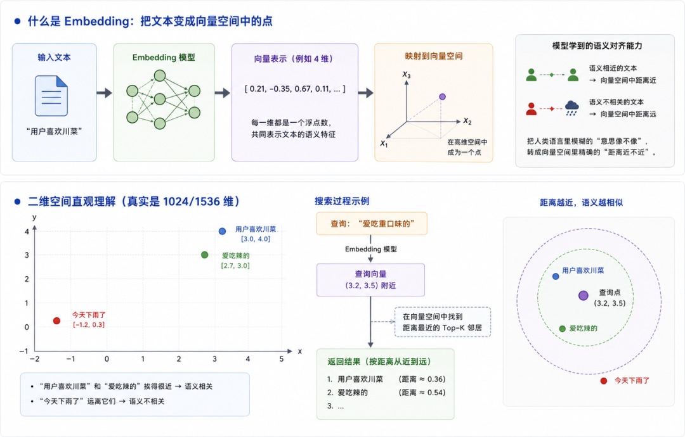

“用户喜欢川菜” 和 “爱吃辣的” 挨得很近 —— 模型学会了 “川菜” 和 “辣” 语义相关。“今天下雨了” 跟它们八竿子打不着，被放到了完全不同的位置。

搜索的时候同理：把查询文本也送进同一个模型算出向量，然后找离它最近的几个邻居。比如搜 “爱吃重口味的”，模型映射到 (3.2, 3.5) 附近 —— 离 “川菜” 和 “辣” 都很近，结果就回来了。

所以 Embedding 的魔法不在于向量本身，而在于那个训练好的模型 —— 它知道什么样的文本应该靠在一起。那模型是怎么学会这个能力的？

### 2.4、Embedding 模型是怎么练出来的

训练方式叫**对比学习（Contrastive Learning）**。想象你拿着一个遥控器，上面有两个按钮 ——「靠近」和「远离」：

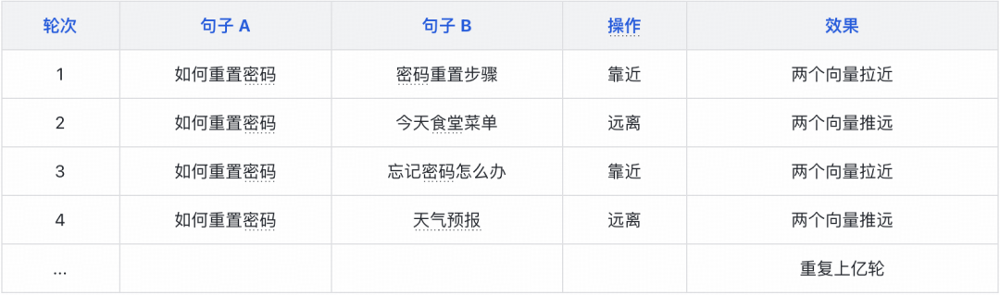

每一轮模型都在根据信号微调自己的参数。拉近正例让它学会 “这两句话意思相关”，推远负例让它学会 “这两句话不相关”。几十亿轮下来，模型就内化了语言的语义关系 —— 不用人告诉它 “川菜” 和 “辣” 是什么关系，它自己从海量训练数据里归纳出来了。

这跟我们学语言有点像 —— 没人跟你解释 “开心” 和 “快乐” 是同义词，你是在无数次看到它们出现在相似上下文中自然学会的。

训练数据的来源，说到底就是把互联网上天然存在的关联信号收集起来 —— 搜索引擎的点击日志（用户搜了什么最终点了哪个结果）、问答社区的采纳记录、平行语料（同一内容的中英版本），再加上 LLM 合成一些。总之就是给模型无限的「这道题对、这道题错」的反馈。

这也决定了 Embedding 的局限：**模型只在训练语料覆盖的领域有效**。英文模型搜中文会劣化，通用模型搜医疗术语会不准。用哪个模型，取决于你的数据是什么领域、什么语言。

**主流 Embedding 模型：**

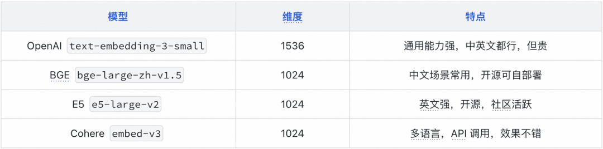

这里有个常见误区值得说清楚——**Embedding 模型和 GPT、Claude 这类大语言模型不是一回事**，虽然底层都是 Transformer，但目标和结构截然不同：

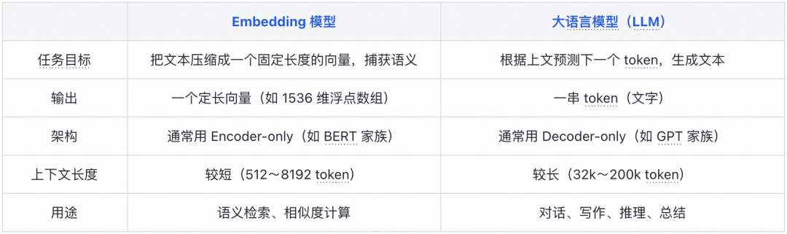

Embedding 模型做的是**压缩** —— 把一段文字的语义浓缩进一个向量；LLM 做的是**生成** —— 根据上下文一步步吐出文字。

在 RAG 流水线里两者各司其职：Embedding（/ɪmˈbedɪŋ/）模型负责离线向量化和在线 query（/ˈkwɪri/）向量化，LLM 负责最后根据检索结果生成答案。

### 2.5、Dense（/dens/） vs Sparse（/spɑːrs/）：两种向量，两种能力

知道了模型怎么训练，再回头看它产出的向量。Embedding 模型最常见的产出是 Dense 向量，但向量实际上有两种截然不同的形态，它们搜的东西不一样，不是替代关系而是互补关系。

- **Dense（稠密向量）：** 每个维度都有值，比如 [0.12, -0.34, 0.07, ...] × 1536 维。搜 “数据库连接池” 能命中 “DB connection pool 配置”—— 文字完全不同，但意思一样。弱点是专有名词和编码不敏感 —— 搜 “SLB-20250101-abc” 这种 trace ID，语义向量帮不上忙。
- **Sparse（稀疏向量）：** 只有少数维度有值，比如 {词 ID_1523: 2.4, 词 ID_8912: 1.7}。每个维度对应一个词，由专门的稀疏 Embedding 模型（如 SPLADE）对文本做词项扩展和重要性打分产生 —— 在几十万维的词表上，只给少数相关词赋非零权重，其余维度全是 0，所以叫稀疏。搜 “SLB” 精确命中所有含 “SLB” 的文档。弱点是换词就搜不到 ——“数据库” 和 “DB” 是完全不同的维度。

类比一下，Dense 搜的是 “意思”，Sparse 搜的是 “字面”。一个好的搜索系统需要两者配合。【注：这里的 Sparse 向量（如 SPLADE）和下文的 BM25 不是一回事。Sparse 向量是 Embedding 模型的一种输出形态；BM25 是统计算法，不产生向量，走倒排索引 ——Lucene、Elasticsearch 的默认打分公式就是它。两者干的活类似（都抓关键词匹配），本文以 BM25 为代表讲解，不展开 Sparse 向量。】

Embedding 搞定了向量的产出，但送进模型的 “一段文本” 到底多长？怎么切？这就是下一章要聊的 Chunking。

## 三、Chunking：知识怎么切

文章开始的流水线里提到了 “切段（Chunking）”，但没展开。这一步其实很关键 —— 很多 RAG 项目效果差，根本原因不是 Embedding 模型不行，也不是向量库选错了，而是切块策略没做好。

### 3.1、为什么要切

直接把整篇文档送进 Embedding 模型，不就行了吗？想法很自然，但现实有 3 道坎。

- **Embedding 模型有输入长度上限。** 主流模型最大支持 512 到 8192 Token，部分模型（如 e5-mistral-7b）已支持 32k 以上，但一份产品文档动辄几万字，塞满了也是问题。
- **即使模型能处理超长文本，语义稀释也会让检索效果大打折扣。** 一篇 50 页的产品文档讲了几十个功能点，Embedding 模型算出来的向量就成了这几十个功能的 “平均值”。这个平均值跟任何一个具体功能都不够接近 —— 用户搜 “退款多久到账”，向量表示里退款只占了几十分之一，检索根本抓不住。
- **即使检索回来了，送给 LLM 的内容也不该是整篇文档** 。LLM 的上下文窗口有限，把整篇文档塞进去既浪费 token，也会稀释真正相关的内容 ——LLM 需要的是精准的段落，不是海量的原文。

所以必须把文档切成粒度合适的段落，每个段落单独向量化，查询时匹配最相关的若干段。那切多大合适？这是个两难。

- **切得太碎 —— 上下文断裂，答案可能被腰斩。** 比如一份退款规则文档，用户问 “退款多久到账”，答案在文档中间。如果按固定长度机械切分，答案恰好横跨两个 Chunk 的边界，检索时两个 Chunk 各抓一半，谁都答不全。
- **切得太大 —— 回到语义稀释的问题。** 一个 Chunk 塞进 2000 Token，覆盖了三四个主题，向量又变成 “平均值”，precision 下降。

打个比方：一本书的目录如果只列到章（太粗），搜某个小节的具体内容肯定找不到；如果精细到每个自然段（太碎），搜的时候又容易丢失上下文。好的切块策略就是在两个极端之间找到合适的粒度。

搞清楚为什么切，下面看几种常见的策略。

### 3.2、切块策略

#### 固定长度切块 + 滑动窗口

最朴素的做法是固定长度切块（Fixed Chunk）—— 每 500 Token 一个 Chunk，简单粗暴。

```
文档: [0..500] [501..1000] [1001..1500] ...
```

优点：实现简单，速度快。缺点：容易在句子中间切断，破坏语义完整性。

**改进方案是滑动窗口（Sliding Window）——Chunk 之间有重叠：**

```
Chunk 1: [0..500]
Chunk 2: [300..800]    ← 跟前一个重叠 200
Chunk 3: [600..1100]   ← 继续重叠
```

重叠区域让跨边界的句子至少能完整出现在某一个 Chunk 里，大幅减少信息丢失。

#### 语义切块

更进一步，按文档的**自然结构**来切——标题、段落、小节：

```
## 退款规则          ← 按标题切
  段落1...           ← Chunk 1
  段落2...           ← Chunk 2
## 退货规则          ← 新标题，新 Chunk
  段落3...           ← Chunk 3
```

语义切块保持了每个 Chunk 的语义完整性，不会出现 “句子被腰斩” 的情况。但需要文档本身有结构（Markdown 标题、HTML 标签等），纯文本就不好使了。

#### Parent-Child Chunk

现代 RAG 系统里更常见的做法是 **Parent-Child Chunk**：

```
Parent Chunk（大块，保留完整上下文）
    ├── Child Chunk 1（小块，用于检索）
    ├── Child Chunk 2
    └── Child Chunk 3
```

检索时用 Child 去搜 —— 小块粒度细，召回率高；返回时把 Parent 塞给 LLM—— 大块上下文完整，LLM 能理解全貌。兼顾了召回率和上下文完整性。

### 3.2、总结

没有银弹，选哪种取决于文档类型和场景。关键结论就两条：切太小丢上下文，切太大语义稀释。实际项目中固定长度 + 滑动窗口是性价比最高的起点，语义切块和 Parent-Child 按需叠加。

另外，即使 LLM 的上下文窗口越来越大，也不意味着可以把检索到的 Chunk 无脑全塞进去。研究发现 LLM 对上下文中间部分内容的关注度往往最低（Lost in the Middle 现象）——更多上下文并不一定带来更好的效果。控制好 Chunk 数量，把最相关的放在最前面或最后面，比堆量更重要。

Chunk 切好了，Embedding 也产出了向量。下一个问题：**两个向量之间，怎么比“像不像”？**

## 四、相似度：怎么衡量"像不像"

Embedding 把文本变成了向量，接下来要解决的就是：给定两个向量，用什么度量算法衡量相似程度。常用的有三种：余弦相似度、欧氏距离、点积。其中余弦相似度是绝对主流。下面逐一过一遍。

### 4.1、余弦相似度：最主流的选择

最常用的是**余弦相似度（Cosine Similarity）**，它比的是两个向量的方向有多接近：

```
cos(θ) = (A · B) / (|A| × |B|)
```

值域在 [-1, 1]，1 表示方向完全一致，0 表示正交（无关），-1 表示完全相反。实践中 Embedding 模型产出的向量余弦相似度通常落在 [0, 1] 区间，真正出现负值的情况极少。

为什么是余弦相似度而不是别的？因为 Embedding 模型在训练时就是用余弦相似度来优化的 —— 你用别的度量去比，相当于考试的评分标准都换了，成绩自然不准。

### 4.2、其他度量的简要对比

**欧氏距离（Euclidean Distance）：**衡量的是两个点在空间中的直线距离，受向量长度影响大。两个意思相同但长度不同的向量，欧氏距离可能很大但余弦相似度很高。通常不优先选用。

**点积（Dot Product）：**当向量已经做了 L2 归一化（长度为 1）时，点积就等于余弦相似度。如果向量已归一化，用点积效率更高。

一句话建议：不确定用哪个，就用**余弦相似度**。

### 4.3、一个具体的例子

概念讲多了容易飘，拿两个二维向量手算一遍就清楚了。假设我们有两条文本的向量（降维到 2D 方便看）：

```
A = [3, 4]    ← "今天天气真好"
B = [3.5, 3.8] ← "外面阳光明媚"
C = [-1, 0]   ← "电脑坏了怎么办"
```

**余弦相似度：**比的是方向。

```
cos(A, B) = (3×3.5 + 4×3.8) / (√(9+16) × √(12.25+14.44))
          = (10.5 + 15.2) / (5 × 5.17)
          = 25.7 / 25.85
          ≈ 0.99  ← 几乎方向一致，意思相近

cos(A, C) = (3×(-1) + 4×0) / (5 × 1)
          = -3 / 5
          = -0.6  ← 方向差很多，意思不相关
```

**欧氏距离：**比的是直线距离。

```
dist(A, B) = √((3-3.5)² + (4-3.8)²) = √(0.25 + 0.04) ≈ 0.54  ← 很近
dist(A, C) = √((3-(-1))² + (4-0)²)   = √(16 + 16)   ≈ 5.66  ← 很远
```

两种度量都能区分 “相近” 和 “不相关”，但关注点不同 —— 余弦看方向，欧氏看绝对距离，能力各异，用途不同。

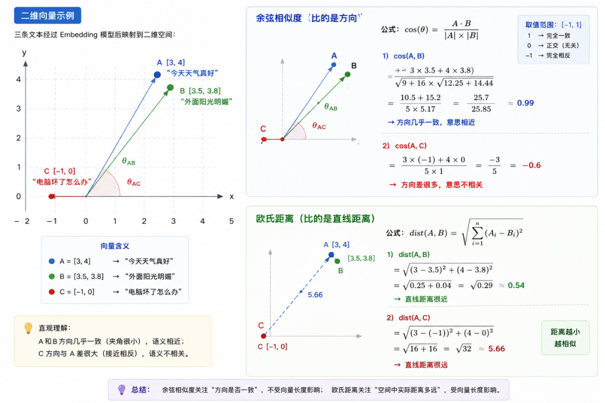

## 五、HNSW：从百万向量中快速找到最相似的

有了度量方法，就可以逐条算查询向量和所有存储向量的相似度，排序取 Top-K。这个问题的学名叫 **KNN（K-Nearest Neighbors，K 最近邻）**。解法分两条路：

- **精确 KNN：**逐条遍历所有向量，逐一算相似度，排序取 Top-K。100% 精确，但复杂度是 O (N×D)——N 条向量、每条 D 维。万级数据还行，百万级开始就扛不住了，更别提千万级。
- **近似 KNN（ANN）：**不逐条算，用索引结构快速锁定候选区域，只对少数候选向量做精确计算。牺牲一点召回精度，换数量级的性能提升。主流实现有 HNSW、IVF、PQ、LSH 等。

### 5.1、暴力搜索为什么不行

精确 KNN 就是全量遍历 ——N 条向量，每条 D 维，逐一算相似度。百万级数据，一次查询一百万次 1536 维向量运算，脑子过一下就知道不行。

打个 MySQL 的比方：就像 SELECT ... ORDER BY score LIMIT 10 没建索引 —— 每次查询全表扫描，数据少还能忍，百万行起步就崩了。ANN 则像给向量建了索引，查询走索引快速定位候选行，只对命中的少量行做精确计算，跟 MySQL 走 B+Tree 只扫少数数据页是一个道理。

所以实际都用 ANN 近似路线 —— **用可控的召回损失，换数量级的查询性能提升**。这个思路类似布隆过滤器：用极小的误判概率换极致的空间和速度，在工程上是笔很划算的买卖。

HNSW 是 ANN 里最主流的算法，但不是唯一的。除了 HNSW，还有 IVF（K-Means 聚类 + 倒排索引）、PQ（向量压缩）、LSH（局部敏感哈希）等方案。选型简单说就是：百万级以内用 HNSW，千万级用 IVF，亿级考虑 DiskANN 或分片。

HNSW 之所以最流行，是因为它在精度和速度之间取得了最好的平衡，而且实现成熟、生态完善。ES、Faiss、Milvus 都默认支持。

### 5.2、核心洞察：跳表 × 可导航小世界图

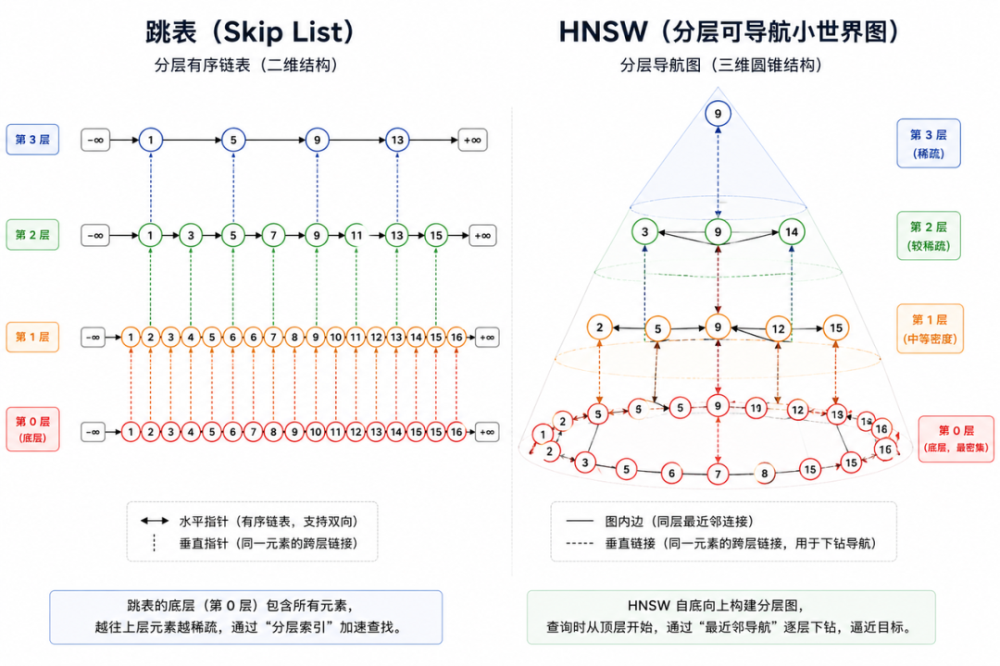

HNSW 是两种经典数据结构的融合。

**第一个灵感来自跳表** —— 在有序链表上增加多层 “快速通道”：

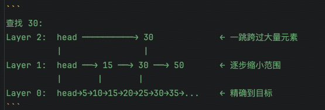

上层节点少、跨度大，底层包含全部节点。查找时从顶层一跳跨过大量元素，逐层缩小范围，复杂度从 O (n) 降到 O (log n)。

节点按概率随机晋升到上层，不需要全局重平衡 —— 随机性自动保证了层间分布符合预期的指数衰减规律。

HNSW 把这个分层思想搬到了**图**上。但这里有个关键问题：跳表能工作，是因为链表是**有序**的，比一下大小就知道往左还是往右。向量没有 “大小” 概念 —— 向量 (1, 3) 和 (-2, 5) 谁大？没法比。光有分层不够，还得解决 “图上怎么导航”。

HNSW 的层间连接机制和跳表完全一致 —— 每个节点按概率随机分配到若干层，同时存在于所属层及以下所有层。层与层之间没有跨节点的连线，只有同一节点在相邻层的纵向连接。上层粗定位找到近似最近邻后，顺着该节点的纵向连线降到下一层，逐层下沉到第 0 层精搜。

**第二个灵感来自可导航小世界图（NSW）：**每一层图中，只要每个节点连了它最近的几个邻居，贪心搜索就能快速导航到目标附近 —— 不需要全局有序，只需要局部比较。站在当前节点，看一圈邻居，跳到离目标更近的那个，如此循环。

两个想法一组合，分层提供 “快速通道”，贪心搜索在每层图上导航 —— 这就是 HNSW 的全部核心。用表格对比看得更清楚：

#### 跳表 vs HNSW 的关键区别

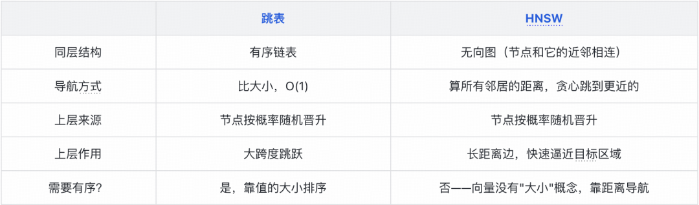

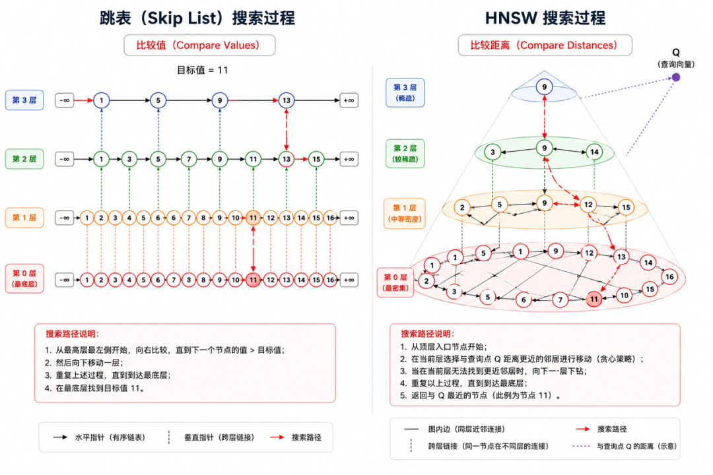

### 5.3、分层图长什么样

建完之后，整张图是这样的分层结构：

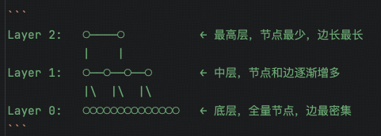

打个比方 —— 上层像是地图上的「国道」「高速公路」：只标注关键枢纽，但一跳就能跨越大半个区域。底层则是「街道路网」，密密麻麻，能精确定位到具体位置。搜索时先走高速确定大致方向，再下到街道找到精确目标。

层级分布（以 M=16、晋升概率简化为 1/M 为例）：

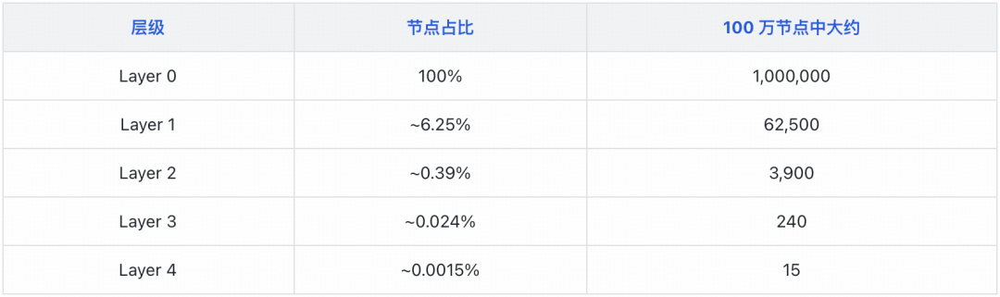

注：HNSW 论文默认用 mL = 1/ln (M)（M=16 时约 0.36）作为晋升概率，实际 Layer 1 占比约 36%，分布比上表更 “胖”。这里用 1/M 做简化推演，目的是直观展示 “层级越高节点越少” 的指数衰减规律，数量级结论不变。

100 万节点，图的最高层大概 5–6 层。上层节点极少，但边长跨度大 —— 因为上层节点少、每个节点都要连 M 个邻居，这些边自然会跨越很远。

知道了图长什么样，再看它是怎么一步步建起来的。

### 5.4、图是怎么建起来的：写路径

HNSW 本质上是一张**多层图**。每条向量是图上的一个节点，边连着它的 “近邻”。插入一条新向量时，要决定两件事：它放在哪些层、它跟谁连边。

#### 第一步：掷骰子定层高

每个节点用随机函数决定自己 “长” 到第几层。概率是 P (level ≥ L) = (1/M)^L，M 默认 16（此处沿用简化模型）。也就是说：每往上一层，概率除以 16。结果就是绝大多数节点只待在底层，极少数节点能上到高层。

```
level = 0
while random() < 1/M:
    level += 1
```

#### 第二步：在已有图中找最近邻

节点还没插入，先拿着它在已有图上做贪心搜索 —— 从顶层开始，逐层往下，找到每层离它最近的节点。

#### 第三步：双向连边

找到最近邻后，在节点所属的每一层，跟离它最近的 M 个邻居互相建立双向边。

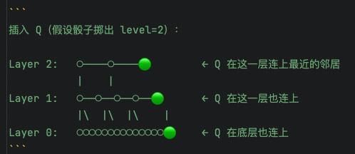

#### 第四步：剪枝

连边后检查 —— 如果某个邻居的边数超过了 M，只保留离它最近的 M 条，多余的剪掉。防止热门节点被太多人连接，搜索时要检查大量候选，拖慢效率。

### 5.5、图是怎么搜的：读路径

**贪心搜索：在一层图里怎么走**

每一层内部的搜索方式叫贪心搜索 —— 站在当前节点，看一圈所有邻居，跳到离目标更近的那个，重复直到没有邻居比当前节点更近。

```
当前在节点 A，目标向量是 Q：
  → 算 dist(Q, 邻居B) = 0.3
  → 算 dist(Q, 邻居C) = 0.8
  → 算 dist(Q, 邻居D) = 0.2  ← 最近！
  → 跳到 D，继续看 D 的邻居
  → 直到所有邻居都比当前节点离 Q 更远 → 停下
```

**逐层下钻：完整搜索流程**

有了单层贪心搜索，多层搜索就很简单了 —— 从顶层开始，每层做一次贪心，终点传给下一层当起点。打个比方：这和查地图一样。先看全国高速路网确定大方向（顶层，几步跨越大半区域），再放大到省道规划具体路线（中层），最后在街道级别精确定位到门牌号（底层）。

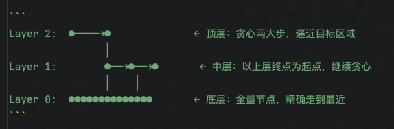

**具体步骤：**

- 从最顶层的入口节点开始，做贪心搜索，走到这一层的局部最近点。
- 降到下一层，以上一层的终点为起点，继续贪心。
- 重复直到最底层 —— 底层包含全部节点、边最密集，做完最后一轮精细搜索。
- 返回途中遇到的、距离最近的 K 个节点。

不分层的话，在密密麻麻的底层图中每步只能走到邻居，想从图的一头到另一头需要很多步。分层后用上层几步逼近目标，底层再精确走几步 —— 总步数从 O (N) 降到 O (log N)。

**贪心不会走进死胡同吗？**

不会。建图时每个节点都连了它最近的邻居（即前文 “双向连边” 那一步），这个结构天然保证 “可导航性”—— 从任意节点出发贪心地往更近的方向走，一定能逼近目标所在区域。

上层的长距离边还有一个关键作用：帮搜索在早期跳过 “看起来近但其实不对” 的区域，避免卡在局部最优里。当然，HNSW 是近似算法，不保证一定命中全局最近邻 —— 这是所有 ANN 算法共同的设计取舍，用可控的召回损失换数量级的性能提升。

### 5.6、三个关键参数

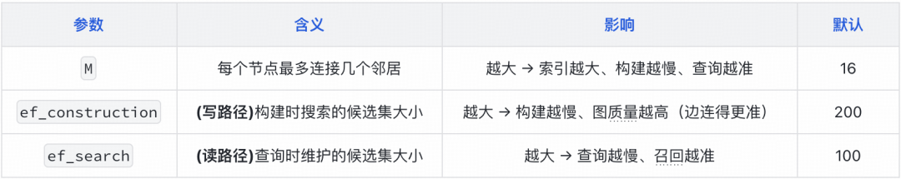

ef_search 是唯一可以在运行时动态调整的参数 —— 精度要求高就调大，速度要求高就调小，不需要重建索引。

### 小结

HNSW 很强大，但语义搜索有自己搞不定的盲区 —— 搜 “SLB-20250101-abc” 这种 trace ID，Embedding 模型无能为力，BM25 倒排索引才是正解。单靠语义搜索不够，完整链路还有召回融合、精排等几道工序，下文展开。

## 六、检索的完整链路：从查询到精排

### 6.1、Query Rewrite：用户不会提问怎么办

前面聊了这么多检索技术，但有一个前提一直被忽略 —— 用户得先提出一个好问题。

现实中用户是怎么提问的：

```
用户输入：「那个接口怎么又挂了」
真实意图：支付服务订单创建接口最近一次故障原因是什么
```

对检索器来说，“接口”“挂了” 两个词的信息量几乎为零 ——Embedding 模型只能猜个大概方向，BM25 更是一头雾水。

很多线上项目最后发现，Embedding 没问题、向量库没问题、Rerank 没问题，真正的问题是用户不会提问。垃圾 query 进去，后续链路再强也白搭。

解决方案是 **Query Rewrite（查询改写）**—— 在检索之前，先让 LLM 把用户的模糊问题改写成适合检索的明确查询。可以结合历史对话做指代消解（“那个接口”→“支付服务订单创建接口”），也可以补充业务上下文。改写后的问题再送入后续的召回和精排流程。

Query Rewrite 在实践中往往是收益最高的单点优化之一，大部分 RAG 框架（LangChain、LlamaIndex 等）都内置了这一步。

### 6.2、元数据过滤：第一道闸门

Query 改写好了，下一步是召回。但召回之前还有一道工序——**元数据过滤（Metadata Filtering）**。

很多新人看完 RAG 介绍后，形成的认知是：

```
Query → Embedding → 向量搜索全库 → 返回结果
```

但企业场景里实际是：

```
Query → 元数据过滤 → 向量搜索（过滤后的子集）
```

举个例子：一个多租户的知识库平台，A 公司和 B 公司的文档存在同一个向量库里。用户搜 “退款流程”，如果不先按 tenant_id 过滤，就会把别家公司的退款文档也搜出来。

常见的过滤维度：

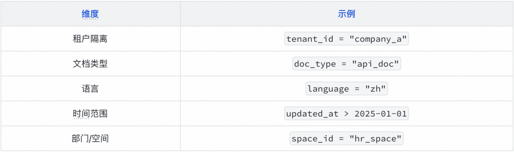

过滤先行，召回后行。这一步看似简单，在生产系统中却是第一道防线 —— 范围没缩准，后面再怎么精排都是错的。

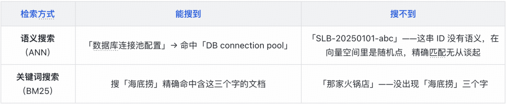

### 6.3、两路互补，各有盲区

语义搜索用 Dense 向量抓语义，BM25 用倒排索引抓关键词 —— 一个搜意思，一个搜字面。

但这只是知识库场景最常见的两路。召回层本质上是一个**多路召回框架**，该去哪里找答案取决于问题类型：

```
Recall
├─ ANN（向量相似度搜索）
├─ BM25（关键词倒排索引）
├─ Graph Recall（实体图谱，搜关联关系）
├─ SQL Recall（结构化数据库，精确查询）
├─ Memory Recall（用户个人记忆，动态偏好）
├─ Conversation Recall（历史对话上下文）
├─ Web Search（实时互联网信息）
└─ Tool Recall（调用外部工具获取结果）
```

用户问「我上次提到的那个 Go 项目怎么部署？」——答案不在知识库里，而在这个用户的历史记忆或对话上下文中。

知识库用向量检索，记忆用 Memory Recall，结构化数据用 SQL 查询——不同的数据类型需要不同的检索方式。召回层该用哪几路、怎么组合，取决于业务场景，没有固定答案。多路检索各跑各的，各自返回一批结果和分数。但分数怎么合并？直接加行不行？

### 6.4、为什么不用原始分数直接加

两路返回的结果，分数含义完全不同：

```
ANN 路：doc_A 得分 0.92（余弦相似度）
BM25 路：doc_B 得分 8.7（BM25 相关度分数）
```

0.92 和 8.7 怎么加？两者是完全不同的尺子 —— 一个是 0 到 1 的相似度，一个是几十上百的关键词打分，直接加就像把 “考了 92 分” 和 “跑了 8.7 秒” 加起来排名次。归一化又很麻烦 —— 需要用历史查询的分数分布来校准，而且分布会随时间变化。

### 6.5、RRF：不拼分数拼排名

**RRF（Reciprocal Rank Fusion，倒数排名融合）**的思路很朴素 —— 既然原始分数没法直接加，那就扔掉分数，只看排名。

**排名怎么变成分数**

- **多路叠加：**一个文档在越多的检索路径里排进前列，它就越应该拿高分。RRF 把最终得分定义为各路排名贡献之和 —— 每一路独立贡献，总分自然叠加。
- **取倒数：**排名越靠前贡献应该越大，取倒数天然满足这个方向 —— 排第 1 → 1/1 = 1，排第 10 → 1/10 = 0.1，排第 100 → 1/100 = 0.01。
- **加平滑系数 k：**1/1 和 1/2 差了整整一倍，实际检索中第 1 名和第 2 名质量可能差不多，不该因为差一名就得分翻倍。分母上加个常数 k（通常取 60），让曲线平缓下来：1/(60+1) ≈ 0.0164，1/(60+2) ≈ 0.0161，差距控制在个位数百分比。

**公式长什么样**

汇总成公式：

```
score(doc) = Σ 1/(k + rank_i)
```

- k = 60：平滑常数，值越大曲线越平缓，排名靠前的权重差距越小。
- rank_i：文档在第 i 路检索中的排名，从 1 开始。
- 某路未出现的文档，该路贡献为 0（相当于排名无限大，1/(k+∞) → 0）。

**拿两路检索算一遍**

```
两路检索结果：
  ANN 排名:  [doc_A #1, doc_B #2, doc_C #3]
  BM25 排名: [doc_B #1, doc_C #2, doc_A #3]

doc_A 总分 = 1/(60+1) + 1/(60+3) = 0.0164 + 0.0159 = 0.0323
doc_B 总分 = 1/(60+2) + 1/(60+1) = 0.0161 + 0.0164 = 0.0325
doc_C 总分 = 1/(60+3) + 1/(60+2) = 0.0159 + 0.0161 = 0.0320
```

ANN 把 doc_A 排第一，BM25 把 doc_B 排第一，RRF 融合后 B > A > C—— 不偏向任何一路，只看综合排名。只在一路出现而另一路没出现的文档，自然排后面。实现起来也就 30 行代码。

### 6.6、Rerank：粗筛之后，再精排一次

Recall（ANN + BM25 + RRF）做的事是**粗筛** —— 从海量文档里快速捞出几十条候选。但捞出来的这几十条只是 “可能相关”，谁排在谁前面还不够准。Rerank 做的事是**精排** —— 用一个更强的模型，对这几十条候选重新打分排序，把真正最相关的推到最前面。

**为什么 Embedding 排不准**

Embedding 用的是 **Bi-Encoder** 架构：query 和 doc 分别编码成向量，再算余弦相似度。问题在于 —— 编码时 query 和 doc 彼此不知道对方的存在，模型只能事后靠向量距离来 “猜” 相关性。

举个例子：用户搜 “VPN 密码怎么重置”，两路召回 + RRF 融合后 Top-3 可能是：

```
1. VPN密码重置指南  向量相似度 0.85
2. VPN客户端安装教程  向量相似度 0.83
3. VPN账号申请流程   向量相似度 0.82
```

这三个文档都在讲 VPN，向量确实都很靠近查询向量，相似度 0.82 起步 —— 话题层面上它们都 “相关”。但话题相关不等于能回答用户的问题：“VPN 客户端怎么安装” 跟 “VPN 密码怎么重置” 完全不是一回事。

Bi-Encoder 把文本压缩成 1024 个浮点数之后，已经分不出这个级别的差异了 —— 在它眼里，这都是 “VPN 相关文档”。所以 Recall 能 “找回来”，但不一定 “排得准”。

**Cross-Encoder：一起看，而不是分开看**

Rerank 用 **Cross-Encoder** 架构弥补这个缺陷。和 Embedding 的 Bi-Encoder 区别在哪？拿上面两个文档对比来看：

**Bi-Encoder（Embedding 的做法）：**

- 把 query “VPN 密码怎么重置” 单独编码 → 向量 Q。
- 把 doc₁ “VPN 客户端安装教程” 单独编码 → 向量 D₁，doc₂ “VPN 密码重置指南” 单独编码 → 向量 D₂。
- 算 cos (Q, D₁) → 0.83，cos (Q, D₂) → 0.85，判定 D₂ 更相关。

问题是第 1 步和第 2 步互不知情 —— 编码 query 时模型不知道 doc 长什么样，编码 doc 时也不知道 query 问的是什么。最后只能靠两个独立向量算距离来 “猜” 相关性，所以准度有限。好处是向量可以提前算好存起来，查询时只算 query 向量就行 —— 快。

**Cross-Encoder（Rerank 的做法）：**

- 把 query 和 doc₁ 拼成一对：“VPN 密码怎么重置 [SEP] VPN 客户端安装教程”→ 一起喂给模型 → 0.31。
- 把 query 和 doc₂ 拼成一对：“VPN 密码怎么重置 [SEP] VPN 密码重置指南”→ 一起喂给模型 → 0.98。

模型同时看到两边，读到了完整的问题和文档，能判断出 “虽然都提到 VPN，但客户端安装跟密码重置不是一回事”——Bi-Encoder 给了 0.83，Cross-Encoder 直接降到 0.31。代价是每对 (query, doc) 都要重跑一遍模型，没法提前算，所以慢得多，只能对 Top-N 候选用。

Rerank 用的是专门的 Cross-Encoder 模型（如 bge-reranker-v2），不是 Embedding 模型也不是通用 LLM。评分来自模型对 query-doc 对的相关性判断，同一批候选过同一个模型，分数天然可比，不需要像 RRF 那样担心尺度问题。

同一个例子，Rerank 之后：

```
1. VPN密码重置指南  0.98  ← 确认高度相关
2. VPN账号申请流程   0.42  ← 原来排第 3，被拉上来了
3. VPN客户端安装教程  0.31  ← 原来排第 2，被挤下去了
```

排名完全变了 —— Rerank 把真正的差距拉开了，LLM 看到的上下文质量直接提升。

**工程上的做法**

流水线就清楚了：

```
多路召回 → RRF 融合 → 取 Top-N（比如 50 条）→ Rerank 精排 → 取 Top-K（比如 5 条）→ 送给 LLM
```

常见方案：bge-reranker-v2（开源）、Cohere Rerank（API）、Jina Reranker（API）。选型原则和 Embedding 一样 —— 看语言、看领域、看成本。

Recall 解决 “别漏掉”，Rerank 解决 “排正确”。两者分工不同，缺一不可。

## 七、总结

这篇文章一路走下来，RAG 检索的核心概念基本就串起来了：

```
Query Rewrite → Metadata Filter → Recall（ANN + BM25）→ RRF 融合 → Rerank 精排 → LLM 生成
```

真正决定 RAG 效果的核心往往是 **Query Rewrite + Chunking + Recall + Rerank**，而不只是 LLM 本身。总结几条关键结论：

- **Chunking 是基础：**切块策略决定知识如何被“打包”，直接影响检索能找到什么。固定切块、滑动窗口、语义切块、Parent-Child 各有适用场景。注意 Lost in the Middle——更多 Chunk 并不一定更好。
- **Embedding 把语义变成数学：**文本变成向量，语义相近的在空间中距离近。Dense 抓语义，Sparse/BM25 抓关键词，两者互补。
- **相似度用余弦：**Embedding 模型就是为余弦相似度训练的，用别的度量相当于换了评分标准。
- **HNSW 解决速度问题：**百万向量不能逐条算，用跳表的分层思想 + 图的贪心搜索，用可控的召回损失换数量级的速度提升。三个参数 M、ef_construction、ef_search 控制精度和性能的平衡。
- **Query Rewrite 是隐藏的高收益优化：**用户不会提问，让 LLM 先改写 query 再检索，往往是投入产出比最高的单点优化。元数据过滤则是生产环境的第一道防线——先缩范围，再做召回。
- **混合检索是终局：**单一路径都有盲区。语义搜索管意思，BM25 管字面，两路互补；RRF 融合排名，Rerank 精排——多路协同，缺一不可。检索的本质：不是单一技术，而是多条检索路径 + 排名融合 + 精排策略的协同——每个环节各司其职，缺任何一环效果都会打折。

以上总结了笔者对 RAG 检索核心概念的主要认识，欢迎补充和指正。
