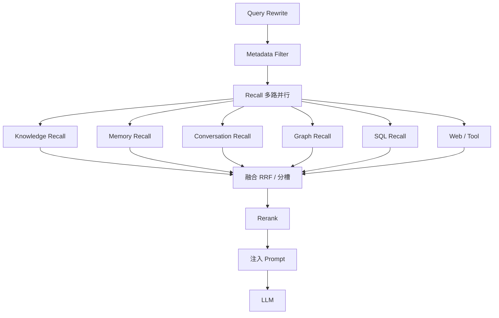
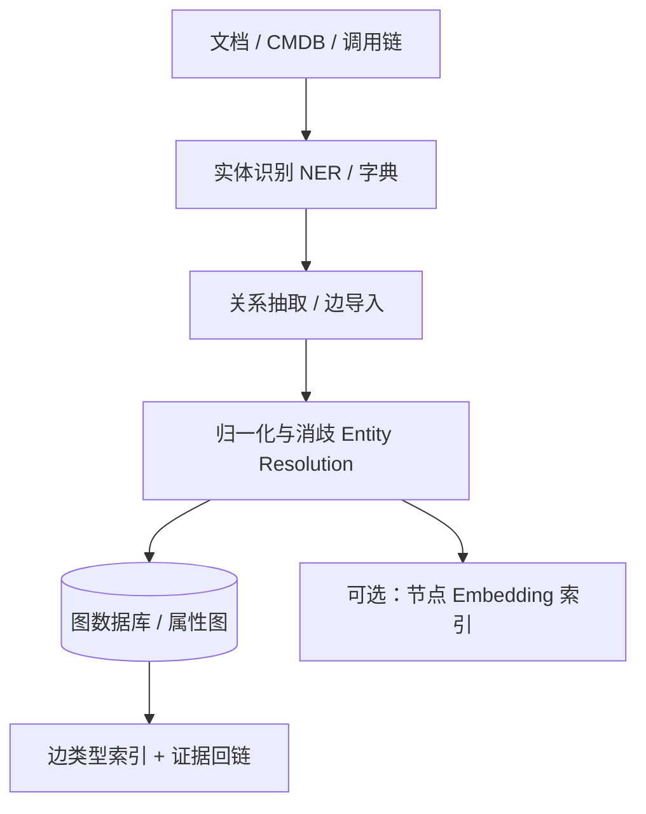
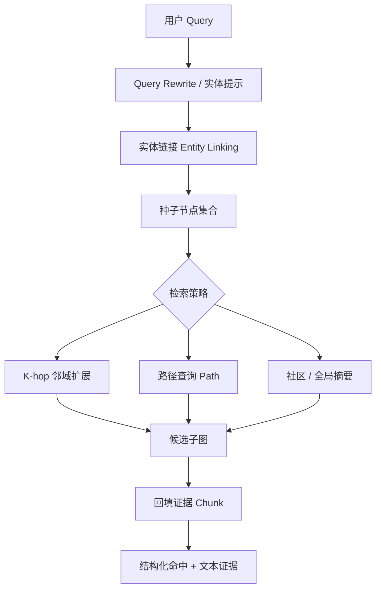
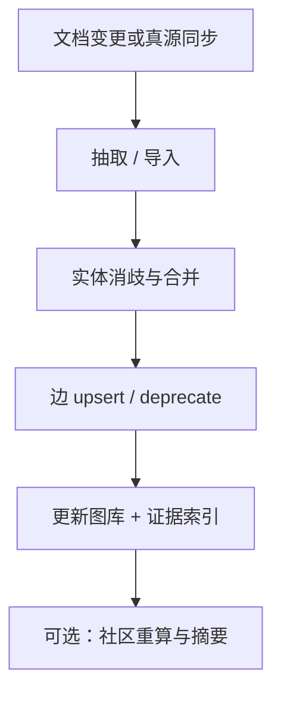
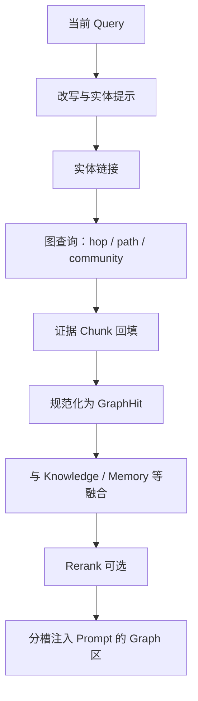
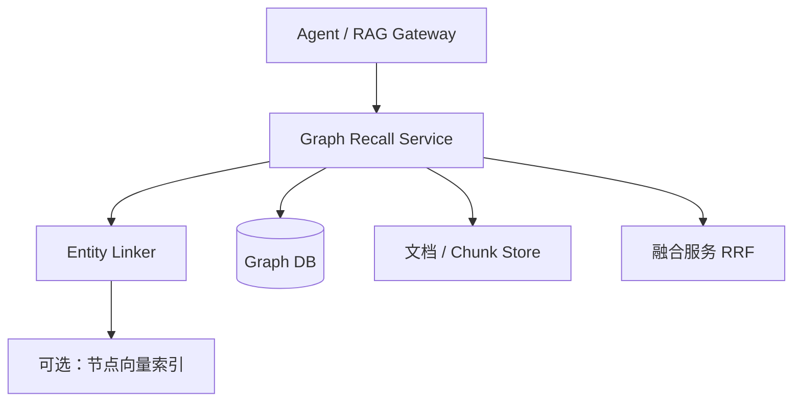

# Graph Recall：图谱召回是什么、如何实现

> 一句话定义：Graph Recall 是多路召回中专门走「实体—关系图」的那一路——先把查询落到图上的实体，再沿边做邻域扩展或多跳路径检索，把结构化关联证据交给融合层与 LLM。

> 前置阅读：[RAG 核心概念与原理](02-RAG%20核心概念与原理：Chunking、Embedding、相似度、HNSW%20与多路召回.md)（多路召回框架）、[Memory Recall](../04-记忆系统/02-Memory-Recall.md)（召回路分工）、[RAG 工程化与 GraphRAG](../13-进阶与工程化/07-RAG工程化与GraphRAG.md)（GraphRAG 产品形态简述）。

---

## 1. Graph Recall 是什么

在完整检索链路里，召回层往往不止「搜文档向量」一条路——这就是 **多路召回** （详见 RAG 专文 §6.3、Memory Recall §2）。Graph Recall 是其中一路，专门回答这类问题：

| 用户说法 | 答案实际靠什么 |
|----------|----------------|
| 「支付服务依赖哪些中间件？」 | 服务→依赖→中间件 的多跳边 |
| 「谁是某某项目的负责人？他管过哪些系统？」 | 人—项目—系统 的关系链 |
| 「这次故障可能波及哪些下游？」 | 组件依赖图上的出边扩散 |
| 「某公司所有产品的共性趋势是什么？」 | 跨文档实体聚合后的社区/子图摘要 |

向量检索擅长「意思相近的段落」，关键词检索擅长「字面命中」。但它们都不显式建模 **A 与 B 通过什么关系相连** 。当答案藏在「多跳关联」里，而不是某一段话的语义近邻时，就需要 Graph Recall。

### 1.1 和相近概念的区别

| 概念 | 检索对象 | 核心操作 | 典型擅长 |
|------|----------|----------|----------|
| **Knowledge / ANN** | 文档 Chunk 向量 | 近似最近邻 | 同义改写、语义相近段落 |
| **Knowledge / BM25** | 文档关键词倒排 | 词项匹配 | 错误码、专有名词 |
| **Memory Recall** | 用户个人记忆 | 按 user 过滤 + 语义/关键词 | 偏好、经历、千人千面 |
| **SQL Recall** | 关系表 | NL→SQL / 条件查询 | 精确计数、订单状态 |
| **Graph Recall** | 实体与边（及邻接文本） | 实体链接 + 游走 / 路径 / 子图 | 多跳关联、影响面、组织关系 |
| **GraphRAG（产品形态）** | 文档抽出的图谱 + 社区摘要 | 建图 + 社区检测 + 局部/全局检索 | 全局综述、跨文档聚合 |

一句话： **ANN/BM25 答「哪段文字像这个问题」；Graph Recall 答「这些实体之间怎么连、连几跳」。** GraphRAG 是把「建图 + 图检索 +（常含）社区摘要」做成完整 RAG 方案的一类系统；Graph Recall 则是多路召回框架里的 **数据源/检索形态** ，可独立落地，也可作为 GraphRAG 的在线检索核心。

### 1.2 为什么向量 RAG 会漏掉「关系题」

假设知识库里有三段互不挨着的 Chunk：

```
Chunk A: 支付服务由交易中台团队维护。
Chunk B: 交易中台依赖 Redis 集群做会话缓存。
Chunk C: Redis 集群由基础架构组负责。
```

用户问：「支付服务最终依赖的缓存由谁负责？」

- 纯向量：Query 可能分别贴近 A、B、C，但 **单次 Top-K 未必同时捞齐三跳证据** ；即便捞到，LLM 也要自己拼关系，容易漏步或幻觉补边。
- BM25：专名能命中，但仍是「散点段落」，没有显式 `支付服务 -依赖→ Redis -负责→ 基础架构组` 。
- Graph Recall：先把「支付服务」链到实体节点，再沿 `依赖` / `负责` 边走 2～3 跳，直接返回路径或子图，再附上边对应的原文证据。

这就是 Graph Recall 的不可替代性： **把隐式跨 Chunk 推理，变成显式图遍历。**

---

## 2. 在多路召回里的位置



| 召回路 | 搜什么 | 典型问题 | 弱点 |
|--------|--------|----------|------|
| **Graph Recall** | 实体、关系类型、路径、子图、社区摘要 | 「A 依赖谁」「影响面」「组织归属」 | 建图贵、更新难、实体链接易错 |
| Knowledge | 文档语义/关键词 | 「退款规则是什么」 | 不善多跳拼装 |
| SQL | 表字段精确条件 | 「未完成工单数」 | 关系表达力弱于图、NL2SQL 易错 |

选型口诀：答案本质是 **关联结构** 就开 Graph；答案本质是 **某段说明文字** 就开 Knowledge；两者常一起开——图负责「连起来」，文档负责「讲清楚」。

---

## 3. 图里存什么：数据模型

### 3.1 最小图元素

| 元素 | 含义 | 例子 |
|------|------|------|
| **Entity（节点）** | 可命名的现实对象 | 服务、人、项目、组件、错误码、组织 |
| **Relation（边）** | 有向/无向的关联类型 | `depends_on`、`owned_by`、`calls`、`mentions` |
| **Property** | 节点/边上的属性 | 环境、版本、置信度、来源文档 id |
| **Evidence** | 支撑该边/节点的原文片段 | Chunk id、页码、抽取置信度 |

建议边尽量 **类型化** （受控词表），不要全用模糊的 `related_to`，否则路径检索无法按语义过滤。

### 3.2 建议的节点 / 边结构

```json
{
  "node": {
    "id": "ent_payment_svc",
    "name": "支付服务",
    "type": "Service",
    "aliases": ["payment-svc", "PaymentService"],
    "embedding": [0.11, -0.22, "..."],
    "source_docs": ["doc_42#chunk_3"],
    "tenant_id": "org_a",
    "updated_at": "2026-07-01T00:00:00Z"
  },
  "edge": {
    "id": "e_001",
    "from": "ent_payment_svc",
    "to": "ent_redis_cluster",
    "type": "depends_on",
    "properties": { "criticality": "high" },
    "confidence": 0.91,
    "evidence_chunk_ids": ["doc_88#chunk_12"],
    "status": "active"
  }
}
```

| 字段 | 作用 |
|------|------|
| `aliases` | 实体链接时匹配口语名、代号、英文名 |
| `type`（节点/边） | 过滤「只要依赖边、不要提及边」 |
| `evidence_chunk_ids` | 召回子图后回填原文，供 LLM 引用 |
| `confidence` / `status` | 低置信边可降权；过时边可 `deprecated` |
| `tenant_id` | 多租户隔离，与知识库元数据过滤同级重要 |

### 3.3 两种常见建图来源

| 来源 | 做法 | 适合 |
|------|------|------|
| **文档抽取图** | LLM/规则从非结构化文本抽实体关系 | Wiki、手册、纪要 → GraphRAG 类 |
| **系统真源图** | 从 CMDB、调用链、ORG、代码依赖直接导入 | 运维排障、权限、组织架构 |

生产上常 **双轨** ：真源图保准，文档图补「自然语言里才说得清」的弱关系；召回时合并，并以真源边优先。

---

## 4. 离线：怎么把知识变成图



关键步骤：

1. **实体抽取与归一** ：「支付服务」「payment-svc」「PaymentService」必须并成同一节点，否则多跳必断。
2. **关系抽取** ：优先受控关系类型；文档抽取务必带 `evidence` 与 `confidence`。
3. **写入图库** ：Neo4j、NebulaGraph、TigerGraph，或 Postgres + `Apache AGE` / 自研邻接表；小规模也可用 NetworkX 原型。
4. **可选向量侧车** ：给节点名/描述做 Embedding，方便「先语义找种子实体，再图上扩展」。
5. **增量更新** ：文档变更 → 重抽局部子图；真源同步用 CDC。全量重建只适合慢变知识。

> GraphRAG（Microsoft 等）还会在图上做 **社区检测（如 Leiden）** 并为社区生成摘要，供「全局性问题」检索。那是 Graph Recall 的一种高级形态，不是最小可用前提。

---

## 5. 在线：Graph Recall 怎么搜

Graph Recall 的在线阶段通常拆成四步： **锚定实体 → 扩展/寻径 → 取证 → 序列化给融合层** 。



### 5.1 实体链接（Entity Linking）—— 第一道闸

把自然语言里的指称落到图节点 id：

| 手段 | 做法 | 备注 |
|------|------|------|
| 字典 / 别名精确匹配 | aliases、代号表 | 高精，覆盖窄 |
| BM25 / 模糊匹配 | 对节点名索引 | 专名友好 |
| 向量近邻 | 节点描述 Embedding | 处理同义改写 |
| LLM 抽取后再链 | 先抽 mention 再消歧 | 灵活，贵、要约束类型 |

失败模式：链错种子节点 → 后面整棵子图全偏。工程上应返回 **候选实体 Top-M + 置信度** ，低置信时让 Agent 追问或并行试探多个种子。

### 5.2 三种主流扩展策略

#### （1）K-hop 邻域扩展（Local Graph Recall）

从种子出发，沿边走固定跳数（常 1～3），按边类型白名单过滤。

- 适合：「A 直接/间接依赖谁」「相关人与系统有哪些」
- 产出：子图节点/边列表 + 证据
- 风险：跳数一大，邻居爆炸；必须限 `max_nodes`、边类型、方向（入/出）

#### （2）路径查询（Path / Multi-hop）

给定起止类型或起止实体，求满足关系约束的路径。

- 适合：「支付服务到基础架构组的责任链」「从故障组件到可能受影响的上游」
- 产出：若干条路径（可按长度、关键度排序）
- 实现：图库原生 Path/Cypher/`MATCH ... [*1..3]`，或 BFS/Yen 算法

#### （3）社区 / 全局检索（Global GraphRAG 风格）

先定位实体所属社区，再取社区摘要或多社区对比。

- 适合：「整体趋势」「某领域全貌」「跨文档主题综述」
- 产出：社区摘要文本（往往比原始边列表更适合直接喂 LLM）
- 代价：社区检测与摘要预计算贵，知识更新时要局部重算

### 5.3 如何把子图变成 LLM 可用上下文

图结构不能直接当散文塞进 Prompt，常见序列化：

1. **路径叙述** ：`支付服务 -depends_on→ Redis集群 -owned_by→ 基础架构组`
2. **三元组列表** ：`(支付服务, depends_on, Redis集群)`
3. **子图 + 证据混排** ：每条边后附原文一句
4. **社区摘要** ：全局问题优先摘要，细节问题再下钻边

原则： **结构化关系保真 + 原文证据可引用** ；避免只扔一堆节点名。

---

## 6. 端到端流程：写入 → 召回 → 融合 → 生成

**写入 / 建图路径**



**召回路径（Graph Recall）**



与知识库 RAG 的对称关系：

| 环节 | 知识库向量 RAG | Graph Recall |
|------|----------------|--------------|
| 离线 | Chunk → Embedding → 向量库 | 实体/关系 → 图库（+ 可选节点向量） |
| 锚定 | Query Embedding / 关键词 | **实体链接** |
| 扩展 | Top-K 近邻 Chunk | **邻域 / 路径 / 社区** |
| 证据 | Chunk 原文即结果 | 边属性中的 evidence → 再取 Chunk |
| 特有难题 | 切块与 Lost in the Middle | **消歧、边质量、邻居爆炸、图新鲜度** |

---

## 7. 如何实现

### 7.1 最小可用架构



选型参考：

- 图库：Neo4j（Cypher 生态成熟）、NebulaGraph（大规模）、TigerGraph；原型可用内存图
- 实体链接：别名表 + BM25；进阶加节点 Embedding
- 证据库：沿用现有文档 Chunk 存储，边只存 id 引用
- 与向量 RAG 共存：同一租户下 Graph 与 Knowledge 并行召回，再 RRF 或分槽

### 7.2 召回实现（核心代码骨架）

```python
from dataclasses import dataclass, field
from typing import List, Optional, Dict, Set

@dataclass
class GraphHit:
    kind: str                 # "path" | "subgraph" | "community"
    score: float
    entities: List[str]
    relations: List[Dict]     # {from, type, to, evidence_ids}
    text: str                 # 序列化后的可读上下文
    evidence_chunks: List[str] = field(default_factory=list)
    meta: dict = field(default_factory=dict)

class GraphRecall:
    def __init__(self, linker, graph_db, chunk_store, max_hops: int = 2, max_nodes: int = 50):
        self.linker = linker
        self.graph = graph_db
        self.chunks = chunk_store
        self.max_hops = max_hops
        self.max_nodes = max_nodes

    def recall(
        self,
        query: str,
        *,
        tenant_id: str,
        relation_whitelist: Optional[List[str]] = None,
        mode: str = "auto",   # auto | hop | path | community
        top_k: int = 5,
    ) -> List[GraphHit]:
        # 1) 实体链接：mention → 候选节点
        seeds = self.linker.link(query, tenant_id=tenant_id, top_m=5)
        if not seeds:
            return []

        # 2) 策略选择：简单启发；生产可交给 Agent / 分类器
        strategy = mode if mode != "auto" else self._pick_strategy(query, seeds)

        hits: List[GraphHit] = []
        for seed in seeds:
            if strategy == "hop":
                sub = self.graph.expand(
                    seed.id,
                    hops=self.max_hops,
                    edge_types=relation_whitelist,
                    max_nodes=self.max_nodes,
                    tenant_id=tenant_id,
                )
                hits.append(self._to_hit("subgraph", seed, sub))
            elif strategy == "path":
                paths = self.graph.find_paths(
                    seed.id,
                    # 目标类型可由改写阶段抽出，如 type=Team
                    target_types=seed.meta.get("target_types"),
                    max_len=self.max_hops,
                    edge_types=relation_whitelist,
                    tenant_id=tenant_id,
                )
                for p in paths[:top_k]:
                    hits.append(self._to_hit("path", seed, p))
            elif strategy == "community":
                summary = self.graph.community_summary(seed.id, tenant_id=tenant_id)
                hits.append(
                    GraphHit(
                        kind="community",
                        score=seed.score,
                        entities=[seed.id],
                        relations=[],
                        text=summary.text,
                        evidence_chunks=summary.evidence,
                        meta={"community_id": summary.id},
                    )
                )

        # 3) 回填证据原文
        for h in hits:
            ids: Set[str] = set()
            for rel in h.relations:
                ids.update(rel.get("evidence_ids") or [])
            h.evidence_chunks = self.chunks.get_many(list(ids))

        # 4) 按链接置信度 × 路径长度衰减等打分，截断
        hits.sort(key=lambda x: x.score, reverse=True)
        return hits[:top_k]

    def _pick_strategy(self, query: str, seeds) -> str:
        q = query.lower()
        if any(k in query for k in ("趋势", "全貌", "整体", "综述")):
            return "community"
        if any(k in query for k in ("路径", "如何连到", "责任链")):
            return "path"
        return "hop"

    def _to_hit(self, kind: str, seed, payload) -> GraphHit:
        text = serialize_graph(payload)  # 路径叙述或三元组
        return GraphHit(
            kind=kind,
            score=float(seed.score) * length_decay(payload),
            entities=payload.entity_ids,
            relations=payload.relations,
            text=text,
            meta={"seed": seed.id},
        )
```

> 骨架强调三件套： **实体链接 → 受控扩展 → 证据回填** 。图查询方言（Cypher 等）按所选图库替换 `graph.expand` / `find_paths` 即可。

### 7.3 与其他路怎么融合

| 策略 | 做法 | 适用 |
|------|------|------|
| **分槽注入** | Prompt 中单独 `[Graph]` / `[Knowledge]` 区 | 关系约束不能被文档语义分淹没时 **优先** |
| **RRF** | 把每条路径/子图当一条「伪文档」参与排名融合 | 希望统一 Top-K 裁剪时 |
| **图主文档辅** | 先定路径实体，再只检索这些实体相关 Chunk | 排障、影响面分析 |
| **文档主图辅** | 向量召回后，对命中 Chunk 提及的实体做 1-hop 补全 | 便宜地补关系上下文 |

分数尺度：图侧常用「链接置信度 × 边置信度 × 长度衰减」，与余弦/BM25 不可直接相加——与 Memory Recall 相同， **用 RRF 或分槽，不要裸加分** 。

### 7.4 Prompt 注入示例

```text
[Graph]
路径1（score=0.86）: 支付服务 -depends_on→ Redis集群 -owned_by→ 基础架构组
证据: 「交易中台依赖 Redis 集群做会话缓存……」（doc_88#chunk_12）

[Knowledge]
……相关运维手册段落……

请基于 Graph 中的关系作答，并引用证据；若关系与文档冲突，以标注 status=active 的真源边为准。
```

---

## 8. 何时用、何时不用

### 8.1 高收益场景

- 运维 / SRE：服务依赖、故障影响面、负责人溯源
- 组织与权限：汇报线、项目成员、审批链
- 研发生态：模块依赖、API 调用、库归属
- 投研 / 舆情：公司—产品—人物—事件的多跳问答
- 需要 **跨文档聚合综述** 且知识相对稳态（上社区级 GraphRAG）

### 8.2 反模式

- ❌ 没有受控关系类型，全是 `related_to` → 路径不可解释、不可过滤
- ❌ 不做实体消歧 → 多跳在别名处分叉或断开
- ❌ 默认 5-hop 无上限 → 子图爆炸、延迟与噪音失控
- ❌ 边不带证据 → LLM 只能背关系，无法引用，难审计
- ❌ 高频变更知识硬上全量社区 GraphRAG → 构建与更新成本失控（见进阶篇反模式）
- ❌ 用 Graph Recall 替代所有向量检索 → 对「纯语义问答」是杀鸡用牛刀

### 8.3 与 Microsoft GraphRAG / LightRAG 等的关系

| 系统 | 侧重点 | 和本文关系 |
|------|--------|------------|
| **Microsoft GraphRAG** | 文档抽图 + 社区检测 + 局部/全局查询 | 完整「建图+召回+摘要」产品；其在线检索 ≈ Graph Recall 的 community/local 形态 |
| **LightRAG** | 更轻量的图增强检索 | 降低建图与检索成本的工程变体 |
| **Neo4j / Nebula + 自研** | 真源或混合图 + Cypher/nGQL | 企业运维类 Graph Recall 常见落点 |
| **KAG / OpenSPG** | 知识图谱推理与语义关联 | 偏「图谱问答 / 推理」增强 |

选型：只要「多跳关系」是刚需，先上 **最小 Graph Recall（链接 + K-hop + 证据）** ；只有全局综述明显痛、且语料稳态，再上社区级 GraphRAG。开源项目索引见 [03-主流 RAG 开源项目](03-主流%20RAG%20开源项目.md) §六。

---

## 9. 评测怎么做

| 指标 | 含义 | 经验关注点 |
|------|------|------------|
| Entity Link Accuracy | 种子实体是否链对 | 错链会整路失效，优先测 |
| Path / Subgraph Recall | 应出现的金标准边是否进结果 | 多跳题的核心 |
| Hop Efficiency | 同等召回下平均跳数/节点数 | 防邻居爆炸 |
| Evidence Coverage | 返回边是否带得上原文 | 可引用性、抗幻觉 |
| End-to-End | 最终答案是否用对关系 | 与 Knowledge 消融对比 |

构造样例时建议同时标注：query、金标准种子实体、金标准路径（或边集）、必要证据 Chunk id。做消融： `Knowledge only` vs `Graph only` vs `Graph+Knowledge` 。

---

## 10. 落地清单（按优先级）

1. **先有真源或高置信边** ：哪怕只有依赖/归属两类边，也比空洞 `related_to` 有用。
2. **实体归一与别名表** ：召回成功率往往卡在链接，不在跳数。
3. **K-hop + 边类型白名单 + max_nodes** ：最小可用 Graph Recall 闭环。
4. **边必须回链证据 Chunk** ：否则难引用、难排错。
5. **与 Knowledge 分槽注入** ：关系约束与说明文档分工。
6. **再考虑 path 专用查询与社区摘要** ：按「多跳寻径 / 全局综述」需求增量上。
7. **监控新鲜度** ：过时边要能 deprecate，避免影响面分析用旧拓扑。

---

## 11. 和本目录其他文的关系

| 文档 | 分工 |
|------|------|
| [01-RAG与知识集成](01-RAG与知识集成.md) | RAG 作为 Agent 工具、集成模式 |
| [02-RAG 核心概念…](02-RAG%20核心概念与原理：Chunking、Embedding、相似度、HNSW%20与多路召回.md) | Chunking / Embedding / 多路框架；Graph 作为一路出现 |
| [03-主流 RAG 开源项目](03-主流%20RAG%20开源项目.md) | GraphRAG / 图数据库项目索引 |
| **本文** | Graph Recall 定义、建图、检索策略、实现与融合 |
| [Memory Recall](../04-记忆系统/02-Memory-Recall.md) | 个人记忆一路；文中将 Graph 列为并列数据源 |
| [RAG 工程化与 GraphRAG](../13-进阶与工程化/07-RAG工程化与GraphRAG.md) | GraphRAG 产品形态与工程化补遗 |

---

## 12. 学习要点

- Graph Recall = 多路召回里走 **实体关系图** 的一路：锚定实体 → 扩展/寻径 → 证据回填。
- 它补的是向量/关键词的盲区： **跨 Chunk 的多跳关联与影响面** ，不是取代语义检索。
- 落地三件套： **实体消歧与链接 + 受控边类型上的图遍历 + 证据回链** 。
- GraphRAG 社区摘要是全局综述的增强形态；运维类场景往往 **真源图 + K-hop** 就够。
- 与 Knowledge / Memory 结果 **分槽或 RRF 融合** ，并严控跳数与邻居上限。

## 13. 参考

- Microsoft GraphRAG：从文档构建知识图谱与社区摘要的检索增强
- LightRAG、KAG（OpenSPG）、Neo4j RAG / NebulaGraph 生态
- [02-RAG 核心概念…](02-RAG%20核心概念与原理：Chunking、Embedding、相似度、HNSW%20与多路召回.md) §6.3（多路召回框架）
- [Memory Recall](../04-记忆系统/02-Memory-Recall.md) §2（召回路分工与融合）
- [RAG 工程化与 GraphRAG](../13-进阶与工程化/07-RAG工程化与GraphRAG.md) §5
