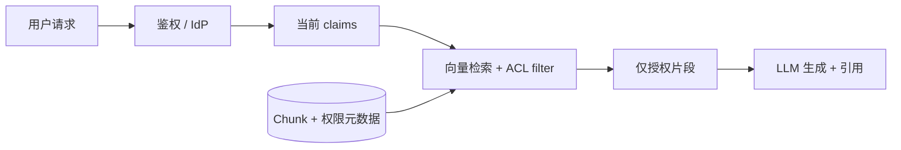
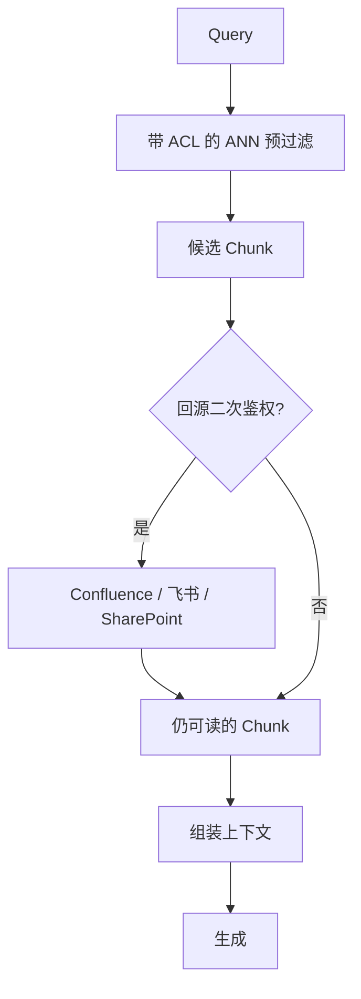

# RAG 权限管控：谁能搜到什么、晋升后如何立刻变多

> 一句话定义：企业 **RAG** /ˌɑːr eɪ ˈdʒiː/ （ **Retrieval-Augmented Generation** /rɪˈtriːvəl ˈɔːɡmentɪd ˌdʒenəˈreɪʃn/ ，检索增强生成）的权限不是「让模型少说话」，而是 **检索进上下文之前** 就按用户身份过滤文档——文档侧存「需要什么权限」，身份侧存「人现在有什么权限」，查询瞬间做交集。

> 前置阅读：[RAG 与知识集成](01-RAG与知识集成.md)、[RAG 核心概念与原理](02-RAG%20核心概念与原理：Chunking、Embedding、相似度、HNSW%20与多路召回.md)。

---

## 1. 为什么「提示词控权」不够

企业内部知识问答里，最常见的诉求是：

| 角色 | 期望 |
|------|------|
| 老板 / 高管 | 能搜到战略、财报、全公司制度 |
| 部门经理 | 能搜到本部门 + 跨部门协作材料 |
| 普通员工 | 只能搜到自己部门、自己项目、公开制度 |
| 外包 / 实习生 | 只能搜到入职手册、公开 Wiki |

如果只在 System Prompt 里写「你是普通员工，不要泄露机密」，会有三类失败：

1. **模型不可靠** ：相关段落已经进了上下文，模型仍可能复述、摘要、侧面暗示。
2. **不可审计** ：出了事无法证明「系统从未把该文档交给模型」。
3. **权限变更难对齐** ：人晋升了，prompt 角色不好精确映射到「突然能看的那 200 份 **PDF** /ˌpiː diː ˈef/ （ **Portable Document Format** /ˈpɔːtəbl ˈdɒkjʊmənt ˈfɔːmæt/ ，便携式文档格式）」。

正确原则是 **defense in depth** /dɪˈfens ɪn depθ/ （纵深防御）：检索过滤是主控，生成侧提示与审计是辅控；绝不能只靠后者。下文生成侧指 **LLM** /ˌel el ˈem/ （ **Large Language Model** /lɑːdʒ ˈlæŋɡwɪdʒ ˈmɒdl/ ，大语言模型）。

```text
❌ 先召回全库 Top-K → 塞进 Prompt → 指望模型「守口如瓶」
✅ 鉴权拿 claims → 带 ACL 的向量检索 → 仅授权 Chunk 进上下文 → 再生成
```

---

## 2. 核心模型：文档 ACL × 用户属性

本节的 **ACL** /ˌeɪ siː ˈel/ （ **Access Control List** /ˈækses kənˈtrəʊl lɪst/ ，访问控制列表）指挂在文档或分块上的权限标签（谁可读、何密级、何部门等）。

把权限拆成两边，查询时求交：

| 存什么 | 存在哪 | 何时变 |
|--------|--------|--------|
| **文档需要什么权限** （密级、角色、部门、项目…） | 每个 Chunk 的 **metadata** /ˈmetəˌdeɪtə/ （元数据，随文档入库） | 文档改密、改可见范围时更新 |
| **人现在有什么权限** | **IdP** /ˌaɪ diː ˈpiː/ （ **Identity Provider** /aɪˈdentəti prəˈvaɪdə/ ，身份提供者）/ 权限中心 / **HR** /ˌeɪtʃ ˈɑː/ （ **Human Resources** /ˈhjuːmən rɪˈzɔːsɪz/ ，人力资源）（ **JWT** /ˌdʒeɪ ˈdʌbljuː tiː/ （ **JSON Web Token** /ˈdʒeɪsən web ˈtəʊkən/ ）里的 **claims** /kleɪmz/ ） | 入职、调岗、晋升、离职时更新 |

**晋升、调岗改的是「人」** ，不是整库重做 **Embedding** /ɪmˈbedɪŋ/ 。下次请求带着新 claims 去 filter，立刻能召回更高密级文档。



业界常见权限范式（RAG 侧通常 **消费** 它们，而不是另起炉灶）：

- **RBAC** /ˌɑːr biː eɪ ˈsiː/ （ **Role-Based Access Control** /rəʊl beɪst ˈækses kənˈtrəʊl/ ，基于角色的访问控制）：`employee` / `manager` / `executive`
- **ABAC** /ˌeɪ biː eɪ ˈsiː/ （ **Attribute-Based Access Control** /ˈætrɪbjuːt beɪst ˈækses kənˈtrəʊl/ ，基于属性的访问控制）：部门、职级、项目成员、数据密级
- ACL（显式名单形态）：`allowed_users`、`allowed_groups`

生产里往往是 **RBAC + ABAC 混合** ：角色定大框，属性定细粒度（「同是 manager，只能看自己部门」）。

---

## 3. 端到端流水线（在原有 RAG 上插两刀）

回顾标准 RAG：Load → Chunk → Embed → Store → Retrieve → Augment → Generate。

权限相关的关键插入点只有两处：

| 阶段 | 做什么 |
|------|--------|
| **离线入库** | 解析源系统权限（或业务打标），写入每个 Chunk 的 metadata；权限字段要能被向量库过滤 |
| **在线检索** | 从网关/会话解析用户身份 → 构造 filter → **pre-filter** /ˌpriː ˈfɪltə/ 检索（见 §6）→ 可选回源二次鉴权 → 再组装 Prompt |

Agent 场景还要加第三条： **每个会读数据的 Tool 都带同一套身份上下文** ，不能「RAG 过了权、读附件工具又绕过去」。

---

## 4. 跑通一个公司例子

假想公司 **Acme** /ˈækmi/ 上线内部知识助手「文 AI」。知识库里有五类文档：

| doc_id | 标题 | 密级 `min_level` | 部门 `depts` | 角色 `roles` | 项目 `projects` |
|--------|------|------------------|--------------|--------------|-----------------|
| D1 | 员工手册 | `L1` | `*`（全员） | `*` | — |
| D2 | 研发规范 | `L1` | `eng` | `*` | — |
| D3 | 支付项目技术方案 | `L2` | `eng` | `*` | `pay` |
| D4 | 2026 薪酬带宽（机密） | `L3` | `*`（全员部门，但角色受限） | `manager`, `executive` | — |
| D5 | 董事会战略纪要 | `L4` | `*` | `executive` | — |

职级约定：`L1 < L2 < L3 < L4`（数字越大越机密）。用户要同时满足： **职级够 +（部门命中或全员）+（角色命中或全员）+（若文档绑了项目则必须是成员）** 。

### 4.1 入库时 Chunk 长什么样

文档切块后， **同一文档的所有 Chunk 继承同一套 ACL** （若页级/段落级权限不同，则按最细粒度打标）。

```json
{
  "chunk_id": "D4#c12",
  "doc_id": "D4",
  "text": "P6 职级现金带宽为……",
  "embedding": [0.012, -0.088, "..."],
  "metadata": {
    "title": "2026 薪酬带宽",
    "min_level": 3,
    "depts": ["*"],
    "roles": ["manager", "executive"],
    "projects": [],
    "tenant_id": "acme",
    "source_uri": "https://wiki.acme.com/hr/comp-2026"
  }
}
```

要点：

- Embedding 只编码 **正文语义** ，不把「谁能看」编进向量（权限是结构化过滤条件）。
- `tenant_id` 做多租户硬隔离，过滤条件写错也不应跨租户命中。
- `source_uri` 留给「回源二次鉴权」与引用展示。

### 4.2 三位用户的 claims

| 用户 | 角色 | 部门 | 职级 | 项目 |
|------|------|------|------|------|
| 小王（普通开发） | `employee` | `eng` | `L2` | `pay` |
| 张经理（研发经理，刚从员工晋升） | `manager` | `eng` | `L3` | `pay` |
| 李总（高管） | `executive` | `exec` | `L4` | — |

可从登录态解析成类似结构（示意）：

```json
{
  "sub": "wang",
  "tenant_id": "acme",
  "roles": ["employee"],
  "dept": "eng",
  "level": 2,
  "projects": ["pay"]
}
```

### 4.3 同一句话，三个人搜到完全不同的世界

用户都问：「公司对薪酬和战略有什么安排？支付项目要注意什么？」

检索伪代码：

```text
ANN(query_vector, top_k=20)
  WHERE tenant_id = user.tenant_id
    AND min_level <= user.level
    AND (depts CONTAINS '*' OR depts CONTAINS user.dept)
    AND (roles CONTAINS '*' OR roles INTERSECTS user.roles)
    AND (projects 为空 OR projects INTERSECTS user.projects)
```

| 用户 | 可能进入上下文的文档 | 文 AI 会怎样答 |
|------|----------------------|----------------|
| 小王 | D1、D2、D3 | 讲员工手册口径 + 研发规范 + 支付技术方案；对薪酬/战略说「无权查看相关材料」 |
| 张经理 | D1、D2、D3、 **D4** | 在小王基础上，可引用薪酬带宽（因 `level=3` 且 `manager`）；仍看不到 D5 |
| 李总 | D1～D5 全部 | 可综合战略纪要与薪酬政策作答，并带引用 |

注意：小王的向量相似度也许对 D4、D5「更像问题」，但 **filter 直接排除** ，模型根本看不到正文——这才是权限，不是礼貌。

### 4.4 晋升当天：张经理从员工到经理

时间线：

```text
T0  张三 claims: roles=[employee], level=2
    → 问薪酬相关：召回不到 D4（level/role 不够）

T1  HR 系统晋升生效，IdP 更新：
    roles=[manager], level=3
    （向量库一个字节都不用动）

T2  张三再次提问（新 JWT）：
    → 同一套 filter，D4 立刻可召回
    → 文 AI 可以基于 D4 回答（并显示引用）
```

| 错误做法 | 问题 |
|----------|------|
| 给每个用户建一份「可见文档副本库」 | 晋升要搬库、降级要删库，运维爆炸 |
| 晋升后全量重 Embed | 慢、贵、且与权限无关 |
| 只改 prompt 里的「你现在是经理」 | 无授权文档仍可能被旧会话缓存/工具读到 |

正确做法： **身份变更即时生效；文档 ACL 变更才需要更新 metadata（或失效缓存）** 。

---

## 5. 过滤条件怎么落到向量库

以常见向量库的「标量过滤 + 向量检索」为例（语义示意， **API** /ˌeɪ piː ˈaɪ/ （ **Application Programming Interface** /ˌæplɪˈkeɪʃn ˈprəʊɡræmɪŋ ˈɪntəfeɪs/ ，应用程序接口）各异）：

**Qdrant 风格** ：

```json
{
  "vector": [/* query embedding */],
  "limit": 20,
  "filter": {
    "must": [
      { "key": "tenant_id", "match": { "value": "acme" } },
      { "key": "min_level", "range": { "lte": 3 } },
      {
        "should": [
          { "key": "depts", "match": { "value": "*" } },
          { "key": "depts", "match": { "value": "eng" } }
        ]
      },
      {
        "should": [
          { "key": "roles", "match": { "value": "*" } },
          { "key": "roles", "match": { "any": ["manager", "executive"] } }
        ]
      }
    ]
  }
}
```

**pgvector + 行级思路** ：向量表带 ACL 列，用 **SQL** /ˌes kjuː ˈel/ （ **Structured Query Language** /ˈstrʌktʃəd ˈkwɪəri ˈlæŋɡwɪdʒ/ ，结构化查询语言）`WHERE` 与 `ORDER BY embedding <-> query` 一起查；或结合 PostgreSQL 的 **RLS** /ˌɑːr el ˈes/ （ **Row-Level Security** /ˈrəʊ ˈlevl sɪˈkjʊərəti/ ，行级安全）把 `current_setting('app.user_level')` 写进策略。

**按「可见文档集合」两段查（权限很复杂时）** ：

1. 权限服务：`allowed_doc_ids = acl.resolve(user)`（可缓存数分钟）
2. 向量检索：`doc_id IN allowed_doc_ids` + **ANN** /ˌeɪ en ˈen/ （ **Approximate Nearest Neighbor** /əˈprɒksɪmət ˈnɪərɪst ˈneɪbə/ ，近似最近邻）

适合「权限规则极复杂、已有成熟权限中台」的企业；代价是 `allowed_doc_ids` 很大时要用倒排/分区优化，避免 `IN` 百万级拖垮查询。

---

## 6. 预过滤 vs 后过滤（务必选对）

| 策略 | 做法 | 风险 |
|------|------|------|
| **pre-filter** （预过滤，推荐） | ANN 索引检索时就带上 ACL 条件 | 实现依赖向量库能力；条件过复杂时要注意索引与性能 |
| **post-filter** /ˌpəʊst ˈfɪltə/ （后过滤） | 先无差别 Top-K，再丢掉无权限条目 | 有权文档被挤出 Top-K；日志/调试易泄露标题；体验上「明明有文档却答不知道」 |

折中（仍要谨慎）：先预过滤到候选集，再在应用层做一次「回源确认仍可读」（应对「向量库 metadata 滞后于源系统 ACL」）。



---

## 7. 文档侧权限变更（另一条时间线）

人变了靠 IdP； **文档变了要同步 metadata** ：

| 事件 | 动作 |
|------|------|
| 文档从「研发可见」改为「全员」 | 批量更新该 `doc_id` 下 Chunk 的 `depts/roles` |
| 文档升密（L2→L4） | 更新 `min_level`；已发出的回答无法收回，但新请求立刻不可见 |
| 文档删除 / 下线 | 删向量 + 删原文；并使引用缓存失效 |
| 项目结项，外包退出项目组 | 人的 `projects` 在 IdP 变更即可；不必改文档 |

同步方式常见三种：

1. **源系统 Webhook** /ˈwebhʊk/ → 权限服务 → 更新向量库 metadata  
2. **定时对账** （每日扫 ACL 差异）  
3. **检索时以源系统为准** （延迟略高，一致性最好）

企业实践建议： **列表/检索用向量库 metadata 快过滤；打开原文或高敏感域强制回源鉴权** 。

---

## 8. 和 Agent / 多工具编排的关系

RAG 只是 Agent 的一个 Tool。权限漏洞经常出在「旁路」：

```text
用户（员工）
  → Agent
      → rag.search（已过滤）✅
      → wiki.fetch(page_id)（忘了传用户身份）❌ 读到战略页
      → sql.query（用了服务账号）❌ 扫到薪酬表
```

落地检查清单：

1. 网关把 **用户身份** 注入 Agent 运行时上下文（不可由模型伪造）。  
2. 每个数据 Tool 的实现里 **强制** 使用该身份做鉴权，禁止默认服务账号读业务数据。  
3. 多跳检索、子 Agent 委托时， **向下传递同一 claims** （可收窄，不可放大）。  
4. 引用与「打开原文」链接走带鉴权的代理，避免把内网未鉴权 **URL** /ˌjuː ɑːr ˈel/ （ **Uniform Resource Locator** /ˈjuːnɪfɔːm rɪˈsɔːs ləʊˈkeɪtə/ ，统一资源定位符）直接给前端。

---

## 9. 生成侧仍要做的几件事（辅控）

检索主控之外，建议保留：

- **Prompt 约束** ：只依据提供的片段作答；没有依据就明确说无权/未知（防幻觉补全机密）。  
- **引用列表** ：只展示本次授权命中的 `doc_id` / 标题。  
- **审计日志** ：`user_id, query_hash, hit_doc_ids, filter_snapshot, timestamp`——合规与追责靠这个。  
- **输出护栏** （可选）：对身份证号、薪酬数字等做脱敏或二次分类（防「有权片段被用户转发给无权同事」——这是管理问题，系统只能降低便利性外泄）。

---

## 10. 常见坑

1. **用后过滤冒充安全** ：Top-K=5 全被无权限高分文档占满 → 有权用户也「检索失败」。  
2. **把用户 ID 写进 Embedding 文本** ：权限一变就要重嵌入；应放 metadata。  
3. **会话缓存未按用户隔离** ：A 的检索结果被 B 的会话复用。语义缓存的 key 必须包含 `user` 或 `authz_version`。  
4. **只控「搜」，不控「聊」** ：历史消息里已有机密摘要，换人共用会话会泄露——会话要按人隔离。  
5. **权限模型与公司真源不一致** ：RAG 自建角色表，和 HR/ **AD** /ˌeɪ ˈdiː/ （ **Active Directory** /ˈæktɪv dəˈrektəri/ ，活动目录）双轨，晋升对不齐。  
6. **忽略租户字段** ：过滤条件 OR 写错导致跨公司命中。  
7. **调试环境打印全文** ：日志里 dump 无权限 Chunk，等于权限形同虚设。

---

## 11. 最小可行设计（MVP）建议

**MVP** /ˌem viː ˈpiː/ （ **Minimum Viable Product** /ˈmɪnɪməm ˈvaɪəbl ˈprɒdʌkt/ ，最小可行产品）：若从零做企业内部文 AI，建议按这个顺序：

1. **统一登录** ，JWT 带 `tenant_id / roles / dept / level / projects`。  
2. **入库强制打标** ：没有 ACL 的文档默认「仅管理员可见」，禁止默认公开。  
3. **检索强制预过滤** ；向量库选型时把「标量过滤 + ANN」列为硬需求（Milvus / Qdrant / Weaviate / pgvector 等）。  
4. **晋升/调岗只接 IdP** ，做一次联调验收（同问句、晋升前后 hit 集合变化）。  
5. **审计 + 引用** 先做起来，再考虑回源二次鉴权与精细到段落的 ACL。

---

## 12. 小结

| 问题 | 答案 |
|------|------|
| 老板为什么「文 AI 给得多」？ | claims 宽 → filter 松 → 召回多 → 上下文多 |
| 员工为什么只能搜自己有权的？ | 无权限 Chunk 根本不进模型上下文 |
| 晋升后如何立刻升高？ | 改 IdP 属性；文档向量不动；下次查询用新 claims |
| 权限写在哪？ | 文档 ACL 在 Chunk metadata；人的权限在身份系统 |
| 模型提示还要吗？ | 要，但是辅控；主控永远在检索与 Tool 鉴权 |

一句话： **RAG 权限 = 带身份的检索，而不是懂礼貌的模型。**

---

## 本文缩写

| 缩写 | 音标 | 全拼 | 中文 |
|------|------|------|------|
| **RAG** | /ˌɑːr eɪ ˈdʒiː/ | Retrieval-Augmented Generation | 检索增强生成 |
| **LLM** | /ˌel el ˈem/ | Large Language Model | 大语言模型 |
| **ACL** | /ˌeɪ siː ˈel/ | Access Control List | 访问控制列表 |
| **RBAC** | /ˌɑːr biː eɪ ˈsiː/ | Role-Based Access Control | 基于角色的访问控制 |
| **ABAC** | /ˌeɪ biː eɪ ˈsiː/ | Attribute-Based Access Control | 基于属性的访问控制 |
| **IdP** | /ˌaɪ diː ˈpiː/ | Identity Provider | 身份提供者 |
| **JWT** | /ˌdʒeɪ ˈdʌbljuː tiː/ | JSON Web Token | JSON Web 令牌 |
| **HR** | /ˌeɪtʃ ˈɑː/ | Human Resources | 人力资源 |
| **AD** | /ˌeɪ ˈdiː/ | Active Directory | 活动目录 |
| **ANN** | /ˌeɪ en ˈen/ | Approximate Nearest Neighbor | 近似最近邻 |
| **API** | /ˌeɪ piː ˈaɪ/ | Application Programming Interface | 应用程序接口 |
| **SQL** | /ˌes kjuː ˈel/ | Structured Query Language | 结构化查询语言 |
| **RLS** | /ˌɑːr el ˈes/ | Row-Level Security | 行级安全 |
| **URL** | /ˌjuː ɑːr ˈel/ | Uniform Resource Locator | 统一资源定位符 |
| **PDF** | /ˌpiː diː ˈef/ | Portable Document Format | 便携式文档格式 |
| **MVP** | /ˌem viː ˈpiː/ | Minimum Viable Product | 最小可行产品 |
