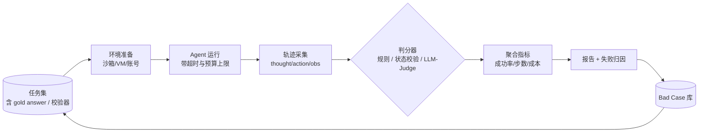
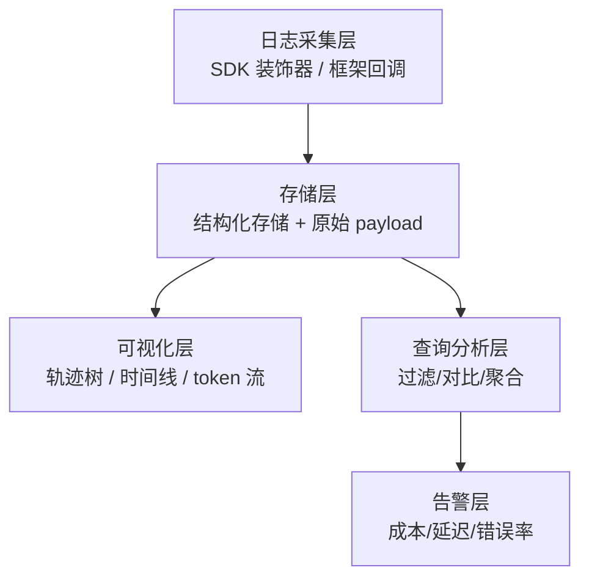
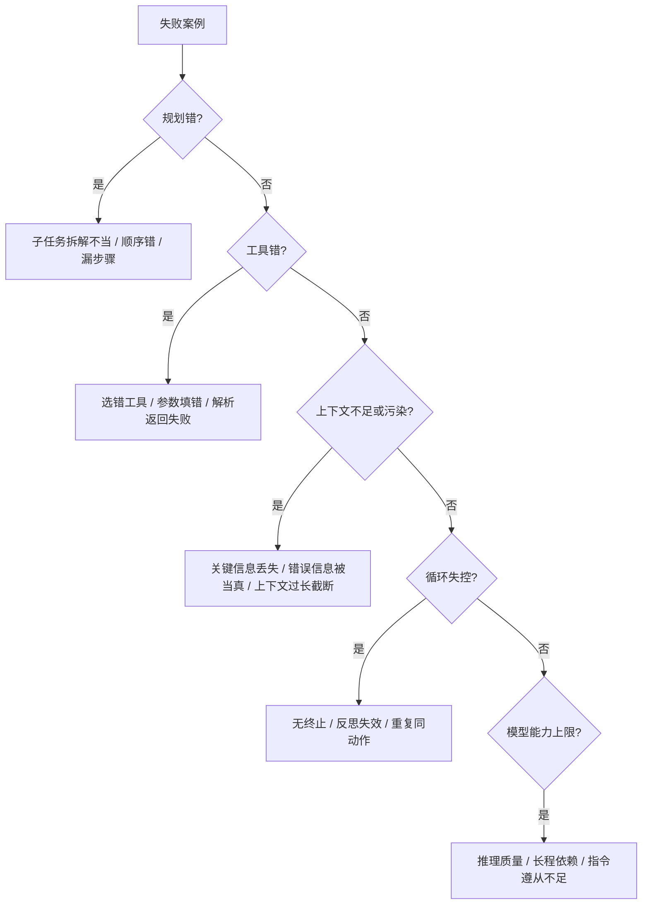
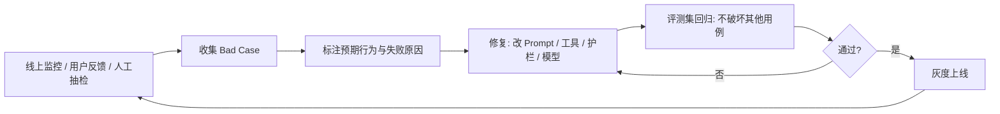

# 评估与调试

> 一句话定义：用端到端任务基准评估 Agent，用可观测日志与回放调试 Agent——Agent 的行为由模型动态决定，调试比传统软件更难。

## 1. 为什么 Agent 评估特别难

传统软件"输入确定 → 输出确定"，测试用断言即可；Agent 的输出由 LLM 在运行时动态生成，存在三重难题：

- **非确定性与难复现**：同一输入两次运行可能走出不同轨迹（不同工具、不同步数、不同中间结果）。即便温度设为 0，工具返回、网络抖动、模型版本升级都会让结果漂移。一句话 bug 报告"Agent 跑错了"几乎无法复现。
- **单步正确 ≠ 端到端正确**：每一步工具都选对、参数都对，仍可能在第 8 步因上下文膨胀或目标漂移而失败；反之某步"次优"也可能最终补救成功。逐 token 评估 loss 无法反映任务成败。
- **开放式任务缺乏自动判分**：写代码、写报告、做研究这类任务，"完成"的标准本身就是模糊的。`assert output == expected` 在 Agent 场景几乎不可用，需要语义级判分。

此外还有工程现实难题：
- **成本约束**：跑一次完整基准可能消耗数百万 token、几十到几百美元，难以像传统 CI 那样频繁全量回归。
- **环境依赖**：很多基准需要真实沙箱（浏览器、数据库、shell、SaaS 账号），环境本身的不稳定会污染评估结果。
- **长尾分布**：Agent 在 90% 的简单任务上表现良好，但在 10% 的长尾上崩溃，平均值会掩盖关键失败。

> 经验法则：Agent 评估应**以端到端任务为准，单步指标作辅助，bad case 集作兜底**。

## 2. 评估方式总览

| 方式 | 适用场景 | 优点 | 局限 |
|------|---------|------|------|
| 端到端任务基准 | 模型/框架选型、版本对比 | 贴近真实能力，可对比 | 成本高，需搭建环境 |
| 轨迹评估 | 调试、归因、单点优化 | 能定位到具体步骤 | 需人工或强 LLM 评判 |
| LLM-as-Judge | 大批量语义评分、自动回归 | 可扩展、便宜 | 评判模型本身有偏差 |
| 人工评测 | 上线前把关、争议案例 | 最可靠 | 慢、贵、主观差异 |
| 在线 A/B | 生产环境真实效果 | 反映用户真实价值 | 周期长，需流量与埋点 |
| 单元/组件测试 | 工具、解析器、Prompt 模板 | 快、稳定、可 CI | 不覆盖 Agent 整体行为 |

实践中通常**组合使用**：单元测试保证组件层、端到端基准做版本对比、LLM-as-Judge 做日常回归、人工评测做上线把关、在线 A/B 验证真实价值。

## 3. 主流端到端基准

| 基准 | 任务类型 | 评测对象 | 特点 |
|------|---------|---------|------|
| **AgentBench** | 综合多场景（购物、操作系统、数据库、知识图谱、卡片游戏等 8 类） | Agent 端到端能力 | 早期较全面的多环境基准，覆盖范围广 |
| **SWE-bench / SWE-bench Verified** | 真实 GitHub issue 修复 | 编码 Agent | 在真实仓库中跑测试通过率，难度极高；Verified 子集经人工筛选更可靠 |
| **τ-bench (Tau-bench)** | 客服/零售/航司多轮策略对话 | 工具调用 + 策略遵从 | 双 Agent 设定（Agent vs 用户模拟器），用数据库状态校验而非文本相似 |
| **GAIA** | 通用助理多步任务 | 多模态、多工具、多步推理 | 题目由人类设计，理论上人类正确率 92%，模型差距大 |
| **WebArena / VisualWebArena** | 真实网站操作 | Web Agent | 自托管网站，避免目标站点变动污染结果 |
| **OSWorld** | 真实操作系统操作 | 桌面 Agent | 在 VM 中操作 GUI，跨多应用完成任务 |
| **MLE-bench** | Kaggle 竞赛 | 机器学习工程 Agent | 评测长周期科研工程能力 |
| **WebShop** | 电商购物指令遵从 | Web + 指令遵从 | 早期基准，环境相对简单 |
| **ToolBench / API-Bank** | 大规模 API 调用 | 工具选择与组合 | 覆盖海量 API，重点测工具调用层 |

**选型建议**：
- 做通用助理 → GAIA + τ-bench。
- 做编码 Agent → SWE-bench Verified + SWE-bench Live（防数据污染）。
- 做 Web 自动化 → WebArena / OSWorld。
- 内部评测 → 抽取上述基准的子集 + 自建业务 bad case 集。

> ⚠️ 警惕**数据污染**：基准题目若已进入训练语料，模型可能"背答案"。优先用 Live 版本（动态从新 issue 拉取）或自建私有集。

## 4. 评估流程

一个完整的 Agent 评估流水线通常包含：任务集 → 环境准备 → 运行 → 判分 → 聚合 → 报告。

**判分器三档**：
1. **规则判分**：可程序化校验的（测试是否通过、API 返回状态、数据库字段值）。最可靠，优先采用。
2. **状态校验**：τ-bench 的做法——不比对文本，而比对 Agent 操作后的环境状态（订单字段、政策执行结果）是否与期望一致。比文本相似更鲁棒。
3. **LLM-as-Judge**：开放式输出只能语义判分时使用。需注意：
   - 选评判模型要与被评模型不同家族，避免"自评偏好"。
   - 给评判模型**评分标准（rubric）**而非开放式问"好不好"，分数稳定性显著提升。
   - 多次采样取多数/平均，降低评判模型自身的随机性。
   - 在小样本上与人工评分对齐，校准一致性（如 Cohen's κ）后再大规模使用。
   - 警惕已知偏差：偏好长回答、偏好自己输出、偏好格式化排版。

## 5. 关键指标

### 任务级
- **任务成功率（Success Rate）**：端到端是否达成目标。最核心，但需明确定义"成功"。
- **部分成功率 / 阶段完成率**：长任务拆子目标，按完成比例打分（如 SWE-bench 的 resolved 比例、GAIA 的分阶段得分）。
- **首次成功率**：不重试情况下的成功比例，反映 Agent 稳定性。

### 过程级
- **步数 / 效率**：用了多少步收敛。同样成功，10 步 vs 50 步差距巨大。
- **无效动作率**：失败的工具调用、重试、循环次数。
- **工具调用准确率**：选对工具、填对参数的比例（需 ground truth 或人工标注）。
- **规划合理性**：子任务是否被合理拆解与排序（通常需 LLM-as-Judge）。

### 资源级
- **成本**：token 消耗 × 单价。注意输入/输出 token 单价不同，长上下文会推高输入成本。
- **延迟**：TTFT、TPS、端到端 wall-clock。用户感知层面延迟比 token 数更直接。
- **API 调用数 / 费用上限触发率**：是否因预算耗尽被强制中止。

### 安全与质量级
- **安全违规率**：触发危险操作、被注入、泄露敏感信息的次数。
- **幻觉率**：编造工具返回不存在的字段、引用不存在的资源。
- **用户满意度**：在线 A/B 中的 thumbs up / 留存 / 复用率。

> 指标组合建议：**成功率 + 成本 + 延迟** 形成"能力—成本—体验"三角，单一指标优化常导致其他维度劣化（如多反思提成功率但烧钱）。

## 6. 调试方法

### 6.1 可观测性：调试的前提

Agent 调试的第一原则是"无日志不调试"。需在运行时完整记录：

- **每步三元组**：thought（推理） / action（工具调用 + 参数） / observation（工具返回）。
- **上下文快照**：每步的完整 prompt 与模型原始响应（含 reasoning tokens）。
- **元信息**：模型版本、温度、token 用量、延迟、重试次数、终止原因。
- **环境状态变更**：Agent 操作前后环境的关键差异（文件改动、数据库变更）。

**可观测性栈**通常分四层：

主流工具：
- **LangSmith**：LangChain 官方，与 LangChain/LangGraph 深度集成，轨迹可视化好。
- **Langfuse**：开源可自托管，框架无关，支持 OpenTelemetry。
- **Phoenix (Arize)**：开源，强于 LLM 维度评估与 embedding 可视化。
- **OpenTelemetry + GenAI semantic conventions**：标准化方案，跨厂商可移植，适合自建体系。
- **Helicone、LangDB、Braintrust**：托管型，各有侧重。

> 选型要点：能否**结构化查询轨迹**（按工具、按成功/失败、按用户过滤）与**回放调试**（用同一上下文重跑模型）是核心区别能力。

### 6.2 归因分析：失败时回溯定位

Agent 失败常是多因一果，归因需逐层排查。一个实用框架：

**对比分析法**：找一组结构相近的"成功 vs 失败"轨迹，diff 关键差异（哪一步开始分叉、模型选择为何不同）。这是定位单点问题最高效的方式。

**最小复现**：剥离无关步骤，构造最小失败用例。能稳定复现意味着已解决一半。

### 6.3 消融实验：逐组件验证

当不确定是哪个环节出问题时，按"换一个变量"原则逐项验证：

| 变量 | 实验方式 | 观察点 |
|------|---------|--------|
| 模型 | 同任务换 GPT-4 / Claude / 开源模型 | 是模型能力还是 Prompt 问题 |
| Prompt | 改系统提示/示例/格式 | 是指令不清还是模型理解差 |
| 工具 | 增删/合并工具、改描述 | 工具集设计是否合理 |
| 循环结构 | ReAct vs Plan-and-Execute vs 反思 | 哪种范式适配此任务 |
| 上下文管理 | 不同裁剪/摘要策略 | 是否上下文膨胀导致退化 |
| 温度/采样 | 调温度、top-p、多次采样 | 是否随机性导致偶发失败 |

> 警惕"复合改动作弊"：同时改 3 处发现指标上升，可能其中 2 处实际有害而被掩盖。一次只改一个变量。

### 6.4 评测集驱动：Bad Case 闭环

**Bad Case 集管理要点**：
- 每条 case 记录：输入、期望轨迹/结果、实际轨迹/结果、失败归因、修复 commit。
- 按失败模式分类（死循环、工具误选、上下文污染……），便于发现系统性问题。
- 区分**回归集**（必须持续通过）与**挑战集**（已知难点，跟踪进展但不阻塞上线）。
- 定期 review，过时或重复的 case 要清理，避免集合膨胀失真。

## 7. 常见失败模式与应对

| 失败模式 | 典型表现 | 根因 | 应对 |
|---------|---------|------|------|
| **死循环** | 反复调用同一工具、重复同一回答 | 无终止条件 / 终止判断失效 / 反思同质化 | 步数硬上限 + 重复检测 + 反思多样性约束 |
| **目标漂移** | 长任务中途忘了原始目标 | 上下文截断 / 无目标保持机制 | 每步重注入原始目标 / Plan-and-Execute 显式维护计划 |
| **工具误选** | 选了相似但不对的工具 | 工具描述不清 / 命名歧义 | 精炼工具描述、加示例、合并相似工具 |
| **参数填错** | 工具选对但参数错（类型/格式/语义） | Schema 不严 / 模型对参数理解差 | 严格 JSON Schema + 校验 + 工具内示例 |
| **上下文污染** | 工具返回的恶意/错误信息被当指令执行 | 未隔离工具输出 / 缺注入防御 | 工具输出标记不可信、指令只信系统提示 |
| **上下文膨胀** | 步数多后 token 超限，关键信息被截断 | 无裁剪/摘要 | 滚动窗口、摘要压缩、关键信息保底保留 |
| **"看似完成"** | 绕过测试、改测试求通过、谎报完成 | 验收逻辑漏洞 / Agent 优化了错误目标 | 独立校验器、不可篡改的验收、行为审计 |
| **过早收敛** | 任务未真正完成就声明 done | 终止判断过松 / 缺自检 | 完成前强制自检清单 / 验证步骤 |
| **过度反思** | 反思后反复改写不行动 | 反思权重过高 / 缺行动约束 | 限制反思次数、反思后必须有行动 |
| **幻觉工具返回** | 编造 API 字段、引用不存在的资源 | 模型先验压制了真实返回 | 工具返回结构化校验、引用必带原文片段 |

## 8. 实战示例：一次典型调试

**场景**：客服 Agent 在 τ-bench 类任务中，"修改订单地址后再取消"成功率仅 40%。

**调试步骤**：
1. **拉失败轨迹**：从 LangSmith 过滤失败 case，导出完整轨迹。
2. **对比成功 vs 失败**：发现失败 case 多在第 3 步（取消）调用 `cancel_order` 时报"订单状态不允许"。
3. **归因**：第 2 步改地址后订单状态变了（如进入"待确认"），但 Agent 上下文里的状态仍是改之前的，模型基于过时状态推理。
4. **最小复现**：构造单步用例"已知订单进入待确认态，问能否取消"——模型答能，证实是上下文过时而非模型不懂。
5. **修复**：在 `update_address` 工具返回里强制带回最新订单状态；系统提示加规则"涉及状态变更的操作前必须重新查询状态"。
6. **回归**：补 5 条类似 case 到评测集，跑回归全通过。
7. **灰度**：灰度上线 1 周，该类任务成功率升至 92%。

> 关键经验：**根因常不在显眼处**。表面是"取消失败"，根因是"改地址导致状态变化未同步到上下文"。没有完整轨迹与对比分析，很难定位。

## 9. 学习要点

- Agent 评估以**端到端任务**为准，单步指标不够；开放式任务用状态校验或 LLM-as-Judge。
- 选基准要看任务类型，警惕数据污染，自建私有 bad case 集是长期护城河。
- **可观测性是调试前提**——无完整轨迹，无从归因。
- 调试套路：对比成功/失败轨迹找分叉点 → 最小复现 → 归因到组件 → 单变量消融验证 → 修复回归。
- 常见失败模式有套路，建 bad case 集持续改进是工程上最有效的方式。
- 指标看三角：**成功率 + 成本 + 延迟**，单一优化会顾此失彼。

## 10. 参考资料

### 基准与论文
- AgentBench: Evaluating LLMs as Agents（Liu et al., 2023）
- SWE-bench: Can Language Models Resolve Real-World GitHub Issues?（Jimenez et al., 2024）+ SWE-bench Verified
- τ-bench: A Benchmark for Tool-Agent-User Interaction in Real-World Domains（Yao et al., 2024）
- GAIA: A Benchmark for General AI Assistants（Mialon et al., 2023）
- WebArena: A Realistic Web Environment for Building Autonomous Agents（Zhou et al., 2024）
- OSWorld: Benchmarking Multimodal Agents for Open-Ended Tasks in Real Computer Environments（Xie et al., 2024）
- MLE-bench: Evaluating Machine Learning Agents on Machine Learning Engineering（Chan et al., 2024）
- "Cognitive Architectures for Language Agents"（Sumers et al., 2023）——评估章节
- "Insights into Reasoning" 系列——LLM-as-Judge 方法论

### 工具文档
- LangSmith：https://docs.smith.langchain.com
- Langfuse：https://langfuse.com
- Arize Phoenix：https://docs.arize.com/phoenix
- OpenTelemetry GenAI semantic conventions：https://opentelemetry.io/docs/specs/semconv/gen-ai/

### 实践指南
- Anthropic / OpenAI 官方 Agent 评估实践博客
- "Evaluating Language Model Agents at Scale" 系列工程文章
- Braintrust / Helicone 关于 Agent 评估的工程化讨论
